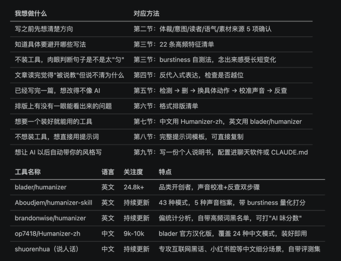

# Leo Skills

可复用的智能体技能集合，兼容 Claude Code 与 Codex / OpenAI 双宿主，覆盖证据优先写作、内容编辑、PPT 演示生成，以及公众号 / 小红书 / 视频创作工具箱。

## 包含技能

### `evidence-first-writing`

先识别写作意图、文章类型、证据风险和协作方式，再编排调研、论证、起草、编辑、个人声音、技术验证、营销文案与去 AI 模板感的多阶段工作流。作者保留事实、判断与取舍的最终控制权。

- 入口：[evidence-first-writing/SKILL.md](evidence-first-writing/SKILL.md)
- 安装与用法：[evidence-first-writing/README.md](evidence-first-writing/README.md)
- 评测：31 个用例（`evals/cases/`）

内置的去 AI 模板感 / Humanizer 工具链选型速览（「想做什么 → 对应方法」映射，以及各开源工具的语言、维护状态与特点）：



### `leo-ppt-generator`

把需求、视觉稿、图片或 PDF 转成可编辑 PowerPoint：覆盖图片版 PPT、可编辑版、hybrid 与升级路线。技能包内含运行时（`runtime/`）、参考风格库（`references/styles/`）、补丁与评测用例，并提供本地安装脚本。

- 入口：[leo-ppt-generator/SKILL.md](leo-ppt-generator/SKILL.md)
- 本地安装：[install.sh](leo-ppt-generator/install.sh)（macOS/Linux）、[install.ps1](leo-ppt-generator/install.ps1)（Windows）
- 评测：9 个用例（`evals/cases/`）

### `creator-buddy`

公众号 / 小红书 / 视频全栈创作工具箱（vendored 集成）。根目录总控 Skill 负责路由：先做平台情报（全域内容搜索、爆款检测、赛道分析、博主与文章拆解），再把选题做成成品（定位、长短文写作、标题、封面、配图、排版、视频脚本、剪辑、B-roll、字幕、配音配乐），共 32 个子技能分三组，保持上游内部结构原样。

- 入口：[creator-buddy/SKILL.md](creator-buddy/SKILL.md)；相对路径命令从 `creator-buddy/` 目录执行
- 上游同步方式：[creator-buddy/UPSTREAM.md](creator-buddy/UPSTREAM.md)
- 平台凭据（`GUAIKEI_API_TOKEN` 等）走本地环境变量，不入库

## 安装与使用

三个插件（`evidence-first-writing` / `leo-ppt-generator` / `creator-buddy`）统一按以下方式安装；各插件 README 的安装节与此保持一致。

### 快速安装（复制即装）

终端粘贴即装，无需进会话逐条输入：

```sh
# Claude Code：一行装齐三个插件（官方 marketplace 通道，等价于方式一）
claude plugin marketplace add leo-kuang-ai/leo-skills \
  && claude plugin install evidence-first-writing@leo-skills \
  && claude plugin install leo-ppt-generator@leo-skills \
  && claude plugin install creator-buddy@leo-skills

# 通用 agents 目录（Codex / Cursor 等兼容宿主）：clone + 软链
git clone --depth 1 https://github.com/leo-kuang-ai/leo-skills.git ~/.agents/skills/leo-skills \
  && cd ~/.agents/skills/leo-skills \
  && for p in evidence-first-writing leo-ppt-generator creator-buddy; do ln -s "$PWD/$p" ~/.agents/skills/"$p"; done
```

> Codex 专用目录：把第二段里两处 `~/.agents/skills` 换成 `~/.codex/skills` 即可。

### 方式一：Claude Code `/plugin`（推荐，已实测）

仓库已配置插件市场（`.claude-plugin/marketplace.json`），在 Claude Code 会话中：

```text
/plugin marketplace add leo-kuang-ai/leo-skills
/plugin install evidence-first-writing     # 或 leo-ppt-generator / creator-buddy
```

- `marketplace add` 从 GitHub clone 到 `~/.claude/plugins/marketplaces/leo-skills/`；
- `plugin install` 把技能装到 `~/.claude/plugins/cache/leo-skills/<技能>/<版本>/`，注册为用户级 Personal Skill（Claude Code 启动时自动扫描）；
- 更新：推送新版本后 `/plugin update <技能>`（或先 `/plugin marketplace update` 再 update）；
- 卸载：`/plugin uninstall <技能>`。

### 方式二：Git clone + 软链到 `~/.claude/skills/`（开发者 / 非 Claude Code 宿主）

```sh
git clone https://github.com/leo-kuang-ai/leo-skills.git ~/.claude/skills/leo-skills
ln -s ~/.claude/skills/leo-skills/evidence-first-writing ~/.claude/skills/evidence-first-writing
ln -s ~/.claude/skills/leo-skills/leo-ppt-generator     ~/.claude/skills/leo-ppt-generator
ln -s ~/.claude/skills/leo-skills/creator-buddy         ~/.claude/skills/creator-buddy
```

软链让 Claude Code 能识别技能，改动即时生效；`git -C ~/.claude/skills/leo-skills pull` 即可更新。

### 方式三：项目级（跟随仓库，团队共享）

在项目根目录建立（例如 `git submodule add https://github.com/leo-kuang-ai/leo-skills.git .claude/skills/leo-skills` 再软链），或直接提交技能目录。

### 验证

在 Claude Code 会话中输入 `/skills`，应看到 `evidence-first-writing`、`leo-ppt-generator` 与 `creator-buddy`；或用触发语直接发起请求。

## 使用示例

```text
# 证据优先写作
使用 evidence-first-writing 帮我写一篇关于远程办公的评论，面向技术团队。

# PPT 生成（Codex 触发语）
$leo-ppt-generator 把这份 PDF 视觉稿转成可编辑 PPTX，保留照片式风格。

# 全域内容搜索与创作（creator-buddy 总控）
小红书 Codex 最近有什么爆款？结合公众号近期热门给我几个短文选题。
```

## 宿主适配

两个技能都与宿主/model 无关——核心是 `SKILL.md` 与 `references/` 里的 markdown 指令，任何能读文件并遵循指令的模型都可执行。体系约定：

- **约定归一化**：能力即 markdown，不绑定特定宿主字段。
- **per-host 薄壳**：Claude Code 用 `SKILL.md` frontmatter；Codex / OpenAI 用各技能下的 `agents/openai.yaml`（`$<技能名>` 触发）。
- **降级契约**：脚本钩子（如 `$EVIDENCE_FIRST_WRITING_SKILL_DIR`）在宿主不可用时显式降级（如 `factual_invariant_check: not_run`），绝不在缺失时猜测路径。

## 开发

```sh
# evidence-first-writing 单元测试
python3 -m unittest discover -s evidence-first-writing/tests -p 'test_*.py'

# 行为评测（需 skill-up CLI 与可用引擎）
skill-up validate evidence-first-writing/evals/eval.yaml
skill-up validate leo-ppt-generator/evals/eval.yaml
```

评测生成的 workspace（`evidence-first-writing-workspace/`、`leo-ppt-generator-*-workspace/`）已在 `.gitignore`，不提交。

**评测证据边界**：evidence-first-writing 的 `20 PASS / 0 FAIL` 完整回归结论来自固定模型 `codex × gpt-5.6-terra`（详见其 `evals/verification-summary.md`）；用例 `post-publish-no-causal` 在 `claude_code` 引擎经 DeepSeek flash 代理的环境下仍稳定 FAIL，待接入真 Claude 端点复验（详见其 `evals/known-issues.md`）。对外引用评测结论时请注明引擎与模型条件。

## 贡献约定

- 每个顶层目录是一个独立技能包（见 `AGENTS.md`）；新技能放在仓库根目录，与 `evidence-first-writing`、`leo-ppt-generator` 平级。
- 源文件变更需同步更新 `CHANGELOG.md`（Keep a Changelog 格式）。
- 新增可安装技能时，补其 `.claude-plugin/plugin.json` 并在 `.claude-plugin/marketplace.json` 的 `plugins[]` 追加条目。

## License

本项目基于 [MIT License](LICENSE) 发布。
