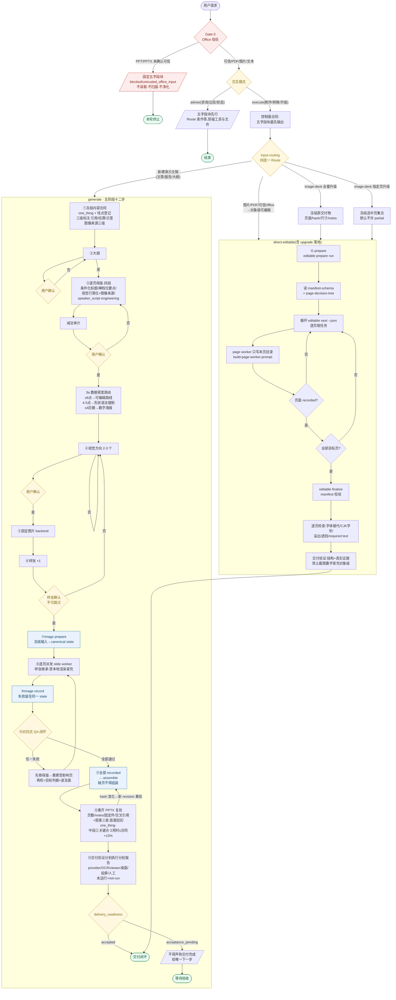

# leo-ppt-generator 执行流程图

- 日期:2026-08-29 · 配套正文见本文件同目录会话梳理,权威源为
  `leo-ppt-generator/SKILL.md` 与 `references/*.md`(含 2026-08-29 叙事合同/密度路由新环节)。
- 用法:下方 Mermaid 可在 GitHub / 支持 mermaid 的查看器直接渲染;节点编号对应
  image-deck-workflow 的步骤号(G=generate,E=editable)。

## 读图要点

1. **红色系 = 硬门禁**(Gate 0 与模式判定),命中即终止或降级,无绕行路径。
2. **黄色菱形 = 用户确认点**:大纲、母版、视觉方向、样张四处,execute 授权不可豁免;样张确认是生成前最后一道。
3. **蓝色节点 = CLI 状态边界**(prepare / record / assemble):跨过这条线的每一步都要 CLI versioned JSON 佐证,聊天声明无效。
4. **QA 打回的箭头指回 worker 派发但先经过「修母版」**:内容问题在母版层修(一行),视觉问题才改 prompt/backend。
5. **upgrade-full / upgrade-selected 在进入 editable 子图前多一步「冻结」**:原交付物 hash 化,失败不得破坏;selected 默认不交付 partial。
6. `delivery_readiness=accepted` 之前一切状态(含 run completed)都**不是**交付声明。
