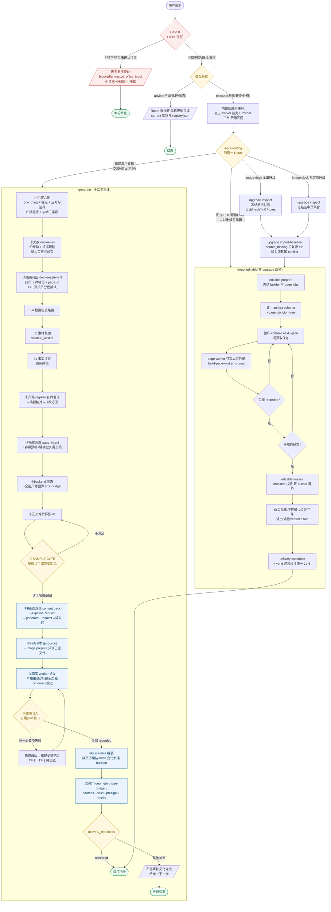

# leo-ppt-generator 执行流程图

- 日期:2026-09-18 · 配套正文见[执行流程](../execution-workflow.md),权威源为
  `leo-ppt-generator/SKILL.md`、`references/*.md` 与运行时 CLI。
  相对 2026-08-29 版本的增补:表达冻结链(内容包 → PipelineRequest → `generate --request`)、
  模板库 v2 的 current 指针与 registry 发现、worker 逐页三层容错、🔶 SAMPLE-GATE 与
  🔴 PARTIAL-GATE / DELIVERY-GATE 两处交付边界、交付门扩展(尺寸预算与 preflight 聚合)。
- 用法:下方 Mermaid 可在 GitHub / 支持 mermaid 的查看器直接渲染;生成节点编号按当前主线顺序
  ①–⑫(aligned 到 image-deck-workflow 的十二步主干,3a/3b/3c 与交付门为新增标注),可编辑节点
  以 E 前缀表示。

## 读图要点

1. **红色系 = 硬门禁**(Gate 0 与模式判定),命中即终止或降级,无绕行路径。
2. **黄色菱形 = 需人裁决的点**:🔶 SAMPLE-GATE 是默认委托执行下唯一默认等待点(逐页派发前的最后一道);
   PARTIAL-GATE 在 upgrade-selected 失败集上单独确认;delivery_readiness 非 `accepted` 一律不是交付闭环。
3. **蓝色节点 = CLI 状态边界**(prepare / record / assemble / 输入代冻结):跨过这条线的每一步都要
   versioned JSON 佐证,聊天声明无效;表达冻结后改版必须建新 run。
4. **QA 打回的箭头指回 worker 派发但先经过「修母版」**:内容问题在母版层修,视觉问题才改 prompt/backend;
   文字失败先走 TF-1(母版减法、同 backend 重生成),再走需样张重确认的 TF-2(留白贴字)。
5. **upgrade-full / upgrade-selected 在进入 editable 子图前多两步「冻结 + 关联」**:`upgrade inspect`
   冻结原交付物,`upgrade import-baseline` 以 source_binding 关联源 generate run;失败不得破坏原成品,
   selected 默认不交付 partial。
6. **run 记录在 backend 合同签署时创建**(约 ⑥ 处):此前的合同、大纲与风格确认属会话内工作,不落 run;
   ⑧ 的输入代一旦提交即不可变,`image prepare` 只核对页身份、页序并登记补充输入,内容或设计改版必须建新 run。
