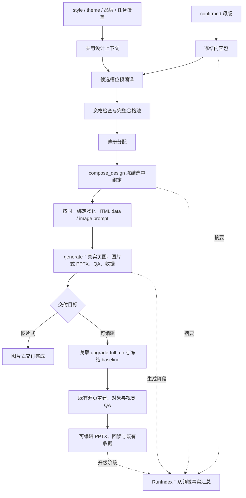

# Dashi PPT 对 Leo PPT Generator 的能力提升与集成方案

## 1. 结论与目标

当前最值得借鉴的是 Dashi 的**内容投影、页面承载资格过滤和整册版式分配**。本方案选择“共用编译逻辑、保留现有执行路线、逐步扩充合格资产”的实现方式：母版内容先映射到候选槽位，检查后冻结并生成页图；需要可编辑交付时再进入既有升级重建流程。Leo 已有的角色映射、推荐、设计组合、RunIndex 和交付收据继续承担各自职责。

| 项目 | 本方案决定 |
|---|---|
| 目标 | 提高内容保真、版式可用性、整册阅读质量和生成可恢复性 |
| 推荐路径 | 已确认母版 → 内容包与设计上下文 → 候选槽位预编译 → 合格池与整册选择 → 冻结设计 → 页图生成与交付；可编辑目标继续进入关联 upgrade run |
| 第一优先级 | 修复已发现的容量筛选、角色 schema 和模板指纹缺口，再接入内容投影 |
| 质量证明 | 必需内容覆盖、真实 CLI 生成、成品回读、逐页视觉检查及改前改后整册对照 |
| 主要风险 | 内容包变成第二份可编辑母版，或组合器只在测试中调用、正式生成继续绕开它 |

本次为 v3 方案修订，U1–U7 均未开始。两阶段投影、关联升级 run 和结构声明是本轮依据源码选定的实施建议，不冒充用户已逐项确认。文档中的新增模块、协议字段、错误分类及验收目标均未实现；“推荐方案”不代表视觉质量或现场收益已被证明。

## 2. 范围与要求

目标仓库为 `leo-skills`，实现边界为 `leo-ppt-generator/`。Dashi 只读参考，不建立兄弟仓库运行时依赖。本文 Leo 文件路径均相对目标仓库根；Dashi 文件路径单独标注，相对 Dashi 仓库根；`<run>/` 表示运行目录，非仓库资产。

| 编号 | 要求 | 对应实施单元 |
|---|---|---|
| R1 | 同一页面经 image/HTML 生成页图，再升级 editable 时，必需事实、数值、单位、期间、来源和页面身份不漂移 | U2、U3、U4、U7 |
| R2 | 自动推荐只返回合同检查合格且 backend 可执行的版式；实际图片/DOM 仍须成品检查，容量、媒体、结构硬失败不能靠加分入选 | U1、U3、U5 |
| R3 | 样张、正式生成、重试、恢复和交付消费同一冻结输入；内容或依赖变化使旧证据失效 | U1、U4、U7 |
| R4 | 页面结构服务论点与证据关系，整册避免无意义重复，并用真实成品对照判断收益 | U5、U6、U7 |
| R5 | 内容、几何、主题、渲染、领域状态、收据分别只有一个所有者，新增模板流程清晰 | U1–U7 |

用户已明确当前处于开发阶段，**无需保留旧路径或旧协议兼容**。新合同直接切换；无法验证的旧 run 明确失效，既有交付文件保留供查阅。已 prepare 后发生内容、设计或执行输入改版时按现有合同建立新 run；同输入失败重试仍留在原 run。既有交付物的 artifact revision 不得替代内容改版所需的新 run。

本期不移植 React 编辑器、整套 Dashi 主题组件、HTML-to-PPTX 引擎，不新增“业务 JSON 直接编译原生 PPTX”的执行路线。对象级可编辑交付复用现有重建器，因此仍有第二次视觉重建的耗时、调用成本与保真风险，必须单独验收。浏览器编辑、任意 bespoke 页面和大规模模板扩库留待独立需求。

## 3. 当前能力与复核证据

### 3.1 已有能力必须复用

| 已有能力 | 当前源码或合同 | 本期增量 |
|---|---|---|
| 内容母版与版本基线 | `leo-ppt-generator/references/deck-master.md`、`leo-ppt-generator/scripts/check_content_baseline.py`、`leo-ppt-generator/scripts/compute_impact.py` | 增加母版到机器输入的无损投影，复用 revision、CAS 和影响计算 |
| 既有派生物重投影 | `leo-ppt-generator/scripts/reproject_derivatives.py` 的 `parse_master()`、`merge_manifest()` | 抽取公共解析，扩展正文/notes 与稳定身份；生成期来源字段仍由原流程拥有 |
| 页图升级与源页归一化 | `leo-ppt-generator/runtime/src/leo_ppt_generator/upgrade/baseline.py`、`leo-ppt-generator/runtime/src/leo_ppt_generator/cli.py` 的 `_normalize_run_sources()` | 在既有 baseline 中关联内容/设计快照，按原路送入可编辑重建 |
| 中文语义角色映射 | `leo-ppt-generator/scripts/suggest_layout.py` 的 `ROLE_PAGE_TYPES` | 统一入口规范化；仅补真正缺少的别名，不另起角色系统 |
| Top-2、分数、理由、置信度 | 同文件的 `score_page()` | 先做硬资格检查，再保留可解释评分并扩展整册分配 |
| canonical 资产与组合器 | `leo-ppt-generator/runtime/src/leo_ppt_generator/asset_resolver.py`、`leo-ppt-generator/runtime/src/leo_ppt_generator/templates.py` | 复用稳定资产 ID、`compose_design()` 和 `verify_design_freshness()`，接入正式生成 |
| 运行状态汇总 | `leo-ppt-generator/runtime/src/leo_ppt_generator/application/run_index.py` | 扩展 `RunIndex` 的引用与可重建摘要；领域 manifest 继续拥有执行状态 |
| 五类交付指纹及漂移计算 | `leo-ppt-generator/runtime/src/leo_ppt_generator/render/receipt.py` | 修复模板源采集，补齐内容、设计、投影和最终产物关联 |

本次盘点的 canonical 库包含 **42 个 layout profile、7 个 HTML 模板**。模板位于 `leo-ppt-generator/template-library/canonical/templates/`，分别为 `cover-basic`、`body-basic`、`compare`、`timeline`、`spec-table`、`pull-quote`、`frame-shot`。7 个模板是当前 HTML 实现覆盖面，不是全部 PPT 生成能力的上限；42 个 layout 也不表示每个都支持所有 backend。

### 3.2 需要进入实施的证据

以下 E1–E4 包含前轮复核的局部探针结果；E5–E10 是当前源码链路核对与资产盘点。它们不构成真实整册生成或视觉验收。当前工作树有既有未提交变更，实施前需冻结实际文件摘要，不能只用 Git HEAD 代表该基线。

| 编号 | 现象与定位 | 影响及证据边界 |
|---|---|---|
| E1 | `leo-ppt-generator/scripts/suggest_layout.py`：封面输入 `est_chars=99999`，P1 容量为 `99999/105`、cover-basic 为 `99999/60`，仍得到 `score=0.6`、`decision=auto` | 容量分归零后仍被角色和节奏分抬过阈值。后续独立容量门可能阻断，不能表述为全流程没有容量检查 |
| E2 | 同一推荐输入将 `image_sources` 从 0 改为 3，候选和分数不变；`load_bank()` 未投影媒体或 renderer 能力供评分器消费 | 推荐层未实际执行媒体承载筛选；字段存在不等于能力生效 |
| E3 | 42 个 layout 使用 8 种角色，P32 使用 `agenda`；`leo-ppt-generator/template-library/governance/schemas/layout-profile-v1.schema.json` 只有 7 值，缺 `agenda`，局部 schema 校验拒绝 P32 | schema、存量资产与角色入口不一致，应先修当前合同，再谈扩词 |
| E4 | 临时 run 修改 `<run>/template-library/canonical/templates/body-basic/page.html` 后收据仍为 `fresh`，模板源采集为 0；`leo-ppt-generator/runtime/src/leo_ppt_generator/render/receipt.py` 的实际采集仍扫描 `<run>/assets/render-templates` | 新目录下的模板变化可漏检；探针是临时 fixture，不代表已证明某份真实交付损坏 |
| E5 | `leo-ppt-generator/template-library/canonical/templates/compare/page.html` 仅在 `sides.length === 2` 时构建对照体；同目录 `template.json` 只声明 `sides` 是 array，`leo-ppt-generator/runtime/src/leo_ppt_generator/render/page.py` 主要解析 JSON 和清洗 SVG | 三组数据可能使整个对照体不生成。应补数量、嵌套字段及可见内容合同；本项未做浏览器复现，不误写成“只漏第三组” |
| E6 | `leo-ppt-generator/runtime/src/leo_ppt_generator/cli.py` 的 `style render` 调用 `compose_style()`，`render page` 独立接受 template/data/theme；`compose_design()` 的调用证据主要在测试和验证脚本 | 正式入口尚未强制绑定冻结设计；不能由验证脚本能组合设计推断正常用户生成已消费它 |
| E7 | `leo-ppt-generator/runtime/src/leo_ppt_generator/templates.py` 在冻结前计算 effective theme 并消费 `page.slots` 校验容量 | 候选需要冻结前的设计上下文与槽位绑定；不能等冻结后才首次投影，落实到 K2/K3 |
| E8 | `leo-ppt-generator/runtime/src/leo_ppt_generator/application/routes.py` 的 generate 只含图片步骤；`leo-ppt-generator/runtime/src/leo_ppt_generator/upgrade/baseline.py` 已能导入页图、notes 和交付物，CLI 可从 baseline 提取可编辑源页 | 使用 generate → upgrade-full 的关联流程，不凭空引入 generate 内的原生对象执行阶段，落实到 K4/U4 |
| E9 | 当前 42 个 layout 中 35 个没有 regions；42 个均未声明结构化槽位类型，41 个仅标为 fixed-regions | 不得从 layout_type 或缺失几何直接生成有质量含义的结构指纹；需要受约束的结构声明与准入，落实到 K5/U5 |
| E10 | `leo-ppt-generator/scripts/reproject_derivatives.py` 已投影图行/术语/数字登记表，但页身份按 S 编号转成 slide 编号；`leo-ppt-generator/references/execution-contract.md` 要求已 prepare 后内容改版建立新 run | U2 复用现有解析；U4 统一稳定身份与展示顺序，内容改版不得借 artifact revision 覆盖原 run |

### 3.3 Dashi 的借鉴落点

Dashi 参考源：`docs/architecture-and-generation-flow.md`、`skills/dashi-ppt/SKILL.md`、`skills/dashi-ppt/references/goal-spec.schema.json`、`skills/dashi-ppt/project/src/deckComposer.jsx`、`skills/dashi-ppt/project/src/view-model/schema-v2-canonical.mjs`。

| Dashi 机制 | Leo 适配决定 | 取舍理由 |
|---|---|---|
| `page-content-pack` / goal / View Model | 扩展既有重投影，新增候选绑定及执行投影，沿用母版内容权威 | 获取结构化收益，避免母版和 JSON 双向维护 |
| `ROLE_ALIASES` | 扩展既有角色映射，保持 canonical 角色集合与 schema 同步 | Leo 已有 25 个中文语义角色映射，不从零另造 |
| 媒体槽过滤 | 把媒体需求、数量和能力纳入硬资格 | 能筛选出真正可生成的候选，不能只看角色和风格 |
| `usedLayouts`、稳定种子选取 | 扩展整册分配，使用稳定 page ID 和结构指纹 | 保留可复现性，同时防止换 ID 或换色冒充结构变化 |
| 多变体 | run 内保存候选与 selected | 沿用 Top-2，按任务必要性扩展，不强制每页“3 模板 + 1 bespoke” |
| 预览编辑与导出关联 | 扩展 RunIndex、样张决策及既有交付收据 | 当前目标是正式生成连续性，不引入第二套编辑状态 |

Dashi 说明文档本身未提供真实 deck 生成、浏览器视觉验收和 PPTX 导出的完整运行证据，因此这里只借鉴机制，不据此宣布其视觉质量优于 Leo。v2 的后续审查为两路独立 Agent 加主 Agent 安全核对，保留两项 P1 和结构指纹风险；v3 在 K2–K5 及对应单元中处理，不将文档修订记为运行验证。

## 4. 技术设计

### K1. 母版唯一可改，内容包单向派生

架构姿态为 **复用母版 + 新增编译投影**。`confirmed deck-master` 仍是 generate 内容层唯一可修改真值；拟新增的 `<run>/input/page-content-pack.json` 必须绑定母版 revision、SHA256、编译器版本和规范化内容摘要。不得编辑内容包后反写母版，也不得把 outline、slides.json 与母版并列为业务内容来源。

内容包至少保留 deck 目标与受众、稳定 page ID、展示顺序、叙事角色、核心论点，以及逐项内容身份。内容项包含数值、单位、期间、证据级别、source_ref、图表行列、图行与媒体引用；`speaker_script` 和 `engineering` 独立存放，后者不进版面或 PPTX notes。

稳定 page ID 首次写入母版后跨 revision 保留，展示页序单独维护。插页、换序不能给未变化页重新编号；内容项也需稳定身份，不能依赖数组下标对账。确认来源沿用 `user-confirmed` / `user-delegated` 的真实记录。

默认所有上版内容都是必需项；可省略项及其条件必须来自已确认母版。解析不了的文本、图行或表格应返回母版补齐，不静默丢弃、截断、改数或降级为可选。正文结构不足时在母版中补充明确的表格/指标/比较对象标记，确认后再编译，不在确定性编译器里调用模型猜测结构。

扩展 `leo-ppt-generator/scripts/reproject_derivatives.py` 已有母版、图行与术语投影；公共解析抽到拟新增的 runtime 内容包模块，由重投影与母版检查脚本共同调用。最高 confirmed 基线查找仍复用现有算法，不维护第二套遍历；runtime 不反向导入脚本。来源文件 hash、实际 backend、生成后产物 hash 等流程事实仍由既有来源 manifest/执行器拥有，内容包只引用，不伪造。来源字段只有在稳定 page ID、figure ID 与来源输入摘要均匹配时才能继承。

新协议的 `page_id` 为母版写入的稳定身份，`number` 为本次展示顺序；文件名中的 slide/page 序号只是产物定位信息。投影、来源 manifest、PageArtifact、升级 baseline 和影响计算使用同一身份映射，不能再从文件名或页标题数字推导业务身份。已 prepare 后调整内容或顺序建立新 run，保留稳定 page ID 并重新计算执行输入摘要。

### K2. 先解析设计上下文，再检查候选资格

架构姿态为 **抽取组合器前半段 + 扩展既有容量所有者**。在 `leo-ppt-generator/runtime/src/leo_ppt_generator/templates.py` 内从 `compose_design()` 抽取共用的设计上下文解析，复用 `leo-ppt-generator/runtime/src/leo_ppt_generator/render/theme.py` 的 `compute_effective_theme()`。上下文包含解析后的 style/theme、mode、品牌锁、任务覆盖、有效字号、约束与实际资产摘要；推荐器与最终组合器消费同一快照，不另写主题覆盖规则。

冻结前的顺序明确为：内容包 + 设计上下文 → 角色规范化 → 候选槽位预编译 → 容量/媒体/backend/必需内容覆盖检查 → 合格池 → 软评分与整册选择。未知角色、必需槽位或媒体能力未知、输入结构不支持均不能自动入选；无合格候选返回待定及具体原因，禁止用软评分抵消硬失败。

容量计算继续由 `leo-ppt-generator/runtime/src/leo_ppt_generator/render/layout.py` 与共用合同拥有。先修硬超仍自动入选，再补逐槽位检查。HTML 使用实际 regions、字体与表格行列容量；image 使用已声明的字数/条数/媒体容量作预检，其几何为指导性，不能宣称生成前已证明最终像素布局可用。两类均须执行成品 QA，预检资格与成品通过分别记录。

角色沿用现有中文映射，仅补确有输入需求的英文别名；不把每个叙事词升级成 canonical page_role。显式指定 layout 也走同一资格检查，不能成为绕过入口。

### K3. 共用候选绑定，分两阶段投影

架构姿态为 **新增窄内容投影职责，复用主题/容量/图表/风格投影**。拟新增的 `leo-ppt-generator/runtime/src/leo_ppt_generator/content_projection.py` 负责以下两个阶段：

| 阶段 | 输入 | 输出与不变量 |
|---|---|---|
| 候选预编译 | 已冻结内容包、同一设计上下文、候选 layout/template、页级 backend | 只读候选绑定：内容项 ID → 槽位/数据路径、完整显示值、媒体引用与使用策略、输入/资产/编译器摘要；不需要 resolved design，不调用 Provider |
| 选定后物化 | selected 候选绑定 + 由该绑定生成的冻结设计 | HTML data 或 image prompt，以及升级重建时的内容核对约束；复用同一绑定，不重新概括内容、重选布局或改字号 |

候选绑定是可重建派生结果，不增加独立可写状态文件。候选摘要随 `<run>/input/layout-selection.json` 保存，选中绑定进入 resolved design 的对应页；`compose_design()` 校验上下文、内容和资产摘要一致后冻结。最终投影按绑定输出，同输入重编译须得到相同绑定摘要；出现差异即拒绝，不能静默换成另一套映射。

layout slots 扩展明确的内容类型与媒体数量能力，模板 manifest 声明真实嵌套输入形状，二者绑定并交叉校验。例如 compare 必须恰好 2 组；3 组比较应换合格结构或回母版修订，不隐藏内容。图表复用 `leo-ppt-generator/runtime/src/leo_ppt_generator/render/chart.py`；image 风格与布局指令复用 `project_design_to_prompt()`，新增代码只补业务内容绑定。

必需内容检查采用“输入映射 → 实际呈现 → 最终交付”三层。HTML 检查可见 DOM、裁切及图表系列/标签；image 检查真实图片文字与事实，prompt 覆盖不代表图像保真；editable 作为后续重建检查对象、渲染与 notes。来源/审核元数据按合同指定位置留存，engineering 不进画面或 notes，禁止把整个内容包直接当成生成提示词。

### K4. 正式生成与关联升级各有执行归属

架构姿态为 **组合现有 generate 和 upgrade-full，不新增执行引擎或总状态文件**。普通图片式交付仍在 generate 中完成。用户要求从材料得到可编辑稿时，交付流程明确分成两个关联 run：

| 环节 | 既有所有者 | 拟补充的关联与完成条件 |
|---|---|---|
| 生成阶段 | generate 的 image prepare/dispatch/finalize，页图可以来自 image 或 render | 消费冻结绑定，完成页图、图片式 PPTX、真实 QA 和收据 |
| 升级准备 | upgrade inspect/import-baseline、RunIndex 创建、edit backend 合同 | 创建独立 upgrade-full run；在现有 image-baseline 中冻结源交付、页图、notes、内容包和设计摘要/副本，以及稳定页面映射 |
| 可编辑重建 | CLI 的 `_normalize_run_sources()`、EditableAdapter、现有 worker 与 builder | 从 baseline 的真实页图重建对象；内容包只提供核对约束，不能替代源页或伪造对象输出 |
| 最终交付 | upgrade-full finalize、既有收据与 RunIndex | 最终对象/渲染/notes/事实对账通过后，才完成用户的可编辑目标；源 generate 完成仅表示前一阶段完成 |

CLI 编排扩展留在现有 run/upgrade 入口及其所有者，薄协调逻辑只负责输入绑定、顺序、幂等和失败传播。route 定义维持现有四条路线；generate 的终态仍是图片交付，不用改变它的含义来掩盖未完成的升级。默认升级全部页面；只有明确选择部分升级时使用既有 upgrade-selected 与 partial 规则。

沿用现有 RunIndex 创建、项目 sources/contracts 路径规则及 edit backend 能力检查。源交付先验证真实归属与 hash，再按既有可信输入流程进入项目源区；用户上传的未知 Office 文件仍走原信任门，不能因存在一个 source-run 字段就被自动信任。

关联与幂等记录放在目标 run 的既有输入引用和 image-baseline 中：绑定源 run ID、源交付 SHA、源内容/设计摘要、目标路线与 edit backend 合同。重复请求同一组合复用已创建的目标；同一目标输入冲突明确拒绝。复制完成后再校验所有快照及关联摘要，最后发布 baseline，失败不暴露可执行的半份基线。目标恢复可仅依赖已验证本地快照，不要求源目录仍在线；源内容改版需生成新的源 run 和升级目标，不替换正在重建的基线。

所有正式 CLI、worker、adapter 使用冻结 page ID/number/内容/设计/投影绑定。样张决定绑定实际输入，改变后按现有规则重新审查；同输入重试先检查 freshness，已 prepare 后修改内容或设计建立新 run。底层单页渲染工具可服务模板开发，但其输出必须补齐正式绑定和证据才能用于交付。

direct-editable 继续以可信输入页与对象合同为权威，没有母版时不强加内容包。来自本技能的 upgrade 继承源母版约束；重建结果与母版或源页冲突时，记录失败并回到相应源修订，不能在目标页悄悄“修正”业务内容。升级失败保留已验收的图片交付，用户的可编辑目标仍为未完成，不自动改成图片式成功交付。

### K5. 明确结构来源，再做整册分配

架构姿态为 **给 layout 补充小型结构声明，新增有界整册分配职责**。42 个 profile 中 35 个没有 regions，不能只 hash 坐标或 `layout_type`。在 canonical layout 内新增受 schema 约束的 `structure`，包含已有槽位的阅读顺序、分组及排列关系、槽位间的信息关系和图表编码；只记录结构，不保存主题、业务文案、评分或第二套几何。

结构声明由资产作者依据模板实现或 image composition 说明整理，并用样张核对。HTML 声明必须对应真实 DOM/regions；image 声明描述预期构图，只有实际页图复核后才能判断是否呈现。不得在每次推荐时用模型重新猜拓扑，也不得把 renderer 自由文本的 hash 叫作结构指纹。

结构指纹对上述声明作版本化规范化：引用重命名不改变结构，颜色/资产 ID/主题名不参与，阅读顺序、分组关系或编码改变则必须改变指纹。它证明“声明的结构相同”，不证明最终图片相同。缺声明记 unknown，不获得多样性加分；进入自动整册分配前必须补齐声明和 K2 的资格合同。显式选择仍需实际承载检查与样张复核，不把 unknown 当作新的结构族。

首批准入集合固定为现有 7 个 HTML 绑定 profile，以及 U6 四类任务实际需要的 image profile。其余存量资产可逐个补齐后进入自动池，不要求给 35 个 image profile 编造精确坐标。由 `capability_manifest.py` 从 canonical 声明与既有验证记录派生可用集合，registry 不另存一套手写准入名单。

整册分配内部保留**完整合格候选池**，Top-2 仅是面向人的推荐摘要。采用确定性有界搜索：先满足显式选择、角色、容量、backend、禁复用与最大次数等硬约束，再按整册匹配分、相邻重复、结构族频率和叙事节拍排序。采用固定策略版本与搜索预算，平分按稳定 page ID/资产 ID 决定；无需为多样性额外生图。

候选存在但搜索预算耗尽与完全没有合格候选分别报告，前者不得宣称无解或放宽硬约束。合理的连续同构页可以保留并记录原因；`max_per_deck` 仅按现行合同对禁复用 profile 生效，不能给所有普通版式默加“一次”限制。选择变化必须生成新的设计与投影摘要，并按 K4 处理 run/样张失效。

### K6. 精选页面结构按任务缺口扩展

架构姿态为 **先复用、必要时新增**。先把 42 个 layout、7 个 HTML 模板及 `leo-ppt-generator/runtime/src/leo_ppt_generator/render/chart.py` 能力映射到真实任务，优先处理四类高价值结构：

| 任务 | 页面应回答的问题 | 承载要求 |
|---|---|---|
| 指标及基准差异 | 当前结果相对目标或上期差多少，意味着什么 | 数值、单位、期间、基准、差异和结论同时可辨认 |
| 趋势及事件注释 | 变化发生在哪里，哪些事件相关 | 时间轴、完整数据系列、事件位置、来源；相关性不冒充因果 |
| 决策矩阵 | 方案如何比较，建议依据是什么 | 评价维度、同口径选项、取舍与建议，不把多维比较压成口号 |
| 流程及责任分工 | 谁在何时完成什么，依赖与交付是什么 | 阶段、责任人、依赖、交付点；必要时分层或拆页 |

已有模板能保真表达时，新增 fixture 或投影规则即可；仅在结构或执行能力不足时新增 layout/template。缺目标/上期基准不能编造差异，缺时间序列不能包装成趋势，缺决策依据不能补一个虚构推荐；先回母版确认表达任务。结构服务论点和证据，不能为了套模板把可选内容升级成必需事实。风格色彩进 theme，几何/容量/结构关系进 layout，输入消费进 template，不能用行业换皮复制模板。

新增流程沿用 `leo-ppt-generator/template-library/canonical/templates/README.md`：定义任务缺口 → 检索可复用能力 → 必要时新增 canonical 资产与绑定 → 输入/容量/媒体负例 → 真渲染及回读 → 按既有库发布流程生成索引。run 候选和样张不写入 canonical。

### K7. RunIndex 与现有收据继续负责状态和交付

架构姿态为 **扩展现有所有者**。撤回 v1 的独立可写 `deck-state.json` 和第二种 preview/export receipt。

RunIndex 仅增加内容、选择、设计、投影及源 run 的引用/摘要，继续从领域 manifest 汇总状态；展示用 View Model 必须可重建，不能反向变成写状态入口。可编辑任务的进展从目标 upgrade run 及其 source-run 关联推导，不再写一份“总任务状态”。并发修改沿用 revision/CAS、文件锁和原子写语义。

既有 `delivery-receipt.json` 关联当前内容/设计/投影、实际使用的模板与依赖、QA、预览和最终文件。修复模板采集不仅要替换旧路径，还要从 resolved design/resolver 取得真实消费依赖并冻结到 run；库外依赖记录稳定资产 ID 与摘要，不依赖机器绝对路径，也不靠扫整库冒充实际消费。

交付核对页数、稳定 page ID 与最终页序映射、文件 SHA、必需内容覆盖、QA 状态及 freshness。对于本次 run 所绑定的输入，母版、模板、主题、布局、字体、媒体或投影漂移均应使关联证据失效；未使用资产及日志/计时变化不污染收据。已导入的 upgrade 以其不可变 baseline 验证源事实，源项目另建新版不回写这份快照，也不允许旧快照冒充新版结果。跨页序影响依据 page ID 映射，不继续只猜文件名中的数字。

### 目标链路

direct-editable 从可信源页直接进入既有重建链；upgrade-selected 按现有选页与 partial 合同执行，两者均不强制经过母版生成。候选预编译在设计冻结前，执行物化在冻结后；编译模块的开发顺序与运行顺序分开描述。

## 5. 实施单元

下述 U 编号仅属于本方案，不替代既有模板重构方案的同名编号。测试路径是后续实施落点，本次未新增测试或执行这些验收。

### U1. 修正现有合同缺口

- **负责要求与依赖**：R2、R3、R5；无前置单元，先冻结当前资产与消费者基线。
- **文件落点**：`leo-ppt-generator/scripts/suggest_layout.py`、`leo-ppt-generator/scripts/check_deck_geometry.py`、`leo-ppt-generator/scripts/lint_layout_grid.py`、`leo-ppt-generator/runtime/src/leo_ppt_generator/render/layout.py`、`leo-ppt-generator/runtime/src/leo_ppt_generator/render/receipt.py`、`leo-ppt-generator/template-library/governance/schemas/layout-profile-v1.schema.json`。
- **交付与失败行为**：修 E1/E3/E4；硬超候选直接淘汰，schema 对齐实际角色；模板源不能在有依赖时记录为空。共享容量判据，找不到依赖明确失败。
- **测试落点**：`leo-ppt-generator/tests/boundary/test_suggest_layout.py`、`leo-ppt-generator/tests/test_library_contracts.py`、`leo-ppt-generator/tests/test_delivery_receipt.py`。
- **验收场景**：复现 99999 字硬超并排除；正常边界仍可选；42 个真实 profile 合同一致；canonical 模板修改/删除使收据 stale，日志修改不影响；未使用资产变化不误判为当前页失效。

### U2. 扩展母版解析与稳定身份

- **负责要求与依赖**：R1、R5；依赖 U1 的角色/容量合同。
- **文件落点**：拟新增 `leo-ppt-generator/runtime/src/leo_ppt_generator/content_pack.py`、`leo-ppt-generator/runtime/src/leo_ppt_generator/schemas/page-content-pack-v1.schema.json`；扩展 `leo-ppt-generator/references/deck-master.md`、`leo-ppt-generator/scripts/check_master_contract.py`、`leo-ppt-generator/scripts/reproject_derivatives.py`、`leo-ppt-generator/scripts/find_confirmed_baseline.py`，复用 `leo-ppt-generator/scripts/check_content_baseline.py`、`leo-ppt-generator/scripts/compute_impact.py`。
- **交付与失败行为**：按 K1 抽取公共解析，统一正文/图行/登记表/notes 与稳定身份；不能解析时指向母版位置。内容包不得从旧来源流程记录盲目继承已失效的 source hash。旧母版缺身份先形成新的合法母版，不能在每次编译时重发 ID。
- **测试落点**：拟新增 `leo-ppt-generator/tests/test_content_pack.py`；扩展 `leo-ppt-generator/tests/test_reproject_derivatives.py`、`leo-ppt-generator/tests/boundary/test_master_contract.py`、`leo-ppt-generator/tests/test_check_content_baseline.py`、`leo-ppt-generator/tests/test_compute_impact.py`。
- **验收场景**：插删/换序不改变未修改页身份；同数不同单位/期间不可合并；正文、来源、图行完整；同 figure ID 更换素材后不继承旧 hash/审查结果；pending 修订不成为投影基线；手改内容包被拒；工程备注不进 notes；CAS 冲突不覆盖。

### U3. 共用候选预编译与执行投影

- **负责要求与依赖**：R1、R2；依赖 U2，复用 U1 容量判据；此单元先交付可单独调用的编译能力，U4 才绑定正式入口。
- **文件落点**：拟新增 `leo-ppt-generator/runtime/src/leo_ppt_generator/content_projection.py`；扩展 `leo-ppt-generator/runtime/src/leo_ppt_generator/templates.py`、`leo-ppt-generator/runtime/src/leo_ppt_generator/render/theme.py`、`leo-ppt-generator/runtime/src/leo_ppt_generator/render/layout.py`、`leo-ppt-generator/runtime/src/leo_ppt_generator/render/page.py`；同步 `leo-ppt-generator/template-library/governance/schemas/layout-profile-v1.schema.json`、`leo-ppt-generator/template-library/governance/schemas/template-v1.schema.json`、`leo-ppt-generator/template-library/canonical/layouts/`、`leo-ppt-generator/template-library/canonical/templates/` 与 `leo-ppt-generator/scripts/lint_template_contract.py`。
- **交付与失败行为**：共用设计上下文，先编译候选绑定，再以选中绑定冻结设计并物化；实际首批使用资产补齐槽位类型/容量/媒体与输入形状。前后摘要不一致、字段无落点、必需能力未知直接拒绝。通过冻结设计 fixture 验证编译能力不等于正式链路已接通。
- **测试落点**：拟新增 `leo-ppt-generator/tests/test_content_projection.py`；扩展 `leo-ppt-generator/tests/test_templates.py`、`leo-ppt-generator/tests/test_template_contract.py`、`leo-ppt-generator/tests/render/test_page.py`、`leo-ppt-generator/tests/render/test_overflow_sentinel.py`。
- **验收场景**：品牌/字体覆盖改变时候选容量和最终容量一致；冻结前后同一绑定摘要一致；换序不丢来源；compare 1/2/3 组拒绝/展示/拒绝；媒体需求 0→3 改变资格；隐藏/裁切/只存在于 JSON 的必需项不能过关；image 预检不得被报告成最终文字保真。

### U4. 接通正式生成与关联可编辑升级

- **负责要求与依赖**：R1、R3；依赖 U3。可先以已补合同的合格 Top-2 接通编排；U5 上线后由同一选择接口替换并在 U7 重跑最终链路。
- **文件落点**：`leo-ppt-generator/runtime/src/leo_ppt_generator/cli.py`、`leo-ppt-generator/runtime/src/leo_ppt_generator/templates.py`、`leo-ppt-generator/runtime/src/leo_ppt_generator/application/run_index.py`、`leo-ppt-generator/runtime/src/leo_ppt_generator/application/routes.py`、`leo-ppt-generator/runtime/src/leo_ppt_generator/upgrade/baseline.py`、`leo-ppt-generator/runtime/src/leo_ppt_generator/image_deck/adapter.py`、`leo-ppt-generator/runtime/src/leo_ppt_generator/editable/adapter.py`、`leo-ppt-generator/runtime/src/leo_ppt_generator/contracts.py`、`leo-ppt-generator/runtime/src/leo_ppt_generator/application/sample_decisions.py`。
- **合同与提示落点**：同步 `leo-ppt-generator/scripts/check_sources_manifest.py`、`leo-ppt-generator/scripts/reproject_derivatives.py`、`leo-ppt-generator/references/sources-manifest-schema.md`、`leo-ppt-generator/SKILL.md`、`leo-ppt-generator/references/execution-contract.md`、`leo-ppt-generator/references/image-deck-workflow.md`、`leo-ppt-generator/references/editable-workflow.md`、`leo-ppt-generator/prompts/render-worker.md`、`leo-ppt-generator/prompts/slide-worker.md`、`leo-ppt-generator/prompts/page-worker.md`。入口只保留路由/必须条件，细节放引用，不复制整套规则。
- **交付与失败行为**：按 K4 接通两个关联 run，保持 generate 图片终态和 upgrade 可编辑终态；源码中所有来源/页产物合同统一 page ID 与 number 映射。篡改内容/主题/模板拒绝执行；源 baseline 复制或校验失败不进入 editable prepare；升级失败不删除原交付，也不宣布可编辑目标完成。
- **测试落点**：拟新增 `leo-ppt-generator/tests/test_design_execution_binding.py`、`leo-ppt-generator/tests/test_generate_upgrade_binding.py`；扩展 `leo-ppt-generator/tests/test_design_projection.py`、`leo-ppt-generator/tests/test_sample_decisions.py`、`leo-ppt-generator/tests/test_sources_freeze.py`、`leo-ppt-generator/tests/test_library_bundle.py`。
- **验收场景**：正式 CLI 从母版到页图，再从真实 baseline 到可编辑 PPTX；父阶段成功但升级失败时目标未完成；重复创建关联目标可重放；复制中断无可执行半成品；成功导入后移走源目录仍可恢复；source hash/目标 edit backend/内容快照冲突被拒；未知 Office 不因伪造源 run 字段被信任；已 prepare 内容改版强制新 run；direct-editable 无母版照常沿可信源页执行。

### U5. 结构声明准入与整册分配

- **负责要求与依赖**：R2、R4、R5；依赖 U3/U4。
- **文件落点**：拟新增 `leo-ppt-generator/runtime/src/leo_ppt_generator/layout_selection.py`；扩展 `leo-ppt-generator/template-library/governance/schemas/layout-profile-v1.schema.json`、`leo-ppt-generator/template-library/canonical/layouts/`、`leo-ppt-generator/runtime/src/leo_ppt_generator/layout_bank.py`、`leo-ppt-generator/runtime/src/leo_ppt_generator/templates.py`、`leo-ppt-generator/scripts/suggest_layout.py`、`leo-ppt-generator/scripts/lint_layout_grid.py`、`leo-ppt-generator/scripts/capability_manifest.py`、`leo-ppt-generator/references/layout-dispatch.md`。
- **交付与失败行为**：按 K5 为首批准入资产补结构声明与样张核对，报告总库/合同合格/自动可选数量；未知结构不冒充新结构族。推荐脚本变薄入口，共用完整候选池与有界搜索；搜索未找到结果不能隐式放宽约束。
- **测试落点**：拟新增 `leo-ppt-generator/tests/test_deck_layout_selection.py`；扩展 `leo-ppt-generator/tests/boundary/test_suggest_layout.py`、`leo-ppt-generator/tests/boundary/test_layout_reuse.py`、`leo-ppt-generator/tests/test_library_contracts.py`、`leo-ppt-generator/tests/test_capability_manifest.py`。
- **验收场景**：结构相同但颜色/命名不同指纹一致，阅读顺序/分组/编码改变指纹变化；35 个无 regions 的 image profile 不被伪造坐标；未知结构的状态与准入明确；全局解需要第三候选时仍可找到；普通版式不误套一次限制；搜索超预算与候选为空可区分；同输入/资产/策略/预算结果一致；声明结构与真实样张对应。

### U6. 补齐精选页面结构与新增流程

- **负责要求与依赖**：R4、R5；依赖 U3/U5，在 U5 已可工作的首批集合上补任务缺口。
- **文件落点**：`leo-ppt-generator/template-library/canonical/layouts/`、`leo-ppt-generator/template-library/canonical/templates/`、`leo-ppt-generator/template-library/canonical/templates/README.md`、`leo-ppt-generator/scripts/capability_manifest.py`，复用 `leo-ppt-generator/runtime/src/leo_ppt_generator/render/chart.py`。
- **交付与失败行为**：按 K6 为四类任务逐一登记输入前提、复用/新增决定、容量/媒体边界与真实样例；先复用实际承载能力，不预设新增模板数量。缺基准/时间/依据时回母版处理，不从模板默认值编造事实。
- **测试落点**：`leo-ppt-generator/tests/test_capability_manifest.py`、`leo-ppt-generator/tests/test_template_contract.py`、`leo-ppt-generator/tests/render/test_chart.py`、`leo-ppt-generator/tests/test_render_theme_baseline.py`；拟新增样例目录 `leo-ppt-generator/tests/fixtures/dashi-integration/`。
- **验收场景**：四类任务均有真实承载证据及缺数据负例；正常/近容量/超容量覆盖；换肤不改变业务内容与结构身份；7 个现有模板无回归；新增资产从 authoring、lint、索引发布到正式生成可达；准入数量由真实状态派生。

### U7. 状态、交付与整册收益验收

- **负责要求与依赖**：R1、R3、R4、R5；完整验收依赖 U1–U6。U1 修收据基础采集，U4 完成跨 run 绑定，本单元收口完整依赖与交付证明。
- **文件落点**：`leo-ppt-generator/runtime/src/leo_ppt_generator/application/run_index.py`、`leo-ppt-generator/runtime/src/leo_ppt_generator/render/receipt.py`、`leo-ppt-generator/runtime/src/leo_ppt_generator/evidence.py`、`leo-ppt-generator/runtime/src/leo_ppt_generator/contracts.py`、`leo-ppt-generator/runtime/src/leo_ppt_generator/upgrade/baseline.py`、`leo-ppt-generator/runtime/src/leo_ppt_generator/hybrid/assembler.py`、`leo-ppt-generator/scripts/build_delivery_preflight.py`、`leo-ppt-generator/references/execution-contract.md`。
- **交付与失败行为**：按 K7 扩展既有收据/汇总，验证候选绑定到生成与升级产物的真实关系；可编辑目标只认目标 upgrade 的证据。错误页序、错误 SHA、漏项、旧样张或缺真实 QA 都不能交付为通过。
- **测试落点**：拟新增 `leo-ppt-generator/tests/test_deck_projection_view.py`；扩展 `leo-ppt-generator/tests/test_delivery_receipt.py`、`leo-ppt-generator/tests/test_compute_impact.py`、`leo-ppt-generator/tests/test_build_delivery_preflight.py`、U4 的关联升级测试。评测材料和规约进入 U6 fixture，生成产物放被忽略的工作区。
- **验收场景**：状态视图从领域文件重建；CAS 冲突拒绝；页序/内容/实际依赖变化使对应证据失效，未使用资产和计时不误触发；既有升级快照不被源目录新版回写；最终对象、渲染、notes、页数与稳定页面映射一致；以 U5/U6 最终资产重跑全部正式路线及整册对照。

## 6. 实施顺序

| 阶段 | 单元 | 阶段退出条件 |
|---|---|---|
| A：补齐当前合同 | U1 | E1/E3/E4 回归通过，共享容量与源依赖判据一致 |
| B：接通内容与执行 | U2 → U3 → U4 | 冻结前后绑定一致；generate 与关联 upgrade 实际贯通；错误输入阻断，源交付保留 |
| C：提升整册表达 | U5 → U6 | 结构声明及自动准入有证据，完整候选池支持分配，四类任务完成复用/新增验证 |
| D：验证成品收益 | U7 | 用最终选择器/资产重跑正式链路，完成成品、关联升级和质量/成本对照 |

开发顺序不等同于运行顺序：U3 可用现有组合器与显式 fixture 验证编译，U4 接通正式流程，U5 替换选择策略后在 U7 验证最终组合。U3/U4 完成前不声明内容投影进入生产路径，U5/U6 完成前不声明全库自动准入或整册质量提升。每次源文件变更同步根目录 `CHANGELOG.md`，不修改无关技能包。

## 7. 验证与完成标准

### 7.1 结构与行为

| 维度 | 通过条件 |
|---|---|
| 内容保真 | 必需内容项映射覆盖率 100%，无未经确认的删减、错数、单位/期间丢失；notes 和工程信息隔离 |
| 推荐资格 | 自动候选通过角色、结构声明、槽位、声明容量、媒体、backend 和映射覆盖检查；硬失败入选为 0，预检不冒充成品通过 |
| 连续性 | 候选预编译、冻结设计、正式 CLI/worker 消费同一绑定；generate → upgrade 快照关联可验证，篡改与 stale 负例全部拒绝 |
| 可恢复 | 同冻结输入可重建绑定/选择/设计摘要；页 ID 稳定；同输入重试与内容改版新 run 分开；独立升级快照可恢复 |
| 交付完整性 | 最终文件存在，SHA、页数、页序映射、QA、预览与收据可相互核对，不靠手写通过状态 |

HTML 的可见性检查、图表数据检查、image 的文字与事实核验、editable 的对象和渲染回读分别执行。不能用 image prompt 含有某句话证明生成图片出现该句话，也不能用 DOM 中存在数据证明观众看得到。

### 7.2 真实路线覆盖

| 场景 | 必须经过的正式链路 | 必须具备的成品证据 |
|---|---|---|
| 全 HTML 页图生成 | 母版 → 候选预编译 → 最终选择 → render → image finalize | 可见内容、图表数据、页图、PPTX 回读与收据 |
| 含真实 image 页的生成 | 同一内容/设计绑定 → 真实图像 backend → image finalize | 实际图片文字与事实检查，不能用 prompt 代替 |
| 从材料获得全可编辑稿 | generate → 验收源交付 → 新建关联 upgrade-full → import-baseline → editable 重建 → finalize | 两阶段关联摘要、真实可编辑对象、视觉回读、notes、事实覆盖和目标收据 |
| 直接重建可信输入 | direct-editable 的原路径 | 不依赖不存在的母版，源页/对象/渲染与最终文件一致 |
| 局部升级与混合组装 | upgrade-selected 的原路径 | 选页映射、保留原图页、实际成功/失败集合及既有 partial 规则 |

从材料到可编辑稿的场景不能用“单独跑过 generate 和 direct-editable”替代。两阶段必须使用真实关联数据；至少注入一次父阶段成功、升级失败的情形，确认目标状态与源交付保留行为正确。

共享合同测试可复用，但每条路线必须有对应真实产物与入口证据。真实图像或重建调用涉及新增费用时按已有授权和具体预算处理；本次不发起 Provider 调用。依赖不可用记 `blocked` 或 `not_run`，不以 Mock 补记真实通过。

### 7.3 整册质量与成本对照

复用既有材料选择 4 组管理层任务，每组 6–8 页，覆盖 K6 的四类结构及长中文、数值、图表、来源和媒体。先冻结原始材料、确认母版、源码/资产摘要、环境与评分规则，再生成改前/改后整册；同组固定内容要求、主题、字体、浏览器、backend、模型配置与输出尺寸，分别保存原始失败、重试及最终样本。

区分两类证据：共同可表达任务用于前后配对盲评，新增或此前不支持的结构用于能力覆盖验证。改前无法生成只计为可靠性/覆盖差异，不能直接算新版赢得视觉盲评；不足有效配对数时报告视觉证据不足，不临时替换失败题目或修改分母。

验收分开记录，不用单一总分替代：

- **硬缺陷**：错数、漏必需内容、来源错配、裁切/遮挡、不可读文字、空媒体、错误页序均为 0；验收器先用植入缺陷确认能检出这些问题。
- **表达质量**：匿名打乱前后顺序，以 4 组有效配对样本作独立盲评，逐项评估论点突出、证据可读、信息关系、节奏与一致性；至少 3 组总体偏好新版，任何组不能出现关键表达维度退步。首轮冻结“平局/分歧/不可判定”的处理规则，不能根据结果修改。相同结构复用是否合理结合任务判断。
- **评审边界**：记录评审来源、模型/人员身份及分歧裁决；无独立评审则如实保留缺口，不能把生成者自评当成独立通过。
- **成本**：记录端到端时间、人工返工时间、模型调用数、费用、重试与重渲染次数，同时报告一次成功率。可编辑任务必须累计 generate 与 upgrade 两段成本，分别报告中间交付和最终可编辑成功率；不能只计成功样本，也不能用重试后最佳图代表首次生成表现。
- **准入**：对照前冻结调用/费用上限和可接受时间预算，超限暂停分析。质量改进但成本增加时，记录取舍依据，不自动宣称“效率提升”。

4 组对照只支持这些固定任务的收益结论，不能外推为全行业能力。已有 20 行业内容评测在样张前截断，可复用其材料与内容判据，但不替代视觉、Provider、成本及最终交付验证。

### 7.4 完成口径

本方案的完成是文档修订、文件落点与验收口径明确；实施完成必须另有 U1–U7 的实际证据。报告分别给出 `structure_contract`、`behavior_quality`、`runtime_cost`、`field_outcome`，其中真实用户收益未观测则保留未验证，不从单测或模型评分推导。

## 8. 风险与后续边界

| 风险 | 处理 |
|---|---|
| Markdown 母版难以无损解析 | U2 扩展既有重投影并统一解析；无法映射就回到母版补齐，不用启发式静默删改 |
| 推荐与生成使用不同映射或字号 | K2/K3 共用设计上下文和两阶段绑定；image 预检与最终像素检查分开，超限回母版处理 |
| 正式路径绕过设计组合器 | U4 对实际 CLI、worker、恢复路径设置绑定检查，用篡改负例验证 |
| 状态、收据、内容多头维护 | K1/K7 明确唯一所有者；派生物可重建，交付前验证真实消费依赖 |
| 结构元数据不足或为“多样性”破坏理解 | K5 声明与成品证据分开，未知结构不冒充新结构族；允许有依据的重复，不为模板编造数据 |
| 提前截成 Top-2 导致全局分配失败 | 内部保留完整合格池，有界搜索失败与无候选分别报告 |
| 重建阶段引入失真、额外成本或假完成 | K4 使用明确关联的 upgrade run，完整内容对账，成本累计两段；原图片交付成功不能替代可编辑目标 |
| 开发中协议变化导致旧 run 混入 | 新协议直接切换；明确拒绝无法验证的旧 run，内容/设计改版新建 run，保留历史成品 |
| 新设计扩大文件路径与数据注入面 | 继续复用 resolver、路径 containment、输入 schema 与 SVG 清洗边界，不绕过既有隔离 |
| 质量评价被静态测试或精选样张替代 | 按第 7 节真实路线、整册盲评和完整成本账验收；缺证据按实际状态报告 |

后续如确需浏览器编辑，先定义“编辑命令如何回到内容或设计所有者”的协议；只读 View Model 可先使用，但不能先做编辑状态文件再补一致性规则。

## 9. v2 修订记录

| v1 建议或遗漏 | v2 修订 |
|---|---|
| content-pack 与母版均称内容源 | 明确母版唯一可修改，content-pack 是有版本与摘要绑定的单向投影 |
| 将角色 alias、候选机制当成全新能力 | 承认既有 ROLE_PAGE_TYPES、Top-2 和评分理由；先修合同与实际承载筛选 |
| 新建 deck-state 与 preview/export receipt | 撤回；扩展 RunIndex、样张决策与 delivery receipt |
| 侧重候选数量和局部组件 | 改为资格优先、整册结构分配和四类任务表达，先复用后扩展 |
| 未说明组合器进入正式链路 | 增加 U4，覆盖 CLI、worker、样张、恢复与不同路线的权威边界 |
| 以一般性条件描述验收 | 增加 E1–E6、U1–U7 文件/测试落点、失败语义、真实路线和质量/成本对照 |
| 默认兼容及阶段完成边界不清 | 无需兼容；本次仅方案，新增能力未实施，真实视觉与用户收益未验证 |

## 10. v3 修订与收口

| 审查问题或进一步源码发现 | 本版决定 | 落点 |
|---|---|---|
| 候选检查依赖冻结后才生成的内容投影 | 共用设计上下文，先编译候选绑定，选定后冻结并按同一绑定物化 | K2/K3、U3/U4 |
| generate 中没有原生 editable 执行阶段 | 复用 generate → 关联 upgrade-full，以真实源页重建；不新增 JSON 直编对象引擎 | K4、U4、7.2 |
| 35 个 image profile 无结构化几何 | 小型结构声明与样张核对，先开放合格资产；不捏造坐标、不从自由文本 hash 推断结构 | K5、U5 |
| 现有母版重投影与来源字段可复用 | 抽取公共解析，明确来源流程字段所有者及继承条件 | K1、U2 |
| 页身份与序号混用、内容改版可绕过 run 冻结 | 新协议分开 page ID 与 number，所有来源/产物映射同步；已 prepare 改版新建 run | K1/K4、U2/U4/U7 |
| 局部 Top-2 无法保证整册可行组合 | Top-2 仅展示，内部完整合格池参与确定性有界搜索 | K5、U5 |
| 有效盲评与新增能力、两阶段成本混算 | 配对质量和能力覆盖分开，升级成本与最终成功率单列且计入总成本 | 7.2/7.3 |

本版的方案级完成条件：两项 P1 有明确职责、输入顺序和验收；结构来源与准入可解释；实施文件与测试落点可查。实施开始前冻结当前源码和资产基线；最终完成仍按第 7 节的真实证据判断，本次不升级 implementation_status。
