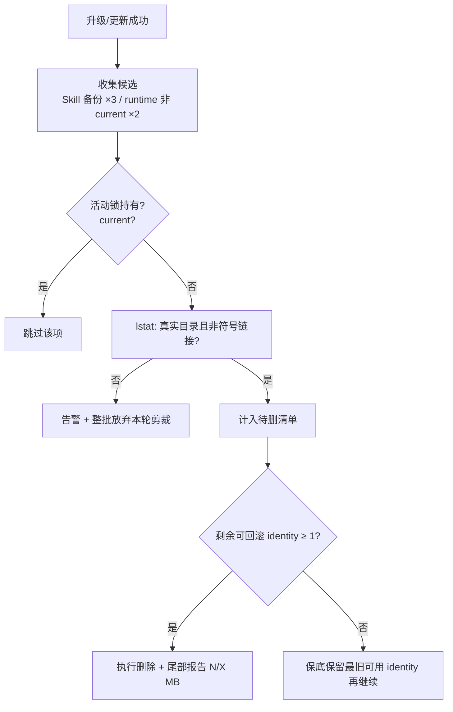

# Leo PPT Generator 全生命周期用户体验落地 - Plan

## Goal Capsule

- **目标**：把生命周期体验方案的 L1–L16b 全部条目转化为三平台一致的落地实现：安全的备份/runtime 保留清理、统一的安装器宿主选择、装后报告中文化、CLI 变更提示语义化，以及配套的使用与卸载文档面。
- **推荐方式**：`extend` 既有所有者——`scripts/install.sh`、`scripts/install.ps1`、`scripts/leo-bootstrap.sh|.ps1`、`scripts/runtime_manager.py` 各自吸收相邻行为；CLI 提示语落在包内 `runtime/src/leo_ppt_generator` 源面；不引入新框架或第二套配置入口。
- **决策焦点**：删除逻辑的 containment 纪律、触发面白名单、rollback 恢复点下限；`--host` 映射矩阵与兼容姿态；双平台行为对齐。
- **验证焦点**：符号链接 fixture 的跳过断言、保留计数与 rollback 可用性边界值测试、bash 语法与旗标冒烟、Windows 侧以静态检查 + 人工冒烟声明（诚实限制）。
- **最大风险或边界**：清理逻辑直接删除用户磁盘上的真实目录——锚死"仅成功路径触发 + lstat 校验 + 整批跳过 + 至少一个可回滚 identity"四道闸，任何一道不确定即不进入实现。
- **停止条件**：出现需要改 Product Contract WHAT 的分歧、或 Windows 平台行为无法在不破坏既有合同的前提下对齐时，停在 checkpoint 返回 owner。
- **执行画像**：code；收尾归属 spec-work。

---

## Product Contract

### Summary

为技能包安装、配置、更新、卸载全链路补齐体验层：量化治本 4.3GB 级历史残留泄漏，把机器词表输出翻译成人话，并以统一宿主参数替代散落的安装入口。范围覆盖 origin 方案的 L1–L16b 全部条目（见 origin: `docs/leo-ppt-generator-lifecycle-ux-plan.md`）。

### Problem Frame

生命周期五场景审查（首次安装/配置/日常/非首次更新/配置变更）实证了三类结构性问题：更新流程没有"离开旧版本"的一半——本机已累积 23 份 Skill 备份与 24 个受管 runtime 共 4.3GB 且零回收；安装器的英文枚举与硬编码宿主名让首触体验像审计报告而非产品；卸载完全没有路径。方案文档给出了分级建议并经多人格评审修订，本次计划将其工程化。

### Requirements

**备份与清理安全**

- R1. 备份与旧受管 runtime 按保留策略自动清理：Skill 备份保留最近 3 份、runtime 除 current 外保留最近 2 份；仅由 `--upgrade` 与 `update` 成功路径触发，其余命令不产生删除动作；成功尾部报告"已清理 N 项，释放 X MB"。(L9)
- R2. 清理动作具备 containment 纪律：候选逐项经 lstat 校验为真实目录且非符号链接，任一异常即整批跳过并告警；任何时刻至少保留一个可回滚 identity 作为 rollback 下限；跳过 current 与活动锁持有的对象。(L9)
- R3. 发现根冲突与陈旧备份挡道的 fail 文案给出可直接照做的处置命令（含确切 `mv` 目标），而非抽象要求。(L10)

**安装体验**

- R4. 安装器新增统一宿主参数 `--host codex|agents|claude`，映射各自默认技能目录；现有 `--agents` 旗标行为保持不变。(L1)
- R5. bootstrap/初始化失败时，在协议 JSON 输出之后向 stderr 追加一行中文人话摘要；stdout 的 JSON 契约逐字节不变。(L2)
- R6. 装后 onboarding 报告状态标签全部中文呈现（执行资格/安装可用性等枚举不再直出）；`install.ps1` 补齐同构的装后报告能力（当前 bash 独有）。(L3)
- R7. 安装完成的"下一步"指引按实际安装模式动态生成：重启哪个宿主、怎么开始第一句、配置命令是什么；不再硬编码"Codex"。(L4)

**更新可见性与回滚发现**

- R8. 用户有稳定的"这次更新变了什么"获取路径：`update --check` 输出末尾追加一行变更详情指引，包内提供固定的变更说明获取位置。(L11)
- R9. `update`/`rollback` 的存在与用法进入 README 故障排查节与高阶诊断回复模板。(L12)
- R10. 会话内版本感知条款写入首次使用合同：execute 开始的状态汇报附带本地版本与人话就绪度一句，版本较上次交付变化时如实提示首轮将重新验证服务。(L8)

**配置语义与文档**

- R11. `configured_unverified` 等三态关键字段配标准中文短语，并在首次使用合同与 README 同源引用。（L5/L7）
- R12. 凡要求用户离开对话的操作（本地终端录入凭据、重启宿主）统一携带"为什么 → 会看到什么 → 做完回来说什么"三件套模板。(L6)
- R13. Agent 代改 provider 配置前向用户告知影响面三问：影响哪些 run、是否触发重新验证（切 Provider 使样张继承失效）、是否产生费用。(L13)
- R14. 凭据相关文档给出系统钥匙串条目命名约定，用户可在钥匙串中自行核对。(L15)

**CLI 影响提示**

- R15. `provider prefer/remove` 与 `credential remove` 在执行时输出一行对既有 run 的影响含义（未完成 run 若依赖该 provider 将需要新的样张确认）；纯附加输出，不改变 `--json` 路径的协议形状。(L14)

**卸载与迁移**

- R16. README 提供手工卸载路径：删 launcher 符号链接、删技能目录、受管数据目录的处理选项，以及钥匙串条目由用户自行决定并附核对步骤。(L16a)
- R17. 安装器新增 `--uninstall`：默认移除 launcher、技能目录与受管 runtime，绝不静默触碰钥匙串；数据目录清空需显式 opt-in 旗标，结束后打印钥匙串人工步骤。(L16b)

### Scope Boundaries

- 不修改 vendored 上游代码与 patches 流程（L 系列全部落在包内自有脚本与包内 Python 源面）。
- 不引入新的 reason-code 统一 glossary 文件（超出 L 清单的延伸主题，延迟处理）；中文化字符串在本计划内以各所有者的常量表 + 引用文档同源承载。
- 不改评测套件判官；若全量评测因输出措辞波动受影响，以 known-issues 记账，不改判官口径。
- 产品身份外移项：无。

---

## Planning Contract

### Key Technical Decisions

- KTD1. **保留策略与 GC 所有权**：受管 `runtimes/` 的保留扫描扩展进 `scripts/runtime_manager.py`（复用 `_cleanup_half_installs` 的 glob+staging 后缀先例；架构姿态 extend）；Skill 侧 `.leo-ppt-generator-backups` 剪裁归安装器脚本自身——三个执行体（bash/ps1/python）无法共享运行时，策略常量在各自文件内定义并由同一组计数断言测试防漂移。
- KTD2. **宿主映射矩阵**：`codex` → `${CODEX_HOME:-~/.codex}/skills`（现状默认）、`agents` → `~/.agents/skills`（现状 `--agents`）、`claude` → `${CLAUDE_CONFIG_DIR:-~/.claude}/skills`。`--host claude` 的目录约定基于通用惯例推断，属 planning-time assumption；实现时以仓库内宿主镜像证据校准，写进 Assumptions 与 limitation，不宣称权威。
- KTD3. **清理触发白名单**：只有两条路径会产生删除动作——install.sh/ps1 的 `--upgrade` 成功分支与 `leo-ppt update` 成功分支。失败、doctor、print-cli 等一切只读路径不得触碰剪裁代码。
- KTD4. **containment 规则的唯一表述**：候选必须是真实目录且非符号链接（lstat 判定）；单点异常不逐个剔除而是整批放弃本轮剪裁并告警——宁可不回收也不能错删。该规则在三处实现中原样转录，fixture 测试锁行为。
- KTD5. **PS1 装后报告对等姿态**：以 bash 版语义为契约做最小对等实现（onboard 检查调用、中文标签、非 TTY 守卫、y/N 向导），保持零付费路径；不追求两侧提示语逐字相同。
- KTD6. **CLI 提示语的兼容姿态**：R15/R8 为纯附加 stderr/stdout 尾行；`--json` 输出形状不变，`operation_result` 协议字段不动。挂点位于包内 provider/credential 命令处理与 update 分支（精确函数位置为 execution-time discovery，owner 面 `runtime/src/leo_ppt_generator/cli.py` 与 config 命令模块）。
- KTD7. **L17 短语库来源裁决**：中文字符串在各改动文件内联常量；跨文件共享的唯一事实是本计划的 R 条目与对应测试断言，暂不新建集中 glossary 工件（延迟处理）。
- KTD8. **uninstall 的破坏性分层**：默认只拆程序面（launcher 符号链接、技能目录、runtimes 下非 current 版本剪除随 KTD3 已覆盖的部分此处不做二次删除）；`--purge-data` 显式移除整个受管 home；钥匙串永不自动触碰，结束打印人工核对步骤。(L16b)

### Interface Contracts

| 字段 | 内容 |
| --- | --- |
| 接口/模式 | 安装器 CLI：`install.sh`/`install.ps1` 参数面（evolution，additive）+ `--uninstall`/`--purge-data`（greenfield 子命令式旗标） |
| 消费者 | 直接终端用户、README 安装/卸载文档、宿主分发脚本（CI 场景未知，显式标记为 unknown consumer） |
| 规范工件 | `leo-ppt-generator/install.sh` 的 `usage()` 文本与 `install.ps1` 注释帮助；所有者为本包维护者，绑定创建单元 U3/U9 |
| 契约摘要 | `--host <name>` 单值旗标与 `--agents` 幂等共存（同时出现时后者仅设置 agents 目录并不冲突，冲突组合报错退出）；`--uninstall` 无需其他旗标即可执行，`--purge-data` 必须与 `--uninstall` 同时出现；错误模型沿用现有 `fail()` 中文前缀 + 非零退出 |
| 兼容 | additive；无 deprecation 窗口需求（`--agents` 长期保留）；回滚路径 = git revert 对应单元提交 |
| 验证 | 仓库原生冒烟：`bash -n` 两脚本 + 子进程调用断言 `--help` 含 `--host` 行与参数接受度（见 U3 测试场景）；`parser_unavailable` 不适用 |

### Assumptions

- Claude 宿主技能目录取 `${CLAUDE_CONFIG_DIR:-~/.claude}/skills`（通用惯例推断，未见仓库内权威定义；KTD2 附带 limitation）。
- `leo-ppt update` 的内部处理函数分布未在本计划内逐一定位（cli.py 未 grep 到 cmd_update 命名），实现时从命令注册面顺藤定位；不影响单元边界。

### Deferred implementation notes

- 中文标签断言测试的固定枚举集，待 U5 实现时随报告函数签名一并确定。
- R15 影响提示的具体措辞需对照现行 reason code 语料（`references/reason-codes.md`）选取稳定的引用码。

---

## High-Level Technical Design

清理判定是本计划唯一的高风险流，其闸门顺序如下：

实施分四个波次，依赖单向：基础设施与安全清理（U1/U2/U4）→ 安装界面（U3/U5）→ CLI 语义（U6）→ 文档与卸载（U7/U8/U9）。

---

## Implementation Units

### U1. 保留策略核心与三侧调用

- **Goal**: 实现 R1/R2：备份与 runtime 的保留扫描、containment 闸门、成功路径调用与尾部报告。
- **Requirements**: R1, R2
- **Dependencies**: 无（首个单元）
- **Files**: `leo-ppt-generator/scripts/runtime_manager.py`（新增 prune helper）、`leo-ppt-generator/scripts/install.sh`、`leo-ppt-generator/scripts/install.ps1`（upgrade 成功分支接入）、`leo-ppt-generator/tests/installer/test_retention_and_containment.py`（新建）
- **Approach**: prune helper 只服务 `runtimes/`（current 由既有解析器识别，不得被扫描命中）；bash/ps1 侧各自内联实现 Skill 备份剪裁（KTD1/KTD4 同一规则文本）；报告行统一格式"已清理 N 项，释放 X MB"。
- **Patterns to follow**: `_cleanup_half_installs` 的受限 glob + staging 后缀先例；`install.sh` 现有 `fail()`/trap 清理习惯。
- **Test scenarios**:
  - 构造 5 份备份目录 + 锁/current 存在：期望恰留 3 份最新，报告数量与体积正确。
  - 候选中混入指向外部目标的符号链接目录：期望告警且整批不删，锁外目标完好。
  - runtime 仅剩 current+2：期望零删除（≤上限不动手）。
  - 连续三轮模拟升级后：期望 rollback 至少仍有一个非 current identity 可用（R2 下限）。
- **Verification**: 本仓新增单测全绿 + 两脚本 `bash -n`/pwsh 解析通过 + 手工在临时 `$LEO_PPT_HOME` 副本上跑一次 upgrade 干跑（备份目录用假产物）。
- **Execution note**: 先写符号链接 fixture 的失败测试再实现（这是唯一的高风险路径，test-first 收益最高）。

### U2. 挡道与失败文案精确化

- **Goal**: 实现 R3：发现根冲突 fail 文案从抽象要求变为含确切命令的一行处置指引。
- **Requirements**: R3
- **Dependencies**: U1（共享命名知识后再改文案，避免二改）
- **Files**: `leo-ppt-generator/scripts/install.sh`、`leo-ppt-generator/scripts/install.ps1`
- **Approach**: "检测到另一个活动 Skill"/"检测到可被发现的旧备份"两类文案追加 `mv <src> <dst>/` 形式的照做命令；dst 固定为用户家下非发现路径。
- **Patterns to follow**: 现有文案的中文祈使风格。
- **Test scenarios**: 断言文案渲染包含字面 `mv ` 引导词与引号包裹路径（冒烟级）。
- **Verification**: 冒烟断言 + `git diff --check`。
- **Test expectation 补充**: 纯文案变更其余场景无需行为测试。

### U3. 统一宿主参数 `--host`

- **Goal**: 实现 R4：`--host codex|agents|claude` 三宿主映射，`--agents` 保持原语义并可与新旗标共存于不冲突组合。
- **Requirements**: R4
- **Dependencies**: 无强依赖（与 U1 并行可行，但合并提交序在 U1 后以便共用 usage 改动窗口）
- **Files**: `leo-ppt-generator/scripts/install.sh`、`leo-ppt-generator/scripts/install.ps1`、`leo-ppt-generator/tests/installer/test_host_flag.py`、`leo-ppt-generator/README.md`（安装命令矩阵）
- **Approach**: 见 Interface Contracts 表；非法 `--host` 值走现有 fail()；`--host` 与显式 `--target` 互斥时优先 `--target` 并告警。
- **Patterns to follow**: 现有选项解析的 while/case 结构。
- **Test scenarios**: `--host agents` 与裸 `--agents` 产出同一目标目录；`--host claude` 尊重 env 覆盖；未知 host 报错含合法值列表；互斥与冲突组合退出码非零。
- **Verification**: 新单测 + `--help` 渲染冒烟。

### U4. bootstrap 失败人话伴随行

- **Goal**: 实现 R5：`fail_bootstrap` 及 ps1 对应失败出口在 JSON 之后输出一行中文摘要。
- **Requirements**: R5
- **Dependencies**: 无
- **Files**: `leo-ppt-generator/scripts/leo-bootstrap.sh`、`leo-ppt-generator/scripts/leo-bootstrap.ps1`
- **Approach**: 摘要行只含 stage 名的人话版与一句话原因，不含绝对路径与内部目录名（对齐 first-use 的禁倾泻纪律）；stdout JSON 字节不动。
- **Patterns to follow**: 现有 `stage_event` 的 stderr 中文行。
- **Test scenarios**: 用 `bootstrap_bundle_incomplete` 触发一次失败：stdout 为可解析 JSON；stderr 含"bootstrap"与中文原因，不含 `/Users/` 或盘符路径。
- **Verification**: 子进程冒烟（bash）；ps1 以静态审查 + 人工冒烟声明限制。

### U5. 装后报告中文化与 PS1 对等

- **Goal**: 实现 R6/R7：bash 报告标签全面中文映射；ps1 新增同构装后报告；下一步指引按宿主动态化。
- **Requirements**: R6, R7
- **Dependencies**: U3（需要宿主名可知才能动态指引发文）
- **Files**: `leo-ppt-generator/scripts/install.sh`、`leo-ppt-generator/scripts/install.ps1`、`leo-ppt-generator/tests/installer/test_report_labels.py`
- **Approach**: 中文标签来自各脚本常量表（KTD7）；"请重新启动 Codex"改为按安装模式选择宿主显示名；附一句到 README 示例 prompt 的指引。ps1 侧 onboard 调用沿用 bash 语义但保持零付费路径与非 TTY 守卫（KTD5）。
- **Patterns to follow**: `verification_label()` 的 case-map 写法（本身已是正确雏形，推广它）。
- **Test scenarios**: 断言报告输出不含 `usable_unverified`/`installed_not_ready` 等 raw token 直出（固定枚举集反向断言）；非 TTY 下不出现付费询问；伪 codex/agents/claude 安装模式下重启提示分别含对应宿主名。
- **Verification**: 新单测 + 双平台人工冒烟记录（bash 实跑，ps1 静态+限制声明）。

### U6. CLI 影响提示与更新指引行

- **Goal**: 实现 R15 与 R8 的 CLI 半：provider/credential 变更一行影响提示；`update --check` 末尾变更获取指引行。
- **Requirements**: R15, R8
- **Dependencies**: 无
- **Files**: `leo-ppt-generator/runtime/src/leo_ppt_generator/cli.py`、provider/credential 与 update 子命令所在模块（execution-time 定位，Assumptions 已记）、`leo-ppt-generator/references/reason-codes.md`（提示语引用稳定码时的措辞对齐，只读参考不扩码）
- **Approach**: KTD6——附加行走人类输出通道；json 路径短路不动；提示措辞引用 `reason-codes.md` 既有的"切 Provider 使样张继承失效"语义而非发明新码。
- **Patterns to follow**: 现有 `操作结果：ready` 式 message 组装。
- **Test scenarios**: json 关闭时 prefer/remove 输出含影响句；json 开启时输出结构与字段集合与本库 schema 校验保持一致；`update --check` 输出以指引行结尾。
- **Verification**: 若包内已有可运行的 CLI 测试入口则挂接用例；否则以有记录的手动冒烟为准（诚实限制写入 Verification Contract）。

### U7. 配置与首次使用文档面

- **Goal**: 实现 R10–R14 中属于合同/文档面的全部条款。
- **Requirements**: R10, R11, R12, R13, R14
- **Dependencies**: U5（引用其中文的标签常量，避免两处自行发明译法）
- **Files**: `leo-ppt-generator/references/first-use.md`、`leo-ppt-generator/SKILL.md`（L8 条款一处落点，最少侵入）、`leo-ppt-generator/README.md`
- **Approach**: 三件套模板落"安全凭据动作"节；三态标准句落"宿主与 Provider"；三问清单落 provider 变更小节；keychain 自检一小段；SKILL.md 仅在控制面/不变边界最小植入版本感知一句（不改位置合同）。全部 repo-relative 引用。
- **Patterns to follow**: 现有合同的祈使短句密度。
- **Test expectation**: none —— 纯文档条目，验证为链接可达抽查与 `git diff --check`。

### U8. 更新、回滚与卸载运维文档

- **Goal**: 实现 R8/R9/R16 的文档半：变更获取路径、故障排查节的 update/rollback 条目、手工卸载四步。
- **Requirements**: R8, R9, R16
- **Dependencies**: U1（卸载文档须描述与实现的实际行为一致的剪裁/保留语义）
- **Files**: `leo-ppt-generator/README.md`、仓库 `CHANGELOG.md` 同步条目（随本计划各单元提交累积，最后统一复核）
- **Approach**: 卸载四步 = 删 launcher 链接 → 删技能目录 → 数据目录去留说明 → 钥匙串人工核对（命名 `leo-ppt-generator/<profile>`）；文档明确"动手前先看 doctor"。
- **Test expectation**: none —— 同上，链接可达 + diff-check。

### U9. `--uninstall` 与 `--purge-data`

- **Goal**: 实现 R17：程序面默认拆除、数据面显式 opt-in、钥匙串永不动。
- **Requirements**: R17
- **Dependencies**: U1（复用 containment 帮助与命名常量）、U3（usage 面一致）
- **Files**: `leo-ppt-generator/scripts/install.sh`、`leo-ppt-generator/scripts/install.ps1`、`leo-ppt-generator/tests/installer/test_uninstall.py`、`leo-ppt-generator/README.md`（指向上一步文档）
- **Approach**: 默认移除 launcher 符号链接与技能目录；`--purge-data` 才移除受管 home；两者都在完成后打印钥匙串人工步骤与 doctor 自检提示；全程沿用安装锁以防与并行升级竞态。`--purge-data` 生效前必须获得一次显式确认（非 TTY 环境直接拒绝该旗标并说明），防止误触的不可逆删除。
- **Patterns to follow**: 安装器的锁/staging/trap 三件套反用作"有序拆除"。
- **Test scenarios**: 临时环境安装后卸载：launcher/技能目录消失、数据目录仍在；`--purge-data` 后 home 移除；`--purge-data` 在非 TTY 下被拒绝且给出原因；钥匙串不产生任何子进程调用（断言未尝试）；对不存在的安装执行卸载得到幂等的友好提示而非错误。
- **Verification**: 新单测 + bash 实机冒烟；ps1 同 U4 限制。

---

## Verification Contract

- 包内新增单测入口：`python3 -m unittest discover -s leo-ppt-generator/tests/installer -p 'test_*.py'`（subprocess 驱动 bash + 临时 HOME/安装根 fixture）。
- 语法门：`bash -n` 于两份 .sh；`pwsh -NoProfile -Command` 可用时对 .ps1 做解析检查，不可用时以静态审查替代并记录。
- 仓库门：`git diff --check`；文档变更链接抽查。
- **高风险信任链（high-risk lens 落地）**：
  - Product Contract confirmation: `inherited` —— 用户在本会话批准 origin 方案全文并通过 scoping 拍板扩大范围为全部条目；同会话同模型 author 计划，声明 correlation limitation，无独立人工签署。
  - Largest unproven risk: 剪裁逻辑对真实用户目录的首轮误删。缓解 = U1 的四闸（白名单触发/lstat/整批放弃/恢复点下限）+ fixture 全覆盖 + 建议首个实机版本以 `LEO_PPT_HOME` 沙盒预演一次真实升级路径。
  - Proof intents：符号链接跳过 = required；保留计数与恢复点下限 = required；Windows ps1 行为 = deferred（owner: 维护者在 Windows 实机执行一次冒烟脚本；claim limitation: 在此之前对 Windows 的声明止步于静态检查）；CLI json 形状不变 = required（schema 校验沿用）；`--uninstall` 钥匙串零触碰 = required（断言未发起任何 security 子进程调用）。
  - Evidence authority: 本地测试为 source-bound（测试同时指纹脚本内容）；Windows 结论在 deferred 期间一律降格为 unverified 声明。
- 验收门外溢：本计划不改评测判官；如全量 skill-up 因安装器/文档措辞变化出现抖动，以 known-issues 记账说明，不在本计划内调口径。

---

## Definition of Done

全局：

- 所有 U-ID 的 Verification 通过；required proof intent 无遗漏地对齐到实际 result、not-applicable 或 deferred-with-owner（R1–R17 全部可追溯）。
- 每个单元一个关注点的提交序列；最终不存在探索性死代码或注释掉的实现残留。
- 顶层 `CHANGELOG.md` 有 (user-visible) 汇总条目；`docs/leo-ppt-generator-lifecycle-ux-plan.md` 不需要回改（origin 是方案不是实现台账）。
- 相关包级文档（README/first-use/SKILL 最小植入）repo-relative 链接全部可达。

每单元：

- 该单元 Files 清单外的意外改动为零；含行为面的单元测试先于或伴随实现落地；Windows 侧任何"通过"声明均标注其证据等级（静态/人工冒烟/实机）。

---

## System-Wide Impact

- 安装器用户面（bash + PowerShell）：in-scope，双平台同步是对每个 [S] 单元的验收项。
- runtime 包源（cli/消息面）：in-scope（仅 R8/R15 附加输出）。
- vendored 上游与 patches：out-of-scope——不触碰，理由：L 清单无上游修复诉求。
- skill-up 评测套件：out-of-scope —— 判官测的是 Agent 合同行为，安装器输出不在其面；潜在措辞波动按 known-issues 记账。
- 凭据/keychain 安全面：in-scope 仅限"描述如何自查"，零自动化触碰为硬边界。

## Risks & Dependencies

- 双平台漂移：三个执行体各自内联常量（KTD1）天然有分叉倾向；靠共用的计数断言测试 + 每单元验收项压制。
- Claude 技能目录约定不明（KTD2 assumption）：错目录会让 `--host claude` 成为"看起来装好实则不被发现"的最坏失败；实现时以宿主镜像证据校准并在 README 用矩阵消歧。
- 剪裁与并发会话竞态：锁跳过已是第一道防线；残余风险登记为已知，不在本计划引入抢占语义。
- `--purge-data` 的不可逆性：交互确认一次 + 与 `--uninstall` 必须同时出现，杜绝单旗标误触。

## Evidence & Limitations

- 量化实证（23 备份/46MB、24 runtime/4.3GB）来自本机实测（`~/.codex/skills` 与受管 home），代表真实泄漏形态但非统计样本；freshness 为当日。
- install.ps1 缺失装后 onboarding 为本会话 grep 实证（仅有备份/doctor 对等结构）；工作区存在大量未提交会话改动——spec-work 开工前应以当前 dirty 状态重建基线再动 installer 文件。
- 外部研究：无新增（origin 文档已携带行业对照与来源，本计划未发现影响 HOW 的未决外部问题；外部研究 non-load-bearing）。

## Sources & Research

- origin 方案与评审链：`docs/leo-ppt-generator-lifecycle-ux-plan.md`、`docs/leo-ppt-generator-optimization-review.md`、`docs/leo-ppt-generator-ux-review.md`。
- 关键既有实现参照：`leo-ppt-generator/scripts/install.sh`（原子激活/onboarding 先例）、`scripts/runtime_manager.py:270`（受限清理先例）、`scripts/leo-bootstrap.sh`（receipt 协议）。
