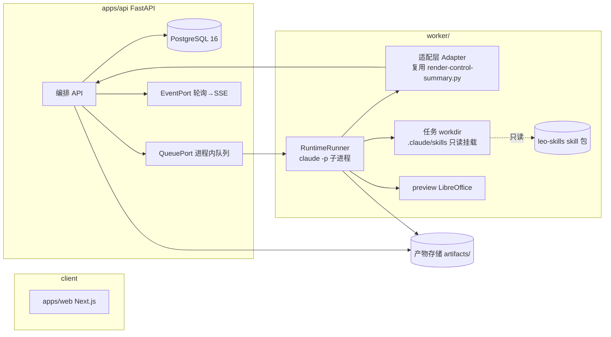
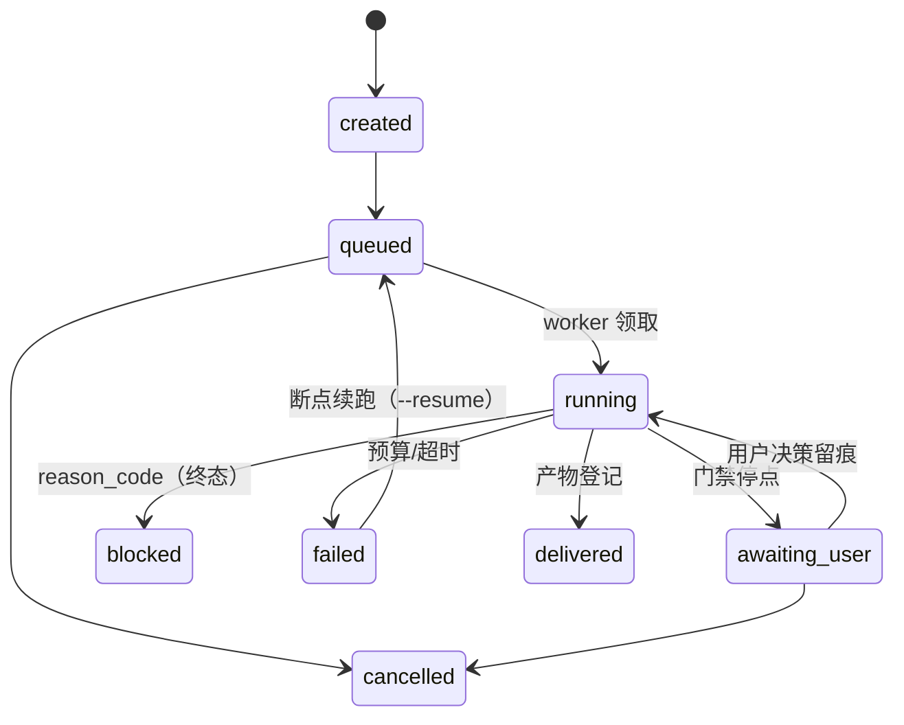
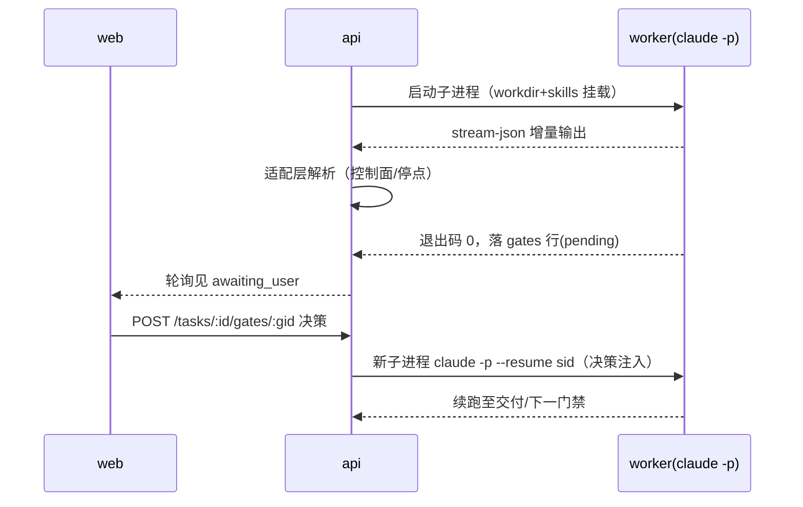

# Leo Studio Web 工作台 - Plan

> **Target repo:** `leo-studio`（新建独立仓库，与本计划文档所在仓库分离）。本文件内所有路径均相对 `leo-studio` 仓库根；skill 供应方 `evidence-first-writing/` 与 `leo-ppt-generator/` 位于本仓库（leo-skills），通过环境变量 `LEO_SKILLS_DIR` 只读引用。

## Goal Capsule

- **目标**：实现 Product Contract R1–R8 定义的 Leo Studio web 工作台——把两个 skill 的门禁式生产管线产品化为可用的多阶段异步 web 应用。
- **推荐方案**：独立仓库 `leo-studio`，三进程架构（Next.js 前端 / FastAPI 编排 / headless `claude` CLI runtime worker）。skill 目录只读挂载进 runtime 工作区，适配层作为唯一翻译点（thin-glue），复用 `render-control-summary.py` 渲染控制面。V0.5 简化基座：PostgreSQL + 进程内队列 + 轮询。
- **权威层级**：Product Contract（本文件下方，字节级保留）为 WHAT 唯一源；当前用户为产品确认人；`assumption` 标注的决定未经确认，沿用 Product Contract 记录。
- **决策焦点**：runtime 会话语义（`--resume` 断点续跑）、适配层解析合同（控制面/路由卡/阻断块）、门禁往返协议（awaiting_user ↔ 用户决策）、PPTX 导出保真。
- **验证焦点**：两包 skill evals 作为行为回归门禁（skill-up）；适配层解析器以 evals 用例为 fixture；端到端跑真实写作任务与 generate 演示任务；安全断言（密钥掩码、越权、Gate 0 未确认文件不可读）。
- **最大风险**：适配层对 agent 自由文本输出的解析脆弱性（skill 措辞演进导致静默解析失败）。缓解：解析器 fixture 化 + 控制面输出强制走 `render-control-summary.py`。
- **停止条件**：Q3（headless 运行时对外服务的合规核实）未通过前不得对外部署；任一 skill evals 红则该版本不得挂载。

## Product Contract

### 定位与差异化（Key Decision D1，assumption: 定位"先内后外"）

一句话定位：面向严肃内容生产者的"有门禁的可信生产管线"——写文章讲证据分级，做 PPT 讲交付路线，作者始终保有最终控制权。

差异化主张：市面竞品（Gamma、Notion AI 等）卖"一键生成"，代价是编造事实与模板感；Leo Studio 把两个 skill 已沉淀的流程合同（阶段门禁、canonical route 字段、证据账本、blocked 阻断语义）产品化为可见、可审计、不可绕过的 UI 结构。核心产品资产是**流程合同本身**，而非生成能力。

#### 业界同类调研摘要（2026-08，详见"证据与来源限制"）

| 维度 | 业界现状 | 对本产品的含义 |
|---|---|---|
| 演示生成标杆 Gamma | prompt/大纲/文件（docx、PDF、Google Docs）多通道输入；导出 PDF/PNG/PPTX（无 .docx）；PPTX 导出常现版式字体问题；分享链接 + 浏览分析（谁看过、每页停留）为 Pro 卖点；credits 按量计费（Free 400 一次性 / Plus 1000/月 / Pro 4000/月）；免费版带水印 | 输入多通道与导出保真是基线预期；**对象级可编辑 + 导出保真**恰好是竞品痛点，升级为验收标准；浏览分析与 skill 的 `post-publish` operation 天然衔接（V2）；credits 模型为计费参考锚点 |
| 可信写作标杆 NotebookLM / Elicit | NotebookLM 默认严格接地（仅从用户上传来源生成）；Elicit 提供 125M+ 论文引用接地、查重与参考文献管理；研究显示通用 LLM 引用错误率可高达 70% | 严格接地模式值得吸收为写作工位显式选项；四分类证据账本 + 因果红线仍独有；"70% 引用错误率"是定位文案的实证弹药 |
| 中文市场 WPS AI / 讯飞智文 / Kimi PPT | 可编辑性是核心评价维度（多篇评测）；WPS 墨匣智能排版与模板适配强，但自定义模板上传后字体颜色丢失（用户需 ~8 分钟手动修复）；JCPPT 归纳文档模式三选：保持原文 / 适当改写 / 作为参考 | "严格保留布局 vs 仅作风格参考"的 Route 二分与业界文档模式**同构**，验证设计；自定义品牌模板的保真是未解痛点 → 样张先行 + 视觉 QA 的流程价值实证；品牌模板列 V2 |

依据：`evidence-first-writing/SKILL.md`（route 四轴、四类证据内容分级、因果红线、post-publish 红线）；`leo-ppt-generator/SKILL.md`（Gate 0 信任门禁、advise/execute 交互模式、四条 Route、控制面五字段合同）。

### 目标用户与场景

- **首选用户（assumption，未确认）**：需要高频产出"事实不能错"内容的独立博主 / Newsletter 作者 / 技术写作者 / 顾问。痛点：AI 产出不敢直接发布。
- **黄金场景**：写完深度文章 → 转入 PPT 工位 → 论证结构映射为演示稿大纲 → 证据账本随行为 PPT 内容可信度背书。此联动为 V2 范围，但一期数据模型需预留。

### Key Decisions

| # | 决定 | 状态 |
|---|---|---|
| D1 | 产品定位"先内后外"：以可对外演进的架构设计，V0.5–V1 先服务自己与种子用户 | assumption |
| D2 | 交互范式以"表单 + 阶段流水线"为主，聊天仅作阶段内局部操作入口，不做聊天框驱动产品 | assumption（对话中已陈述理由，未获显式确认） |
| D3 | Web 为最终形态，按"重型工具型 web app"预期复杂度；一期不做移动端/小程序/桌面壳 | assumption |
| D4 | Web 层只做编排与状态，**skill 逻辑不重写**：Agent Runtime 原样只读挂载两个 skill 目录，适配层是唯一翻译点 | 对话中陈述，未获显式确认 |
| D5 | skill 安全语义产品化为不可绕过的交互（Gate 0 blocked 卡片、无"忽略警告强制写入"入口），产品永不提供绕过按钮 | 与 skill 硬性拒绝语义一致 |
| D6 | 一切生成任务异步化：提交 → 进度 → 门禁点等待用户决策 → 交付；无同步生成端点 | 设计决策，未获显式确认 |
| D7 | 模型供给双通道：平台托管 + 用户 BYOK（OpenAI-compatible），任务级生效快照 | assumption（本轮新增） |
| D8 | 设计语言：壳层（导航/仪表盘/设置）Apple 官网风；工位层（写作/PPT/任务运行）Linear 式密度与动效；以 `docs/prototypes/DESIGN.md`（Stitch DESIGN.md 格式）为唯一设计系统源 | 用户明确要求（本轮细化，见 DESIGN.md） |

### Requirements（需求，非实现）

**R1 写作工位**
- R1.1 任务创建呈现 canonical route card（lifecycle_intent / article_family / evidence_risk / operation / depth），字段值来自 skill 枚举，用户可修改且修改驱动管线分支。
- R1.2 裸主题低置信场景以结构化"决定性问题"引导，用户回答前不进入起草。
- R1.3 **输入多通道**（调研：Gamma 基线）：粘贴文本 / 上传文件（Markdown、docx、PDF）/ 引用既有项目产物作为素材；已有草稿可进入 `revise` 而非重写。
- R1.4 **证据模式显式化**（调研：NotebookLM 严格接地）：严格接地（仅基于用户提供的来源生成，缺口显式报告）与开放调研（允许外部检索但逐条入账）作为 route card 上的可选档位，与 `evidence_risk` 联动。
- R1.5 阶段流水线可视（Brief 门禁 → 调研 → 主张/结构 → 草稿 → 分层审查 → 终稿），每阶段可查看产出物。
- R1.6 证据账本为招牌界面：四类内容（已核实事实 / 有来源解释 / 作者判断 / 亲身经历）在正文中区分标注，侧栏呈来源地图。
- R1.7 skill 的因果红线（无对照证据不得断言"X 导致 Y"）以前端警告呈现，且无强制写入入口。
- R1.8 声音档案（soul.md / profile）作为可管理资产，可挂载到写作任务。

**R2 PPT 工位**
- R2.1 四条 Route（generate / direct-editable / upgrade-full / upgrade-selected）以入口卡片呈现；内容与视觉稿并存时显式区分"严格保留布局 / 仅作风格参考"（调研：与业界"保持原文/适当改写/作为参考"三模式同构）。
- R2.2 **输入多通道**（调研：Gamma 基线）：粘贴文本 / 上传 Markdown、docx、PDF / 引用写作工位的文章产物。
- R2.3 Gate 0 产品化：来源未确认的 PPT/PPTX 上传即呈现 blocked 状态卡（含 reason_code 与 next_action），确认动作须由 owner 显式操作并留痕；确认前文件不被读取/处理。
- R2.4 控制面五字段作为 run 详情常驻状态条，reason code 可视化。
- R2.5 样式库为可浏览画廊（先样张、过视觉 QA 后批量生产）。
- R2.6 **PPTX 下载与导出保真**：每条 Route 交付的最终 PPTX 必须可从工位一键下载；中间产物（样张、页面图片、manifest）同样可下载或导出。**导出保真为验收标准**：对象级可编辑（文本框、形状可选中修改）、字体与配色不丢失、版式与预览一致——直击竞品导出后版式字体损坏的痛点（调研：WPS 模板字体颜色丢失、Gamma PPTX 导出质量问题）。导出格式：PPTX / PDF / 页面图片。

**R3 任务与门禁通用**
- R3.1 统一任务状态机：created → queued → running → awaiting_user → … → delivered / blocked / failed / cancelled；blocked 为终态且透传 reason code。
- R3.2 每次门禁的提问与用户决策完整留痕（审计资产）。
- R3.3 任务可取消；失败保留已完成阶段产物，支持基于决策历史的断点续跑。
- R3.4 长任务事件实时推送，页面可关闭后回来续接。

**R4 项目与资产**
- R4.1 工作单元为 Project（article / deck / pipeline 三类），Dashboard 呈现类型、阶段、风险、最近门禁。
- R4.2 资产库跨项目：声音档案、来源库、样式库；产物可版本化并可导出（导出能力一期即有，用于建立信任）。来源库向参考文献管理靠拢（调研：Elicit）——条目可复用、可导出标准引用格式（BibTeX/Markdown）。
- R4.3 **用户历史记录持久化**：用户的所有项目、任务、门禁决策、事件流与产物长期保存并可在 Dashboard 按时间线回溯；历史项目可重新打开查看（联动管线 V2 可基于历史文章转 PPT）。删除须为显式用户操作且不可误触。
- R4.4 **品牌模板**（V2，调研：企业刚需 + 竞品保真痛点）：自定义 logo、色板、字体上传为品牌模板；生成时样张先行验证保真，字体/颜色不丢失为验收门槛。

**R5 联动管线（V2）**
- R5.1 文章"转为演示"动作：论证图 → 页面大纲，证据账本随行转化为页面事实/判断标注。

**R8 发布与分享（V2，调研：Gamma Pro 核心卖点）**
- R8.1 交付物可生成只读分享链接（写作稿网页视图 / 演示网页视图）。
- R8.2 浏览分析（谁看过、逐页停留时长）回流为版本绑定指标，衔接 skill 的 `post-publish` operation——且**必须遵守其因果红线**：单篇表现只作观察，不自动升级为规则（skill 已有硬性拒绝语义，产品侧同样不提供"写入公式"入口）。

**R6 认证与用户体系**
- R6.1 注册/登录：Email + 密码（argon2id 哈希）与 OAuth（Apple/Google/GitHub）双通道；邮箱验证与密码重置。
- R6.2 会话：短期 access token + refresh token 轮换；登录与注册接口限流防爆破。
- R6.3 用户资料：昵称、头像、默认偏好（语言、主题）；账户可注销并导出全部数据（与 R4.3 历史保存对齐）。
- R6.4 角色模型：owner / member（一期两档足够）；用户只能访问自己的项目、资产与配置。
- R6.5 用量可观测：每用户按任务记录 token 与时长消耗，账户页可见（为 V1 末期计费预留数据，不做扣费）。

**R7 自定义模型配置（BYOK）**
- R7.1 双通道供模型：平台托管（系统密钥，开箱即用）+ 用户自定义 provider（OpenAI-compatible base URL + API key + 模型名）。
- R7.2 作用域：可为"写作 / PPT"分别设默认模型；发起任务时可临时覆盖；Agent Runtime 按任务解析生效配置。
- R7.3 密钥安全：API key 仅写入时明文可见，落库加密（服务端主密钥），展示恒为掩码；提供"测试连接"验证可用性；密钥永不下发前端、不写入日志。
- R7.4 配置管理：可增删改多个自定义 provider，可启用/停用；删除需显式确认；运行中任务不受配置变更影响（按任务启动时快照）。

### Scope Boundaries（范围边界）

**Non-goals（一期）**：多人实时协作、通用聊天助手、模板市场、移动端、桌面壳、计费系统（V1 末期再评估）、分享链接与浏览分析（V2，R8）、品牌模板（V2，R4.4）、免费版导出水印（**明确决策：不做**——与"可信工具"定位冲突，Gamma 用水印推付费，我们用水印会自毁信任主张）、.docx 导出（一期不做，与 Gamma 一致放弃；用户导出 Markdown 自行转换）。

**不做**：Web 层重写或"净化"skill 逻辑；提供任何绕过 skill 硬性拒绝（Gate 0、因果红线、post-publish 不升级规则）的产品入口；学术代写/伪造经历类需求（与 skill 拒绝项一致，产品 ToS 双重声明）。

### 成功标准

- 有效性：种子用户把"真实要发布的稿子"放进产品生产（信任信号）。
- 质量指标：产出文章的证据账本覆盖率；PPT 项目一次通过视觉 QA 的比例；**导出保真一次通过率**（对象可编辑、字体配色无丢失——竞品痛点的正面度量，R2.6）。
- 交互验证（V0.5 核心）：门禁式交互相对聊天框的可用性——用户在门禁点做出真实决策而非放弃。
- blocked 分布（reason code 聚合）作为安全语义正常工作的观测信号。

### 明确假设（均待用户确认）

- A1（=D1）：定位"先内后外"渐进。
- A2：第一批真实用户为严肃内容创作者（独立博主/Newsletter 作者/顾问）。
- A3（=D2/D3/D6）：交互范式、Web-only 形态、全异步任务模型。
- A4：Provider 模型密钥服务端统一管理，用户不接触模型配置细节。

### Resolve Before Planning / Outstanding Questions

- **Q1（最高优先）**：目标定位——对外 SaaS / 自用内部 / 先内后外 / 概念验证？影响计费、账号、并发与成本模型。（当前假设：先内后外）
- **Q2**：第一批种子用户是谁、如何触达验证？（当前假设：严肃内容创作者）
- **Q3**：Agent Runtime 宿主选型与许可边界——headless agent 会话的产品化使用是否在相关服务条款允许范围内？（planning 前需核实，属合规事实而非偏好）
- **Q4**：写作与 PPT 一期是否同权重交付，还是写作先行（V0.5 只做写作工位）？（当前倾向：写作先行）
- **Q5**：多租户数据边界与用户上传文件隔离的合规要求（是否涉及个人信息，决定存储与隔离强度）。
- **Q6**（新增，调研触发）：计费采用 credits 按量模型（Gamma 锚点：Free 400 一次性 / Plus 1000/月 / Pro 4000/月）还是订阅内含额度？任务预算（token/时长）如何映射为 credit 单位？R6.5 的用量数据即为此预留，V1 末期决策。

### 证据与来源限制

- 主要依据为仓库内两个 skill 的 `SKILL.md`（合同语义均已直读核实）；references 细节（intent-routing.md 枚举全集、styles 目录结构）未逐一展开，planning 阶段需按需读取。
- 竞品判断基于 2026-08 的公开调研（本轮新增）：Gamma 功能与定价（gamma.app 及其帮助中心/评测）；NotebookLM 严格接地机制与 Elicit 引用接地（含"通用 LLM 引用错误率最高 70%"的研究引用）；中文市场可编辑性评测（WPS AI 模板字体丢失、JCPPT 文档模式三分类）。价格数字随时间漂移，决策引用时需复核官网。外部调研链接：gamma.app、gamma.app/pricing、elicit.com、paperguide.ai/blog/elicit-vs-notebooklm、zhuanlan.zhihu.com/p/2046187728036013052、chatexcel.com/blog/comparison-of-editable-capabilities-of-7-aippt-versions、jcppt.com。
- 用户需求输入来自本对话（web 工作台包装两个 skill、最终形态 web、完整系统含登录/注册/模型配置、保存历史与下载 PPT、Apple/DESIGN.md 风格原型、业界调研优化需求），多轮结构化提问未获回答，故产品确认均以 assumption 形式记录。


---

## Planning Contract

Product Contract unchanged (byte-preserved upstream source slice).

### Key Technical Decisions

- **KTD1 目标仓库与形态（new）**：新建独立仓库 `leo-studio`，不在 leo-skills 内混入应用代码——leo-skills 的所有权边界是 skill 包，web 应用是消费方。拒绝在 leo-skills 内新建顶层目录的方案：会破坏"每个顶层目录是一个技能包"的仓库约定。skill 以 git 依赖（子模块或 vendored copy + 版本号）供 runtime 只读挂载，`LEO_SKILLS_DIR` 环境变量指向。
- **KTD2 三进程架构（compose / thin-glue）**：`apps/web`（Next.js 14+ App Router、TS、Tailwind、TipTap）+ `apps/api`（FastAPI、SQLAlchemy、Alembic）+ `worker/`（runtime 子进程管理）。api 层只拥有编排与状态（项目/任务/门禁/资产），不复制任何 skill 领域规则；skill 语义的权威始终在两包 SKILL.md 及其 references。胶水层职责限定：任务翻译、会话调度、失败传播、事件观测。
- **KTD3 Runtime = headless `claude` CLI 子进程（reuse）**：以 `claude -p --output-format stream-json --resume <session_id> --permission-mode acceptEdits` 在每任务独立 workdir 中驱动 skill；会话 ID 持久化于任务记录，实现断点续跑（R3.3）。skill 通过 workdir 内 `.claude/skills/` 只读符号链接挂载。V0.5 不引入 Agent SDK 包装，CLI 已满足流式输出与 resume 原语；SDK 化留作 V1 优化项。合规（Q3）仅影响对外部署，不影响内部 V0.5。
- **KTD4 控制面解析复用（reuse）**：`render-control-summary.py`（含 `--fixed gate0` / `--fixed worker-unavailable` 固定块）是控制面五字段的权威渲染器；适配层调用它而非自行解析。route card 字段枚举取自 `intent-routing.md`（V0.5 内联为 contracts 常量并标注来源与同步责任）。Gate 0 阻断块在 Web 层的呈现与该脚本输出逐字段对应。
- **KTD5 简化基座（V0.5，吸收"过度复杂"结论；2026-08-28 用户决定直接采用 PostgreSQL）**：PostgreSQL 16 + 进程内 asyncio 队列 + 前端轮询（2s）——Redis 与 SSE 仍推迟；单 worker 串行。选 PG 而非 SQLite：route_card / decision_history / 事件 payload 原生 JSONB，V1 多用户并发写零平移成本；代价是本地与 CI 各需一个 PG 实例（docker compose / CI service）。数据层 Alembic 从第一天面向 PG。队列与推送各有接口抽象（`QueuePort` / `EventPort`），U9 落地 SSE 时替换实现而非改调用方。无 OAuth、无多租户隔离强化（单用户内部部署，登录仅一道共享门）。
- **KTD6 任务状态机（new）**：`created → queued → running → awaiting_user → running → … → delivered | blocked | failed | cancelled`。`blocked` 为终态并透传 reason_code；`awaiting_user` 挂起时 worker 进程可退出，靠 `--resume` + 决策历史重建（状态快照存 `tasks.decision_history` JSONB）。门禁往返协议：worker 检测到门禁语义（写作 Brief/样张确认等由 skill 输出中的显式停点标记或适配层预设的阶段-门禁映射决定）即退出并落 `gates` 行，前端提交决策后新起子进程续跑。
- **KTD7 密钥与上传安全（new）**：API key 以 AES-256-GCM 加密落库，主密钥来自环境变量 `LEO_MASTER_KEY`（KMS 留 V1）；读取路径永不回明文，日志字段白名单。未确认上传存隔离前缀 `uploads/unconfirmed/`，runtime workdir 挂载白名单不含该前缀——Gate 0 的"不读取"由文件系统边界而非提示词保证。
- **KTD8 预览与导出保真（extend on skill 产出）**：PPTX → 页面图片预览用 LibreOffice headless（`worker/preview/`），产物即 R2.5 样张与 QA 的输入；导出保真检查（R2.6 验收）为脚本化门槛：python-pptx 校验文本框/形状可选中、嵌入字体清单、与 manifest 版式记录比对，进 U10 质控流水线。
- **KTD9 前端设计系统（reuse）**：`leo-studio` 内落 `docs/DESIGN.md`（自 leo-skills `docs/prototypes/DESIGN.md` 移植为仓库内权威），tokens 进 `apps/web/src/styles/tokens.css`；组件以原型 `leo-studio-interactive.html` 为 pattern 起点重构为 React 组件（非复制粘贴）。
- **KTD10 执行方向**：适配层解析器 test-first（fixture 先行）；状态机与安全断言 test-first；工位页面 smoke 优先（Playwright 走关键路径），不追求组件单测全覆盖。

### Implementation Scope Boundaries（plan-local）

- V0.5 落：U1–U6、U10（写作端到端 + 引擎 + 质控）；U7 只落 generate 单 Route + Gate 0。
- V0.7 落：U7 全量（四 Route）、U9（SSE 替换轮询）、OAuth 登录通道。
- V1 落：U8 BYOK 面向用户化（V0.5 仅系统级 Provider 配置）、资产库完善、多租户强化。
- 计划内不做（呼应 Product Contract Non-goals + KTD5）：分享链接（R8）、品牌模板（R4.4）、联动管线（R5）——均为 V2，不设 U-ID。

### Evidence & Limitations

- 直读源：`evidence-first-writing/SKILL.md`、`leo-ppt-generator/SKILL.md`（route/gate/控制面合同）、`leo-ppt-generator/scripts/render-control-summary.py` 头部（FIXED_BLOCKS 与 ROUTES 枚举，1e57 本地工作树，未提交变更中）。
- 运行时事实：`claude` CLI 2.1.247 本机可用；headless/resume/permission-mode 语义来自官方文档（见 Sources），版本演进的破坏性变更由 U10 的 CLI 契约测试捕获。
- 外部调研（Gamma/NotebookLM/中文市场）为 advisory，已落 Product Contract 调研摘要；不承载 KTD 依赖。
- 限制：`intent-routing.md` 枚举全集与 styles 目录结构未逐一直读，U5/U7 实施时按需读取并同步 contracts 常量。

---

## High-Level Technical Design

### 组件拓扑



### 任务状态机（两工位共用）



### 门禁往返时序



### Output Structure（新仓库形状）

```text
leo-studio/
├─ apps/web/                # Next.js 工位前端
│  └─ src/{app,components,styles/tokens.css,lib}
├─ apps/api/                # FastAPI 编排
│  └─ src/leo_studio/{api,core,models,adapters,ports}
├─ worker/                  # runtime 子进程 + 适配层 + 预览
│  └─ src/leo_worker/{runner,adapter,preview}
├─ packages/contracts/      # TS/Py 共享 schema（route card、task_event、gate）
├─ docs/DESIGN.md
├─ tests/{e2e,fixtures}
└─ artifacts/               # 产物与 workdir 归档（git-ignore）
```

---

## Implementation Units

### U1. 仓库脚手架与配置基座

- **Goal**：建立 monorepo、三应用骨架、环境变量合同与本地启动。
- **Requirements**：支撑全部（基础设施）。
- **Dependencies**：无。
- **Files**：`apps/web/*`、`apps/api/*`、`worker/*`、`packages/contracts/*`、`docs/DESIGN.md`、`.env.example`、`Makefile`。
- **Approach**：pnpm + uv 管理两端依赖；`LEO_SKILLS_DIR`、`LEO_MASTER_KEY`、`LEO_ARTIFACTS_DIR`、`DATABASE_URL` 进 `.env.example` 并文档化；`docker-compose.yml` 提供 PostgreSQL 16（本地 `make dev` 一键起全栈，CI 用 service 容器）；DESIGN.md 移植入库；CI 占位（lint + 单测）。
- **Test scenarios**：`make dev` 一键起 web/api/worker 三进程冒烟；缺失 `LEO_SKILLS_DIR` 时启动即清晰报错（exit 非 0 + 明确信息）。
- **Verification**：三进程健康检查端点 200；README 记录启动步骤。
- **Execution note**：`Test expectation: none -- 脚手架，行为由 U2+ 覆盖`（冒烟脚本除外）。

### U2. 认证与用户（V0.5 简化档）

- **Goal**：Email+密码登录与会话，单用户门禁到位。
- **Requirements**：R6.1（密码部分）、R6.2（简化：无 refresh 轮换，长会话 + 登出）、R6.3（昵称/头像字段）。
- **Dependencies**：U1。
- **Files**：`apps/api/src/leo_studio/api/auth.py`、`models/user.py`、`tests/api/test_auth.py`、`apps/web/src/app/(auth)/`。
- **Approach**：argon2id 哈希；JWT（HS256，`LEO_SECRET`）；登录失败限流（内存桶 5 次/15 分钟）。OAuth/邮箱验证/密码重置为 V0.7（U2 后续扩展，不设新 U-ID）。
- **Test scenarios**：正确凭证换 token；错误密码 401；连续 5 次失败后第 6 次 429；未带 token 访问受保护 API 401；密码哈希为 argon2id 格式（非明文/弱哈希）。
- **Verification**：上述测试绿；curl 全流程可登录拿到受保护资源。

### U3. 项目/任务/门禁领域模型与状态机

- **Goal**：R3 的持久化与状态流转内核。
- **Requirements**：R3.1、R3.2、R3.3（取消部分）、R4.1、R4.3。
- **Dependencies**：U1、U2（归属 user）。
- **Files**：`apps/api/src/leo_studio/models/{project,task,gate,event,artifact}.py`、`core/state_machine.py`、`api/projects.py`、`tests/api/test_tasks.py`、`tests/core/test_state_machine.py`。
- **Approach**：表结构对齐 Product Contract 数据模型（projects/tasks/task_events/artifacts/gates）；SQLAlchemy 2.0 + Alembic 面向 PG，JSONB 字段（route_card、decision_history、payload）用原生类型并可索引查询；状态迁移函数集中且非法迁移抛错；门禁决策追加写 `decision_history`；事件表带自增 seq 支撑轮询游标（U9 升级 SSE 复用）。测试用 PG 实例（testcontainers 或 CI service），不用 SQLite 内存替身，避免方言差异假绿。
- **Test scenarios**：合法迁移链全覆盖（created→…→delivered）；非法迁移（delivered→running）抛错；blocked 落 reason_code 且不可再迁移；取消仅 queued/awaiting_user 可达；门禁决策留痕含 user/time/choice；事件 seq 严格递增。
- **Execution note**：状态机 test-first——先写迁移矩阵测试再实现。

### U4. Runtime worker 与 workdir 隔离

- **Goal**：headless `claude` 子进程生命周期、预算与隔离。
- **Requirements**：R3.3（断点续跑）、D4/KTD3、KTD7（挂载白名单）。
- **Dependencies**：U1、U3。
- **Files**：`worker/src/leo_worker/runner.py`、`workspace.py`、`worker/tests/test_runner.py`。
- **Approach**：每任务 mktemp workdir + `.claude/skills` 只读链接（仅两 skill 目录）；`claude -p --output-format stream-json --resume <sid>`；token/时长预算超限 kill 并落 failed(budget_exceeded)；session_id 存 task。挂载白名单硬编码排除 `uploads/unconfirmed/`。
- **Test scenarios**：workdir 内可见且仅可见两 skill；任务结束 workdir 归档到 artifacts/；预算超限进程被 kill 且已完成阶段产物保留；`--resume` 二次调用沿用同 session_id；未确认上传路径在子进程可见集中不存在。
- **Verification**：真实 `claude -p` 冒烟（echo 级 prompt）双进程串联成功。
- **Execution note**：隔离与 kill 语义 test-first（可 monkeypatch 子进程）。

### U5. 适配层：控制面/路由卡/阻断块解析

- **Goal**：agent 输出 → 结构化事件与门禁的唯一翻译点。
- **Requirements**：R3.1（事件侧）、R2.4、R2.3（blocked 块）、R1.1（route card 回显）。
- **Dependencies**：U3、U4。
- **Files**：`worker/src/leo_worker/adapter/{control_plane,route_card,stop_points}.py`、`packages/contracts/schemas.py`、`worker/tests/fixtures/`（取自两包 evals cases）、`worker/tests/test_adapter.py`。
- **Approach**：control_plane 直接调 `render-control-summary.py`（subprocess，输入为 CLI JSON envelope）；route card 枚举常量源注 `intent-routing.md` 并列同步清单；停点检测采用"阶段-门禁映射表 + 输出标记"双通道（表驱动，新增门禁改表不改代码）。evals cases YAML 抽样进 fixtures，防措辞漂移。
- **Test scenarios**：gate0 固定块解析出五字段且与 `--fixed gate0` 输出逐字段相等；正常控制面五字段解析；route card 各字段枚举值合法；未知字段降级为 log 事件不抛错；evals fixture 全量解析通过率 100%；停点映射表命中后产出 gates(pending) 行。
- **Execution note**：test-first——fixtures 先于实现提交。

### U6. 写作工位端到端

- **Goal**：写作管线从 route card 到终稿交付的可用闭环。
- **Requirements**：R1.1、R1.2、R1.3（粘贴+md 上传）、R1.5、R1.6、R1.7、R1.8（挂载 soul.md 文件级）；R3.4（轮询档）；R4.3。
- **Dependencies**：U3、U5、U2。
- **Files**：`apps/api/src/leo_studio/api/write.py`、`apps/web/src/app/write/[id]/*`、`components/{RouteCard,Pipeline,EvidenceLedger,GateCard,CausalWarn}.tsx`、`tests/e2e/write.spec.ts`。
- **Approach**：RouteCard 表单驱动 U5 枚举；裸主题低置信渲染"决定性问题"单选且提交前禁用起草；证据账本为 api 聚合的 ledger JSON（分类计数+来源行）+ TipTap 四色 mark；因果红线条目由适配层透传，前端只渲染不提供忽略入口；门禁卡内联 + 决策 toast 留痕。`check_factual_invariants.py` 挂为终稿前检查步骤（before/after 比对）。
- **Test scenarios**：route card 提交创建任务并回显 canonical 字段；裸主题路径阻止起草入口；管线推进至门禁并暂停；决策后续跑至 delivered；终稿下载 md；四色标注与账本计数一致；因果警告存在时无"强制写入"按钮（DOM 断言）；e2e 全流程 Playwright 通过。
- **Verification**：以真实 `evidence-first-writing` skill 跑一篇 standard 短文（主题自选）全流程成功，门禁至少触发一次。

### U7. PPT 工位（V0.5 generate + Gate 0）

- **Goal**：generate Route 全流程 + Gate 0 阻断与信任确认 + 下载。
- **Requirements**：R2.1、R2.2（粘贴+md）、R2.3、R2.4、R2.5、R2.6、R4.3。
- **Dependencies**：U5、U6（复用管线组件）、U4（预览）。
- **Files**：`apps/api/src/leo_studio/api/deck.py`、`uploads.py`、`worker/src/leo_worker/preview/convert.py`、`apps/web/src/app/deck/[id]/*`、`components/{RoutePicker,SlideGrid,ControlBar,BlockedCard}.tsx`、`tests/e2e/deck.spec.ts`、`tests/e2e/test_gate0.py`。
- **Approach**：上传入 `uploads/unconfirmed/`（不入 workdir）；PPTX 上传未确认 → BlockedCard 渲染 `--fixed gate0` 输出；确认动作写 trust 留痕并解锁 preflight；generate 流程样张先行（预览图）→ 门禁 → 批量 → QA → delivered；下载端点流式返回 PPTX + manifest。导出保真脚本 `worker/src/leo_worker/preview/fidelity_check.py`（python-pptx 断言）。
- **Test scenarios**：未确认 PPTX 上传后任务立即 blocked 且文件未被任何子进程打开（workdir 白名单断言）；确认后进入 generate 后续阶段；样张门禁往返；delivered 后下载的 PPTX 可被 python-pptx 打开且文本框可枚举（保真冒烟）；中间产物（页面 png/manifest）可下载；控制条五字段与任务状态一致。
- **Verification**：真实 skill 跑 generate 全流程产出可打开 PPTX；Gate 0 演示脚本可复现 blocked→确认→续跑。

### U8. BYOK 模型配置与用量（V0.5 系统级，V1 用户级）

- **Goal**：Provider 配置管理、密钥加密、任务级生效快照、用量记账。
- **Requirements**：R7.1–R7.4、R6.5。
- **Dependencies**：U3、U4。
- **Files**：`apps/api/src/leo_studio/api/providers.py`、`core/crypto.py`、`models/usage.py`、`apps/web/src/app/settings/*`、`tests/api/test_providers.py`。
- **Approach**：KTD7 加密；Provider 行（name/base_url/key_cipher/model/enabled）；任务启动时快照解析进 runner 环境变量；测试连接端点发最小请求；用量按任务记 token/时长（从 stream-json 统计）。V0.5 仅管理员配置页，用户级多 Provider UI 留 V1。
- **Test scenarios**：保存后 GET 返回掩码（`sk-••••3f9a` 形）；日志/错误栈中检索不到明文 key（负向断言）；删除需确认且运行中任务不受影响；快照变更后新任务用新配置；测试连接失败返回结构化错误；用量聚合数值与 stream-json 统计一致。
- **Execution note**：加密与掩码 test-first。

### U9. 实时事件与断点续跑强化（V0.7）

- **Goal**：SSE 替换轮询，断线补发，跨会话恢复。
- **Requirements**：R3.4（完整档）。
- **Dependencies**：U3（事件 seq）、U6/U7（消费方切换 EventPort）。
- **Files**：`apps/api/src/leo_studio/api/events.py`、`ports/event_sse.py`、`apps/web/src/lib/useTaskEvents.ts`、`tests/api/test_sse.py`。
- **Approach**：SSE 端点按 `Last-Event-ID` 从 task_events 补发；EventPort 实现替换，前端 hook 统一轮询/SSE 切换开关。
- **Test scenarios**：断开重连后按 seq 补发无丢失无重复；SSE 不可用时自动降级轮询；事件顺序与状态机迁移一致。

### U10. 质控流水线（skill evals 回归 + 导出保真门禁）

- **Goal**：版本挂载与合并的双门禁。
- **Requirements**：R2.6（保真验收）、KTD4/KTD8；支撑全部。
- **Dependencies**：U5（fixtures 复用）、U7（保真脚本）。
- **Files**：`scripts/run_skill_evals.sh`、`scripts/export_fidelity_gate.py`、`.github/workflows/ci.yml`（引用脚本）、`docs/ops.md`。
- **Approach**：CI 调 `skill-up run evals/eval.yaml`（两包，`LEO_SKILLS_DIR` 指向 vendored 版本）；适配层 fixture 测试自动由 evals cases 生成；fidelity gate 对交付 PPTX 样本跑断言。skill 版本号记录在 task 元数据（归因）。
- **Test scenarios**：evals 任一用例红 → CI 红；evals 绿但 fixture 抽样解析失败 → 适配层测试红；fidelity gate 对故意损坏样本（转曲图片页）报失败。
- **Verification**：CI 在示例坏样本上正确拦截；文档写明"evals 红=禁止挂载/合并"。

---

## Verification Contract

- **单测/集成**：`apps/api` 与 `worker` 用 `pytest`（`make test-api`、`make test-worker`）；前端组件不强制单测，关键路径由 e2e 覆盖。
- **e2e**：Playwright（`make test-e2e`）：登录→写作全流程（含一次门禁）、generate 全流程（含样张门禁与下载）、Gate 0 blocked→确认。
- **行为回归门禁**：`scripts/run_skill_evals.sh` 跑两包 `evals/eval.yaml`（skill-up），红即禁止该 skill 版本挂载与合并（KTD10/U10）。这是本计划"skill 不重写"决策的守护机制。
- **导出保真**：`scripts/export_fidelity_gate.py` 对交付 PPTX 断言对象可编辑、字体清单、版式记录一致（R2.6 验收）。
- **安全断言**：密钥掩码/日志无明文（负向检索）、越权 404、Gate 0 未确认文件不可达、登录限流。
- **最大未证风险**：适配层对 skill 措辞演进的鲁棒性——由 fixture 全量解析测试与 evals 门禁共同覆盖，无法静态证明，接受为运行时风险并在 ops.md 记录监控指标（解析降级率）。
- **证据权威**：行为正确性以两包 evals 为权威（非本仓库单测）；导出保真以 fidelity 脚本为准；runtime 契约以 CLI 冒烟测试为准。
- **Product Contract confirmation**：R 覆盖矩阵见各单元 Requirements 字段；`release:validate` 不适用（非发布流程仓库）；无需额外 behavioral skill evaluation——skill 本身即被测对象。

## Definition of Done

- 全部所辖 U-ID 的 Verification 通过且 `make test-*` 全绿；CI 上 evals 门禁与 fidelity 门禁绿。
- 真实任务双工位各跑通至少一次（写作 standard、演示 generate），产物可下载。
- 安全负向断言（明文密钥检索、越权、Gate 0）进 CI。
- `docs/ops.md` 记录：启动、skill 版本升级流程（先 evals 后挂载）、解析降率监控、`--resume` 断点续跑运维手册。
- 清理标准：实验性/死端代码不入最终 diff；workdir 归档策略生效；`.env.example` 与 README 一致。
- Per-unit：各单元 Verification 字段所述结果 + 对应测试文件入库。

---

## Open Questions

全部为 deferred（不阻塞 V0.5–V0.7 实施），沿用 Product Contract Q1–Q6；补充两个计划内衍生问题：

- Q7（deferred，V0.7 前决）：OAuth 提供商优先级（Apple/Google/GitHub 先上哪个）。
- Q8（deferred，V1 前决）：skill 供应从 `LEO_SKILLS_DIR` 本地路径升级为 vendored 版本锁定的迁移时点与同步流程。

## Risks & Dependencies

- **适配层脆弱性**（最大）：skill SKILL.md 措辞或 references 结构演进破坏解析。缓解：U5 fixture 化 + U10 evals 门禁 + 降级为 log 不抛错 + ops 监控解析降级率。
- **claude CLI 契约漂移**：`-p/--resume/stream-json` 行为变更。缓解：U4 CLI 冒烟测试进 CI；锁定 worker 内 CLI 版本升级流程。
- **长任务成本**：预算超限即 failed 保留阶段产物（U4），成本可观测（U8 用量）。
- **依赖**：本机/部署机需 `claude` CLI、LibreOffice、`skill-up`；skill 包版本由 `LEO_SKILLS_DIR`（V0.5）提供。

## System-Wide Impact

- **client**：in-scope（apps/web 全量）。
- **service/backend**：in-scope（apps/api、worker）。
- **API/schema/event contract**：in-scope（packages/contracts；task_event/gate/route card schema 为接口合同，变更需过 fixture 测试）。
- **data**：in-scope（PostgreSQL 单库；artifacts 生命周期：workdir 归档后清理策略 in-scope）。
- **operational/rollout**：in-scope（ops.md、skill 升级门禁流程）；对外部署 out-of-scope: Q3 合规未核实。
- **agent/tool surface**：in-scope（skill 只读挂载、权限模式、workdir 白名单）；skill 包自身修改 out-of-scope: 属 leo-skills 所有权。
- **verification/test**：in-scope（U10）。

## Sources & Research

- 本仓库（advisory patterns）：`evidence-first-writing/SKILL.md`、`leo-ppt-generator/SKILL.md`、`leo-ppt-generator/scripts/render-control-summary.py`、`evidence-first-writing/scripts/check_factual_invariants.py`、`docs/prototypes/DESIGN.md` 及三个原型 HTML（D8/D9 的 UI 权威起点）。
- Runtime 语义：[Claude Code headless 文档](https://code.claude.com/docs/en/headless)、[Agent SDK sessions/resume](https://code.claude.com/docs/en/agent-sdk/sessions)、[Agent SDK permissions](https://code.claude.com/docs/en/agent-sdk/permissions)；本机 `claude` 2.1.247 实测存在。
- 竞品与可信写作调研：见 Product Contract"业界同类调研摘要"及其外链（Gamma 定价/导出、NotebookLM 接地、中文市场可编辑性评测）。
- headless 权限执行风险参考：[claude-code#33343](https://github.com/anthropics/claude-code/issues/33343)（allowedTools 在 -p 模式的执行差异——U4 权限模式选型时复核）。
