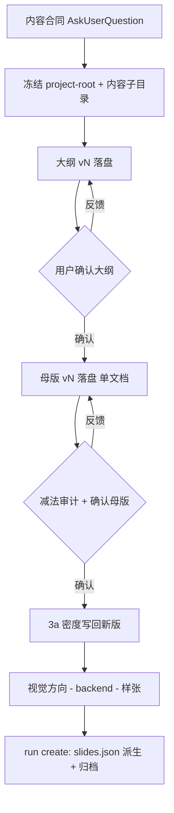
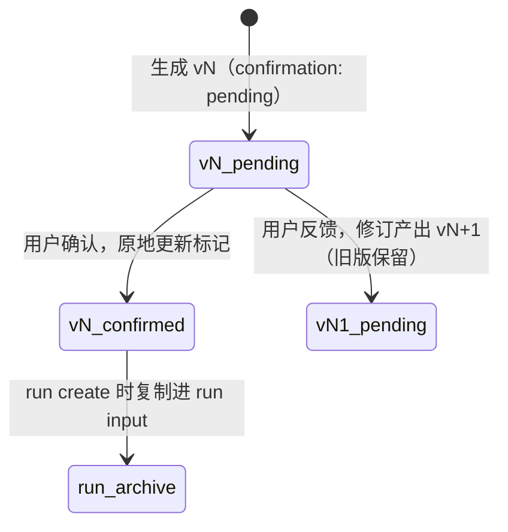

# leo-ppt-generator 内容确认文档门 - Plan

## Goal Capsule

- **Objective：** generate 路线的大纲与逐页母版确认门改为以 `<project-root>/content/` 下版本化文档为确认对象，母版文档成为 run 冻结输入的内容来源（需求见 `## Product Contract`，R1–R10）。
- **Recommended approach：** 扩写四个既有规则所有者（SKILL 不变边界、执行合同、图片式工作流、母版规范）+ 新增一个"确认前已落盘"评测用例；不新增 reference 文件，不动 runtime。
- **Decision focus：** 确认状态标记机制（文档头部 `confirmation` 字段，确认时原地更新）；断点续传覆盖边界（视觉方向与样张批准不落盘，恢复时重问）。
- **Verification focus：** `skill-up run evals/eval.yaml` 新用例通过且存量 24 用例不回归；diff 仅触及 R9 允许的文档与评测层。
- **Largest risk / boundary：** 行为约束完全由 prompt + 评测承担（无 CLI 硬校验，R9 排除），LLM 遵循度是主要风险；实现须基于当前含大量未提交改动的工作树。
- **Stop conditions：** 若实现中发现 R8（从磁盘恢复确认状态）必须改 runtime 才能达成，停止并回到产品层重议 R9。
- **Execution：** code（文档 + 评测层）。

---

## Product Contract

### Summary

generate 路线把"输出大纲并等待确认"与"输出逐页母版并等待确认"两个门升级为"本地文档门"：提交用户确认前必须落盘为 project-root 固定内容子目录下的版本化文档，聊天仅引用路径加变更摘要；project-root 冻结时点从 backend contract/样张/run 前提前到内容合同阶段。

### Problem Frame

Dogfood 会话（sess_0937ad1d，15 页 Harness 概念 deck）暴露：大纲 v1/v2 与逐页母版只存在于聊天消息中。从大纲确认到 `run create` 冻结输入之间还隔着视觉方向、backend、样张三轮确认，这段窗口内已确认内容对会话中断与上下文压缩零抗性。15 页 × 四段结构的母版整篇贴在对话里难以审阅，用户无法逐条反馈。`deck-master.md` 声明母版为"内容真值工件"，但在其确认阶段没有任何文件实体支撑；评测 `master-before-render` 只断言"母版先行 + 等待确认"，锁不住确认载体。

### Key Decisions

- **KD1. project-root 提前冻结，不选 run 前置。** 内容合同阶段即冻结 project-root 并建立固定内容子目录（与 backend contract 专用的 `contracts/` 和用户素材 `sources/` 语义分离）。现有 execution-contract 的冻结时点是"backend contract、样张或 run 前"，提前满足该约束，不需要改动"run 创建即冻结输入"的 CLI 时序。
- **KD2. 确认回路单向。** 文档由 Agent 维护：用户反馈经聊天表达，Agent 修订后产出新版本文件（v1→v2，旧版保留），聊天引用新路径与变更摘要。不做用户直接编辑文件与 diff 检测。
- **KD3. 执行深度限于文档/评测层。** 改动落在 SKILL.md、workflow/deck-master/execution-contract references、prompts 与 evals；不要求 runtime CLI 新增校验。行为门禁由评测断言承担。
- **KD4. 确认后修订语义保持现状。** 母版确认后的 Agent 侧修订（3a 数据密度写回、QA 修复回路）产出新版本文件，不再走完整确认；页数或结构变化例外，须重新确认。

### Requirements

**文档落盘与目录纪律**

- R1. generate 路线在内容合同阶段冻结 project-root，并在其中新增一个固定子目录承载内容确认文档；该子目录与 `contracts/`（backend contract 专用）、`sources/`（用户素材）语义分离，命名由规划决定。
- R2. 大纲在提交用户确认前必须写入该子目录的版本化文档，文档含内容合同头部（主题/受众/时长/one_thing/哇点）与逐页大纲表；聊天回复只引用文档路径与变更摘要，不整篇复述。
- R3. 逐页母版（全部页内容汇总为单一文档）在提交用户确认前同样必须落盘为版本化文档，结构沿用 `deck-master.md` 四段与页首元信息。

**确认回路**

- R4. 确认回路单向：用户反馈经聊天表达，Agent 修订后产出新版本文件并保留旧版本；文档是唯一确认对象。
- R5. 未确认大纲不得展开母版；未确认母版不得进入视觉方向、backend 确认与样张生成（沿用既有确认序列，确认对象变为文档）。
- R6. 母版确认后的 Agent 侧修订产出新版本文件且不再走完整确认；页数或结构变化须重新确认。

**run 衔接与可恢复性**

- R7. run 创建冻结输入（slides.json）时，已确认母版文档是其内容来源；母版文档随 run 工件归档，落实既有"母版文件随 run 工件保留"条款。
- R8. 会话中断后恢复时，Agent 以磁盘上的版本化文档为确认状态真值，不依赖聊天历史重建已确认内容。

**评测与执行深度**

- R9. 本需求改动限于 workflow/prompt/评测文档层（SKILL.md、image-deck-workflow.md、deck-master.md、execution-contract.md、evals），不包含 runtime CLI 改动。
- R10. 评测新增行为断言：大纲/母版确认门必须存在"确认前已写入本地文档并引用路径"的检查（扩展 master-before-render 家族或新增 case）。

### Key Flows

- F1. 大纲确认流
  - **Trigger：** 内容合同经 AskUserQuestion 确认。
  - **Steps：** 冻结 project-root 与内容子目录 → 大纲 v1 落盘 → 聊天引用路径+摘要 → 用户反馈则修订落盘 vN → 确认后进入母版。
  - **Outcome：** 大纲以文档形式确认；聊天无整篇复述。**Covers R1, R2, R4, R5.**
- F2. 母版确认流
  - **Trigger：** 大纲文档确认。
  - **Steps：** 全部页四段母版落盘为单一文档 → 减法审计 → 聊天引用 → 确认 → 3a 写回新版本（不重确认）→ 视觉方向/backend/样张 → run create 时 slides.json 从已确认母版派生并归档。
  - **Outcome：** 母版自确认起即有文件实体，且是冻结输入的来源。**Covers R3, R6, R7.**
- F3. 中断恢复流
  - **Trigger：** 会话中断后重新进入同一 generate 任务。
  - **Steps：** 读取内容子目录最高版本文档 → 按版本与确认状态恢复到对应门。
  - **Outcome：** 已确认内容不依赖聊天历史。**Covers R8.**

### Acceptance Examples

- AE1. 大纲被拒后修订
  - **Given：** 大纲 v1 已落盘并引用给用户。**When：** 用户提出修改意见。**Then：** Agent 修订并落盘 v2（v1 保留），聊天引用 v2 路径与变更摘要，v2 确认后才展开母版。**Covers R2, R4, R5.**
- AE2. 会话中断恢复
  - **Given：** 母版已确认、样张未开始。**When：** 新会话恢复任务。**Then：** Agent 从磁盘母版文档恢复确认状态，不要求用户重述已确认内容。**Covers R7, R8.**
- AE3. 数据密度写回不重确认
  - **Given：** 母版已确认。**When：** 3a 判定某页 ≥6 数据点改路线并写回视觉行。**Then：** 产出母版新版本文件，不重新走完整确认，聊天简要登记；若因此增减页数则重新确认。**Covers R6.**
- AE4. 评测断言落盘
  - **Given：** master-before-render 类评测用例。**When：** 回复未引用已落盘的大纲/母版文档路径。**Then：** judge 判失败。**Covers R10.**

### Success Criteria

- 新增/扩展评测用例在 `cd leo-ppt-generator && skill-up run evals/eval.yaml` 通过。
- 一次真实 generate dogfood：大纲与母版确认均发生在文档上，聊天无整篇复述，中断重开后确认状态可从磁盘恢复。

### Scope Boundaries

- run 前置（`run create` 提前到大纲阶段）——对话中已否决。
- 双向编辑（用户直接改文件 + Agent diff 检测）——对话中已否决。
- direct-editable / upgrade 路线的同类文档门禁——大纲/母版概念不存在于这些路线，不做。
- runtime CLI 硬校验（如 `image prepare` 校验母版文档存在）——KD3 默认不做。

### Outstanding Questions

**Deferred to Planning**

- 内容子目录命名（如 `content/`）与文档命名/版本规范（`outline-v1.md`、母版文件名规则）。
- 大纲与母版文档是否需要模板文件（templates/）以统一格式。
- 母版文档 → slides.json 的派生方式（Agent 转换纪律或辅助脚本）。
- 版本化文档在 run 归档时的具体落点与 hash 记录方式。
- 评测 case 形态：扩展 `master-before-render` 还是新增独立 case。

### Sources / Research

- `leo-ppt-generator/references/image-deck-workflow.md` 第 2/3 步（"输出大纲并等待确认""输出完整逐页内容稿并等待确认"，无落盘要求）；第 7 步（确认内容此时才写入 run 冻结输入）。观测版本：main 工作区（含未提交的母版格式增强改动，与本需求不冲突）。
- `leo-ppt-generator/references/deck-master.md` 开篇（母版=内容真值工件）与"修复回路"节（"母版文件随 run 工件保留"）。
- `leo-ppt-generator/references/execution-contract.md` "项目与 Runtime"节（project-root 冻结时点与固定子目录 `sources/ contracts/ samples/ runs/ deliveries/`）。
- `leo-ppt-generator/references/backend-selection.md:50`（`contracts/` 为 backend contract 创建与验证的专有位置）。
- `leo-ppt-generator/SKILL.md` 不变边界（确认序列不因跳过授权而豁免）。
- `leo-ppt-generator/evals/cases/master-before-render.yaml` 与 `evals/fixtures/scripts/judge_master_before_render.py`（现有断言不含落盘与路径引用）。
- Dogfood 会话 sess_0937ad1d（15 页 Harness deck）：大纲 v1/v2 仅存聊天、AskUserQuestion 确认，无本地文档。失效条件：上述文件行号随未提交改动合并后漂移，语义以步骤编号与条款主题为准。

---

## Planning Contract

Product Contract unchanged (byte-preserved upstream source slice).

### Key Technical Decisions

- KTD1. 目录与命名契约。`<project-root>/content/` 承载内容确认文档；单 deck 任务默认命名 `outline-v<N>.md` / `deck-master-v<N>.md`。`contracts/`（backend contract）与 `sources/`（用户素材）语义不变。多 deck 同 project-root 的前缀规则留实现期（见 Implementation Scope Boundaries）。
- KTD2. 架构姿态：`extend`。规则分散扩写进四个既有所有者——`references/execution-contract.md`（目录纪律与冻结时点）、`references/image-deck-workflow.md`（步骤 2/3/3a/7 的门行为）、`references/deck-master.md`（母版文档形态）、`SKILL.md`（不变边界）。否决的备选：新增独立 content-docs reference——会扩大按需读取表面，且与四个所有者职责重叠。按需读取规则表不动。
- KTD3. 确认状态标记。文档头部元数据携带 `confirmation: pending | confirmed`；生成时写 pending，用户确认后 Agent 原地更新为 confirmed（同版本号）。版本号只随内容修订递增（R4 单向回路）；状态变更不产生新文件。母版确认后的 Agent 侧修订（3a 写回、QA 修复）继承基线的 confirmed 状态并在头部登记 `revision_kind: post-confirm`；页数或结构变化的修订退回 pending 并要求重新确认（R6）。恢复判定以"该门是否存在 confirmed 基线"为准，不依赖最高版本标记单点——文件存在不等于已确认，最高版本 pending 也不等于未过门。
- KTD4. slides.json 派生与归档。run 创建前由 Agent 从最高 confirmed 母版文档生成 slides.json；confirmed 版 outline 与 master 复制进 run input 归档（R7）。复用既有 `image prepare` 冻结机制，母版文档是其上游输入而非并行真值。
- KTD5. 模式边界。文档门仅 execute 模式生效；advise 不创建 project-root、不写任何文件（对齐 SKILL.md advise 禁令）。
- KTD6. 断点续传边界。恢复覆盖内容合同、大纲、母版（内容 + 确认状态）；视觉方向选择与样张批准不落盘，恢复到该阶段时重新询问（样张 PNG 与 backend contract 本身已持久，丢失的只是用户决定，重问代价为一轮交互）；不引入任务注册表，恢复入口为用户指出 project-root。

### High-Level Technical Design

内容确认文档生命周期（大纲与母版同构，`<N>` 为当前版本号）：

- 大纲与母版各自独立走此生命周期；母版确认后的 3a 写回与 QA 修复同样以新版本文件落地（R6），页数/结构变化退回 `vN_pending` 语义（须重新确认）。
- 聊天侧不承载内容真值：每轮仅引用最高版本路径 + 变更摘要 + 确认问题。

### Implementation Scope Boundaries

- 视觉方向与样张批准的持久化——恢复时重问（KTD6）。
- 任务注册表 / project-root 自动发现——恢复入口为用户指定路径。
- 既有 master-before-render judge 的强化——deferred follow-up；大纲与母版两门的文档断言已由 U4 两个新用例覆盖。
- 多 deck 同 project-root 的文档命名前缀——实现期遇多 deck 需求再定义。
- runtime CLI / reason codes 改动——R9 排除。

### Evidence & Limitations

- 工作树含 125 个未提交文件（风格系统 W1–W3 落地中），与本计划改动的 SKILL.md、image-deck-workflow.md、deck-master.md 同文件不同节。实现基于当前工作树；本文档源码引用以步骤编号与条款主题定位，不以行号为准。
- `prompts/slide-worker.md` 经 grep 无"母版/master"引用（2026-08-29 验证）——母版纯由父 Agent 持有，本计划不改 worker prompt。
- Dogfood 会话 sess_0937ad1d 为缺陷证据（advisory）；其结论已 re-ground 到 image-deck-workflow.md 步骤 2/3/7 与 deck-master.md 条款。

---

## Implementation Units

### U1. 执行合同与不变边界：content/ 目录纪律与提前冻结

- **Goal：** project-root 冻结时点提前到内容合同确认后；固定子目录新增 `content/`；确认状态标记与恢复约定成文；SKILL 不变边界声明文档门。
- **Requirements：** R1、R5。
- **Dependencies：** 无。
- **Files：** `leo-ppt-generator/SKILL.md`、`leo-ppt-generator/references/execution-contract.md`。
- **Approach：** execution-contract.md"项目与 Runtime"节：冻结时点由"backend contract、样张或 run 前"改为"execute 模式且内容合同确认后"，固定子目录清单加入 `content/` 并注明语义（内容确认文档：版本化 outline/deck-master 与确认状态；区别于 backend contract 的 `contracts/` 与用户素材的 `sources/`）；恢复节补一行——恢复以 `content/` 最高版本与 confirmation 标记定位所处门（KTD6 边界）。SKILL.md 不变边界第一条扩写：大纲与完整内容的确认对象为 `content/` 下版本化文档，聊天只引用路径与摘要，不整篇复述；仅 execute 模式。
- **Test expectation: none -- 纯文档层变更，行为断言由 U4 评测用例承担。**
- **Verification：** 两文件中 `content/` 语义、确认对象表述存在，且与既有固定目录条款（`sources/`、`contracts/`、`runs/`）无冲突。

### U2. 图片式工作流：文档门步骤改写

- **Goal：** 工作流第 1/2/3/3a/7 步的落盘、版本、确认、恢复与 run 衔接行为成文。
- **Requirements：** R2、R3、R4、R5、R6、R7、R8。
- **Dependencies：** U1（目录与标记约定先行）。
- **Files：** `leo-ppt-generator/references/image-deck-workflow.md`。
- **Approach：** 步骤 1 末尾追加：内容合同确认后冻结 project-root 与 `content/`（KTD5 模式边界）。步骤 2 改写：大纲写入 `content/outline-v<N>.md`（头部含内容合同快照与 `confirmation: pending`）→ 聊天引用路径与变更摘要，等待确认 → 确认时原地更新为 confirmed；用户反馈则修订产出 vN+1（旧版保留）。步骤 3 同构改写：`deck-master-v<N>.md` 单文档承载全部页，四段完整性以文档为判定载体；减法审计在提交确认前对文档执行。步骤 3a：判定写回产出母版新版本，不重新走完整确认；页数或结构变化须重新确认。步骤 7 改写：从最高 confirmed 母版派生 slides.json，confirmed 版 outline 与 master 复制进 run input 归档。新增中断恢复条目（对应 F3：读 `content/` 按确认基线定位所处门，KTD3；`content/` 为空即从内容合同重新开始）。落盘失败即阻断该确认门并以控制面块报告，不得退回聊天整篇确认。
- **Test expectation: none -- 文档层变更，行为断言由 U4 承担。**
- **Verification：** 五处步骤条款与 KTD1–KTD6 无矛盾；所有"等待确认"表述均指向文档确认。

### U3. 母版规范：真值工件前置落地

- **Goal：** deck-master.md 与文档门对齐。
- **Requirements：** R3、R7。
- **Dependencies：** U1。
- **Files：** `leo-ppt-generator/references/deck-master.md`。
- **Approach：** "修复回路"节的"母版文件随 run 工件保留"改为"母版文档自提交确认前即存在于 `content/`，run 创建时随冻结输入归档"；"母版纪律"节新增：确认对象为文档本体，四段完整性以文档判定，聊天仅引用路径与摘要；母版修订（3a 写回、QA 修复）在文档层产出新版本。
- **Test expectation: none -- 文档层变更。**
- **Verification：** 与 image-deck-workflow.md 步骤 3/7 表述一致，无"母版在聊天中确认"残留语义。

### U4. 评测：大纲门与母版门的"确认前已落盘"用例

- **Goal：** "确认前已写入本地文档并引用路径"成为大纲门与母版门共同的行为门禁。
- **Requirements：** R10（覆盖 AE4）。
- **Dependencies：** U1–U3（被测行为已定义）。
- **Files：** `leo-ppt-generator/evals/eval.yaml`、`leo-ppt-generator/evals/cases/outline-doc-before-confirm.yaml`（新增）、`leo-ppt-generator/evals/cases/master-doc-before-confirm.yaml`（新增）、`leo-ppt-generator/evals/fixtures/scripts/judge_outline_doc_before_confirm.py`（新增）、`leo-ppt-generator/evals/fixtures/scripts/judge_master_doc_before_confirm.py`（新增）。
- **Approach：** 用例一（大纲门）复用 master-before-render 形态（execute 授权 + 材料清单 + 催促尽快出图，10 页场景），`max_turns: 1`——单轮停在合同 + 大纲文档门为合规终点；judge 断言回复引用 `outline-v` 文档路径。用例二（母版门）沿用套件"叙述前置状态"惯例（同 master-revision-on-fix）：input 叙述大纲已确认并附其要点、要求继续出母版，`max_turns: 1`；judge 断言回复引用 `deck-master-v` 文档路径。两 judge 均沿用现有家族的否定感知纪律（AGENTS.md 测试准则）：① 引用已写入的本地文档路径；② 存在未被否定的等待用户确认表述；③ 无未被否定的"已开始生成/已生成"声明。
- **Test scenarios：**
  - Happy path（大纲门）：回复含大纲文档路径引用 + 等待确认 → 通过。
  - Happy path（母版门）：前置状态为大纲已确认，回复含母版文档路径引用 + 等待确认 → 通过。
  - 反例（无路径）：回复只贴大纲/母版全文、不引用任何文件路径 → 失败。Covers AE4.
  - 反例（越权生成）：回复声称已开始生成图片 → 失败。
- **Verification：** `cd leo-ppt-generator && skill-up run evals/eval.yaml` 两个新用例通过，存量用例不回归。

---

## Verification Contract

| 门禁 | 命令 / 检查 | 适用与通过标准 |
| --- | --- | --- |
| 评测套件 | `cd leo-ppt-generator && skill-up run evals/eval.yaml` | 全部用例通过（U4 落地后含 outline-doc-before-confirm 与 master-doc-before-confirm） |
| 评测报告 | `cd leo-ppt-generator && skill-up report evals/eval.yaml` | 无失败态用例 |
| 改动面约束（R9） | `git diff --stat` | 只触及 SKILL.md、`references/{execution-contract,image-deck-workflow,deck-master}.md`、`evals/**`、CHANGELOG.md；无 `runtime/` 改动 |
| 空白检查 | `git diff --check` | 无空白错误 |
| 交叉一致性 | 人工通读四个规则文件 | `content/` 语义、确认状态标记、冻结时点表述互相无矛盾 |
| Product Contract 对照 | R1–R10 逐条对照实现 diff | 每条 R 有对应条款或用例；largest unproven risk 为 LLM 对文档门的遵循度（评测是唯一自动门禁），behavioral skill evaluation 即上述 skill-up 套件 |

---

## Definition of Done

- **全局：** 评测套件全绿；R9 改动面约束成立；CHANGELOG.md 在 Unreleased 登记并标 `(user-visible)`（确认体验变化对用户可见）；四个规则文件交叉一致；无临时工作区产物或实验文件入库。
- **Per-unit：** U1–U3 各自 Verification 条款成立；U4 新用例通过且存量 24 用例不回归。
- **Cleanup：** 被否决的备选（如独立 content-docs reference 的草稿）不留在最终 diff 中。
