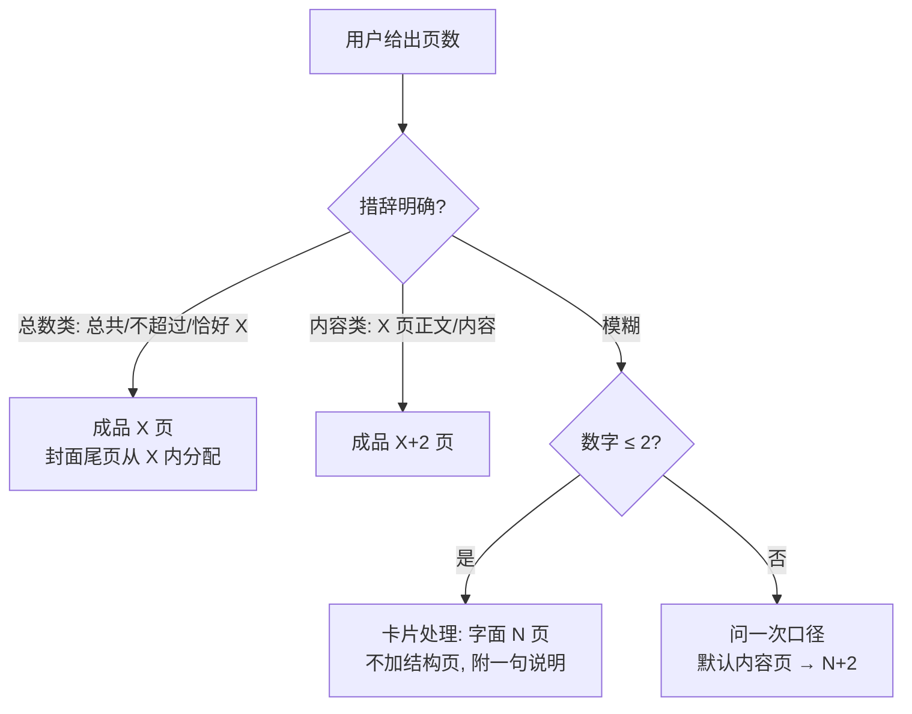

# Leo PPT 页数契约 - Plan

## Goal Capsule

- **Objective:** 为 `leo-ppt-generator` generate 路线落地页数契约——口径判定、封面/尾页结构页、极小页数豁免与时长口径——消除"用户数字 vs 成品页数"的隐式判断。
- **Recommended approach:** 扩展三层既有文档契约(内容合同第 1 步、大纲/母版结构、叙事三查),不新建文件、不新增确认门;配 4 个行为评测用例(否定感知 judge)。
- **Product authority:** 用户在 brainstorm 对话中确认全部四项核心决策(默认口径、询问触发条件、尾页强制强度、最小页数),另接受一项 agent 提出的时长口径默认。
- **Decision focus:** 口径语义的落点措辞与评测断言设计。
- **Verification focus:** 4 个新评测用例通过,评测套件全量回归。
- **Largest risk:** judge 断言对询问话术的文案敏感度——以否定感知匹配与意图级模式(而非逐字话术)缓解。
- **Open blockers:** 无。

---

## Product Contract

### Summary

generate 路线新增页数契约:用户所说页数默认指内容页,封面与尾页作为必选结构页额外计入(说 15 页 → 成品 17 页);措辞模糊时主动询问一次口径,明确措辞直接按字面执行;成品最少 5 页,≤2 页的请求按卡片处理不加结构页。

### Problem Frame

内容合同第 1 步冻结"页数"字段,但从未定义其语义——"15 页"指成品总数还是内容页数,流程无据可依,同一措辞在不同 run 可能产出不同页数。封面与尾页处于同样的隐式状态:叙事三查①已有"首页与收尾页回扣 one_thing"的检查,页面角色词表含"开场/收束",但大纲层无强制结构页,可能生成无封面或无收尾的 deck。

口径之外还有一处既有张力:版式库的页码惯例(`deck结构模板.md` 页面计划"01 封面"计入、页码 `03 / 08`)是总数口径。本契约把默认口径定为内容页后,两者并存——必须在内容合同层向用户说破算式,下游只做派生校验,否则按版式惯例会误读成品页数。

### Key Decisions

- **默认口径为内容页口径(N → N+2)** (session-settled: user-directed — chosen over 总页数口径(PPT 与产品两专家基于行业惯例、本仓版式库页码惯例、时长校验一致性推荐): 用户判断其目标用户说页数时指干货内容页,封面尾页是技能应尽的本分)
- **口径歧义时才问,明确措辞字面优先** (session-settled: user-directed — chosen over 每次都问与"不问只靠合同说破": 避免机械提问打扰重复任务,同时保留模糊场景的一次澄清)
- **尾页默认强制、可显式关** (session-settled: user-directed — chosen over 绝对强制与按 deck 类型自动判断: 内部周报、附录型 deck 的 THANKS 页是噪音,但叙事闭环(回扣 one_thing)不豁免)
- **成品最少 5 页,N≤2 按卡片处理** (session-settled: user-directed — chosen over 无豁免任何页数都加: 1–2 页本质是卡片不是演示,结构页占比过半即加戏;3 内容+封面+尾页=5 为最小完整 deck,与版式库页数参考最低档一致)
- **结构页用时计入时长预算** (session-settled: user-approved — 封面开场与尾页 Q&A 本就消耗现场时间,不计时会导致叙事三查③系统性超时误报)

### Requirements

**页数口径**

- R1. generate 路线内容合同的"页数"字段必须声明口径与算式;默认内容页口径下,合同文本须向用户呈现结构拆解(封面 1 + 内容 N + 尾页 1 = 成品 N+2)。
- R2. 用户措辞明确指向总页数("总共/不超过/恰好 X 页")时,按总数 X 执行,封面与尾页从 X 内分配;明确指向内容页("X 页正文/内容")时按 X+2 执行;两种明确措辞均不触发口径询问。
- R3. 措辞模糊时,必须在内容合同冻结前询问一次口径,询问须给出默认(内容页口径)与换算结果。

**结构页**

- R4. 封面页必选:大纲必须显式包含封面页,任何场景不得省略。
- R5. 尾页默认包含:大纲必须显式包含收尾页;用户显式要求去掉时立即删除且不二次确认,收束职能(回扣 one_thing)并入末页,叙事三查①仍强制。
- R6. 额外计入的结构页仅封面与尾页两项;目录、章节隔断、附录计入内容页数,不额外增加。

**极小页数**

- R7. 用户数字 ≤2 且未明示要结构页时,不加结构页、按字面总数交付,并附一句话说明(此类请求按卡片处理);明确要求结构页的措辞仍按 R2 字面执行。

**时长**

- R8. 结构页用时计入时长预算;叙事三查③的 Σ各页用时按成品全部页(含封面尾页)计算,对比合同演讲时长。

**权威与派生**

- R9. 内容合同是页数口径的唯一权威;大纲、母版与组装核对只做派生校验,不得各自定义口径。

### Acceptance Examples

- AE1. 模糊措辞走询问
  - **Given** 用户说"生成 15 页 PPT"(措辞模糊,数字 >2)
  - **When** 进入内容合同冻结
  - **Then** 询问一次口径(默认内容页,成品 17 页),按答复冻结合同
  - **Covers R1, R3.**
- AE2. 明确总数字面执行
  - **Given** 用户说"总共 15 页,含封面"
  - **When** 进入内容合同冻结
  - **Then** 不询问,成品 15 页 = 封面 1 + 内容 13 + 尾页 1
  - **Covers R2.**
- AE3. 去尾页保留叙事闭环
  - **Given** 用户说"15 页,不要尾页"
  - **When** 冻结合同
  - **Then** 成品 16 页 = 封面 1 + 内容 15,末页承担收束职能,叙事三查①仍强制
  - **Covers R5.**
- AE4. 极小页数按卡片
  - **Given** 用户说"做一页 PPT"
  - **When** 进入流程
  - **Then** 成品 1 页,不加结构页,附一句话说明
  - **Covers R7.**
- AE5. 非 generate 路线豁免
  - **Given** rebuild/upgrade 路线,源 deck 12 页
  - **When** 执行重建/升级
  - **Then** 成品 12 页,页数契约不适用
  - **Covers R9.**

### Scope Boundaries

- rebuild/upgrade 路线整体豁免:页数来自源 deck,1:1 保真契约禁止增删页;源 deck 缺封面时只提示不自动补,补页须用户确认并记结构变更。
- 按 deck 类型自动判断结构页(发布会强制/内部周报不加)不采纳——判断结果用户不可预测。
- 不维护措辞关键词模式表作为硬规则:"明确 vs 模糊"的判断发生在对话层。

### Dependencies / Assumptions

- "明确 vs 模糊措辞"的判定是对话层 agent 行为;是否辅助以关键词提示属 planning 可选项,不进 Product Contract。
- 本契约是对既有内容合同"页数"字段的语义增强,不新增独立确认门;口径询问搭内容合同冻结的便车。

### Outstanding Questions

- **Deferred to Planning:** 契约落点文档与措辞定稿——`image-deck-workflow.md` 第 1 步(口径询问与算式呈现)、`deck-master.md`(结构页显式成页)、`input-routing.md`(确认项)、evals 行为用例(AE1–AE5 的评测化)。
- **Deferred to Planning:** 页数口径是否作为固定字段进入 `outline-v<N>.md` 头部的合同快照。

### Sources / Research

- `leo-ppt-generator/references/image-deck-workflow.md:5` — 内容合同第 1 步含"页数"字段,语义未定义(本契约的直接动因)。
- `leo-ppt-generator/references/image-deck-workflow.md:67` — 叙事三查①已有首页/收尾页回扣检查,③为时长校验挂点。
- `leo-ppt-generator/references/image-deck-workflow.md:28` — 页面角色词表已含"开场/收束",结构页显式成页可复用。
- `leo-ppt-generator/references/styles/04_来源_guizang/组件模板/deck结构模板.md:22,84` — 版式库既有页码为总数口径("01 封面"计入页面计划、页码 `03 / 08`);与本契约默认的内容页口径并存,需在合同层说破。若该模板被修订需复核此张力。
- `leo-ppt-generator/references/input-routing.md:7` — generate 路线确认项已含"页数"。
- `leo-ppt-generator/references/reason-codes.md:159` — 组装前置条件含 `page_count_mismatch`,派生校验的既有挂点。

---

## Planning Contract

Product Contract unchanged (byte-preserved upstream source slice).

### Key Technical Decisions

- **架构姿态:extend,不新建文件或确认门** — 页数契约扩展现有三层文档:内容合同(`image-deck-workflow.md` 第 1 步)加口径语义,大纲/母版层(`image-deck-workflow.md` 第 2 步、`deck-master.md`)加结构页要求,交付核对层(第 12 步叙事三查③与页数核对)加时长口径与页数基准。口径询问搭内容合同冻结的便车,不新增独立确认门。
- **SKILL.md 不改动** — 入口文档的执行导航已把 generate 路线指向 `image-deck-workflow.md`,契约在 workflow 层生效即可;入口保持最小。
- **rebuild/upgrade 豁免不建评测用例** — 现有 rebuild/upgrade 方向用例已覆盖"页数来自源 deck"的行为面,豁免在契约层以"仅 generate 路线"一句声明。
- **口径判定停留在对话层,不建关键词模式表** — "明确 vs 模糊措辞"由 agent 在对话中判断;评测用例的 prompt 设计为明确触发某一分支,断言按意图级模式而非关键词路由。
- **大纲头部快照自然携带口径** — `outline-v<N>.md` 头部的内容合同快照含页数字段,口径与算式随快照进入头部,无需新增独立字段。
- **judge 断言沿用否定感知匹配** — 复用既有 `NEGATORS` + `require_positive` / `forbid_positive` 模式(见 `evals/fixtures/scripts/judge_outline_doc_before_confirm.py`),避免对健康响应误判。

### Implementation Scope Boundaries

- 不改版式库页码惯例:`deck结构模板.md` 的 `03 / 08` 是页码显示惯例,与"用户数字怎么解释"是两个概念;合同层呈现算式已消除歧义。
- 不在本计划内运行 skill-up 全量评测——用例与 judge 的编写属本计划,实际运行与取证属实施验证。
- 不动 `SKILL.md`、`execution-contract.md`、`editable-workflow.md`、`prompts/slide-worker.md`。

---

## Implementation Units

### U1. 内容合同层:页数口径契约

- **Goal:** `image-deck-workflow.md` 第 1 步的"页数"字段写入完整口径语义,`input-routing.md` 的 generate 确认项同步注记。
- **Requirements:** R1, R2, R3, R7, R9(口径部分)
- **Dependencies:** 无
- **Files:** `leo-ppt-generator/references/image-deck-workflow.md`, `leo-ppt-generator/references/input-routing.md`
- **Approach:** 第 1 步冻结内容合同处扩写"页数"语义,五要素齐备:①默认内容页口径(成品 = 封面 1 + 内容 N + 尾页 1);②明确总页数措辞("总共/不超过/恰好 X 页")按总数 X 执行且封面尾页从 X 内分配、不询问;③明确内容页措辞按 N+2 执行、不询问;④模糊措辞在合同冻结前询问一次,询问给出默认与换算结果;⑤数字 ≤2 且未明示要结构页时按卡片处理(不加结构页、字面交付、一句话说明)。契约标注"仅 generate 路线"。合同文本向用户呈现结构拆解算式。`input-routing.md` generate 行"必要确认"列的"页数"补口径指向。
- **Patterns to follow:** 同文件第 1 步既有合同字段的表述密度;`one_thing` 字段的"必填+求证"句式。
- **Test scenarios:** 由 U3 行为用例覆盖;本单元无独立单测。
- **Verification:** 文档审查五要素齐备、无与既有字段矛盾;`rg -n "页数" leo-ppt-generator/references/image-deck-workflow.md` 确认口径句落位。

### U2. 结构页层:封面/尾页显式成页与时长口径

- **Goal:** 大纲与母版层要求结构页显式成页;交付核对层落地时长口径与页数基准。
- **Requirements:** R4, R5, R6, R8, R9(派生校验部分)
- **Dependencies:** U1(口径定义先行,结构页算式引用它)
- **Files:** `leo-ppt-generator/references/image-deck-workflow.md`, `leo-ppt-generator/references/deck-master.md`
- **Approach:** 工作流第 2 步大纲结构:封面页必选、尾页(需求所称"收尾页")默认包含,均以既有"开场/收束"页面角色显式成页;用户要求去尾页时立即删且收束职能(回扣 `one_thing`)并入末页。目录、章节隔断、附录计入内容页。第 12 步:叙事三查③的 Σ各页用时按成品全部页(含结构页)计算;页数核对基准 = 内容合同的成品总页数(N+2 或总数口径下的 X)。`deck-master.md` 母版纪律补一条:封面/收尾页在母版中以显式页面存在,删尾页时末页备注需声明承担收束。
- **Patterns to follow:** 页面角色词表("开场/收束")与 `argument_role`/`beat` 元信息的既有表述;叙事三查①的既有句式。
- **Test scenarios:** 由 U3 行为用例覆盖(去尾页场景);本单元无独立单测。
- **Verification:** `rg -n "收束|封面" leo-ppt-generator/references/deck-master.md` 确认结构页纪律落位;三查③表述含结构页用时。

### U3. 评测用例:四个行为场景 + judge 脚本

- **Goal:** 把验收样例 AE1–AE4 评测化为 skill-up 行为用例。
- **Requirements:** R1–R7 的行为验证(经由 AE1–AE4)
- **Dependencies:** U1, U2(用例断言的契约先落地)
- **Files:**
  - `leo-ppt-generator/evals/cases/page-count-ambiguous-asks.yaml`(AE1)
  - `leo-ppt-generator/evals/cases/page-count-explicit-total.yaml`(AE2)
  - `leo-ppt-generator/evals/cases/page-count-no-closing.yaml`(AE3)
  - `leo-ppt-generator/evals/cases/page-count-tiny-deck.yaml`(AE4)
  - `leo-ppt-generator/evals/fixtures/scripts/judge_page_count_ambiguous_asks.py`
  - `leo-ppt-generator/evals/fixtures/scripts/judge_page_count_explicit_total.py`
  - `leo-ppt-generator/evals/fixtures/scripts/judge_page_count_no_closing.py`
  - `leo-ppt-generator/evals/fixtures/scripts/judge_page_count_tiny_deck.py`
  - `leo-ppt-generator/evals/eval.yaml`(注册 + 分组注释)
- **Approach:** case 结构照 `outline-doc-before-confirm.yaml`(id/title/description/input.prompt/constraints/judge.type=script);judge 复用否定感知骨架(`NEGATORS` + `require_positive`/`forbid_positive`,读 `EVAL_FINAL_MESSAGE`)。断言按意图级模式:
  - Covers AE1. 模糊询问 — prompt 措辞模糊(如"帮我生成 15 页 PPT,数据已定级,别磨蹭")→ require_positive:出现口径询问且给出默认与换算(模式覆盖"封面"+"尾页"或"内容页"+总数换算,非逐字话术);forbid_positive:未询问即声称页数已定/直接开始出大纲。
  - Covers AE2. 明确总数 — prompt 含"总共 15 页,含封面"→ forbid_positive:口径询问;require_positive:15 总数拆解(封面 1 + 内容 13 + 尾页 1 的意图级模式)。
  - Covers AE3. 去尾页 — prompt 含"15 页,不要尾页"→ require_positive:成品 16 页结构且末页承担收束;forbid_positive:保留尾页或对删除二次确认。
  - Covers AE4. 极小页数 — prompt 含"做一页 PPT"→ require_positive:不加结构页的说明(卡片处理);forbid_positive:成品 3 页/自动加封面尾页的正面声明。
  - `eval.yaml` 新增分组注释"# 页数契约(docs/plans/2026-08-29-003):口径询问、明确字面、去尾页收束、极小页数卡片。"并注册 4 个 case。
- **Patterns to follow:** `evals/cases/outline-doc-before-confirm.yaml` 的 prompt 构造(授权执行+数据定级前置,减少无关阻断);`judge_outline_doc_before_confirm.py` 的否定感知骨架。
- **Test scenarios:** judge 脚本对构造的正/负样例消息自测(require_positive 在健康响应上通过、在含否定词的响应上拒绝)——实施时以样例消息字符串直接驱动脚本验证;`python3 -m py_compile` 全部脚本。
- **Verification:** `cd leo-ppt-generator && skill-up list-cases evals/eval.yaml` 显示 4 个新用例;4 个 judge 脚本对样例消息行为正确。

### U4. CHANGELOG 收尾

- **Goal:** 变更记录入库。
- **Requirements:** 仓库变更纪律(AGENTS.md)
- **Dependencies:** U1, U2, U3
- **Files:** `CHANGELOG.md`
- **Approach:** Unreleased → Added 新增条目"**leo-ppt-generator: generate 路线页数契约** (user-visible)",概述口径、结构页、极小页数、时长口径与 4 个新评测用例,链接本计划;仿照既有内容确认文档门条目的格式与密度。
- **Test scenarios:** Test expectation: none — 纯文档变更。
- **Verification:** 条目含 (user-visible) 标记与计划路径链接。

---

## Verification Contract

| 验证项 | 命令 / 方式 | 适用单元 | 通过信号 |
| --- | --- | --- | --- |
| judge 脚本语法 | `python3 -m py_compile leo-ppt-generator/evals/fixtures/scripts/judge_page_count_*.py` | U3 | 退出码 0 |
| 用例注册 | `cd leo-ppt-generator && skill-up list-cases evals/eval.yaml` | U3 | 4 个新用例可见 |
| 行为评测 | `cd leo-ppt-generator && skill-up run evals/eval.yaml` | U1–U3 | 全量通过(含 4 个新用例,无既有用例回归) |
| 契约落位 | `rg -n "仅 generate 路线\|收束职能" leo-ppt-generator/references/image-deck-workflow.md leo-ppt-generator/references/deck-master.md` | U1, U2 | 新增契约句命中(非既有关键词) |

行为评测的实际运行与失败取证属实施阶段;本计划只定义用例与 judge。

---

## Definition of Done

- 全局:U1–U4 全部完成;`image-deck-workflow.md` / `deck-master.md` / `input-routing.md` 的页数契约五要素齐备;4 个新评测用例注册且 judge 可执行;`CHANGELOG.md` 已更新;实施阶段 `skill-up run evals/eval.yaml` 全量通过。
- U1:口径语义五要素落位且标注"仅 generate 路线"。
- U2:结构页显式成页、删尾页收束并入末页、三查③含结构页用时、页数核对以合同成品总页数为基准。
- U3:4 case + 4 judge + eval.yaml 注册;judge 否定感知;正/负样例自测通过。
- U4:CHANGELOG 条目含 (user-visible) 与计划链接。
