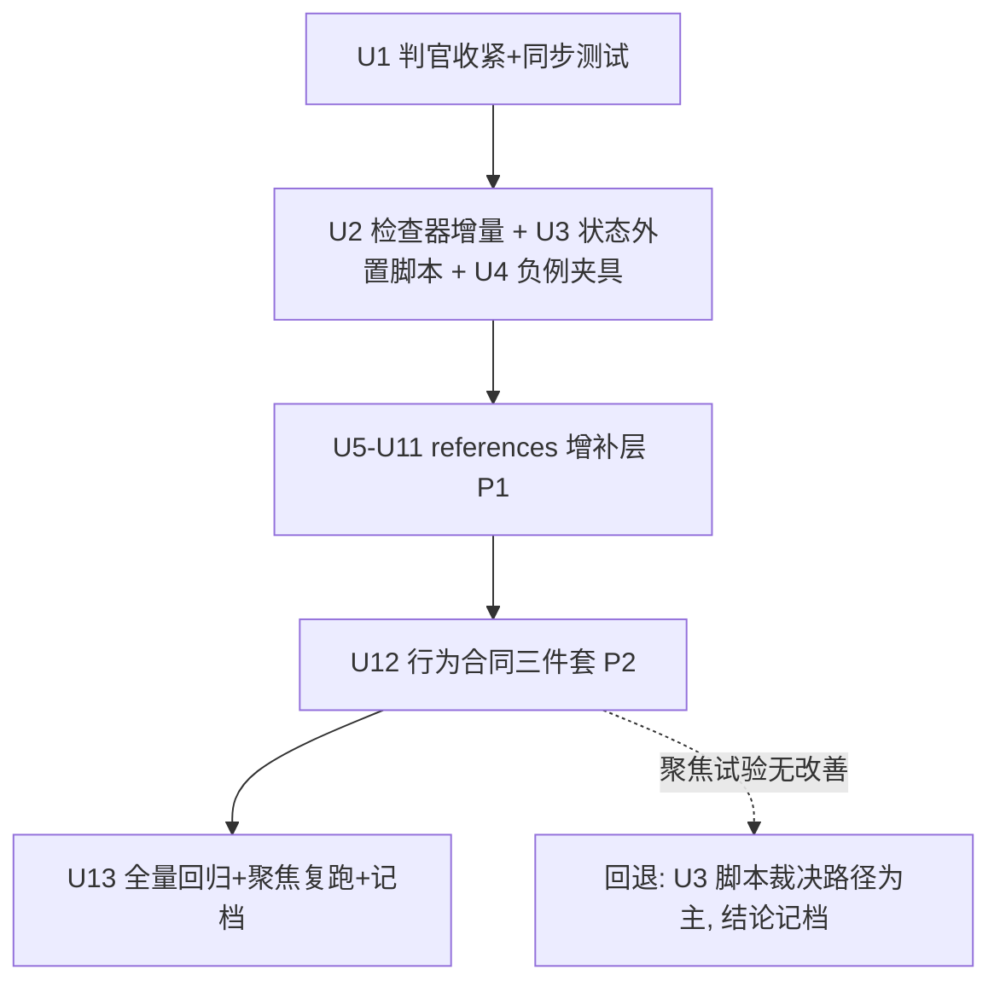

# evidence-first-writing 第二轮上游吸收落地 - Plan

## Goal Capsule

- **目标**：把已裁决的第二轮上游吸收（file-github 语料、152 仓库漏斗筛选、20 项目深读、44 候选合并）落进 evidence-first-writing：P0 地基层（判官/脚本/测试 8 项）、P1 增补层（references 既有文件增补约 20 项 + 工具登记）、P2 合同层（3 项）+ 全量回归。
- **推荐路径**：判官先行 → 脚本 → references 增补 → 合同改动 → 一次全量回归；单元按文件所有权分组、批次串行落地。
- **权威层级**：用户两次裁决（三批全做；合同口径 3+6）为最高输入；深读报告（原存 git-ignored 工作区，已于 2026-09-11 清理）为机制证据；当前技能源文件为对接面事实源。
- **决策焦点**：P2 三项合同改动的受控试验设计（post-publish 结构锚对 flash 级模型 0/8 失败的首次干预）与失败回退路径（转脚本裁决）。
- **验证焦点**：判官收紧的历史响应重放 100% 接受 + 对抗样本 100% 拒绝；每批聚焦评测；P2 收尾全量回归（存量 33 case + 本轮新增 case，通过线口径见 Verification Contract）。
- **最大风险/边界**：references 膨胀与合同回归。边界：不新建 references 文件、不改 canonical route 语义、数值过线门禁禁入。
- **停止条件**：P2 聚焦试验（post-publish 无字段泄漏变体 8 轮）无改善时（判定线预注册于 U12），停止合同路径、按预定回退转 U3（深读候选 W1）脚本裁决路径，并把结论记档 known-issues，不再追加 SKILL.md 文本尝试。

---

## Product Contract

### Summary

为 evidence-first-writing 落地第二轮上游吸收的三批变更：研究环合同（终止/策展/压缩保真/引用核验）、中文去 AI 味协议增量、判官与脚本地基、声音档案认知层、文案质检工具、三项行为合同改动。全部以既有文件增补与新脚本/测试形态落地，来源、许可证与快照日期全程标注。

### Problem Frame

2026-08-30 融合批次后，技能的检测器与 humanizer 知识层已更新，但五块能力缺口未覆盖：研究环缺显式终止与来源策展纪律；中文去 AI 味缺语义级核对与语域采样；post-publish 状态块在 flash 级模型上 0/8 自发违约（在案唯一真实行为缺陷）；声音档案缺认知层 schema；文案缺语料溯源与语义质检。同时 152 个语料仓库中存在大量"README 宣称级"机制与被实测证伪的数值门禁，需要一条证据门控的吸收管线把真增量筛出来。本轮漏斗（浅筛 152 → 深读 20 → 合并 44 候选 → 用户裁决）已完成筛选，本方案只负责落地。

### Requirements

**调研与证据纪律**

- R1. `research`/`shape` 执行获得显式研究终止与预算纪律：每轮要么产出账本有效证据行、要么产出下一组检索词；问题级双向终止（找到即止/确证不可得即记缺口）；轮次上限按 depth 分档；已核验主张幂等跳过。
- R2. 来源策展采用保守准入（相关性宁滥勿缺、可信度除非明确不可信才剔）与降级保留（策展失败返回未策展全量，不清空上下文）；逐条证据是非判定含糊即拒。
- R3. 调研整理与引用呈现遵守压缩保真（清理而非总结、逐字保留、不丢来源）与引用契约（唯一来源单一编号、编号按 article_family 分治、引用紧跟其实际支持的陈述）；核心主张账本行的"来源+证据摘录"必填（按 evidence_risk 分档）。

**判官与脚本地基**

- R4. post-publish 判官采用双分支接受模型：输出含 canonical fenced YAML 状态块时走逐字段结构化解析（字段枚举校验、`stable_rule_update` 值域限 `none|hypothesis|candidate|promoted`、冲突决策检测、零字段不静默通过）；不含 canonical 块的自然语言响应保留既有同义词实质判定路径。哨兵接受判定用全串精确匹配（strip + 配对引号归一），禁 substring。
- R5. post-publish 落盘路径由脚本裁决状态：canonical 块由脚本产出（argparse 枚举 + promoted 三条件强制 + append-only ledger，仅写用户显式提供的路径），模型不手写状态块；`check_factual_invariants.py` 输出事实回归哈希并由 ledger 记录，实现 auto-stale 绑定。
- R6. `check_prose.py` 增加字面排除表消除技术术语误报（如"代码仓库/搜索引擎"触发比喻场聚集），并新增过程叙述 lint（核验声明须由状态块承载）；两者均为诊断线索非交付门禁。
- R7. evals 获得系统性"不该改"负例集：以 shuorenhua SF/SNF 阴阳对为素材精选 10-20 组，覆盖"同形不同质"的保留/应改分界。

**中文文体协议**

- R8. 中文 humanize/audit 协议获得：冻结清单关系化 + 语义七要素双向核对（范围/条件/否定/情态/完成态/方向/强度）；动词强度匹配证据（证明/充分说明 > 支持/显示分层）；改写不得把证据绑定的 hedging 升格为强断言；venue-first 语域采样（同 venue 人写文本优先于体裁缺省）；归属分层交付与"连续『公开资料显示』=核验笔记泄漏"诊断；压缩试验（删 1/3 不损事实/动作判断=注水）作 audit 判据；两域（技术文章/postmortem）AI tells 注记；中文实证锚点（CCL 2023/2025）挂入实证权重注记；【需作者确认】区块（逻辑风险不静默纠正、排除关系不升级为肯定事实）。

**审查协议**

- R9. 审查循环具备收敛早停（每轮只精修上轮发现、"无新发现"须原样保留上轮产出、轮数是上限不是配额）与输出完备性契约（逐维度显式结论、正式审查最少 1 条具体问题否则必须走"未发现问题+检查范围"合法出口、finding 动作带必改/可选分级且作者否决即终局、维度结论有界枚举化 pass/blocked/not_checked 对齐 not_run 语义）。

**声音与文案**

- R10. 声音档案新增认知层章节（核心信念与判断方式、观点张力），每条稳定特征落行级证据格式（出处摘录+复现样本数+适用边界）；主题显著超出档案样本范围时显式披露并降级，不得以档案名义对未覆盖领域编造作者立场；train-voice 产物自检清单检查项化。
- R11. 文案工作获得语料溯源纪律（grounding corpus、Verbatim 优先、无语料即标 ungrounded）与双层语义借势质检（一跳可达/点破即死/落点在"你"/五类钩子判贴；暗示的产品主张过同一证据账本，强合规与产品状态文案禁用双关）；钩子战术表带失效条件双列；评分迭代有界停止（带"启发式非实测"声明）。

**行为合同（P2）**

- R12. post-publish 与路由输出获得结构锚定：状态块尾锚（单行末行标记）、route 首锚、发前自检第四层（覆盖核对）；这是对"SKILL 文本强化对 flash 无效"在案结论的限定性受控试验（内容追加式无效，结构位置式未试过）。
- R13. 长文改写获得 bounded scope 控制：先全量缺陷清单后逐项修的顺序强制、"建议删除（待确认）"清单交用户拍板、字数留存率 ≥0.85（结构性改写的缩水下限，作启发式线索）。

**治理**

- R14. 全部吸收项标注来源项目 + 许可证 + 快照日期（2026-08-31）；无证/GPL/AGPL 项目只吸收思想不复制文本；数值过线门禁（任何"分数≥X 才放行"机制）禁入；每批变更配套对应验证并记档 CHANGELOG 与 known-issues。

### Scope Boundaries

**非目标（本轮不做）**

- 数值过线门禁（28/35、16/20 等）：深读实测为"LLM 自评 + 机械阈值"的可博弈伪客观门禁，与"分数不参与放行"三原则冲突。
- 声音蒸馏的策略层（运营打法/发布节奏/蹭热点）与"蒸馏他人博主"模式：与授权红线和档案证据纪律冲突。
- Nonce 溯源、多 agent 拓扑、网络核验脚本、外部 embedding 依赖：单 agent 形态无攻击面或违背零网络脚本原则。
- 新建 references 文件：全部增补既有文件（登记批仅更新 tool-selection.md）。

**Deferred to Follow-Up Work（下轮候选，触发条件：本轮回归通过后）**

- 渠道容忍矩阵落地（avoid-ai-writing，实体表已定位其 SKILL.md L665-703）。
- STORM pip 桥升级评估（deep 档可选执行器）。
- 卡片池精华：ALwrity claim 三分类、FAROS 证据六态枚举、SurveyX NLI 引用核验、yuwen-publish-precheck 两层门禁、social-account-doctor H1-H8、writing-helper voice 四维度、neuro-book 承诺账本等（完整清单原存 git-ignored 工作区 phase1 汇总，已于 2026-09-11 清理）。

---

## Planning Contract

### Key Technical Decisions

- KTD1. **判官先行**：P0 中判官收紧（U1）先于一切合同改动落地，且必须历史响应重放 100% 接受 + 对抗 fixture 100% 拒绝后才允许 P2。依据：known-issues 在案纪律"收紧判定必须附带历史响应重放"，判官先行保证 P2 合同改动后的回归信号可信。
- KTD2. **合同口径 3+6**：SKILL.md 级合同 3 项走 P2；6 项合同性参考增补（引用编号契约 U6、拒答式评审 U7、返工上限 U7、需作者确认区块 U8、voice 覆盖披露 U9、语料溯源 U10）随 P1 落地并标注合同性（†），并入 P2 后统一全量回归。(session-settled: user-directed — chosen over 严格口径仅 3 项: 分批受控、与 2026-08-30 融合批次 L1/L2 分层先例一致)
- KTD3. **引用呈现按 article_family 分治**：正式报告/研究解释用编号引用契约（唯一 URL 单编号、来源列表连续无空洞）；观点评论/公众号用 inline 引用（引用随陈述移动，不挂宽主张）。依据：open_deep_research（编号连续）与 AcademicForge（禁编号防 reorder desync）的实证对立，分场景消解。
- KTD4. **机械优先、降级保留**：可机械判定的先机械判（字段结构、字面排除、精确匹配哨兵）；LLM/人工判定失败时降级保留全量而非清空。统一自 gpt-researcher 策展降级与 deep-searcher 保守准入的共识。
- KTD5. **线索而非门禁、增量而非镜像**：脚本输出均为诊断线索，服从作者样本与渠道优先原则；references 增补只注明来源+快照日期，不做逐条镜像追踪。沿用 2026-08-30 融合三原则。
- KTD6. **数值门禁禁令**：任何形式的"自评分数 + 过线放行"不得进入技能。深读实测：chapter_quality_check.py 的分数由 LLM 自评填入后加总，弱维度可被高分买过线；伪造引用可过校验。
- KTD7. **五件材料门禁以 draft 侧指引形态落地**（article-workflows.md 新增小节），不升格为起草硬门禁，避免加重 quick 档流程。(session-settled: user-approved — chosen over 升格为硬门禁: 与"最轻 depth"原则相抵)
- KTD8. **架构姿态 extend 为主**：全部 references 增补落在既有 owner 文件内（新增小节时置于相关既有节之后，不新建文件）；新增仅一个脚本（postpublish 状态外置）与配套测试，属 justified new（状态外置需要独立于模型输出的裁决器，无既有 owner 可承载）；判官结构化解析在既有 `evals/scripts/` 判官脚本内增补（bash 入口保留为 case YAML 的 script_path，结构化解析以 python3 辅助脚本承载，具体入口形态在 U1 落定时验证）；W1 脚本（即 U3）与判官为 compose 关系（脚本产 canonical 块，判官校验之）。已检查既有能力：`check_factual_invariants.py`/`check_prose.py` 为既有检查器 owner，W2 哈希绑定 extend 其输出而非新建平行脚本。

### Sequencing

依赖列为"—"的 P1 单元（U9-U11）可与同批并行；U5/U8 依赖 U1 仅因判官收紧改变其聚焦复跑的测量口径。

### Evidence & Limitations

- **证据源**：机制证据全部来自六份深读报告（原存 git-ignored 工作区，已于 2026-09-11 清理），每条候选带语料内文件路径级证据；深读时已逐一对照技能当前源文件做差集（已吸收边界清单同存该工作区）。语料快照 2026-08-31，152 仓库 commit 清单当时冻结于工作区语料 manifest。
- **许可证**：可改造文本项均为 MIT/Apache-2.0（gpt-researcher、deep-research、deep-searcher、open_deep_research、node-DeepResearch、AcademicForge、claude-blog、Deep-Research-skills、last30days-skill、writing-agent、shuorenhua、sepia、qu-ai-wei、academic-humanizer、academic-paper-skills、blogger-distiller、xiaoma-durex-copywriter、marketing-os）；AI-Scientist 为非标准许可证只吸收思想（全量重写表达）；观察名单见 `04-phase1-summary.md`。
- **限制**：评测环境为 GLM flash 代理（非真 Claude），措辞漂移按 known-issues 记档纪律处理（实质在场即不算失败）；sepia 74/18/8 为英文语料测量，迁移须标注来源与局限；R12 是受控试验而非确定性修复——在案结论表明内容追加式强化无效，结构位置式干预未试过，失败则回退脚本路径。

---

## Implementation Units

| U-ID | 标题 | 主要文件 | 依赖 |
|---|---|---|---|
| U1 | P0 判官收紧与三方同步测试 | evals/scripts/、tests/ | — |
| U2 | P0 检查器脚本增量 | scripts/check_prose.py、scripts/check_factual_invariants.py、tests/ | — |
| U3 | P0 postpublish 状态外置脚本 | scripts/、tests/ | — |
| U4 | P0 负例评测夹具 | evals/cases/、evals/eval.yaml | — |
| U5 | P1 source-analysis 增补 | references/source-analysis.md | U1 |
| U6 | P1 workflow-contract 增补 | references/workflow-contract.md | U5 |
| U7 | P1 编辑管线/审查协议增补 | references/editorial-pipeline.md、references/editorial-review.md | U5 |
| U8 | P1 中文协议增补 | references/chinese-editorial-protocol.md、references/humanizer-pattern-catalog.md、references/humanizer-patterns.md | U1 |
| U9 | P1 声音档案增补 | references/voice-profiles.md | — |
| U10 | P1 文案协议增补 | references/copywriting.md、references/copy-frameworks-ext.md | — |
| U11 | P1 工作流指引与工具登记 | references/article-workflows.md、references/tool-selection.md | — |
| U12 | P2 行为合同三件套 | SKILL.md、references/editorial-pipeline.md、references/editorial-review.md、references/chinese-editorial-protocol.md | U1-U11 |
| U13 | 全量回归与记档 | CHANGELOG.md、evidence-first-writing/evals/known-issues.md、references/upstream-source-audit.md | U12 |

### U1. P0 判官收紧与三方同步测试

- **Goal**：post-publish 判官从 presence 检查升级为双分支结构化解析，堵 `stable_rule_update: promoted` 裸值可漏过的漏洞；建立合同↔references↔判官三方同步测试。
- **Requirements**：R4、R14
- **Dependencies**：无（必须最先落地）
- **Files**：`evidence-first-writing/evals/scripts/`（post-publish 相关判官脚本，以 `evals/cases/post-publish-*.yaml` 实际引用的脚本为准；结构化解析以 python3 辅助脚本承载——如 `evals/scripts/postpublish_judge.py`，bash 入口保留为 script_path、内部委托执行）；`evidence-first-writing/tests/test_postpublish_judge.py`（新增，仅承载结构化解析特有场景）；`evidence-first-writing/tests/test_judges.py`（历史回放 fixture 登记进既有 CASES 矩阵——单一事实源，不另建平行回放矩阵）；`evidence-first-writing/tests/test_contract_sync.py`（新增）
- **Approach**：双分支接受模型（源自深读 T3 的实证设计）：仅当输出含 canonical fenced YAML 状态块时走逐字段结构化解析——四字段（observation/hypothesis/stable_rule_update/persistence）枚举校验、`stable_rule_update` 值域限 `none|hypothesis|candidate|promoted`（与 editorial-pipeline.md Node 14 在档四值枚举对齐）、`promoted` 与单篇表现冲突时拒绝、零字段命中不静默通过；不含 canonical 块的自然语言实质合规响应保留既有同义词判定路径（known-issues 词汇漂移纪律）。哨兵接受判定改全串精确匹配（strip + 一对配对引号归一，禁 substring，防 "None of the criteria" 类误判）。同步测试仿 claude-blog `test_blog_delivery_contract.py` 形态：SKILL.md 合同字段 ↔ editorial-pipeline Node 14 ↔ 判官接受集三方一致，任一方漂移即红。
- **Test scenarios**：①历史失败/通过响应重放 100% 接受（登记进 test_judges.py CASES，含 it51_pass 等在档 fixture 的加粗 bullet/自然语言形态——它们走同义词分支）；②对抗样本：canonical 块内 `stable_rule_update: promoted` 无复现条件、canonical 块四字段全缺、`promoted` 决策伴随字段同义替换越权——100% 拒绝；③`"None of the criteria are met"` 不被哨兵误判为接受；④同步测试变异（改任一方单字段）即 FAIL；⑤自然语言响应中的同义措辞（观察/记录/待验证假设）走同义词分支不误拒。
- **Verification**：单测全绿；历史重放与对抗 fixture 双 100%（对抗 fixture 新增于 `tests/fixtures/judge_replay/`）；判官输出接受分支标注（`branch=canonical|synonym`，供 U12 判定线计数）。

### U2. P0 检查器脚本增量

- **Goal**：`check_prose.py` 消除技术术语字面误报并新增过程叙述 lint；`check_factual_invariants.py` 输出事实回归哈希。
- **Requirements**：R6、R5（哈希输出部分）、R14
- **Dependencies**：无
- **Files**：`evidence-first-writing/scripts/check_prose.py`；`evidence-first-writing/scripts/check_factual_invariants.py`；`evidence-first-writing/tests/test_check_prose.py`；`evidence-first-writing/tests/test_factual_invariants.py`
- **Approach**：移植 shuorenhua `hard_metrics.py` 的 METAPHOR_LITERAL_PREFIX 字面排除表（已实测复现："代码仓库/搜索引擎"63 字技术句触发 metaphor-cluster WARN，加表后消除），docstring 同步改；新增过程叙述检测（核验声明句出现在正文而非状态块时报 finding，警告级）；`check_factual_invariants.py` 在输出中附 before/after 内容哈希（auto-stale 的比较端由 U3 ledger 记录与 U12 指针句消费，见 U3）。
- **Test scenarios**：①"代码仓库/搜索引擎/瀑布流"等技术名词句不再触发比喻场 WARN；②真实比喻句仍触发（排除表不吞真阳性）；③"我核对了来源，确认无误"类过程叙述在正文出现时报 warning 级 finding，在 YAML 状态块内不报；④冒号引直接引语等既有豁免回归不破；⑤哈希输出稳定且正文单字改动后哈希变化；⑥退出码语义（0/1/2/3）不变。
- **Verification**：全套 unittest 通过；对既有 eval fixture 重放无新误报。

### U3. P0 postpublish 状态外置脚本

- **Goal**：落盘路径的状态块由脚本裁决产出，模型不再手写。
- **Requirements**：R5、R14
- **Dependencies**：无（SKILL.md 指针句在 U12 随合同包接入）
- **Files**：`evidence-first-writing/scripts/update_postpublish_record.py`（新增）；`evidence-first-writing/tests/test_update_postpublish_record.py`（新增）
- **Approach**：参照 writing-agent `update_run_manifest.py` 形态：argparse 枚举子命令与字段值（observation/hypothesis/stable_rule_update/persistence），`promoted` 强制要求三条件参数（2 复现 + 2 可比 + 反例已查声明）否则非零退出；append-only ledger（JSONL）**仅通过显式 `--ledger <path>` 参数写入**——无默认路径、绝不在技能目录或其镜像内落盘，"授权路径"即用户显式提供的路径（对齐 SKILL.md 持久写入授权红线）；可选 `--invariant-hash` 参数把 `check_factual_invariants.py` 输出的哈希写入 ledger 条目（auto-stale 比较端）；stdout 吐 canonical YAML 块供判官比对。
- **Test scenarios**：①合法参数产出 canonical 四字段块；②`promoted` 缺任一条件参数即退出码非零且不写 ledger；③ledger 追加不覆盖（append-only）；④重复写入同 observation 幂等跳过或显式新条目；⑤未提供 `--ledger` 时不写任何文件；`--ledger` 指向技能目录时拒绝；⑥ledger 文件缺失按新建处理、含损坏 JSON 行时跳过该行并警告不崩溃；⑦`--invariant-hash` 写入条目且正文改动后旧哈希条目显式失效。
- **Verification**：单测全绿；脚本 `--help` 与非交互失败路径清晰。

### U4. P0 负例评测夹具

- **Goal**：补系统性"不该改"负例集，覆盖保留/应改分界。
- **Requirements**：R7、R14
- **Dependencies**：无
- **Files**：`evidence-first-writing/evals/cases/`（新增 1-2 个 case YAML，素材内联）；`evidence-first-writing/evals/eval.yaml`
- **Approach**：从 shuorenhua 120 案例基准（SF 63 + SNF 57，MIT）精选 10-20 组阴阳对：同形不同质（如"排比"在演讲稿是体裁特征 vs 在技术教程是模板痕迹；"深邃"作人名 vs 作滥情形容词）。case 断言用否定感知匹配（对健康响应不误判）。
- **Test scenarios**：①SNF 侧（不该改）响应不得出现改写建议误报；②SF 侧（应改）漏报被捕获；③判官词表按同义词惯例可扩展不削弱；④新 case 首跑记录基线（GLM flash 首跑通过率未知，首跑即 FAIL 时按 known-issues 同义词惯例收口并记档，不计入本轮通过线分母——见 Verification Contract）。
- **Verification**：`skill-up list-cases` 输出含新 case；首跑并将基线（日期/轮次/结果）记录于该 case YAML description 尾部，供 U13 比较；首跑 FAIL 的收口结论随 U13 统一记档。

### U5. P1 source-analysis 增补

- **Goal**：研究环获得终止/预算、策展/准入、压缩保真/引用忠实三组纪律。
- **Requirements**：R1、R2、R3（压缩保真与忠实核验部分）、R14
- **Dependencies**：U1（判官收紧改变聚焦复跑测量口径，先行定基线）
- **Files**：`evidence-first-writing/references/source-analysis.md`
- **Approach**：新增三个小节（每节 15-30 行，标注来源+快照）：①终止与预算（breadth×depth 几何收敛 ∪ 反射无新查询早停 ∪ 饱和三信号 ∪ 次数按 depth 分档 ∪ 预算分割预留终稿；问题级双向终止与幂等来自 T4-C2）；②策展与准入（五维保守准入、失败降级保留全量、逐条是非判定含糊即拒、source_status 十态覆盖词表）；③压缩保真与引用忠实（清理而非总结三段式、引用三态核验——无法核验≠编造、作者名不从记忆补全、引用-主张对齐抽查思想）。与既有 STORM 多视角节的衔接：新节为 STORM 节的执行纪律层，不重复其方法论。
- **Test scenarios**：①research 场景 eval：问题已回答时停止检索、证据不可得时显式记缺口（扩展既有 research 对位 case，不新增 case 文件）；②人工 diff 核对与既有"检索为空明确拒绝"阴性纪律无表述冲突。
- **Verification**：聚焦复跑相关 case；`rg` 确认来源标注齐全。

### U6. P1 workflow-contract 增补

- **Goal**：工作流合同获得引用呈现契约、账本完备性校验与起草前回看。
- **Requirements**：R3（编号契约与账本完备性部分）、R14
- **Dependencies**：U5（同一证据链的上游）
- **Files**：`evidence-first-writing/references/workflow-contract.md`
- **Approach**：§2 证据账本规则增补：核心主张账本行"来源+证据摘录"必填（按 evidence_risk 分档：high 全量必填、medium 核心主张、low 抽查；仅主张无来源=unsupported 既有态，有来源无摘录=降级不可引用）；引用呈现契约按 family 分治（KTD3，标注合同性 †）；引用-主张对齐抽查（抽 k 条抄出支持原文段，对不上即降级）。§5 起草增补前置回顾（deep/长文限，2-4 行）。段首判据（段首须是自己的主张句，读段首句序列判综述 vs 罗列）并入 §2/§3。
- **Test scenarios**：①draft 场景 case：账本行缺摘录时正文引用该主张被拦截；②回看纪律不与"起草时不静默补研究"冲突（只看已写内容不开新检索）。
- **Verification**：聚焦复跑 draft 相关 case；行数预算（本文件净增 ≤60 行）内。

### U7. P1 编辑管线与审查协议增补

- **Goal**：编辑管线获得拒答式评审与返工上限语义；审查协议获得收敛早停。
- **Requirements**：R1（返工上限）、R9（收敛早停部分）、R14
- **Dependencies**：U5
- **Files**：`evidence-first-writing/references/editorial-pipeline.md`；`evidence-first-writing/references/editorial-review.md`
- **Approach**：editorial-pipeline 独立审查节增补拒答式评审（先最强反方后正方，输出"要通过，你必须…"清单回注修订；失败禁原地重答）与 Node 11 返工上限（打回-修订默认 ≤3 轮，超限显式记录未解决 finding 带病放行，0 查询/全失败即停）——两处标注合同性（†）。editorial-review「去 AI 模板感协议」第 7 步（"再次检测……没有明显问题时停止"）附近增补收敛早停三条（每轮只精修上轮发现、声明无新发现须原样保留上轮产出、轮数是上限不是配额），与"越磨越讲究就回滚"的保护性编辑边界合并表述（收敛管何时停、回滚管停后往回退）。
- **Test scenarios**：①audit 多轮 case：第二轮无新发现时显式声明收敛而非硬造 finding；②全量回归观察既有 case 无退化。
- **Verification**：聚焦复跑；净增行数 editorial-review ≤12 行、editorial-pipeline ≤25 行。

### U8. P1 中文协议增补

- **Goal**：中文去 AI 味协议获得语义级核对、语域采样、实证锚点与需作者确认区块。
- **Requirements**：R8、R14
- **Dependencies**：U1（聚焦复跑测量口径）
- **Files**：`evidence-first-writing/references/chinese-editorial-protocol.md`；`evidence-first-writing/references/humanizer-pattern-catalog.md`；`evidence-first-writing/references/humanizer-patterns.md`（中文渠道矩阵所在文件）
- **Approach**：chinese-editorial-protocol「条件触发改写」节增补：冻结清单关系化+七要素双向核对；「声音校准」节增补 venue-first 语域采样；「检测报告」第 1 类增补动词强度匹配；输出契约节增补【需作者确认】区块（逻辑风险不静默纠正、排除关系不升级为肯定事实，标注合同性 †）；归属分层交付与"公开资料显示"连续=核验笔记泄漏诊断信号；压缩试验判据（阈值作启发）。humanizer-pattern-catalog：反注入节增补第 8 条（改写不得升格确定性，hedging 是正确用法）；实证注记节挂 CCL 2023/2025 中文锚点（按原表口径引用）。humanizer-patterns 中文渠道矩阵行注记两域 AI tells（技术文章/postmortem，标注英文语料出处 arXiv:2501.15654）。每处 ≤15 行。
- **Test scenarios**：①`chinese-22-rules` 聚焦复跑漏报率对比（基线 5/10，为 U1 判官收紧前测量，对比须注明口径）；②七要素核对被正确执行而非机械挂限定语（否定感知断言）；③需作者确认区块在含逻辑风险的改写中被触发而非静默纠正。
- **Verification**：聚焦复跑；净增行数 protocol ≤65 行、catalog ≤20 行、patterns ≤10 行。

### U9. P1 声音档案增补

- **Goal**：声音档案获得认知层 schema、行级证据与覆盖边界披露。
- **Requirements**：R10、R14
- **Dependencies**：无
- **Files**：`evidence-first-writing/references/voice-profiles.md`；`evidence-first-writing/evals/cases/voice-out-of-scope-disclosure.yaml`（新增）；`evidence-first-writing/evals/eval.yaml`
- **Approach**：文件合同节新增「核心信念与判断方式」「观点张力」两章节定义（每条=陈述+最短出处摘录（≥2 篇独立样本）+适用边界；张力注明"矛盾是真实性信号非待修复"）；稳定特征行级证据格式落档；使用档案节增补覆盖边界披露（复用 voice_basis 字段族，不新增状态名；标注合同性 †）+可选 2-3 组"通用 vs 本人"负例锚（禁当填空模板）；「从案例建立档案」节尾附自检清单（≤10 行，三列：检查项/通过标准/失败信号）。显式声明：运营策略不属于声音档案（拒策略层）；Nuwa 排他性思想已在审计吸收，本轮增量仅 schema 落地。
- **Test scenarios**：①`train-voice` 产物 lint 断言：标记稳定的特征行均含出处标记；②盲评 case 构想 `voice-out-of-scope-disclosure`：超样本主题任务产出覆盖不足声明，且无超样本立场归因。
- **Verification**：`train-voice-provisional` 聚焦复跑；新 case 注册（list-cases 输出含该 case）并将首跑基线记录于其 YAML description 尾部；voice-profiles.md 净增 ≤45 行。

### U10. P1 文案协议增补

- **Goal**：文案获得语料溯源纪律与双层语义质检。
- **Requirements**：R11、R14
- **Dependencies**：无
- **Files**：`evidence-first-writing/references/copywriting.md`；`evidence-first-writing/references/copy-frameworks-ext.md`；`evidence-first-writing/evals/cases/copy-grounding-ungrounded.yaml`（新增）；`evidence-first-writing/evals/eval.yaml`
- **Approach**：copywriting 写前合同增补一句溯源纪律（标注合同性 †）：文案主张须有 grounding corpus 支撑，无语料即标 ungrounded，Verbatim beats paraphrase。copy-frameworks-ext：三个测试工具后新增第四个——双层语义与借势质检（一跳可达/点破即死/落点在"你"/五类钩子判贴 + 边界改写：暗示不豁免证据、强合规与状态文案禁双关、题材五条硬边界）；标题公式库节尾增钩子战术失效双列（8-12 条中文化）与修辞公式紧凑子集（词义劫持/场景移植/宜忌体 + 频率红线：谐音一条一次、反向克制全年 ≤5 次）；七轮编辑法节尾增评分有界停止（90+ 或 3 轮 + 单点修复，带"启发式非实测"声明）；AI 痕迹词表节内小表补语感纪律差集。
- **Test scenarios**：①copywriting-route 回归不退化；②新增 case（构想 `copy-grounding-ungrounded`）：无 grounding 的转化主张须带 ungrounded 披露。
- **Verification**：聚焦复跑；新 case 注册（list-cases 输出含该 case）并将首跑基线记录于其 YAML description 尾部；references 净增 ≤70 行。

### U11. P1 工作流指引与工具登记

- **Goal**：draft 侧获得五件材料指引；工具登记批落地。
- **Requirements**：R1（材料面）、R14
- **Dependencies**：无
- **Files**：`evidence-first-writing/references/article-workflows.md`；`evidence-first-writing/references/tool-selection.md`
- **Approach**：article-workflows.md 新增「长文起草材料指引」小节（置于骨架选择节之后；约 1200 字长文→5 件材料，不足时三选一：补研究/缩到 ≤3 问/缩短至 600 字——指引形态非门禁，KTD7）；tool-selection 登记批：newsnow（66 源 JSON API，选题素材）、xiaohongshu-mcp（Apache-2.0 发布执行器）、md2wechat-skill（BUSL，只登记不复制）、autocorrect（MIT，CJK 排版 CI 诊断线索）、Wechatsync（CLI 命令面增量）。登记条目含维护状态与许可证。
- **Test scenarios**：①tool-select 相关 case 回归；②材料指引不改变 quick 档行为（低于字数阈值不触发）。
- **Verification**：聚焦复跑；登记条目五项齐全。

### U12. P2 行为合同三件套

- **Goal**：落地三项 SKILL.md 级合同改动并接受全量回归检验。
- **Requirements**：R12、R13、R9（完备性契约部分）、R14
- **Dependencies**：U1-U11（判官可信 + 增补层就位）
- **Files**：`evidence-first-writing/SKILL.md`；`evidence-first-writing/references/editorial-pipeline.md`；`evidence-first-writing/references/editorial-review.md`；`evidence-first-writing/references/chinese-editorial-protocol.md`
- **Approach**：①C1+L1 结构锚（SKILL.md post-publish 节 + 入口节；Node 14 同步）：状态块尾锚（canonical YAML 块后单行末行标记）、route 首锚（"开始写正文前先补 route 卡"）、发前自检第四层（输出前核对状态块与 route 覆盖）；锚不得弱化实质断言（双轨）；同批接入 U3 脚本的指针句（落盘任务优先脚本裁决，并要求 ledger 记录 `check_factual_invariants.py` 哈希）。②C4 审查输出完备性契约（editorial-review Finding 合同收紧，≤15 行）：逐维度显式结论（通过也附最低限度检查说明）、正式审查最少 1 条具体问题或"未发现+检查范围"出口、finding 动作必改/可选分级且作者否决即终局、维度结论有界枚举（pass/blocked/not_checked，对齐 not_run 语义）。③S2+P3 长文缩水控制（chinese-editorial-protocol 条件触发改写节）：bounded scope 声明、"建议删除（待确认）"清单、字数留存率 ≥0.85 启发式、先全量清单后动手顺序。
- **Test scenarios**：①`post-publish-no-causal-unprompted` 聚焦 8 轮（历史 0/8）。判定线预注册：8 轮中 ≥3 轮 canonical 四字段结构完整记"改善"；≤1 轮记"无改善"触发回退；2 轮为边界，按趋势与 known-issues 记档纪律裁决；结构完整轮次按判官分支标注（`branch=canonical`）计数。②`signal-bearing-topic-proceeds`/`bare-topic-fork-two-turns` 各聚焦 10 轮频次对比（首锚不得破坏 turn-1 无卡期望——分叉问询轮不出 route 卡是既有断言，锚表述须兼容）；③`chinese-22-rules` 聚焦 10 轮漏报率（基线 5/10，测量口径注明）；④健康稿审查不因完备性契约误报（"未发现+检查范围"出口被接受）。
- **Verification**：全量回归（见 Verification Contract）；每项改动独立 commit 便于二分定位。

### U13. 全量回归与记档

- **Goal**：收尾验证与治理记档。
- **Requirements**：R14
- **Dependencies**：U12
- **Files**：`CHANGELOG.md`；`evidence-first-writing/evals/known-issues.md`；`evidence-first-writing/references/upstream-source-audit.md`
- **Approach**：全量回归（分母=存量 33 + 本轮新增 case）；存量 33 对比基线 iteration-83..92（扣除在案故意失败项 90.0%）；新增 case 以 U4/U9/U10 首跑记录的基线为参照，不低于首跑基线即不计为"新增稳定 FAIL"，首跑 FAIL 项随 known-issues 记档（验收说明须注明与裁决记录 06-adjudication.md 中"33 case"口径的差异来源=本轮新增用例）。CHANGELOG 按批写条目（来源项目+许可证+快照日期+验证记录，user-visible 标注）；known-issues 记档新词表扩展与聚焦试验结论（含 R12 受控试验结果与判定线）；upstream-source-audit.md 增补"第二轮审计"章节（语料规模、方法、五簇结论、不吸收清单、许可证纪律）。
- **Test scenarios**：全量回归即本单元场景。
- **Verification**：回归通过线（见 Verification Contract）；三处记档齐备；`git diff --check` 干净。

---

## Verification Contract

| 项 | 命令/标准 | 适用 |
|---|---|---|
| 单元测试 | `python3 -m unittest discover -s evidence-first-writing/tests -p 'test_*.py'` | U1-U3 及全部脚本改动 |
| 判官收紧门 | 历史在案响应重放 100% 接受 + 对抗 fixture 100% 拒绝（fixture 登记进 test_judges.py 既有 CASES 矩阵） | U1 先行，未过禁入 U12 |
| 用例注册 | `cd evidence-first-writing && skill-up list-cases evals/eval.yaml` | U4/U9/U10 新 case（各自 list-cases 输出含新 case 名） |
| 聚焦评测 | `cd evidence-first-writing && skill-up run evals/eval.yaml --include-case-name <case> --iteration <N>` | U5-U11 对位 case、U12 四组聚焦 |
| 全量回归 | `cd evidence-first-writing && skill-up run evals/eval.yaml`。分母=存量 33 + 本轮新增 case；通过线：存量 33 扣除在案故意失败项后 ≥90% 且无新增稳定 FAIL；新增 case 不低于各自首跑基线（首跑 FAIL 项记档 known-issues，不计入通过线分母） | U12 后一次 |
| 仓库级检查 | `rg -n "TODO|FIXME" --glob '!AGENTS.md'`；`git diff --check` | 每批 |
| 来源标注 | 每处增补含来源项目+许可证+快照日期（2026-08-31） | 全部 P1/P2 |
| 行数预算 | 各单元 Verification 中净增行数上限 | 防膨胀 |

- **Product Contract confirmation**：R1-R14 由对位单元的测试场景与聚焦/全量评测覆盖（映射见各单元 Requirements 字段）。
- **Largest unproven risk**：R12 结构锚对 flash 级模型是否有效（受控试验，判定线预注册于 U12；失败回退 U3 脚本路径）。
- **Behavioral skill evaluation**：全量注册用例即行为评测门；判官措辞漂移按 known-issues 总则处理（实质在场不追词）。
- **Evidence authority**：机制证据=深读报告（带语料内路径）；行为证据=skill-up 真实会话。

---

## Definition of Done

**全局**

- 三批全部落地：U1-U13 完成，每单元按各自 Verification 与 Test scenarios 全过（P1/P2 单元另含聚焦评测与行数预算）。
- 全量回归达通过线：存量 33 case 扣除在案故意失败项 ≥90% 且无新增稳定 FAIL；新增 case 不低于各自首跑基线。
- `post-publish-no-causal-unprompted` 聚焦 8 轮结论明确（按 U12 预注册判定线）：改善（记档新词表与锚设计）或无改善（回退脚本路径为主并记档在案结论修正）。
- CHANGELOG（含 user-visible 标注）、known-issues、upstream-source-audit 第二轮章节三处记档齐备。
- 全部增补带来源+许可证+快照日期；无证/GPL 项目零文本复制（思想重写）。
- 死代码清理：试验性锚措辞的废弃尝试、对抗 fixture 的一次性脚本不入最终 diff。

**Per-unit**

- 每个 U 的 Test scenarios 全部执行且通过；Verification 中行数预算未超。
- U12 的三项合同改动各自独立 commit，回归失败可单独二分回退。
