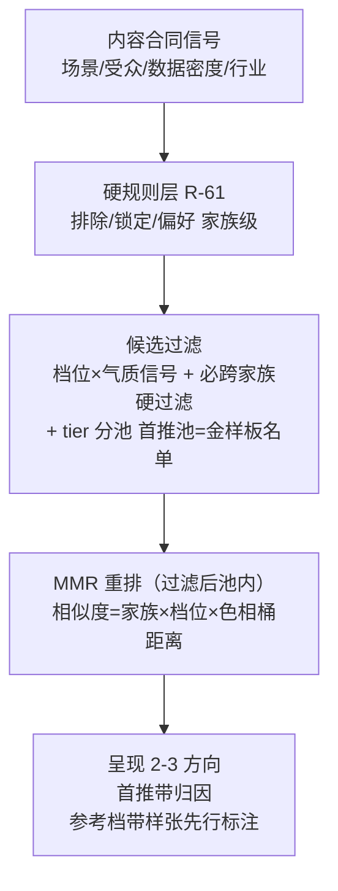

# leo-ppt-generator 风格推荐坐标系 - Plan

> ## ⚠ 对齐标注：tier 口径与目标架构相反，enrichment 前必须修正
>
> **标注日期**：2026-09-03 ｜ **对齐源**：目标架构 v4.5
> [`docs/leo-ppt-generator/architecture/style-library-target-architecture.md`](../leo-ppt-generator/architecture/style-library-target-architecture.md)（见其 §0.4、§11.2）
>
> 本方案是 `artifact_readiness: requirements-only`，因此**不是 `spec-work` 的执行入口**，风险低于
> 同批标注的 `2026-09-02-001`。但它的 tier 口径与架构**方向相反**，若在未修正的情况下被 enrich 到
> `implementation-ready`，会把一个已被架构否决的设计带进实施。
>
> ### 失效条目（逐条，均已核对本文原文）
>
> | 本文条目 | 冲突点 | 架构依据 |
> |---|---|---|
> | **KD-1**「首推必出已验证池」，口径＝`golden_style_names()` 金样板名单（当前 19 套） | **方向相反**。架构明确 `candidate` 即可默认首推，`verified` 只承担排序加权、验证标签与高保障档准入，**不作默认首推硬门槛**；默认可推池＝`candidate ∪ verified`。把首推面收窄到 19 套金样板，正是架构自 v4.1 起反复否决的「回退现状首推面」 | §11.2、§17.3 |
> | **KD-5** tier 枚举＝`builtin/reference/source` | 架构的 tier 是 `experimental/candidate/verified/deprecated`，语义是**资格等级**而非来源标签；来源属 `source.origin`（§4.3），二者不可混用。另：架构 v4.5 澄清 `stale` 是**收据状态**而非 tier | §11.2、§4.3 |
> | **KD-5**「新迁移风格默认 tier=reference」＋晋升制 | 对应关系应为：默认 `candidate`（已可首推），`verified` 需 style-level golden 绑定当前 `resolved_input_digest`。晋升语义可保留，但不得把「未出图强验证」等同于「不可首推」 | §11.2、§15.2 |
>
> ### 方向一致、可直接保留的部分
>
> **KD-2** 三轴同质坐标（家族 × 档位 × 色相桶）与架构 §8.2 的 `diversity_coordinate` 同向；
> **KD-3** 家族硬过滤保留在 MMR 之前，与架构 §8.3 漏斗顺序（hard rules → … → MMR）一致；
> **KD-4** 回填高频池先行，与架构 §15.2 的渐进富化一致。这三条无需改动。
>
> ### 修正指引
>
> 1. 把 tier 枚举与首推门整体换成架构 §11.2 口径；若确实需要 `builtin/reference/source` 这组标签，
>    改名为来源或过渡实现标签，**不要占用 `tier` 这个词**；
> 2. 金样板名单可继续作为 `verified` 的证据来源与高保障档准入依据，但不得作为默认首推的准入线；
> 3. 本方案与 `2026-09-02-001` 的重叠项（计数真值单一 owner）纪律不变，见架构 §15.1。

## Goal Capsule

- **objective**: 修复风格推荐的三类实测失败（气质错配、三套同质化、兑现落差），建立机器可执行的推荐坐标系，使「根据内容推荐 3 套合适模版」在库存持续增长下不退化。
- **product authority**: owner 于 2026-09-01 会话逐项确认——tier 分池降权（Q1）、三轴坐标家族×档位×色相桶（Q2）、高频池回填（代理最佳判断，综合确认未否决）、MMR 重排与使用信号晋升（业界调研升级轮确认）、排期在 R3-2.5 评测复绿之后。2026-09-02 四视角审查（产品/技术/风险/一致性）后的修正：保留必跨家族硬过滤（审查共识，回归保守方向）、①增补行为需求、勘察数据按实测重写——均为修正性采纳，owner 可翻案。
- **open blockers**: R3-2.5 + C1/C2/C3 已提交（e84fd53/882c446/b33aae9，工作树干净）；剩余前置＝推荐相关评测全量复绿确认（iteration-105~115 hardrule 批已过）。
- **execution profile**: leo-ppt-generator 技能包内增量——brief 字段、治理 lint、推荐合同、evals、**SKILL.md 入口锚点（BR-001 交付面）**。零路径迁移（内容修改面见 R2）。

---

## Product Contract

### Summary

在已落地的推荐漏斗（信号映射 → 硬规则 → 家族配额 → tie-break）之上建立机器可执行的推荐坐标系：档位字段 schema 化（机械推导+分层回填）、色相桶全量推导、家族硬过滤保留前提下的 MMR 三轴重排、tier 分池降权（首推必出已验证池）、新进货默认参考档+晋升制；配套推荐质量基线进 evals，并扩展既有计数真值机制至全部派生文档。

### Problem Frame

owner 实际观察到推荐的三类失败，横跨推荐链路三段：① 气质与内容场景错配；② 推荐的三套方向同质化；③ 选中的风格渲染兑现落差。2026-09-01 全量勘察与 2026-09-02 四视角审查复核，把三类失败归因到具体结构缺口：

- **档位坐标几乎全缺**。机器判定口径＝brief 头部 `variant-dimension` 标注行：全库 318 份 brief 仅 **8 份**（全部来自 C2 OfficeCLI 进货先例）；`01_通用母版/` 155 份、11 套顶层内置、02/03 目录均为 0。`references/style-library.md` 明载该维度「无专用 schema 键」。
- **同质化是分布必然**。primary 色相推导显示 blue+neutral 合计约占全库七成（具体占比随分桶阈值敏感——分桶定义由 R3 钉死）；`scripts/audit_style_families.py` 检出跨目录孪生簇（金融奢华风×银行年报风 palette 相似 0.62、党建活动风×年会庆典风 0.83、电商大促风×直播带货风 0.83），但它是只读盘点，R-62 家族配额不消费该信号，且只在 variant_of 单轴计算。
- **兑现保障与推荐池错位**。R-65 金样板只管变更回归不管推荐准入；推荐合同 `references/style-recommendation.md` 中无任何兑现能力过滤。已验证池现状＝`generate_style_gallery.py` 的 `golden_style_names()` 名单 **19 套**（11 内置+8 家族代表），磁盘画廊另有 3 个名单外孤儿目录待处置。
- **进货面与推荐面脱节**。`references/styles/00_索引/风格路由.md` 为两张手工策展速查表（快速路由 35 行+气质速查 14 行），C1/C2/C3 进货风格经 grep 证实全部不在其中——新风格可被点名，但默认推荐漏斗不可见。
- **计数口径分裂（部分已被上游修复）**。commit 882c446 已把文档计数修正为 311 可加载/294 独立可选，并引入「`_INDEX.md` 顶行为唯一真值」机制；现存四口径并存：lint 谓词 318（311 可加载+7 guizang 组件）、style-library 311、独立可选 294（311−17 变体）、`lint_style_index` 口径 279（不含 15/16 来源目录）。合法口径差异与真漂移尚无统一判定。

R3-2.5 风格体系批已提交；推荐相关评测最新批次（iteration-105~115，2026-09-01，hardrule 组已过）晚于 owner 失败观察——② 被 R-62 缓解的残余占比需以其后全量评测复核，①③ 为该批未覆盖的结构性缺口。

### Key Decisions

- **KD-1 tier 分池降权**（owner 确认）。首推必出已验证池（口径＝`golden_style_names()` 金样板名单，当前 19 套，随金样板登记同源扩张；首推池 ⊆ R-26 缩略图覆盖面，覆盖面随金样板同源扩张）。参考风格可进第二/三方向且必带「参考方向·样张先行验证」标注。弃全池平权（③ 风险保留）与硬过滤（池小说平庸三套）。**用户发起路径（点名/沿用/照图做/预设）bypass tier 语义；自定义风格保持既有优先候选序（R7），tier 只约束默认首推。**
- **KD-2 三轴同质坐标：家族 × 档位 × 色相桶**（owner 确认；审查修正：不取代家族硬约束）。档位＝明度×饱和度六分组（bw/dark/light/mixed/vivid/warm）的简称，本批坐标系仅消费其明度语义，饱和度/色温档为预留维度。依据：primary HEX 覆盖 318/318（色相桶零标注成本全量推导），背景 HEX 覆盖 183/318（档位 58% 可推导）。
- **KD-3 重排采用 MMR，但家族硬过滤保留在前**（owner 确认 MMR；审查修正硬过滤地位）。「推荐的 2-3 方向必须跨家族」是既有合同硬约束，**保留为 MMR 前置过滤**（R-62 语义不变）；MMR 只在过滤后的池内重排：迭代选 `argmax(λ·匹配分 − (1−λ)·与已选集合的最大坐标相似度)`，相似度＝离散坐标距离，λ 默认 0.7 可调，argmax 并列以风格名稳定 tie-break。业界依据：MMR 为 top-k 多样性重排标准算法（Carbonell & Goldstein 1998），确定性、零依赖。
- **KD-4 回填高频池先行**（代理最佳判断——owner 对此问未答，综合确认未否决）。范围＝11 内置 + 8 场景预设主风格 + R-66 家族主风格（8 个主家族，合计 27 份起，视子家族代表口径上探），内置 11 优先；缺失背景 HEX 者补 HEX 锚点而非补标签。回填工程约束（审查补写）：幂等（--check 模式）、基于已提交基线执行、与后续补货批文件域互斥、触及金样板登记风格时同步重建金样板并独立裁决留痕。其余存量走 lint 白名单渐进。
- **KD-5 新进货默认参考档+晋升制**（代理最佳判断，综合确认采纳）。新迁移风格默认 tier=reference；tier 枚举＝builtin/reference/source。**晋升仅授予资格，准入首推仍须满足兑现口径**（确定性渲染+金样板）；晋升资格事件＝进路由表、进场景预设、金样板通过、R-64 per-style 使用信号达标（`recommend_feedback.py` 现仅家族粒度聚合，需扩 per-style 出口）；晋升/降级审计落仓内记录（本地 records.jsonl 不跨机，需仓内快照）。
- **KD-6 排期与形态**（owner 确认；状态刷新）。R3-2.5 已提交，剩余前置＝推荐评测全量复绿；本批零路径迁移——内容修改面＝约 27-60 份 brief（回填+锚点）+ lint 基线文件 + 推荐合同与 SKILL.md 锚点行，不动任何既有文件路径。

### 推荐漏斗（重排后形态）

（漏斗各段行为条件见 Acceptance Examples；R4-R6 消费本图对应层级。）

### Requirements

**坐标与数据**

- R1. 档位（明度×饱和度六分组）是 brief 的机器可读正式字段；档位标注的机器判定口径＝brief 头部 `variant-dimension` 行（现库存 8 份）。lint 落地照 R-25/R-68 先例：档位缺失为 WARNING、新文件因不进白名单天然升 ERROR，存量白名单批量收录与基线头纪律（「不登记存量」承诺）改写于同一提交落地，此后进入只缩不涨。
- R2. 存量档位按混合策略回填：背景 HEX 可推导者（183/318）机械推导；高频池（11 内置+8 预设主风格+8 家族主风格，27 份起）人工复核优先；缺失背景 HEX 者随回填补背景 HEX 锚点。回填脚本幂等、基于已提交基线、与补货批文件域互斥；触及金样板登记风格时同步重建金样板。
- R3. 色相桶是从 primary HEX 机械推导的派生值，不落盘、不人工标注；分桶定义（HSL 阈值表+中性判据）作为脚本常量钉死并以边界 HEX 单测锁定，杜绝占比随阈值漂移。

**推荐行为**

- R4. 候选过滤消费档位信号：按内容合同气质信号（受众保守度/场景正式度/明暗偏好）与候选档位匹配，错档候选被过滤或降权（① 的行为承载，与 R-61 家族级硬规则分工互补）。
- R5. 多样性硬过滤与 MMR 重排：「必跨家族」保留为前置硬过滤（R-62 语义不变）；过滤后池内按 MMR 重排，相似度＝家族/档位/色相桶离散坐标距离——无家族坐标的风格（实测 72/318）以目录轴派生家族坐标，多标签家族距离取标签集 Jaccard；同输入逐字节确定。
- R6. tier 分池与呈现：首推必出已验证池（口径＝金样板名单，当前 19 套，随金样板登记同源扩张；首推池 ⊆ 缩略图覆盖面）；参考风格进第二/三方向必带「参考方向·样张先行验证」标注；用户发起路径（点名/沿用/照图做/预设）bypass tier 语义——无 tier 标注、无 tier 劝阻，既有一次性错配提示与选择依据记录照旧。
- R7. 用户自定义风格优先序保持：`${LEO_PPT_HOME}/styles/` 同场景自定义风格维持既有「优先列为候选+你保存过」标注与 tie-break 复用判据，tier 不约束用户发起路径。

**治理与度量**

- R8. 晋升制：新进货默认 tier=reference；晋升资格事件（进路由表/进预设/金样板通过/R-64 per-style 达标）机器可判并落仓内审计记录（含金样板判定模式——降级字节比较时如实标注）；首推准入仍须兑现口径。
- R9. 计数真值统一（代理最佳判断，治理域）：扩展 882c446 已引入的 `_INDEX.md` 顶行真值机制至全部派生文档与两套 lint 口径（318/311/294/279），区分合法口径差异（可解释共存）与真漂移（lint ERROR）。
- R10. 推荐质量基线进 evals（代理最佳判断，评测域）：覆盖 ①②③ 三类对抗样本 case；首推接受率/前三命中率统计衔接已交付的 R-51 `eval_stats`；新 judge 按 M0.1 协议交付（历史重放+反向陷阱+在线复测），首推池成员的判官侧真值来源＝金样板名单脚本输出；SKILL.md 入口锚点同步——「模版推荐与选择」不变边界增首推池/参考档标注锚点行、跨家族锚点补 MMR+档位语义（BR-001）。

### Acceptance Examples

- AE1. **Covers R1.** Given 新进货 brief 无档位字段；When 治理 lint 运行；Then 该文件因 WARNING 不在白名单而升 ERROR 被拒绝。
- AE2. **Covers R2.** Given 背景 HEX 可推导的存量风格与已提交基线；When 回填执行两次；Then 输出幂等一致，档位机械推导落字段；触及金样板登记风格时金样板同步重建且裁决留痕。
- AE3. **Covers R3.** Given 含 primary HEX 的 brief；When 色相桶推导执行；Then 桶值可查、brief 文件字节不变、lint 白名单不含它；分桶边界 HEX 单测锁定占比不随阈值漂移。
- AE4. **Covers R4, R5.** Given 答辩场景且候选池含赛博朋克系与同档位错配家族；When 候选过滤+重排执行；Then 错配被硬规则或档位信号至少其一拦截（① 闭环）。
- AE5. **Covers R5.** Given 候选池含 5 个跨 01/02/03 目录的深蓝商务系风格；When 硬过滤+MMR 重排；Then 呈现方向必跨家族且至少跨两个色相桶或档位；同输入双跑逐字节一致。
- AE6. **Covers R6.** Given 已验证池 19 套且用户未点名；When 默认推荐呈现；Then 首推 ∈ 已验证池且带归因句；第二/三方向可为参考风格且带样张先行标注；用户点名某参考风格时直行——无 tier 标注与 tier 劝阻，既有错配一次提示照旧。
- AE7. **Covers R7, R8.** Given 同场景存在用户保存风格与新进货风格；When 推荐执行；Then 自定义风格保持优先候选标注；新进货风格默认不进首推，获金样板后下次可进首推且晋升审计可查（降级判定模式如实标注）。
- AE8. **Covers R9.** Given 任一派生文档计数与 `_INDEX` 真值不符；When 计数 lint 运行；Then 真漂移 ERROR，合法口径差异（279 vs 318 等已登记口径）放行。
- AE9. **Covers R10.** Given 三类对抗样本 case 与 SKILL.md 新锚点；When evals 运行；Then 判官可判定①由档位信号/硬规则拦截、②由硬过滤+MMR 消解、③无兑现风格未进首推；M0.1 校准记录在案。

### Scope Boundaries

**Deferred for later**

- 正式度坐标（可机器判定性未验证，观察 ② 残余占比后再议）。
- manifest 全量治理、目录本体重排、来源轴 UPSTREAM 化（`docs/ideation/2026-09-01-style-template-hierarchy-ideation.html` 其余幸存方向，另批立项）。
- R-26 缩略图实施本身（属 R3 批；本批只消费其覆盖面并随金样板同源扩张）。
- 3 个金样板名单外孤儿目录的补录或清理（随 R8 晋升制裁决）。

**Outside this product's identity**

- embedding/向量粗排（R3 PRD Non-Goals 继承；零依赖分发约束下坐标+硬规则+LLM 精排是既定形态）。
- 中心化风格市场、绕过人在回路确认序列（视觉方向/样张确认）的任何自动化推荐收口。

### Dependencies / Assumptions

- **前置 blocker**：推荐相关评测全量复绿（R3-2.5 已提交，iteration-105~115 hardrule 组已过）。
- **依赖与状态**：R-65 金样板（已交付，名单脚本可查）、R-26 缩略图（已覆盖 11 内置）、R-64 反馈通道（已交付，需扩 per-style 聚合）、R-51 `eval_stats`（已交付，31 单测）、`audit_style_families.py` 相似度函数（可 import 复用）。
- **Assumptions**：①②③ 归因有效但属 R3-2.5 前观察，② 残余占比需全量评测复核；档位可从背景 HEX 可靠推导（58% 已证可行，mixed/vivid/warm 需人工档位判断）；MMR λ 初值 0.7 需 bench 调参；「视觉预览是业界标配」依据见 ideation 报告业界调研节。
- **Limitations**：owner 观察无逐案 case 记录；首推接受率无历史基线数据（R10 建立）。

### Outstanding Questions

**Deferred to Planning**

- MMR λ 默认值与 bench 调参方案。
- 计数真值承载的扩展范围（`_INDEX` 顶行机制已存在，扩至哪些派生文档与 lint 口径）。
- R-64 per-style 聚合出口形态（扩展 suggest-weights vs 新聚合脚本）与仓内审计快照方式。
- 非蓝系内置补强的选型与是否入本批（唯一保留的择优项）。

### Sources / Research

- 仓内（快照 2026-09-02，HEAD=e84fd53/882c446/b33aae9 之后干净树；数字经四视角审查独立复现）：`leo-ppt-generator/references/style-recommendation.md`（推荐合同全文）、`references/style-library.md`（311/294 口径）、`references/styles/00_索引/设计体系.md`、`references/styles/00_索引/风格路由.md`（两张速查表 35+14 行）、`scripts/lint_style_briefs.py`（briefs=318/0/0；WARNING+白名单机制）、`scripts/generate_style_gallery.py`（`golden_style_names()`=19）、`scripts/audit_style_families.py`（跨目录簇）、`scripts/style_hard_rules.py`（FAMILIES 词表，72/318 无家族坐标）、`scripts/recommend_feedback.py`（家族粒度聚合）；全量脚本实测：档位标注 8/318（头部 variant-dimension 口径）、primary HEX 318/318、背景 HEX 183/318、blue+neutral ≈七成（分桶阈值敏感，R3 钉死口径）；`docs/brainstorms/2026-08-31-005-leo-ppt-oss-fusion-r3-requirements.md`（域 H、R3-0 纪律、BR-001/002）。
- 外部（产品页/评测级证据，非源码级）：MMR——Carbonell & Goldstein 1998（CMU）、Elastic Search Labs 实践、ACM SMMR 2025；业界机制——Gamma（精选 vibe 前置选择）、Canva Magic Design（内容感知推荐）、Beautiful.ai（使用热度策展）、PowerPoint Designer（内容分析少量建议）、WPS 墨匣/AiPPT（NLP+设计推荐算法）。完整链接见 `docs/ideation/2026-09-01-style-template-hierarchy-ideation.html` 关联会话记录。
- 失效条件：全量评测显示 ② 残余占比接近零 → R5 的档位/色相轴可降级为可选；库存封库且不再进货 → R8 晋升制优先级下调；金样板名单扩张机制变更 → R6 池口径随之重定义。
