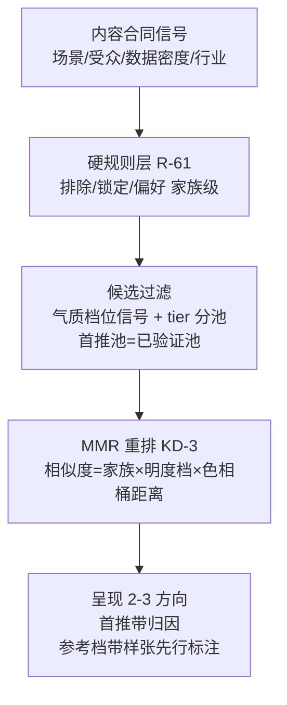

# leo-ppt-generator 风格推荐坐标系 - Plan

## Goal Capsule

- **objective**: 修复风格推荐的三类实测失败（气质错配、三套同质化、兑现落差），建立机器可执行的推荐坐标系，使「根据内容推荐 3 套合适模版」在库存持续增长下不退化。
- **product authority**: owner 于 2026-09-01 会话逐项确认——tier 分池降权（Q1）、三轴坐标家族×明度档×色相桶（Q2）、高频池回填（代理最佳判断，综合确认未否决）、MMR 重排与使用信号晋升（业界调研升级轮确认）、排期在 R3-2.5 之后。
- **open blockers**: R3-2.5 批（含 C1/C2/C3 进货，约 440 未提交文件）完成提交且推荐相关评测跑通——本批动工前置，不阻塞规划。
- **execution profile**: leo-ppt-generator 技能包内增量（brief 字段、治理 lint、推荐合同、evals），零文件迁移。

---

## Product Contract

### Summary

在已落地的推荐漏斗（信号映射 → 硬规则 → 家族配额 → tie-break）之上建立机器可执行的推荐坐标系：明度×饱和度档位 schema 化（机械推导+分层回填）、色相桶全量推导、候选重排 MMR 化（三轴坐标距离）、tier 分池降权（首推必出已验证池）、新进货默认参考档+晋升制；配套推荐质量基线进 evals，并统一全库计数真值。

### Problem Frame

owner 实际观察到推荐的三类失败，横跨推荐链路三段：① 气质与内容场景错配；② 推荐的三套方向同质化；③ 选中的风格渲染兑现落差。2026-09-01 的全量勘察把三类失败归因到具体结构缺口，而非内容信号或呈现层：

- **档位坐标几乎全缺**。明度×饱和度标注全库 318 份 brief 中仅 30 份（9%），且分布倒挂——`references/styles/03_场景用途结构/` 有 17 份，而 `01_通用母版/` 155 份与 11 套顶层内置全部为零；`references/style-library.md` 明载该维度「无专用 schema 键」，仅 C2 进货 8 份文件有头部标注先例。
- **同质化是分布必然**。primary 色相推导显示 blue 118 份（37%）+ neutral 105 份（33%）占全库 70%；跨顶层目录的同桶（色相×明度）风格对 1652 对；`scripts/audit_style_families.py` 已检出跨目录孪生簇（金融奢华风×银行年报风 palette 相似 0.62、党建活动风×年会庆典风 0.83、电商大促风×直播带货风 0.83），但它是只读盘点，R-62 家族配额不消费该信号，且配额只在 variant_of 单轴计算，拦不住跨目录三胞胎。
- **兑现保障与推荐池错位**。R-65 金样板只管变更回归不管推荐准入；R-26 缩略图明确只覆盖 11 内置而候选池是全量；推荐合同 `references/style-recommendation.md` 中无任何兑现能力过滤。
- **进货面与推荐面脱节**。`references/styles/00_索引/风格路由.md` 为 27 行手工策展表，C1/C2/C3 三批净增 68 个风格全部不在其中——新风格可被点名，但默认推荐漏斗不可见。
- **计数真值三处漂移**。lint 实测 318 份、`style-library.md` 记 273 可加载、`style-recommendation.md` 记 121 独立可选（陈旧）。

R3-2.5 风格体系批（R-61/62/63/64/65/66/68）已在工作树落地但未提交未评测；推荐相关评测最新一轮为 2026-08-29，早于其落地——即 owner 的失败观察大概率来自 R3-2.5 之前，② 可能被 R-62 部分缓解，①③ 为本批未覆盖的结构性缺口。

### Key Decisions

- **KD-1 tier 分池降权**（owner 确认）。首推必出已验证池（兑现口径＝确定性渲染路径+金样板通过，同 R-65），参考风格可进第二/三方向且必带「参考方向·样张先行验证」标注。弃全池平权（③ 风险保留）与硬过滤（早期池小致「安全但平庸的三套」）。约束：首推池 ⊆ R-26 缩略图覆盖面（视觉预览是业界标配，非可选对齐）；点名 bypass 语义不变。
- **KD-2 三轴同质坐标：家族 × 明度档 × 色相桶**（owner 确认）。取代 R-62 单轴家族配额；家族保留为坐标之一，语义不变。依据：全库 primary HEX 覆盖 318/318（色相桶零标注成本全量推导），背景 HEX 覆盖 183/318（明度档 58% 可推导）。
- **KD-3 重排算法显式采用 MMR**（业界调研升级，owner 确认）。迭代选 `argmax(λ·匹配分 − (1−λ)·与已选集合的最大坐标相似度)`；相似度＝离散坐标距离，λ 取代手工放宽序。理由：MMR 为 top-k 多样性重排的业界标准（Carbonell & Goldstein 1998），确定性、零依赖、可单测，直接消解 70% 蓝中性聚集下的边界情况。
- **KD-4 回填高频池先行**（代理最佳判断——owner 对此问未答，综合确认未否决）。范围＝11 内置 + 8 场景预设主风格 + R-66 家族主风格（约 30-60 份），内置 11 优先（它们是首推池反而全零）；缺失背景 HEX 者补 HEX 锚点而非补标签（锚点是更底层真值，顺带补全三层 token 覆盖）；其余存量走 lint 白名单渐进（371→0 的既有收敛先例）。
- **KD-5 新进货默认参考档+晋升制**。新迁移风格默认 tier=reference，不进首推；晋升为机器可判事件：进路由表、进场景预设、获得金样板、R-64 使用信号达标（业界 Beautiful.ai 的使用信号策展模式）。推荐可见性从「手工加路由行」变为「坐标可查+晋升制」。
- **KD-6 排期与形态**（owner 确认）。R3-2.5 提交+评测通过后动工（R3-0 纪律：在案债务不清零不叠新批）；本批零迁移——全部为 brief 字段、lint、脚本、合同文档的增量修改，不动任何既有文件路径。

### 推荐漏斗（重排后形态）

（漏斗各段的行为条件见 Acceptance Examples；本图与 AE 共同承载路径，不另设 Key Flows 节。）

### Requirements

**坐标与数据**

- R1. 明度×饱和度档位（bw/dark/light/mixed/vivid/warm）是 brief 的机器可读正式字段；新进货必标，缺字段即治理 lint ERROR（同 R-25/R-68「内置必填、参考渐进」模式，白名单只缩不涨）。
- R2. 存量档位按混合策略回填：背景 HEX 可推导者（183/318）机械推导；高频池（11 内置+8 预设主风格+家族主风格）人工复核优先；缺失背景 HEX 者随回填补背景 HEX 锚点。
- R3. 色相桶是从 primary HEX 机械推导的派生值，不落盘、不人工标注、不进 lint 白名单口径。

**推荐行为**

- R4. 推荐候选重排采用 MMR：相似度为家族/明度档/色相桶的离散坐标距离，λ 有默认值且可调；同输入逐字节确定，取代 R-62 单轴家族配额（家族降为坐标之一，跨家族硬约束语义保留于坐标距离）。
- R5. 首推必出自己验证池（确定性渲染路径+金样板通过口径）；参考风格进入第二/三方向时必带「参考方向·样张先行验证」标注；首推池成员必须在缩略图覆盖面内；用户点名 bypass 一切池与标注语义，直行既有四式路径。
- R6. 新进货风格默认 tier=reference；晋升已验证池由机器可判事件触发（进路由表、进场景预设、金样板通过、R-64 使用信号达标），晋升与降级均可审计。

**治理与度量**

- R7. 全库风格计数收敛为单一真值来源；`style-library.md`、`style-recommendation.md` 等文档计数与 lint 输出从其派生，漂移即 lint ERROR。
- R8. 推荐质量基线进 evals：覆盖 ① 气质错配、② 三套同质化、③ 兑现落差 三类对抗样本 case；首推接受率/前三命中率的统计口径随基线建立（与 R-51 统计工具衔接）。

### Acceptance Examples

- AE1. **Covers R1.** Given 新进货 brief 无档位字段；When 治理 lint 运行；Then ERROR 拒绝且新文件不得进白名单。
- AE2. **Covers R2.** Given 背景 HEX 可推导的存量风格；When 回填执行；Then 档位机械推导落字段，高频池人工复核记录在案；缺失者补的是背景 HEX 锚点而非手写标签。
- AE3. **Covers R4.** Given 候选池含 5 个跨 01/02/03 目录的深蓝商务系风格；When MMR 重排；Then 呈现的 2-3 方向至少跨两个色相桶或明度档；同输入双跑输出逐字节一致。
- AE4. **Covers R5.** Given 已验证池仅 11 内置且用户未点名；When 默认推荐呈现；Then 首推 ∈ 已验证池且带归因句；第二/三方向可为参考风格且带样张先行标注；用户点名某参考风格时直行、无标注无劝阻。
- AE5. **Covers R5, R6.** Given 某新进货风格尚未满足任何晋升条件；When 推荐执行；Then 该风格不进首推；其完成金样板后下次推荐可进首推，晋升事件在审计记录中可查。
- AE6. **Covers R7.** Given 三处文档与 lint 各自维护计数；When 计数真值统一后运行 lint；Then 任一文档计数与真值不一致即 ERROR。
- AE7. **Covers R8.** Given 三类对抗样本（答辩场景含赛博朋克系候选、深蓝聚集候选池、无金样板风格竞争首推）；When evals 运行；Then 判官可判定错配被硬规则拦截、同质被 MMR 消解、无兑现风格未进首推。

### Scope Boundaries

**Deferred for later**

- 正式度坐标（可机器判定性未验证，观察 ② 残余占比后再议）。
- 定向补 2-3 套非蓝系已验证内置（缓解首推池色彩偏斜的可选子项，随本批择优或后置）。
- manifest 全量治理、目录本体重排、来源轴 UPSTREAM 化（`docs/ideation/2026-09-01-style-template-hierarchy-ideation.html` 其余幸存方向，另批立项）。
- R-26 缩略图实施本身（属 R3 批；本批只消费其覆盖面作为硬约束）。

**Outside this product's identity**

- embedding/向量粗排（R3 PRD Non-Goals 继承；零依赖分发约束下坐标+硬规则+LLM 精排是既定形态）。
- 中心化风格市场、绕过人在回路确认序列（视觉方向/样张确认）的任何自动化推荐收口。

### Dependencies / Assumptions

- **前置 blocker**：R3-2.5 + C1/C2/C3 批提交、推荐评测跑通（R3-0 纪律出口条件）。
- **依赖**：R-65 金样板口径（已验证池定义）、R-26 缩略图（首推池覆盖约束）、R-64 反馈通道（晋升信号）、`audit_style_families.py` 相似度输出（坐标距离辅助）。
- **Assumptions**：①②③ 归因有效但属 pre-R3-2.5 观察，② 残余占比需 R3-2.5 评测后复核；明度档可从背景 HEX 可靠推导（58% 已证可行，mixed/vivid/warm 需人工档位判断）；MMR λ 初值需 bench 调参。
- **Limitations**：owner 观察无逐案 case 记录；首推接受率无历史基线数据（本批 R8 建立）。

### Outstanding Questions

**Deferred to Planning**

- MMR λ 默认值与 bench 调参方案。
- 计数真值的承载形态（`_INDEX.md` 机读化 vs lint 内计数函数单源）。
- R8 统计口径与 R-51 `eval_stats` 工具的衔接方式。
- 非蓝系内置补强的选型与是否入本批。

### Sources / Research

- 仓内（快照 2026-09-01，工作树含 R3-2.5 未提交修改——数据为 dirty 状态实测）：`leo-ppt-generator/references/style-recommendation.md`（推荐合同全文）、`references/style-library.md`、`references/styles/00_索引/设计体系.md`、`references/styles/00_索引/风格路由.md`、`scripts/lint_style_briefs.py`（briefs=318/0/0）、`scripts/audit_style_families.py`（10 跨目录簇）、`scripts/style_hard_rules.py`；全量脚本实测：档位标注 30/318、primary HEX 318/318、背景 HEX 183/318、blue 37%+neutral 33%、跨目录同桶对 1652；`docs/brainstorms/2026-08-31-005-leo-ppt-oss-fusion-r3-requirements.md`（域 H 与 R3-0 纪律）。
- 外部（产品页/评测级证据，非源码级）：MMR——Carbonell & Goldstein 1998（CMU）、Elastic Search Labs 实践、ACM SMMR 2025；业界机制——Gamma（精选 vibe 前置选择）、Canva Magic Design（内容感知推荐）、Beautiful.ai（使用热度策展）、PowerPoint Designer（内容分析少量建议）、WPS 墨匣/AiPPT（NLP+设计推荐算法）。完整链接见 `docs/ideation/2026-09-01-style-template-hierarchy-ideation.html` 关联会话记录。
- 失效条件：R3-2.5 评测显示 ② 残余占比接近零 → R4 的明度/色相轴可降级为可选；库存封库且不再进货 → R6 晋升制优先级下调。
