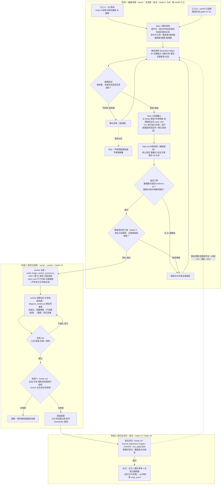

# evidence-first-writing 文章配图合同 - Plan

## Goal Capsule

- **目标**：为 evidence-first-writing 增加文章配图能力。不新增管线节点，以「配图合同」独立 reference 形态落地三步子流程（图位规划 → 风格确认 → 内容规格 + 设计产出）与四个门禁，挂接既有节点钩子（Node 8 决策、Node 5/12 事实、Node 13 制作与授权），并以机制吸收方式复用 leo-ppt-generator 的确定性渲染资产（零运行时依赖）。
- **推荐路径**：illustration-contract.md（合同真值源）→ vendor 吸收 diagram_render.py → 图位清单 schema + worker brief 构建脚本 → 管线接线（≤6 行）→ eval 断言 ×2。
- **权威层级**：本轮设计对话为最高输入（用户确认三步骨架、机制吸收方向、worker 架构）；排版合同 plan（2026-08-31-005）为 reference 形态先例。
- **决策焦点**：retrofit（已成稿补图）入口的 operation 枚举决策（D1，gated）；worker 形态是否升级宿主原生 subagent（D2，缓议）。
- **验证焦点**：新增 eval case 首跑基线 + 既有单测/评测零回归 + 吸收来源登记完备性检查。
- **最大风险/边界**：兄弟技能运行时依赖红线（AGENTS.md 治理条款，只能机制吸收）；「配图感」本身成为新模板（删图测试门禁拦截）；膨胀红线（新 reference ×1、脚本净增 ×2、eval case ≤2、SKILL.md 接线净增 ≤6 行）。
- **停止条件**：若某类图必须依赖非确定性图像模型才能完成结构表达——该类型降级为登记判据（同 px 阈值的处理形态），不硬造。

---

## Product Contract

### Summary

以「一个 owner + 两个上游钩 + 一份合同」为骨架：配图合同的编辑决策挂 Node 8（结构与素材编排），事实责任延伸 Node 5/12 既有条款，制作/渠道适配/授权挂 Node 13（发布包），全部细则收在新增 `references/illustration-contract.md` 真值源中，管线文件只挂引用钩。

### Problem Frame

配图在 skill 中已有四个散落钩子，但没有生产节点与合同：

- `editorial-pipeline.md` Node 13 授权句「发布、外发、配图、HTML 和平台操作需要用户明确授权」——全管线唯一把配图当事项的地方，只有授权语义，无生产语义；
- Node 14 复盘指标「与具体标题/正文/封面版本绑定」——封面已被视为版本化交付物；
- Node 9 首屏合同只管正文前三行，公众号信息流实际首屏的「封面+标题」不在合同内；
- `tool-selection.md` 登记 md2wechat-skill 的封面配图链路（BUSL，只登记不复制）。

即骨架已留桩，缺的是「谁决定图、谁产图、图的事实责任」的合同。同时存在两个外部约束：leo-ppt-generator 的 description 明确排除「单张配图/封面/图表素材」用例；AGENTS.md 禁止兄弟技能运行时依赖——复用只能走仓库既有「机制吸收 + 来源登记」路径（排版合同从 xiahu-wechat-format 吸收的同款模式）。

### Requirements

- **R1. 配图合同本体（三步子流程）**：
  - Step 1 图位规划：逐节问「纯文字完成这节的读者任务，成本是否过高」；命中模式才立项——复杂机制/流程 → 概念图，并列结构 → 结构图，数据主张 → 数据图，操作步骤 → 截图，记忆锚点 → 情绪图；
  - Step 2 风格确认：从 article_family、渠道、声音档案、既有品牌规范派生 style card（3-5 条可执行约束：色板、图形语言、图表风格、信息密度）；
  - Step 3 内容规格 + 设计产出：内容规格（核心信息一句话、数据点、标注文案、图注、alt 文本）是编辑责任；设计产出（版式、色彩、尺寸、生成提示词 / diagram.json / SVG / 截图采集）是发布责任。
- **R2. 图位清单（illustration ledger）**：每张图记录 `{ID, 位置锚点, 读者任务, 类型, 证据/素材来源, 状态}`；数据图的证据来源必须为证据账本 evidence ID；仿证据账本/金句卡片「注明兑现位置」的可审计形态。
- **R3. 四门禁**：
  - 事实门禁：数据图逐点可指回证据账本（evidence_risk=high 时逐点核对）；截图等同引语，不得摆拍伪造；正文改稿后图随文回归（Node 12 延伸条款，factual_regression 块新增 images 字段）；
  - 删图测试：拿掉该图，若所在节的读者任务不受实质损伤，判为装饰图，删；不设数量配额，设通过率；
  - 情绪真实性：情绪图内容须过 Node 7 既有门禁——命名读者已有感受合法，制造新情绪（如库存照片诱发本不存在的焦虑）按操纵处理；
  - 授权与版权：生成、外发、图库采购过 Node 13 既有授权句；使用他人图片核对许可证（沿用 md2wechat「只登记不复制」纪律）。
- **R4. 管线接线**：Node 8 挂图位规划钩（一句 + 引用）；Node 12 挂图回归条款；Node 13 落制作/渠道适配（公众号封面比例、知乎、Newsletter 图宽）；Node 9 首屏合同补一句「折叠线渠道的封面图属于首屏承诺的一部分」；`copy_proof` 既有「无障碍」覆盖 alt 文本检查；`layout-contract.md` 登记图注/图密度条款（保持其「排版 lint 真值源」地位）。
- **R5. 入口模式**：full 管线内嵌（Node 8 期决策图位、Node 13 期制作）＋ retrofit 独立入口（已成稿补图，从正文直接进入 Step 1）——retrofit 的路由形态 gated on D1。
- **R6. 能力复用（机制吸收，零运行时依赖）**：vendor 复制 `diagram_render.py`（单文件、Pillow 确定性渲染 diagram.json→PNG、中文字体回退、同输入逐字节确定）；吸收色板池机制（chart_palette_pool 思想）、风格 brief 字段结构思想（可 lint 的结构化风格而非自然语言）、视觉 QA 度量思想（visual_qa / validate_visual_measure）。全部带来源 + 许可证 + 快照标注。
- **R7. worker 架构**：切分线画在内容规格之后——Step 1/2 与内容规格留在主流程（依赖证据账本、声音档案、全文结构，拆出去就丢上下文）；逐图设计与渲染走 worker 派发（脚本从图位清单 JSON 构建 worker brief：图 ID、类型、内容规格、style card、尺寸约束、证据摘录，不含全文）；worker 产出回主流程过事实回归与授权门；worker 无外发/写权限（同「独立 reviewer 只审授权范围」纪律）。
- **R8. 治理**：来源 + 许可证 + 快照 2026-09-05 标注；问询纪律不变（style card 无规范时声明有界假设、不新增问询）；渠道或用户给出明确视觉规范时一律从其规范（同排版合同第 0 条）；CHANGELOG 同步。

### Scope Boundaries

**非目标**：调用 leo-ppt-generator skill 本体（其 description 自排除单张配图用例）；建立兄弟技能运行时依赖（AGENTS.md 禁令）；自建图像生成模型管线或图库；首版做宿主原生 subagent 定义（无先例，需过 spec-first 镜像）；数据图表的渲染侧强制（登记形态，同 px 阈值先例）。

**Deferred to Follow-Up Work**：worker 升级宿主原生 subagent（gated on token 压力实测）；`illustrate` 独立 operation 升格（gated on retrofit 需求频率）；渲染器中立 SVG 管线（`rasterize_svg.mjs` 形态，待图类型需求证实）。

---

## 执行流程图

阅读注记：

1. **full 模式的阶段错位**：阶段一在 Node 8 期完成图位立项，风格确认与内容规格可在编辑期并行完成；阶段二、三在 Node 13/12 期执行——即配图制作是发布包装的一部分，不阻塞正文起草。
2. **retrofit 模式**三阶段连续执行，从正文直接进入 Step 1（路由形态 gated on D1）。
3. **chat 交付**（无发布计划）默认止步于阶段一产物（图位清单 + 内容规格），不进入渲染与生成；事实与授权门禁不因交付场景放宽（同管线总则）。
4. 三个回环各有 owner：删图测试回环归编辑（R1/R2 → L1）、视觉 QA 回环归 worker（QA → W1）、事实回归回环按错误归属返回（内容错误回 S3、渲染错误回 W1），对应管线「返回拥有该错误的节点，不用润色遮掩」总则。

---

## Planning Contract

### Key Technical Decisions

- **KTD1. 不新增管线节点，配图合同为独立 reference 真值源**：管线已用「合同文件 + 节点挂引用钩」模式承接横切关注面（layout-contract 先例）；把三步细则写进 editorial-pipeline.md 会混责，新建第 15 个节点则破坏既有 depth 裁剪表。(session-settled: 对话确认)
- **KTD2. 图位先于风格（顺序对调）**：用户原始顺序为风格 → 图位 → 设计；调整为图位 → 风格 → 设计。依据是 skill 自己的排序先例——Node 9 明确规定标题「在 thesis、证据和结构稳定后再设计」（内容决策先于呈现决策）。图位决定图类型集合，风格合同必须覆盖全部所需类型；先锁风格会遇到「手绘风锁死但此处必须精确数据图」的冲突，反序无代价。
- **KTD3. Step 3 拆两层，归属不同责任主体**：内容规格是编辑责任（随图位清单走、数据来自证据账本），设计产出是发布责任（Node 13）。不拆的后果是设计感侵蚀内容准确——数据图截断坐标轴在本 skill 等于「超出证据的表述」。
- **KTD4. 只机制吸收，不调 skill、不建运行时依赖**：两条硬约束——leo-ppt-generator description 明确「不要用于……单张配图/封面/图表素材」；AGENTS.md「不要在兄弟技能之间建立运行时依赖」。同仓库同许可证（MIT）vendor 复制无法律障碍，只有所有权边界需登记声明；不为两三个脚本做 AGENTS.md 级共享契约声明。
- **KTD5. worker-prompt 模式先行，非 subagent**：两 skill 的 agents/openai.yaml 均仅接口元数据，仓库无 subagent 先例；仿 `build-page-worker-prompt.py`（page_jobs.json → 隔离 prompt）形态宿主无关；token 压力实测后再考虑升级。
- **KTD6. 删图测试仿删句测试**：判据形态直接复用 chinese-editorial-protocol 的删句测试先例（拿掉后全文是否受损），回答「到底要几张图」——不设数量配额，设通过率；防止配图本身成为新模板。
- **KTD7. 金句先例贯穿**：论点压缩句在编辑期产生打磨、Node 13 打包成卡片并披露兑现位置——配图完全同构（图位清单编辑期产生、制作发布期完成、内容承诺在正文有兑现位置），四门禁与 ledger 字段均按此模式设计。

### 与既有合同的一致性对照

| 配图新条款 | 延伸的既有合同 | 一致性 |
|---|---|---|
| 图位规划的读者任务判据 | Node 8「每节只承担一个读者任务」「删除有趣但不服务主线的材料」 | 同一纪律向图素材延伸 |
| 删图测试 | 删句测试（chinese-editorial-protocol） | 同构判据 |
| 数据图锚定账本 | Node 5 claim-to-source 账本 | 图内数字 = 可核查 claim |
| 图随文回归 | Node 12 factual_regression 块 | 新增 images 字段，语义不变 |
| 情绪图真实性 | Node 7 情绪真实性门禁 | 图是情绪制造高危通道，门禁前移适用 |
| 制作/外发授权 | Node 13 既有授权句 | 既有句已含「配图」，补生产语义 |
| alt 文本检查 | Node 11 copy_proof「无障碍」 | 既有职责自然覆盖 |
| style card 从规范派生 | 排版合同「渠道或用户给出明确规范时一律从其规范」 | 同款优先级条款 |
| 兑现位置披露 | 金句卡片披露形态 | 同构 |

### Evidence & Limitations

- 机制证据：diagram_render.py 源码核验（单文件自包含、确定性、退出码 0/2/3）；build-page-worker-prompt.py 源码核验（page_jobs.json → worker prompt 模式）；layout-contract plan 与成品（reference 形态先例）。
- 许可证：diagram_render.py 为仓库内自有代码（批次 3-G，无上游依赖），同仓库 vendor 复制仅涉所有权边界；chart-palette-pool 吸收的是机制思想，落实现时重新核对来源。
- 限制：视觉 QA 度量首版不建脚本（登记思想进合同，防止膨胀）；eval 环境措辞漂移总则适用；retrofit 入口未定（D1）前 U5 不实施。

---

## Implementation Units

### U1. illustration-contract.md 合同真值源

- **Goal**：配图合同的唯一真值源文档。
- **Requirements**：R1、R2、R3、R7 合同侧、R8。
- **Files**：`evidence-first-writing/references/illustration-contract.md`（新增）。
- **Approach**：六节——①三步子流程（含顺序依据与每步输入/动作/产物）；②图位清单 schema 与字段枚举；③四门禁条款；④worker 派发合同（brief 字段、权限边界、回归回流）；⑤渠道适配登记（公众号封面比例、知乎、Newsletter 图宽，登记形态）；⑥来源与许可证标注。净增 ≤90 行。
- **Test scenarios**：人工核对每条门禁在既有合同有出处（对照表成立）；rg 检查来源标注齐全。
- **Verification**：行数预算内；与 layout-contract 无职责重叠（排版归排版、配图归配图）。

### U2. diagram_render.py vendor 吸收

- **Goal**：结构类配图（流程图/结构图）的确定性渲染通道。
- **Requirements**：R6。
- **Files**：`evidence-first-writing/scripts/diagram_render.py`（vendor 复制 + 头部来源登记注释）；吸收记录入合同第⑥节。
- **Approach**：逐字节复制（同仓库自有代码，无许可证障碍）；头部加来源登记（源路径、快照日期 2026-09-05、吸收理由：单文件自包含、确定性、零新增依赖）；不做接口改动。
- **Test scenarios**：同输入渲染两次哈希一致（确定性）；缺字体环境回退不崩溃。
- **Verification**：`python3 scripts/diagram_render.py <fixture.json> out.png` 退出码 0；`git diff` 确认除头部注释外零改动。

### U3. 图位清单 schema + worker brief 构建脚本

- **Goal**：图位清单的可机读形态与 worker 派发的确定性入口。
- **Requirements**：R2、R7。
- **Files**：`evidence-first-writing/scripts/build_image_worker_prompt.py`（新增，仿 build-page-worker-prompt 形态）；schema 内嵌合同第②节。
- **Approach**：输入 illustration ledger JSON，输出单图 worker prompt（图 ID、类型、内容规格、style card、尺寸约束、证据摘录；显式不含全文与作者会话）；数据图缺 evidence ID 时退出码 2 拒绝构建。
- **Test scenarios**：数据图无 evidence ID 被拒；brief 输出不含正文全文；同 ledger 构建结果确定。
- **Verification**：单测覆盖拒绝分支与确定性；`python3 -m unittest discover` 零回归。

### U4. 管线接线

- **Goal**：既有节点挂引用钩，不混入细则。
- **Requirements**：R4。
- **Files**：`references/editorial-pipeline.md`（Node 8/9/12/13 各 ≤2 行）、`SKILL.md`（条件加载句 ≤3 行）、`references/workflow-contract.md`（产物清单 +1 行）、`references/layout-contract.md`（图注条款登记）。
- **Approach**：全部为「运行 X 时读取 illustration-contract.md」式引用钩 + Node 12 factual_regression 块加 `images: checked | not_applicable` 字段；Node 13 授权句后补一句生产落点。
- **Test scenarios**：rg 验证接线句均指向合同文件；SKILL.md 净增 ≤6 行。
- **Verification**：`git diff --check` 干净；既有 eval 全量重跑零回归。

### U5. retrofit 入口路由（gated on D1）

- **Goal**：已成稿补图的独立请求路径。
- **Requirements**：R5。
- **Files**：gated——D1 选 B 时仅 SKILL.md 收窄说明 ≤1 行；D1 选 A 时另改 `references/intent-routing.md` 枚举。
- **Approach**：见 D1；未裁决前不实施。
- **Test scenarios**：「给这篇已写完的文章补配图」请求正确路由且不强制 full 流程。
- **Verification**：新增路由 eval 断言（若 D1=A）。

### U6. eval 断言

- **Goal**：门禁行为的机器检查。
- **Requirements**：R3 行为侧。
- **Files**：`evals/`（case ≤2）。
- **Approach**：case A 装饰图拒绝（给一篇各节均可纯文字低成本完成的短文要求配图，断言产出为空清单或明确拒绝 + 删图测试依据）；case B 数据图锚账本（含数字主张的文章，断言每张数据图带 evidence ID、无 ID 时降级或拒绝）。判官用否定感知匹配（对「不会：- …」类表述过滤，沿用仓库评测纪律）。
- **Test scenarios**：即 case 本身。
- **Verification**：`skill-up run evals/eval.yaml` 通过；既有 case 零回归。

---

## Open Decisions

- **D1. retrofit 入口形态（阻塞 U5）**：
  - 方案 A：`intent-routing.md` operation 枚举新增 `illustrate`（改动枚举合同 + SKILL.md operation 列表 + 跨族 operation 说明）；
  - 方案 B：路由到最近生命周期 `revise` 并声明收窄假设（零枚举改动，完全符合 intent-routing.md「枚举之外不存在合法 operation 值……回到最近的生命周期行」的既有规则）；
  - **建议 B 先行**（零合同改动、先探需求频率），retrofit 请求高频后再升格 A。
- **D2. worker 是否升级宿主原生 subagent**：建议 worker-prompt 模式实测 token/上下文压力后再议；升级需过 spec-first 镜像流程，当前无先例。
