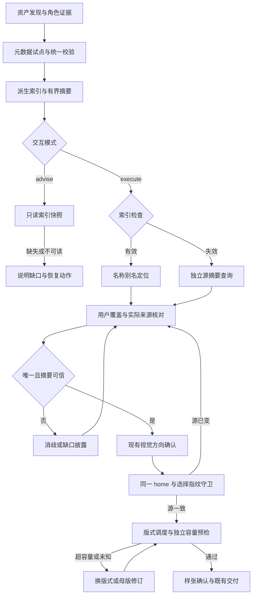

# PPT 风格模板治理、索引与执行接入统一方案

本文件是下列两份方案合并后的唯一当前实施入口。旧迁移方案保留原路径作为历史记录，生命周期改为 `superseded`；不再并行实施旧 Phase 0–3。

- 被吸收来源：[风格库结构分层重构方案](2026-09-02-001-refactor-leo-ppt-style-library-restructure-plan.md)。
- 本文件此前的索引方案原位升级，路径不变。
- 长期方向：[风格库目标架构](../leo-ppt-generator/architecture/style-library-target-architecture.md) 保持独立；其中关于旧计划状态的描述是历史快照，当前计划状态以各文件 frontmatter 为准。
- 实施结果与现场验收：[风格索引实施验收](../leo-ppt-generator/style-index-implementation-verification.md)。本方案正文保留设计期合同与历史审查说明，当前验证以该报告为准。

## Goal Capsule

**目标：** 模板管理做到收得全、分得清、改得动；执行时做到找得到、核得准、用得上。
**推荐路径：** brief 保持人工维护真值，生成紧凑索引与候选摘要；执行时核对实际用户/随包来源，再经独立容量预检和现有样张门交付。
**本期交付：** 完整资产账本、最小资产状态模型、兼容的元数据校验与有限回填、名称/别名与分面索引、作用域核对、执行期消费和检索回归。`implementation-ready` 仅覆盖本期 U0–U6，依赖顺序见 Implementation Units。
**后续目标：** 稳定身份、类型化语义推荐、MMR、多平面 catalog 和组合收据遵循目标架构 L1/L2，尚不在本期实施范围。
**决策与验证重点：** 不漏新模板、不误合并变体、不把 pool 冒充可执行风格、不静默处理歧义；推荐理由能回到真实字段；内置索引和用户覆盖的实际加载对象一致；元数据不得污染最终图片 prompt。
**最大边界：** 当前目标架构 v4.6 为 draft，允许先行 L0 与 L1 前置地基，但 L1a 起须先满足该架构的重新冻结条件。本方案不宣称其已经冻结。
**执行与退出：** 本轮仅改方案和变更记录。后续实施由 `spec-work` 拥有；遇到身份迁移、超出本方案角色兼容矩阵的候选资格改变，或消费者无法兼容时停止扩大范围，返回方案修订。无提交、推送或发布授权。

---

## Product Contract

### Summary

用户最新明确的核心目标是“提升 style 模板管理，以及执行流程中的精准索引推荐”。前版围绕风险分档、通用证据图和演讲结果搭建的主线偏离此目标，本版已撤出这些主动实施要求。
本方案优先解决资产进入库后无法稳定进入检索和推荐链的问题。精准包含名称解析正确、分类入口完整、场景判断有依据、版式承载可核验四层，不能用模板总数或生成文件数替代。

### Problem Frame

| 当前证据 | 对用户的影响 | 本期处理 |
|---|---|---|
| `styles.py` 接受任意可解析 JSON 块，`lint_style_briefs.py` 另要求 `style_name`，清单又有目录白名单 | “能列出”“是模板”“已验证”不是同一集合，数量容易混用 | 统一扫描账本，分别给出资产角色、可加载兼容集合和完整 brief 集合 |
| `capability_manifest.py` 与 `lint_style_index.py` 各维护目录口径 | 来源批次新增后可能只被部分入口计入 | 一个发现与分类 owner，生成所有计数和检索视图 |
| `style_hard_rules.py` 的 `FAMILIES` 和 gallery 代表表按名称硬编码 | 改名或新增后可能静默漏出规则与预览集合 | 成员存在性检查，已确认 family 关系回到 brief |
| `style-recommendation.md` 有候选规则，但 CLI 主要提供 list/load/render/layouts | Agent 需要在多个长文档间自行拼接检索结果 | 用生成索引精确定位，继续由现有合同负责语义推荐 |
| `suggest_layout.py` 和 layout sidecar 已有角色、容量、复用评分 | 风格好看仍可能装不下某页内容 | 串接 deck 风格检索与 page 版式核验，不新建评分器 |
| 参考池文件携带完整 brief，当前内容嗅探可能把 pool 当作普通风格 | 池代表可能进入 `style list`、`load` 或 compose，执行语义不稳定 | 本期增加最小角色状态和显式 legacy 兼容规则，禁止静默改变既有行为 |
| `styles.py` 按用户目录同名文件优先于随包风格 | 索引摘要可能描述内置文件，实际生成却使用用户覆盖 | 查询确认实际 scope、path 和 hash，再进入样张门 |

以上为当前源码观察；未运行完整库审计，历史计划中的风格数、覆盖率与质量结论均不作为本轮实测值。

### Requirements

需求编号保持追踪性：R1、R3–R6 的旧版任务分档、新增结果字段、表示路由、通用证据图和全流程遥测已退出本期，编号不复用。R2、R7–R12 收敛到风格主题，现行需求沿用 R13–R20；U-ID 保持稳定，不因执行顺序调整而重编号。

| ID | 本期要求 | 来源 |
|---|---|---|
| R2 | 保持 Gate 0、数据分级、点名/参考图/推荐优先序、确认点、worker 与交付门的既有语义 | 当前 Skill 合同 |
| R7 | 当前有效名称、变体、用户自定义风格和已冻结 run 继续可用；索引更新不自动改已选风格 | 当前源行为 |
| R8 | 分开报告索引完整性、检索正确性、推荐相关度和实际样张效果；不同证据不相互替代 | 证据约束 |
| R9 | 已确认的来源、分类等人工维护事实写入 brief JSON；可选字段经兼容 L0 profile 校验；catalog、计数、索引和诊断只从源派生，不反向写回事实 | 合并旧 R2/R3 + 目标架构 §4/§5/§15 |
| R10 | 完整资产账本区分风格、变体、版式、轴规范、规则、参考池；来源、family、别名与缺失状态可查 | 用户目标 + 目标架构 L0 |
| R11 | 名称/别名精确定位、分面浏览、歧义消解和无匹配出口明确；本期不把词法索引声称为语义排序引擎 | 用户目标 |
| R12 | 新增、修订模板须校验类型、成员引用、变体关系、适用版式与索引同步；缺预览与结构失败分别表达 | 用户目标 + 现有治理 |
| R13 | 推荐链先定位 deck 风格，再用既有版式调度核验逐页角色、容量和复用约束，按既有样张门确认 | 用户目标 + 现有执行合同 |
| R14 | Agent 按需接收候选摘要，选定后才加载完整 brief；执行期工具可为少量候选读取实际源并返回摘要，用户全文不进入全局索引；禁止 Agent 全库预加载 | 当前按需读取合同的有界接线 |
| R15 | 用固定查询集检验点名、别名、长尾、复合场景、硬规则、用户覆盖和版式不匹配 | 本期验证设计 |
| R16 | 同名、别名、变体、family/golden 成员和本地链接逐项检查；任何移动或身份变更须另有迁移方案，不把 stem 当长期身份 | 合并旧 R5/R6/KTD5 |
| R17 | 只回填本方案明确列出的内置试点，其他存量只读盘点；源事实不明时保留 unknown/absent，并保证未富化模板仍可达 | 合并旧 U0.1 的分批治理 |
| R18 | 每个条目区分资产角色、存储作用域、摘要覆盖度和带证明范围的验证状态；可执行性与角色分别表达，pool 不以普通 style 身份出现 | 目标架构 §2、§10、§11 + 本期兼容矩阵 |
| R19 | 候选摘要与实际加载使用同一 home、来源、内容口径；选定后源变化须停止使用旧选择并重新核对；已冻结产物不自动重做，未完成 run 变化先走现有修订与样张门 | 当前 `styles.py` 优先序 + 交付边界 |
| R20 | 将检索精度、资格精度、语义精度分开验收；本期只对前两类设硬门，语义精度仅建立后续标注接口 | 本期范围收敛 |

### Scope Boundaries

本期覆盖目标架构 L0 的模板治理与最小索引地基，以及既有推荐流程的消费接线。沿用四条 Route，不改图片式/可编辑/hybrid 的能力承诺，不搬目录、不铸 `style_id`、不启用许可 enforcing，也不新建通用 `style_registry.py` 或 `style_recommend.py`。本期采用加性、可选的 L0 元数据校验，保留既有视觉字段与缺字段的旧 brief；回填严格限于 U5。文件位置和目录名只可记录为物理事实或待审线索，不能自动成为来源许可或语义分类真值。资产状态只落最小四维，不实现完整 tier 或 readiness 推导。

**后续工作及触发条件：**

- 稳定 ID、AssetResolver、v2 schema、typed query：归属 L1a–L1d；目标架构重新冻结并有完整消费者迁移计划后实施，不以临时路径键冒充稳定身份。
- 语义特征富化、相关度模型、MMR 和证据置信排序：归属 L1d/L2；先定义词表、请求级覆盖与标注集，再调整算法。
- 风格级完整视觉验证、跨项目反馈和权重学习：沿用既有验证/反馈 owner，后续独立计划落实；缺图不得一次性清空现有候选。
- 通用风险分档、演讲 ±10% 指标、业务效果实验、证据图、Provider 新增与全库物理重排均不纳入本期 DoD。
- 稳定 `style_id`、AssetResolver、完整 v2 schema、语义 ranker、MMR 和 pool 晋升不纳入本期 DoD。

### User Flows

| 场景 | 预期流程 | 不允许的行为 |
|---|---|---|
| 点名“瑞士网格风” | 名称索引命中 → 核对 source → 读该 brief → 现有 render 与样张 | 改成得分更高的别的风格 |
| 点名“terminal”等共享别名 | 列出全部命中及区别 → 在既有视觉方向门消歧 | 按遍历顺序取第一项 |
| “董事会经营复盘，数据多” | 分面检索 → 现有规则过滤 → Agent 给有依据的候选 → 逐页容量核验 | 声称存在尚未实现的确定性语义得分 |
| 用户目录存在同名风格 | 索引候选标明 builtin/user；实际 load 后核对 scope/path/hash，再进入样张 | 用 builtin 摘要掩盖 user 覆盖 |
| 点名参考池代表 | 先说明 pool 角色；已有合法完整 brief 的池代表沿用显式兼容路径，其他池只浏览成员 | 将池代表标为普通已验证风格，或把无完整 brief 的 pool 送入 compose |
| “像这张参考图” | 优先参考图路径 → 提取视觉系统 → 样张并排比对 | 强制先选库内模板 |
| “跟上次一样” | 验证现有用户风格/已确认基线 → 沿用；找不到则诚实返回候选 | 假装找到历史锁定记录 |
| 已选风格但数据页超容量 | 用真实 layout ID 换型或回母版减内容 → 重验 | 缩字、截断、编造版式或整套换风格 |

### Acceptance Examples

- AE1. 一个新来源目录中的完整 brief 加入后，扫描账本、计数、名称索引均出现该文件；规则或 JSON 示例被分类而不混入可推荐风格。
- AE2. 两个风格共享别名时，索引保留两者；执行期请求返回差异并等消歧；精确点名现有变体仍加载该变体，不静默改为主风格。
- AE3. 缺少 golden 的有效风格仍可被浏览、点名和按现有合同推荐，但不得标注“已验证”；命名表引用不存在文件则产生具体治理错误。
- AE4. 对已有冻结 deck 仅添加治理元数据或重建索引，最终逐页图片 prompt 不变；版式容量失败仍走原有返工路径。
- AE5. 没有可依据元数据推荐的候选时，给出分面浏览/点名入口与覆盖限制，不能以空结果终止视觉方向确认，也不能凑齐不合适的候选。
- AE6. 用户目录中的同名模板具有不同颜色和布局时，候选卡、实际 render 使用同一 user 文件；若摘要后文件变化，返回选择失效并重核对。缺少用户版式绑定时不继承同名内置绑定。
- AE7. 携带完整 brief 的池代表仍标 asset_role=pool，普通 style 分面不混入它；显式兼容调用与普通推荐分开记账。无完整 brief 的池只可浏览，缺 golden 不影响普通有效 style 的可达性。
- AE8. 整个 generated 目录缺失或根索引生成段损坏时，advise 不运行脚本、不读取坏生成段，只给缺口与恢复动作；execute 使用独立源读取入口，准确消歧而不改写安装目录。
- AE9. 角色和节奏分很高但文字容量硬超的页面不得因调度器 decision=auto 而通过；必须在容量检查通过并完成样张确认后生产。

### Success Criteria

本期硬目标：固定资产集合逐文件分类率 100%；在声明集合内名称和别名索引覆盖 100%；歧义 fixture 静默误选为 0；新增悬空引用为 0；治理元数据进入最终 prompt 的泄漏为 0。这里的 100% 仅指已检查的集合与用例。
本期硬门分两类：检索正确性（名称/别名集合/长尾/消歧）和请求资格正确性（按角色与兼容路径分离、来源一致、现有硬规则、版式引用及容量）。各固定用例全通过；合法点名 override、池代表显式兼容和名称未解析分别统计，不能计为普通推荐违规或成功。语义相关度 top-1/Hit@3 暂不设通过线，只保留未来标注字段，不要求采集真实业务反馈。
评测从工具 transcript 统计 Agent 接收的文件数、摘要字节量与消歧往返；样张重做仅在确有样张记录时统计，缺失标 not-recorded。取消没有基线支持的“下降 30%”承诺，不新建生产遥测服务。

---

## Planning Contract

### Consolidation Map

表中“旧”均指被替代的 2026-09-02-001；只继承问题与有效约束，不继承它已失效的目录、字段形状和执行顺序。

| 旧需求/实施单元 | 处置与合并落点 |
|---|---|
| R1、U1.1、Phase 3 | 类型分层的目标保留到后续 L3；否决按家族再次归档、旧四目录结构和先搬目录的默认顺序 |
| R2、U0.1、U2.3 | U5 负责兼容的 source/taxonomy 字段、有限回填；U4 更新新增模板纪律；删除来源目录不在本期 |
| R3、U0.4、U2.2 | U2 负责从 authored 事实派生分类/名称索引；先对账再接入，不以目录搬迁作为索引替换前提 |
| R4、U0.2、U1.2 的计数部分 | U1 统一发现，U2 统一分类 counts；旧 v1 清单仅保留兼容投影，不成为第二套新口径 |
| R5、U0.3 | U0 盘点冲突，U1 做存在性与唯一性检查；不自动改名或删除，stem 只是迁移前守护 |
| R6、KTD3a | U0 冻结基线；U3/U6/U4 校验实际选择、最终逐页 prompt 与 CLI 兼容差异；不只测默认 stdout |
| U2.1a | 原“来源风格移入家族目录”不吸收；后续身份与消费者收敛后才规划角色目录迁移 |
| U2.1b | U1 先区分组件、规则、pool 和可执行风格；物理移动与 pool 晋升属于后续阶段 |
| U1.2 的运行时扫描收窄 | 延期到 L3；本期共享解析但保留旧按名/递归加载行为 |
| KTD5 | 吸收链接风险，修正工具归属：扩展风格治理检查；现有 check_references.py 是学术文献检查器 |
| KTD6 与坐标方案重叠项 | 当前 U2 唯一拥有分类 counts/index；不执行坐标旧方案的 tier 策略，算法进入后续计划 |

当前索引方案的既有 R-ID、U0–U5 保留原编号；补齐 R18–R20，新增 U6 承接版式/样张验证。旧方案的编号只在本表加“旧”引用，避免同号混淆。

### Existing Capability Inventory

| 能力 | 当前 owner | 本期复用方式 |
|---|---|---|
| 递归加载、用户覆盖、按名读取 | `leo-ppt-generator/runtime/src/leo_ppt_generator/styles.py` | 集中解析与分类，保留 load/list 兼容优先序 |
| 哈希、确定性清单、差异比较 | `leo-ppt-generator/scripts/capability_manifest.py` | 扩展为最小索引构建入口，复用 `build_manifest` / `compare_manifests` |
| schema 与 brief 校验 | `leo-ppt-generator/runtime/src/leo_ppt_generator/schemas/style-brief-v1.schema.json`；`leo-ppt-generator/scripts/lint_style_briefs.py` | 根对象允许额外字段；增加可选字段结构与 profile，既有 required 集合不变，完整 v2 延后 |
| family 规则与相似度审计 | `leo-ppt-generator/scripts/style_hard_rules.py`；`leo-ppt-generator/scripts/audit_style_families.py` | 成员存在性先行；taxonomy 就绪后派生成员，RULES 保持规则 owner |
| 画廊与金样板 | `leo-ppt-generator/scripts/generate_style_gallery.py` | 统一发现和计数，保留样板范围与证据限制 |
| page 版式与容量 | `leo-ppt-generator/runtime/src/leo_ppt_generator/layout_bank.py`；`leo-ppt-generator/scripts/suggest_layout.py` | 复用 sidecar 和既有评分，不建立平行版式表 |
| prompt 组合 | `leo-ppt-generator/runtime/src/leo_ppt_generator/templates.py` 的 `compose_style` | 保持输出白名单，验证最终 prompt 无元数据 |
| 风格反馈 | `leo-ppt-generator/scripts/recommend_feedback.py` | 保留本地记录与建议输出，不自动改规则或权重 |
| 风格引用/路由校验 | `leo-ppt-generator/scripts/lint_style_governance.py` | 扩展本地 Markdown 目标检查；不将学术 check_references.py 用作目录迁移验收 |

### Key Technical Decisions

前版 KTD1–KTD8 随被撤出的风险分档与通用结果体系退出本期，编号不复用；KTD9/KTD10 以下文为准。

- KTD9. **`extend`：brief authored，索引 computed。** 当前 v1 根 schema 未设置 `additionalProperties: false`；source/taxonomy 顶层加性扩展是可行路径，不需要把事实改为索引临时推断。U5 为可选字段增加结构校验，并在有限试点回填；旧视觉字段、required 集合和嵌套约束不变，缺新增字段的旧 brief 继续通过。
- KTD10. **`reuse`：检索与推荐分层。** 本期确定的是名称/别名解析和候选输入，语义判断仍由现有推荐合同的 Agent 完成。容量评分继续归 `suggest_layout.py`。语义 ranker / MMR 在 L1d/L2 落地。
- KTD11. **`extend`：先清点，再有限回填。** U1 全库只读发现和关系检查，U5 仅回填 11 个内置试点。已有 FAMILIES 关系带出处记录；未回填风格仍用旧成员表的兼容投影，已回填项以 authored 字段为准且与旧表差异必须裁决，不双写维护。未知许可、主 family 和适配特征保留 unknown/absent，不按目录或色板臆测。
- KTD12. **`compose / thin-glue`：接入现有确认点。** 索引只为当前流程提供定位与依据，不代用户选风格。点名 bypass 审美/场景推荐规则仍有效，但不绕过信任、安全和文件有效性边界。
- KTD13. **推荐资格与验证证据分离。** 缺预览、未验证、不适合场景、格式无效分别报告；不凭缺图片淘汰存量，不把目录中的缩略图存在当作 verified。变体在家族展示聚合，明确点名保留自身语义。
- KTD14. **兼容发布而非全局状态迁移。** 本期仅增加独立派生索引输出模式；原 capability manifest v1 不改层级与摘要算法。旧 `briefs` 字段暂标旧口径，用户文档改引用新分类 counts，兼容消费者仍能读取旧字段，删除须另有迁移计划。
- KTD15. **`reuse`：最终 prompt 白名单与内容基线。** 不把 catalog、counts、来源字段、治理状态写入 `deck_spec.style` 或 worker prompt。现有已冻结风格按原内容继续，不因索引更新重新生成。
- KTD16. **统一实施入口。** 用户在比较两份方案的冲突与取舍后要求合并；旧方案只保留历史，相关有效内容按 Consolidation Map 进入本文件。（session-settled: user-approved；采用单一实施方案，避免并行计划重复定义 owner 和交付边界。）
- KTD17. **状态不互相代替。** asset_role 描述资产类型，scope 描述存储域，coverage 仅描述候选摘要字段覆盖，verification 是带检查范围和证据引用的集合。executable 是请求可执行性结论，legacy_callable 是兼容事实，均不得冒充资产角色或新的 tier。
- KTD18. **作用域核对可执行。** 复用 styles.py，增加 CLI 有界摘要读取和可选的选择指纹守卫；摘要、load、render 传递同一 home。核对时工具内部可读源，Agent 只收摘要；只在用户选定后接收全文。同名用户覆盖不得继承内置条目的家族、预览或版式事实。
- KTD19. **三种精准度分层。** 检索与请求资格属于本期硬门；语义相关度需要标注与样张结果，本期只预留数据字段，不实现 ranker 或宣称提升。
- KTD20. **容量与样张独立验收。** suggest_layout 的 auto 仅为候选调度结果；独立调用现有容量预检，硬超必须阻断。索引新鲜、样张方法一致、页面视觉通过分别给证据，互不推出。

### High-Level Technical Design

本期资产流与执行分支：

用户点名跳过自动推荐排序，参考图走既有照图做路径，二者仍遵循来源有效性和样张门；上述图描述检索链，不重排合同、大纲、母版、视觉方向、样张的既有确认顺序。

### Minimal Asset Model

所有字段由同一解析/摘要函数生成，写入 style-index-v1 或请求内摘要；它们不是新的 authored 真值，也不是独立运行状态库。

| 维度 | 值与判定 | 不允许的推论 |
|---|---|---|
| asset_role | style / layout / axis / rule / pool / reference / unknown；以明确声明及结构识别，role_basis 记录依据；轴的 rendering/mode/brand 等细分沿用既有分类 | executable、legacy-executable、verified 均不是角色；未知角色不按目录猜成 style |
| scope | builtin / user；随包的旧 source=builtin 或 reference 均归 builtin 存储域，旧 source 字段保留 | source=reference 不代表 asset_role=reference；用户覆盖不进入 bundle 索引 |
| coverage | full / partial / name-only，专指本期摘要字段覆盖；full=适用、视觉、密度、布局四组均有有效来源；partial=部分有值；name-only=仅定位信息 | 不表示全库覆盖、语义相关度或视觉质量 |
| verification | 按 schema/layout/visual 范围分别记录 status=not-run/passed/failed/stale、evidence_ref、绑定 digest；无相应证据为 not-run | 单一 passed 不能代表全部检查通过；缩略图存在不等于视觉通过 |

role_basis 的优先顺序为已声明的机器角色、明确的文件类型声明、可验证的结构判别；相互矛盾则 unknown + 诊断。既有 pool 代表的明确“参考池代表”声明可以作为角色依据，不能仅因含完整 JSON 就归为普通 style。没有足够证据的条目留在可浏览账本中，资格判定不得默认放行。

本期角色兼容矩阵：

| 角色与实际结构 | 新索引的普通 style 候选 | 点名/读取/执行 |
|---|---|---|
| 有效 style，包括变体和缺 golden 项 | 可进入，遵循既有场景规则 | 按原名称加载，选定后完整读取，再过样张门 |
| pool 且当前已有完整可加载 brief | 不混入普通 style 分面；单列 pool 浏览 | compatibility.legacy_callable=true，披露“池代表的旧版显式调用”；用户明确点名该池时保留既有 load/compose 能力，不作普通推荐或晋升 |
| pool 且无完整 brief | 否 | 仅浏览真实成员，不能直接 compose |
| layout/axis/rule/reference | 否 | 经其既有角色消费者使用，不送入风格 compose |
| unknown 或不完整/损坏的 style | 否 | 给诊断和恢复动作，不把“可读取文本”当作可生成 |

compatibility.legacy_callable 是从 U0 对账得到的兼容事实，携带依据；不是生命周期或资格等级。旧 list/load/compose 默认行为不批量变更，池代表从新普通候选中分开是本期明确的展示变化。彻底移除旧兼容执行属于后续 L1d，不能由本期索引擅自完成。

### Interface Contracts

| 接口及演进 | owner / 载体 | 输入输出与兼容 | 验证 owner |
|---|---|---|---|
| brief 可选字段，additive | 现有 style-brief-v1 schema + lint_style_briefs.py | 保留 v1 $id/required 与旧字段；新增 source/taxonomy 可选结构，存在即校验，不在旧 brief 中强塞 schema_version；错误由原 lint 通道返回 | U5 schema、实际 lint 和 pack/import 兼容测试 |
| 派生索引，新增输出模式 | capability_manifest.py + `leo-ppt-generator/runtime/src/leo_ppt_generator/schemas/style-index-v1.schema.json` | kind=style-index/schema_version=1，entries、counts、source_digest、generation、输出完整性；不覆盖 capability-manifest v1 | U2 构建/检查 fixture |
| 摘要子合同，共用定义 | style-index-v1 的 summary 定义 + styles.py | 基础名称/角色/作用域、四组 display 摘要、来源字段与截断/缺失信息；不含原始业务正文 | U2/U3 共用摘要 fixture |
| `style load --summary`，新增可选模式 | cli.py → styles.py | 按现有 home/user 优先序实际读取单个已解析名称，返回 kind=style-summary/schema_version=1、display、scope、source、scope-relative path、content digest 和 selection_fingerprint；默认 load 原样 | U3 CLI/用户覆盖测试 |
| `style list --summary --filter`，新增可选模式 | cli.py → styles.py | 内存合并 builtin/user，名称与别名过滤；不依赖 generated，支持 summary 专用 limit/offset，limit 默认 20、最大 40；返回 total/next_offset，不静默取第一个 | U3 无索引及跨作用域分页测试 |
| `style render --expected-selection`，新增可选守卫 | cli.py → templates.py | 输入摘要给出的选择指纹，统一传 home，实际加载后比对，匹配则直接使用同一已加载内容组合；不匹配返回 style_selection_changed，不调用 Provider | U3/U6 并发变更及逐页投影回归 |
| Markdown 阅读面 | 根 _INDEX.md + generated 分面 | 每片至多 40 条且 12 KiB，按实际转义后 UTF-8 字节计；名称入口只给路由，分面含候选摘要，超限分页 | U2 分页集合与链接校验 |

上述命令扩展均为待实现合同，不是当前工具能力。返回沿用现有 CLI 外层 versioned envelope；summary/check 载荷用 style-index-v1 定义，scope-relative path 对应 builtin bundle 或当前 user styles 根。原 load 的 content/sha256/source 不改口径，新增字段仅在新模式中返回。list 不带 summary 不改变输出形状。

schema 兼容矩阵：旧 brief 缺新字段时继续合法；新可选字段合法时默认 load 正文/hash 会变化且要披露，旧 composer 仍只取视觉白名单；错误类型或非法命名空间由实际 lint 拒绝；未知许可保留 unknown 且本期不启用许可排除。gallery、style_pack 导入/导出、安装副本必须验证其读取新字段且完整保留。schema 撤回时可选字段不被旧 root schema 拒绝；本期不迁移已有 run schema。source/taxonomy 的字段约束归现有 schema，未来独立词表 owner 与强制晋升门留给 L1。

### Candidate Summary

四组 display 字段统一从 brief JSON 派生，catalog 和请求级 user 摘要调用同一函数：

| 字段 | 唯一来源 | 最大 Unicode 字符数 |
|---|---|---|
| suitable_for | best_for | 120 |
| visual_character | visual_direction | 160 |
| density | canvas.density | 60 |
| layout_hint | layout_patterns 中按源顺序取前 2 项 | 每项 80 |

先折叠连续空白；超过上限保留前缀并标 truncated=true。每组附 source_field、present、truncated；缺字段为 null + present=false，不借用文件名或目录补写。展示转义 Markdown 特殊字符，严禁从 source URI 获取内容、执行指令或把摘要当系统提示词；路径锚来自校验过的实体位置。
摘要是有界摘录，不是翻译器或新标注模型；Agent 可据摘录用中文解释，但不能声称被截掉的部分支持某结论。四组齐全也只表示可比较信息完整。render 只能使用完整源，不能把摘要或截断文本投入生成。
索引单条展示含标签、链接后也计入 12 KiB；异常长名称/别名不得为了过预算静默截断身份，须生成独立分页或给明确信息尺寸错误，保留资产账本条目。

### Scope Resolution

1. advise 只消费随包快照，不扫描用户 home；明确说明尚未核对用户覆盖，不能声称已找到或不存在某用户风格。
2. execute 固定一次有效 home，所有 list/load/render 都使用它。先列举有界摘要以发现用户条目和同名覆盖，再对最终候选调用 load --summary；工具可在内部读文件，Agent 此时只接收摘要。给候选最多 2–3 项的既有展示合同不变，共享别名命中集合分页而非截掉。
3. builtin 同名被 user 遮蔽时保留两者溯源信息，但实际候选取 user；其 family、预览、版式支持不得沿用 builtin 声明。user-only 名称可正常参与，未知标签不按 builtin family 推断；用户数据只在请求内处理，不进入 Git 或默认持久日志。
4. 选定后载入完整 brief，并将请求内 selection_fingerprint 传给 render 的可选守卫。指纹是规范化 scope、相对实体位置和 style_content_digest 的 hash，格式归 summary 合同；它不是持久 style_id，也不写回 brief。load/render 之间发生新增用户覆盖、删除、内容变化均导致指纹不一致。
5. render 比对通过后复用同一内存内容生成视觉投影，不再按名称第二次读取 brief。现有 CLI 的 --home 必须传到 compose_style；这是本期明确的行为修复。未传 --home 且无新旗标的旧调用保持基线输出。
6. 用户文件无效或选择失效时，不静默回落 builtin；返回真实错误/新摘要，在既有视觉方向确认点修订选择。已完成 run 不重做；未完成 run 继续使用可验证的冻结材料，材料缺失或变动时暂停受影响页，按现有修订门处理。

### Freshness and Digests

| 证据 | 计算和作用 | 不能证明 |
|---|---|---|
| source_digest | index 构建器用相同输入集合、排序与策略版本计算的目录源摘要 | 单个 user 风格与 builtin 相同、样张可继承 |
| snapshot_digest | 对输出文件清单及 hash 排序聚合；不含记录该摘要的自身文件 | 风格质量通过 |
| file_sha256 | 文件原始字节 hash，用于资产清单差异 | 与 loader 规范化后 sha256 必然相等 |
| style_content_digest | 对 load_style 实际交给 composer 的规范化内容计算，复用其 sha256 语义 | 元数据变更一定改变视觉输出 |
| layout_binding_digest | 对实际使用的路由/sidecar、容量因子、layout ID 与其内容 hash 计算；无绑定为 null 并标未知 | 通用容量预检证明风格专属支持 |
| sample_generation_method 与样张确认 | 复用现有 run 中 backend/尺寸/生成方法、style lock 和确认材料 | catalog 新鲜就可以跳过样张 |

风格所有字段变化先影响内容 hash；只有 U6 的视觉投影比较和已确认材料才能决定是否需要重做样张，避免一次 taxonomy 回填触发全库重生成。新增 digest/selection 元数据只在工具返回或现有母版 engineering 备注中用于核对，不进入 deck_spec.style、图片 prompt 或交付收据的新字段。没有历史 layout digest 的旧 run 标“未记录”，以已有冻结内容重新核验，不伪造历史证据。

发布与检查纪律：

- 生成器继续扩展 capability_manifest.py；style-index 与 capability-manifest v1 是不同 kind 和输入域。旧 v1 的 references 层可能包含发布 Markdown，因此发布后整包 digest 会变化；这不等于 source_digest 变化，也不互相嵌入。
- index 输入包括非生成资产、实际消费的规则/配对源、schema 与策略版本。根 _INDEX.md 的手写区可作为输入，生成区必须剔除；generated 全目录、gallery 图片和缓存均排除，避免根索引生成段造成间接自引用。
- 唯一生成入口先写临时 generation，再检查 schema、引用和输出 hash。检查只读，0=当前，1=缺失/过期/漂移，2=输入或构建失败；读取混合代际拒绝消费，构建失败保留前一完整 generation。
- source 变更、输出篡改、仅策略版本变化必须分别可检出。无关文件和 mtime 不影响 source_digest。用户任务只检查与降级，不重建安装目录。
- 随包索引是前版限定的可重建参考快照，范围仅 U2 声明的文件；沿用已跟踪 gallery 的发布资料惯例，不将评测工作区、用户数据或缓存纳入 Git。更新源与快照同次发布，安装只复制它们，无需首次运行生成器，也不打入 Python wheel。
- stdout 检查载荷为 kind=style-index-check/schema_version=1、expected/actual source digest、snapshot digest、reason_code、next_action；保留到工具 transcript，不写任意 run-step metadata。missing/stale/corrupt/rebuild_failed 均是索引领域状态，不能推导为 Provider 不可用或风格本身无效。

### Fallback Matrix

| 条件 | advise | execute |
|---|---|---|
| 快照可读 | 按需读取并披露快照版本，不能声称已执行哈希检查 | 先只读 freshness，再按 Scope Resolution 核对实际源 |
| generated 全目录缺失 | 只读 SKILL.md 内固定降级说明，不沿用根生成段或从记忆列风格；next_action=恢复有效索引后继续查询 | 直接 style list/load 的 summary 模式，使用源解析而非 catalog；读取结果仍做角色和作用域检查 |
| 根生成段损坏、声明代际不一致或已知过期 | 停止引用受影响索引，仅说明当前无法确认目录；同一恢复动作，不启动脚本 | summary 模式提供真实名称/别名/用户覆盖结果；不能把旧分类摘要冒充当前源 |
| 用户明确点名但索引不可用 | 记录用户意图，不能确认文件存在或读取完整 brief | 按名摘要定位，多别名则返回命中集合与差异；查无或不可读给真实错误 |
| 独立源解析也失败 | 不做存在性推断 | 停止该次选择，给受影响文件/原因与唯一恢复动作；不任选默认风格 |

固定降级说明是 SKILL.md 中不含风格成员/数量的短文本，不另建手工模板清单。advise 无法察觉的隐蔽篡改属于其只读快照证据限制，不能宣称已检测；execute 与发布检查必须检出。本期不增加确认门或为恢复强制切换执行模式。

### Recommendation Target

后续精准语义推荐遵循目标架构 §8：请求归一化 → 作用域合并 → 规则与有效性 → 请求级语义覆盖 → 相关度 → 规则约束内多样性 → 反馈调整 → 既有样张门。本期实现有界元数据检索、来源核对和既有规则接线；summary 不是 typed semantic query，不建立相关度排序服务。
taxonomy 负责分类浏览，recommendation features 负责匹配，二者不可混用。排序理由必须来自实际命中字段；未知容量、未知版式支持不能算作已适配。
显式点名优先，参考图次之，推荐最后；场景错配提示一次后尊重用户。自动推荐才受推荐家族过滤；负反馈不越过约束，不直接改 authored 元数据。
相关度与多样性不能用单一关键词取代，但也不提前引入向量数据库。后续 MMR 必须与简单规则基线比较；语义方向不足时附浏览/点名出口，不凑满三项，不把未富化长尾隐藏。

### Evidence & Limitations

当前源码校准（2026-09-05）：checkout `6a8578ba16624550c2150ed72245fa9bc3c9fa8c`，有未提交改动。`docs/leo-ppt-generator/architecture/style-library-target-architecture.md` 为已存在 dirty draft，本轮只读；不把其历史数值或冻结声明当作运行结果。
目标架构 §0.3、§0.5、§4、§8、§15 用于限定本期 L0 子集和后续阶段；被合并的结构方案已标记 superseded。坐标旧方案仍只是历史线索，其状态与目标架构不在本轮修改范围。
现场已读源码包括上述 owner、`leo-ppt-generator/scripts/lint_style_index.py`、`leo-ppt-generator/references/layout-dispatch.md` 与现有推荐合同；本轮没有运行单测、eval、全库计数或图片生成。

源码校准：v1 根 schema 未禁止新键，新字段仍须实际 lint 校验；record_run_step.py 没有任意 metadata 接口；check_references.py 是学术文献检查器。另核对 cli.py 的 render 分支没有转交 --home，templates.py 会再次按名称加载，suggest_layout.py 对缺 sidecar 使用 1.0 通用因子且高角色/节奏分可能抵消容量零分。分别落实为 U5 可选校验、U2 stdout 报告与链接检查、U3 同源摘要和选择守卫、U6 独立容量门。本轮仅只读源码核对，未运行这些生产路径。

外部材料于 2026-09-05 取得，仅用于原则比较：

- [DTCG Format 2025.10](https://www.designtokens.org/tr/2025.10/format/) 描述跨工具的结构化设计数据和引用机制，支持 KTD9 的 authored 与派生分离；它不是 W3C Recommendation，本期不迁移为 DTCG 格式。
- [Elastic Search Labs：MMR](https://www.elastic.co/search-labs/blog/maximum-marginal-relevance-diversify-results) 说明相关度排序可能产生重复结果，MMR 用于重排阶段；支持将多样性放在候选检索之后，并以基线验证。它不证明本仓已经需要 Elasticsearch、embedding 或某组固定权重。

上述为已访问的公开技术资料，不是 PPT 产品市场全景调查。此前“无法外部检索”的说明未做能力核验，本版不沿用。外部方法不替代本仓资产覆盖、Agent 行为与样张结果证据。

### Rollout and Compatibility

| 变化 | 允许变化 | 保持与回滚 |
|---|---|---|
| schema/11 个试点 | 新 authored 字段出现在 load 正文，hash 变化 | 旧 required 不变、无字段仍合法；回退只移除本次元数据，重建索引，不覆盖其他改动 |
| 新 summary 模式 | 有界摘要、scope 和选择指纹 | 原 load/list 默认字段不变；新模式失败有独立源入口，旧命令不依赖 catalog |
| 显式 --home | render 按指定 home 使用实际用户覆盖 | 修复必须与 load 行为一致；未指定 home 的基线不变，新增测试固定默认环境 |
| pool 普通候选分离 | 新 style 分面不把 pool 标为 style | 老池代表的显式兼容路径保留；不删文件、名称或历史 run |
| 新渲染守卫 | 不同选择指纹报 style_selection_changed | 不生成或改文件；用户在既有门修订；新旗标撤回时运行流程退回旧输入合同 |
| 索引缺失/过期/损坏 | 按 Fallback Matrix 降级 | 不重建用户安装，旧产物保留但不作为当前证据 |
| 发布快照更新 | 整包 manifest 可变化，新 source_digest 独立计算 | 更新同一代际的源与快照；既有 run 保留原材料和验收，不按最新库自动刷新 |

U3 可先修改并测试 Skill 入口；只在 U4 的必需证明全部通过后发布新版本、让安装用户默认使用新摘要/守卫。试点回填、索引接入与查询旗标各有独立差异账本，不用“所有 CLI stdout 不变”掩盖明确的输出增量。用户资料只在当前请求工具返回中处理，自动日志仅记录分类/错误代码；共享样例用合成数据，不写真实用户路径、模板正文或反馈到仓库。能力检测或外部 Provider 未验证只限制相应结论，不能跳过来源核对或容量门。

---

## Implementation Units

顺序为 U0 → U1 → U5 → U2 → U3 → U6 → U4。保留已有 U-ID 的职责与编号，新增 U6 承接原 U3 的版式/样张部分；U4 仍是最终验收单元。编号不代表执行顺序，依赖才是执行依据。迁移和语义引擎仅列入后续阶段。

### U0. 风格资产与检索基线

**目标/需求：** 固定现有集合、prompt 和查询行为；R7、R8、R15。
**依赖：** 无。
**文件：** 扩展 `leo-ppt-generator/tests/test_capability_manifest.py`、`leo-ppt-generator/tests/boundary/test_prompt_block_regression.py`；新增 `leo-ppt-generator/tests/fixtures/style-index/queries.json`、`leo-ppt-generator/tests/fixtures/style-index/asset-cases.json`、`leo-ppt-generator/tests/test_style_index_baseline.py`。
**方法：** 在任何元数据改动前保存受控 fixture；同时建立当前全库逐文件分类账本，生成账本属于忽略的 workspace，不提交真实用户内容。查询集覆盖八类各至少四个输入：精确名、唯一别名、共享别名、变体、复合场景、长尾来源、用户覆盖、无匹配/规则冲突。留出查询与开发查询分开，禁用留出集调参。
**测试场景：**

1. Covers AE1. 含完整 brief、损坏 JSON、任意 JSON 示例、pool、规则与 layout 的集合均有唯一归类或明确诊断。
2. Covers AE2. 共享别名保存所有命中，精确变体保留自身文件，用户同名覆盖行为有基线。
3. Covers AE4. 冻结 deck 覆盖默认 render、品牌、anchor、layout-lock 等现有有效组合，日期和环境变量固定；最终 prompt 可重复落盘。

**验收：** 账本记录源码 revision、样本集合与缺失字段；有可回放基线，不声称已经测得推荐提升。

### U1. 统一解析、分类与模板治理

**目标/需求：** 模板发现、资产角色和 authored 关系有唯一 owner；R7、R9、R10、R12、R18。
**依赖：** U0。
**文件：** 修改 `leo-ppt-generator/runtime/src/leo_ppt_generator/styles.py`、`leo-ppt-generator/scripts/lint_style_briefs.py`、`leo-ppt-generator/scripts/audit_style_families.py`、`leo-ppt-generator/scripts/style_hard_rules.py`、`leo-ppt-generator/scripts/generate_style_gallery.py`；测试 `leo-ppt-generator/tests/test_style_brief_schema.py`、`leo-ppt-generator/tests/test_lint_style_briefs.py`、`leo-ppt-generator/tests/test_audit_style_families.py`、`leo-ppt-generator/tests/test_style_hard_rules.py`；新增 `leo-ppt-generator/tests/test_style_asset_inventory.py`。U1 不写存量 brief；schema 增量与回填归 U5。
**方法：** 共享解析返回类型、brief 与诊断，替换各工具自行猜测的判定；先对账再保留 runtime 旧可加载集合的兼容投影。按 Minimal Asset Model 派生 role/scope/coverage/verification；pool 的完整 brief 不改变其 pool 角色，另用 compatibility.legacy_callable 保留旧显式调用事实。普通候选面与兼容面分开，U1 不修改旧 list/load/compose 默认行为。只读检查成员表存在性、同 scope 的重复 canonical 名、variant_of/variants 双向关系与循环；共享别名保留为消歧集合，用户覆盖按原优先序处理。坏引用阻止发布新索引，但不擅自改名、删除或搬迁现有资产；修复有歧义时退回治理裁决。
**测试场景：**

1. Covers AE1. 加入未列在旧目录白名单中的 brief，发现结果与 legacy compatibility 差异可解释；JSON 示例不成为完整风格。
2. Covers AE2. 变体父节点缺失、循环、重复名称有定位诊断；合法共享别名不被误删。
3. Covers AE3. family/alias/golden 成员改名后必报悬空；缺 golden 本身不报结构失败。
4. 同一 HEX palette 或相似名称只形成审计候选，不自动合并 authored 风格。
5. Covers AE7. pool 代表有完整 brief 时固定 asset_role=pool、compatibility.legacy_callable=true；无完整 brief 为 false；普通 style 分面不混入，未知角色保留诊断。

**验收：** 只有一套新分类定义；旧 load/list 用户优先序保持；发现范围、旧兼容集合和未知项分别报告，U1 不产生存量内容改写。

### U5. 兼容元数据校验与有限回填

**目标/需求：** 吸收旧方案的 source/taxonomy 单真值方向，形成可验证的 L0 authored 地基；R9、R10、R16、R17。
**依赖：** U0、U1。
**文件：** 修改 `leo-ppt-generator/runtime/src/leo_ppt_generator/schemas/style-brief-v1.schema.json`、`leo-ppt-generator/scripts/lint_style_briefs.py`、`leo-ppt-generator/scripts/style_hard_rules.py`、`leo-ppt-generator/scripts/recommend_feedback.py`；测试 `leo-ppt-generator/tests/test_style_brief_schema.py`、`leo-ppt-generator/tests/test_lint_style_briefs.py`、`leo-ppt-generator/tests/test_style_hard_rules.py`、`leo-ppt-generator/tests/test_recommend_feedback.py`、`leo-ppt-generator/tests/test_style_pack.py`；新增 `leo-ppt-generator/tests/test_style_metadata_backfill.py`。本批 brief 写入白名单仅为：

- `leo-ppt-generator/references/styles/党政红风格.md`
- `leo-ppt-generator/references/styles/创意杂志风.md`
- `leo-ppt-generator/references/styles/复古扁平插画风.md`
- `leo-ppt-generator/references/styles/手绘技术解释风.md`
- `leo-ppt-generator/references/styles/手绘白板风.md`
- `leo-ppt-generator/references/styles/教学课件风.md`
- `leo-ppt-generator/references/styles/数据仪表盘风.md`
- `leo-ppt-generator/references/styles/清爽专业风.md`
- `leo-ppt-generator/references/styles/温暖手工风.md`
- `leo-ppt-generator/references/styles/电子墨水杂志风.md`
- `leo-ppt-generator/references/styles/科研答辩风.md`

**方法：** 先增加可选字段及“存在即校验”的 L0 profile，再按白名单逐文件补充事实。taxonomy 采用目标架构主 family 单值、多 family 数组及复数 industries/scenarios，不继承旧字段形状；无法确认主 family 时不填，不从成员数组首项猜测。source 使用目标架构 §4.3 的字段与许可枚举，许可 unknown 不改变本期准入。字段词表约束归 schema，lint 消费同一约束，不能仅改 schema 而漏掉现有手写 lint 路径。根 required 集合不变，不把新字段写入 token_sidecar/layout 等封闭对象。
**依据与回滚：** 只接受 brief 现有明确声明、具名的已登记上游记录或明确 owner 记录；不由位于内置目录推断 native-owned，也不由本仓 MIT 推断第三方许可。U0 账本保存 before/after hash、字段差异与证据引用；来源不足时 license=unknown，其余 absent。只回退本单元新增元数据，随后重建索引，不能覆盖并行修改。
**成员兼容：** 试点 authored families 与旧表先做双读等价；同义命名转换集中于适配层，规则纯函数继续使用原协议。未回填风格由旧表提供标记为 legacy-mapping 的兼容值；feedback 消费同一 family 视图。出现真实成员差异不静默改变推荐规则，先确认映射或保持旧行为。

**测试场景：**

1. 旧 brief 缺所有新字段仍通过；新字段类型错误、主 family 不属于 families、许可枚举非法均被实际 lint 检出。
2. 11 个试点逐文件只新增允许元数据；其余目录 hash 不变；来源不足不被自动赋予“自研/许可已确认”。
3. family 双读等价，原规则输出和家族反馈不变；未知主 family 不导致已有候选消失。
4. source/taxonomy 出现在 load 正文是允许差异，但未启用新守卫的 render 和冻结 deck 最终 prompt 不变；退回旧 brief 后仍可读取。
5. pack/import 对新增合法字段保真，旧缺字段包继续可读；非法字段被实际校验拒绝，不仅检查 schema 文件是否存在。
6. 字段覆盖 full 但 visual 尚无证据时，coverage=full 与 visual=not-run 同时成立；schema passed 不能提升 visual 状态。

**验收：** 11 个试点有逐文件账本与真实缺口标注；兼容结构校验和投影回归通过。它只证明有限试点，不能声明全库元数据富化完成。

### U2. 生成名称、别名与分面索引

**目标/需求：** 资产变化自动反映到用户可浏览入口；R9–R12、R14、R16、R18。
**依赖：** U1、U5。
**文件：** 修改 `leo-ppt-generator/scripts/capability_manifest.py`、`leo-ppt-generator/scripts/lint_style_index.py`、`leo-ppt-generator/scripts/lint_style_governance.py`、`leo-ppt-generator/scripts/generate_style_gallery.py`；新增 `leo-ppt-generator/runtime/src/leo_ppt_generator/schemas/style-index-v1.schema.json` 与发布生成文件 `leo-ppt-generator/references/styles/generated/catalog.json`、`leo-ppt-generator/references/styles/generated/counts.md`、`leo-ppt-generator/references/styles/generated/by-name-alias.md`、`leo-ppt-generator/references/styles/generated/facets/` 下按词表分页文件；测试 `leo-ppt-generator/tests/test_capability_manifest.py`、`leo-ppt-generator/tests/test_generate_style_gallery.py`、新增 `leo-ppt-generator/tests/test_style_index.py`、`leo-ppt-generator/tests/test_style_index_links.py`。
**方法：** 扩展现有生成器，复用 hash 与排序；按 Interface Contracts 发布随包参考快照，Candidate Summary 四组摘录由 styles.py 的共享函数产生，不另造文案或 family 映射。新计数均来自共享分类，旧 manifest 仅保留标注的兼容投影。试点消费 authored taxonomy，未回填条目保留 legacy-mapping/未分类入口。根索引保留编辑规则段，分类/数量段由生成器生成；源或 schema/策略变化均使索引失效。链接检查扩展 lint_style_governance 的风格范围，覆盖生成页与本轮触及的人读页；不调用学术 check_references.py 充当文件链接验证。
**测试场景：**

1. Covers AE1. 新增、删除、修改、移动源文件后的计数和名称列表与账本集合一致，差异按路径列出。
2. 同一源集合两次生成字节相同；修改源后 `--check` 非零；检查模式无写入。
3. 任意分页均不丢条目；分面超 40 条或 12 KiB 自动稳定分片，名称索引保持所有别名边。
4. 写入中断保留前一份索引或被识别为混合代际；损坏 schema/引用不发布；旧 capability-manifest v1 仍可比较。
5. 仅改源、仅篡改输出、仅改构建策略均被检查区分；改无关业务文件不使 source_digest 失效；不出现生成物自引用摘要。
6. 本地链接含空格、中文、相对父路径和锚点时正确解析；缺目标或生成锚点断链报错，外部 URL 不当成本地文件且不联网校验。
7. 四组摘要值逐项等于源字段的规范化前缀，缺字段不臆造；中文、英文、Markdown 控制字符和超长字符串均按转义后字节预算分页，不将摘要用于 render。
8. 仅修改根索引生成区不改变 source_digest，但产物完整性检查必须发现篡改；source_digest 与整包 references 摘要不作相等断言。

**验收：** 生成索引与 schema 一致，无悬空链接，无手写第二套数量；缺图状态不影响名称覆盖。

### U3. 执行期摘要、作用域核对与降级

**目标/需求：** 让索引命中、用户看到的摘要和实际加载一致；R2、R7、R11、R14、R18、R19。
**依赖：** U2。
**文件：** 修改 `leo-ppt-generator/runtime/src/leo_ppt_generator/styles.py`、`leo-ppt-generator/runtime/src/leo_ppt_generator/cli.py`、`leo-ppt-generator/runtime/src/leo_ppt_generator/templates.py`、`leo-ppt-generator/runtime/src/leo_ppt_generator/schemas/style-index-v1.schema.json`、`leo-ppt-generator/SKILL.md`、`leo-ppt-generator/references/style-library.md`、`leo-ppt-generator/references/style-recommendation.md`、`leo-ppt-generator/references/styles/00_索引/_INDEX.md`、`leo-ppt-generator/references/styles/00_索引/风格路由.md`；新增 `leo-ppt-generator/tests/test_style_scope_resolution.py`、`leo-ppt-generator/tests/test_style_index_workflow.py`、`leo-ppt-generator/evals/cases/style-index-lookup.yaml`、`leo-ppt-generator/evals/cases/style-index-fallback.yaml`、`leo-ppt-generator/evals/cases/style-index-user-override.yaml`；扩展 `leo-ppt-generator/tests/test_templates.py`、`leo-ppt-generator/tests/test_style_render_options.py`。
**方法：** 依照 Scope Resolution 和 Fallback Matrix，增加 load/list 的 summary 可选模式及 render 的 expected-selection 守卫，补齐 home 参数传递。summary 与 catalog 共用解析/摘录函数；列表在源内存合并 user 后过滤名称和别名，不查询新 catalog，因此可独立降级。普通候选输出先核对实际 scope，再给依据，选择后的全文读取和渲染共享有效 home。守卫校验同一已加载内容后再组合，不在比较后重新按名称读 brief。
**兼容：** 不带新旗标的默认字段保持原协议；显式 --home 的 render 修复单列可见变化。新模式未知参数/指纹形状非法为用法错误；选择变更返回 style_selection_changed；正文缺失、不可读、损坏使用原错误通道并限制当前选择。summary 是只读，不能发送用户字段给 Provider 或修改安装目录。

**测试场景：**

1. Covers AE2. 唯一名称、共享别名和跨页集合输出完整，用户同名优先；list --summary 的 alias 过滤由真实字段驱动，默认 list 响应字段不变。
2. Covers AE6. 临时 user home 与默认 home 各有不同同名风格；summary、load、render 使用指定 home 一致，不能因 render 丢参数使用默认或 builtin。
3. Covers AE6. 摘要后增加用户覆盖、编辑内容、删除文件或改 source 均使守卫失败；无任何 Provider 调用，既有 run 产物不改。
4. 工具内部读取候选并不输出完整 content；没有用户确认时 Agent 只见有界摘要。对两个实际内容不同的同名文件，不复用 builtin family/preview/密度。
5. Covers AE8. 删除整个 generated 或破坏根生成段时，advise 无脚本调用且不引坏数据；execute 独立 summary 返回真实源并能消歧；独立源也失败时不任选默认风格。
6. Covers AE7. 池代表角色与 legacy_callable 分开；显式调用保留旧兼容，普通 style 列表不混入 pool，用户点名覆盖仅绕过审美规则而非结构有效性。
7. 用户摘要不持久化到 bundle、Git 或默认日志；错误信息只包含本次必要的相对位置和诊断。

**验收：** 不存在“builtin 摘要 + user render”错配，索引失效有独立退出路径，确认点数不变。当前源变化的复核有实际 CLI 测试，不能只用文档关键词断言。

### U6. 版式容量与样张继承

**目标/需求：** 让选定资产贯穿版式、视觉投影和样张；R2、R7、R13、R18、R19。
**依赖：** U3。
**文件：** 修改 `leo-ppt-generator/runtime/src/leo_ppt_generator/templates.py`、`leo-ppt-generator/references/layout-dispatch.md`、`leo-ppt-generator/references/image-deck-workflow.md`、`leo-ppt-generator/references/style-recommendation.md`；复用 `leo-ppt-generator/runtime/src/leo_ppt_generator/layout_bank.py`、`leo-ppt-generator/scripts/suggest_layout.py`、`leo-ppt-generator/scripts/check_deck_geometry.py` 的既有逻辑。扩展 `leo-ppt-generator/tests/test_templates.py`、`leo-ppt-generator/tests/boundary/test_prompt_block_regression.py`、`leo-ppt-generator/tests/boundary/test_deck_geometry_capacity.py`；新增 `leo-ppt-generator/tests/test_style_selection_layout.py`、`leo-ppt-generator/evals/cases/style-index-capacity-gate.yaml`。
**方法：** 新守卫路径下，只有 scope 与实际条目匹配的显式绑定才能作为风格路由依据；user 同名不自动使用 builtin 配对渲染、预览或 capacity_factor。用户文件缺路由时，用通用 layout-bank 做中性候选调度和容量检查，报告“仅通用布局，风格适配待样张”，不得称风格专属能力已通过。不新增用户 sidecar 搜索体系；未来正式组合解析归 L1。
**容量出口：** 先 suggest_layout，再用同一 page 数据和有效路由输入运行 check_deck_geometry 的容量模式；其 overflow 必须阻断，即使调度器 auto。缺失 user 路由时两次检查都不传同名 builtin style，避免第二次检查重新继承因子。软超警告与硬超阻断按原合同，不缩字号、不截断。没有可用版式时在母版说明具体缺口并返回人工选择，不伪造 P 码。
**样张继承：** source_digest 变化只要求重检目录；单 style 内容变化需比较实际视觉投影，若仅新增治理字段且视觉与既有 binding 不变，不重新生成。视觉投影、有效 layout 绑定、backend/尺寸或生成方法变化，回既有确认门重做受影响样张。缺历史 digest 不算相等；可从已有冻结材料重验，材料缺失才按原恢复合同报告。已交付文件不因当前索引变化自动重写。
**证据出口：** 复用已有母版 engineering 备注、style lock、样张文件与 qa_note 记录选择来源、通用/专属布局、检查结果和必要 hash；不在 deck_spec.style 加索引字段，也不把“仅静态通过”写成交付 accepted。新增守卫下的 user 配对行为变化单列回归；旧无守卫调用保持已声明兼容。

**测试场景：**

1. Covers AE6. user 同名风格没有布局配置时，调度和容量检查都使用通用输入，不能读取同名 builtin routing，也不能继承其预览或配对效果。
2. Covers AE9. 构造 role/rhythm 高分且 capacity=0 的页面：即使 suggest_layout 返回 auto，独立容量检查仍阻断生产。
3. 未知 P 码、空布局库、容量字段缺失不伪造通过；软超按原警告，硬超回母版或换型。
4. Covers AE4. U5 仅添加元数据或其他模板变动时，冻结 deck 的最终逐页 prompt 不变；指定风格视觉字段变化时重新确认样张，不能复用旧接受状态。
5. backend/尺寸/生成方法变更遵循现有样张重确认；缺历史证明明示未记录，不影响已有成品字节。
6. 参考图路线仍优先于库推荐；拒绝样张时回该路线的视觉修订，不强制改选内置模板。

**验收：** 每次“可生产”都有独立容量结果和正确的样张依据；索引、内容、绑定与样张四类证明互不代替，实际最终 prompt 无治理信息。

### U4. 检索回归、引用与发布验收

**目标/需求：** 证明风格资产地基、lookup/browse/disambiguation/eligibility 有效，并分开建立检索精度、资格精度和后续语义精度基线；R8、R12、R15、R20。
**依赖：** U0、U1、U5、U2、U3、U6。
**文件：** 修改 `leo-ppt-generator/evals/eval.yaml`、`leo-ppt-generator/README.md`、`leo-ppt-generator/references/_INDEX.md`、`leo-ppt-generator/references/styles/00_索引/style-extension-template.md`、`CHANGELOG.md`；新增 `leo-ppt-generator/evals/judges/judge_style_index.py`、`leo-ppt-generator/evals/cases/style-index-long-tail.yaml`、`leo-ppt-generator/evals/cases/style-index-prompt-boundary.yaml`、`leo-ppt-generator/tests/test_style_index_judge.py`、`leo-ppt-generator/tests/test_style_index_distribution.py`。
**方法：** 先 validate/list-cases，再 focused 行为评测，最后完整风格相关回归。确定性 Judge 判断名称、候选集合、消歧、作用域、资产角色、源引用和违规路径，处理否定表述；本期硬门只验证检索正确性、角色兼容矩阵、作用域守卫和独立容量门，不设置语义准确率通过线，也不能拿新索引输出作标准答案。语义评估只预留 future_labels 字段，不采集真实客户结果。运行中间状态不作为通过证据。
**测试场景：**

1. 相同查询旧新流程按相同素材、宿主/引擎版本及成本口径配对；开发集和留出集单列，不混合统计。
2. “未读取所有模板”不会被错误判为全库读取；不存在的风格与版式不能被当成有效命中。
3. family、source 批次、用户/内置作用域分别报告覆盖；平均分不能遮蔽长尾漏收。
4. 没有真实样张或人工标注时准确记录证据缺口，禁止用 lint 通过宣称审美或现场效果提升。
5. 源码 checkout、完整复制的 skill bundle 与目录链接方式均能读取随包快照；不执行生成器也可 advise；缺快照只降级，不触发 setup 或安装目录写入。
6. 同名 builtin/user 覆盖、pool/reference 角色和各范围 verification 分别统计，不用总平均值掩盖泄漏。
7. 新增 lookup/fallback/user-override/capacity-gate/long-tail/prompt-boundary 六类 eval 均接入 eval.yaml；有界读取由真实工具输出核验，不由回答中的自我声明判通过。

**验收：** 最终 result.json 与 per-case evidence 对齐；README 说明新增索引入口和能力边界，变化记录为计划实施后的真实行为。

---

## Verification Contract

| 必须证明的事实 | 检查与证据 | 阻断/限制 |
|---|---|---|
| 全库资产口径可解释 | U0 全文件账本 + U1 共享分类与引用检查 | 源文件遗漏、无理由移出集合阻断 |
| 索引确定性和完整性 | U2 schema、生成器 `--check`、新旧差异与分页集合断言 | 漂移、悬空、检查模式写入阻断 |
| 原有视觉输出保持 | 现有 templates/render 测试 + 冻结 deck 的最终逐页 prompt 比较 | 元数据泄漏或视觉投影差异阻断 |
| 实际检索流程有效 | U3/U4 真实 Agent eval transcript 和确定性 Judge | 静默消歧、完整候选正文泄漏、伪造风格、确认门绕过阻断 |
| 作用域与角色正确 | U1/U3/U6 style/pool/reference 兼容矩阵、双 home、选择变化 fixture | 内置元数据冒充用户资产、静默变更选择、pool 混入 style 身份阻断 |
| 风格/版式匹配分层 | U6 真实串接 suggest_layout → 独立容量检查 → 样张判据 | auto 不能抵消 overflow；通用布局不能声称风格专属通过 |
| 治理和发布不回归 | brief、layout、index、governance 四条 lint；本地链接与随包复制 fixture；gallery 检查 | 链接与安装资源缺失阻断；缺渲染能力如实限缩证据 |
| 元数据有限回填 | U5 白名单 before/after 账本、schema 与实际 lint 的正反用例 | 白名单外改写、无依据许可推断、规则输出变化阻断 |

实现阶段从技能目录运行既有 Python 包级测试入口和上述精确测试文件；skill-up 必须先 `validate` 与 `list-cases` 再运行，报告依据最终 `result.json`。当前实施结果及逐项证据统一见[实施验收报告](../leo-ppt-generator/style-index-implementation-verification.md)，本节描述验收合同，不以计划文字代替运行证据。
golden 图像验证必须保留颜色、字体、布局与引擎环境口径；固定模板缩略图不能证明每个 AI 风格的真实还原度，视觉回归与索引回归分开报告。

---

## Definition of Done

- U0、U1、U5、U2、U3、U6、U4 按依赖完成，源文件账本与分类集合可逐项复核，新增悬空引用和索引漂移为零；U5 只完成 11 个试点。
- 已退役用户文档中的重复手工总数；legacy manifest 的兼容字段明确标注，不再被当成新可推荐数量。
- 名称、别名、变体、长尾与用户覆盖保持可达；lookup、browse、disambiguation 和 eligibility 的歧义进入既有确认点。
- 资产角色、作用域、摘要覆盖度和有范围的验证状态可查询；pool 不被标成 style，旧池代表的合法显式兼容可用且单列。
- 摘要与 render 同 home、同选择指纹；正文变化或用户覆盖发生时守卫拒绝旧选择。旧成品不自动刷新，未完成 run 依原样张和修订合同恢复。
- 新治理字段不进入最终逐页 prompt，已有锁定风格和 Route 的行为不变。
- 相关单测、结构检查和 Agent 行为评测有实际结果；所有未完成验证均明确限制对应结论。
- 方案所述语义排序引擎、ID 迁移、MMR 和 L1/L2 后续工作不计入本期完成，也不被宣传成已实现；本期不以 lookup 结果宣称语义推荐准确率提升。
- 双路径降级、候选摘录与独立容量门均有真实工具和 Agent 证据；没有能力完成的 required 验证必须报告未完成，不以免责声明代替通过。
- 本期只对检索与请求资格设通过门；语义排序与现场样张改善不作为本期质量承诺。

---

## Future Phases

以下仅是合并后保留的路线图，不是本期实施单元。旧 Phase 0–3 与架构 L0–L3 没有编号对应关系。

| 后续阶段 | 目标与启动前提 | 必须保留的验证 |
|---|---|---|
| L0 后续富化与 L1 前置 | 将有限试点扩大到新清单；完成配对表 owner、golden 名称耦合及 CI 载体等架构冻结前置 | 全文件账本、成员与配对引用、最终 prompt 基线；不靠文档自证冻结 |
| L1a / L1b | 目标架构重新冻结后，加性 ID → resolver 双读等价 → 所有身份消费者收敛 | loader/composer/layout/pack/gallery/lint/feedback 消费者闭包；最后才翻转 stem 规则 |
| L1c | reader-first 后才进行实体包归一，不改变显示名；不采用旧“归入家族目录”方案 | 旧平铺/新包 fixture、CLI 允许差异清单、含覆盖旗标的最终 prompt 字节比较、可执行回滚载体 |
| L1d / L2 | 类型化查询、语义特征、请求级覆盖、资格与证据分层，再验证 MMR/反馈 | 约束零泄漏、候选不足有出口、长尾可达、标注集相关度；candidate 不因缺 golden 被全面排除 |
| L3 | 身份/消费者稳定后才迁入 canonical 角色目录，迁移的是位置而非分类语义 | 源目录到目标目录逐文件映射、相对链接/sidecar/pack/gallery、迁移前后产物与恢复演练 |

后续每阶段须补齐对应实施计划，不能执行旧结构方案中的原命令或旧目录目标。目录是否整洁不作为本期检索价值的替代指标。

---

## Deferred Decisions

目标架构重新冻结、L1 身份/消费者全迁移、推荐 feature 词表与许可阶段阈值由各自 owner 继续处理；它们阻断相应后续阶段，不阻断本期零迁移索引地基。
本期 source/taxonomy 只在 U5 白名单整理已知事实，语义类别有争议时保持 absent 并登记待治理；不得用批量填标签制造覆盖率。旧方案的全库回填、自动改名、目录归位和推荐算法均不可从此处自动升级为在范围内。

## Review Notes

2026-09-06 实施收尾：U0、U1、U5、U2、U3、U6、U4 已完成。本地包级 1270 项通过，末次判官/轨迹测试 26 项通过；最终 32 项真实 Agent 原始 30/32，误报修复后同一轮全部重评 32/32，咨询轨迹 27/27。资产、prompt、作用域、容量、分发和有限回填的必需证明已对账，详见[实施验收报告](../leo-ppt-generator/style-index-implementation-verification.md)。代码审查采用主 Agent 行内差异核对，独立跨模型审查未运行；未发布。下文为方案设计期的历史审查说明。

本版完成一次生产者自审，针对三个既有审查缺口落实了可执行合同：U3 有界摘要/同 home/选择守卫、Fallback Matrix 双路径退出、U2 四组展示字段；同时完成状态与角色兼容矩阵、U6 独立容量和样张继承、U-ID 依赖与 schema 演进核对。独立评审未运行，review_status=degraded，independent_review=not_run；本轮只做文档和只读源码校准，不能用历史评审或结构检查声称实现通过。
文档结构和路径检查只能证明方案可读、引用可定位，不能证明推荐效果或实现正确。本轮未修改 PPT Skill 的实现、运行数据或目标架构草案。
