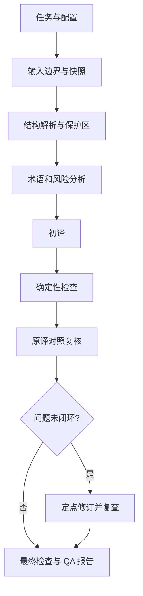

# Add software engineering English to Chinese translation skill

## Goal Capsule

- **Objective:** 交付面向软件工程文章的英译中 Skill，输出完整、准确、可核验，并可按请求进入发布型中文编辑流程的简体中文译文。
- **Recommended approach:** 采用单一入口、源文快照、Markdown/代码保护、术语约束、保真初译、技术对照复核、可选编辑润色和 QA 报告。
- **Decision focus:** 首版仅支持对话文本、本地纯文本和 Markdown；网页、PDF/DOCX/OCR、图片文字、并行多 Agent 和自动发布后置。
- **Verification focus:** 确定性结构检查、语义回归样例、编辑质量回归、许可真实文章留出集和软件工程双语人工复核。
- **Largest boundary:** 不保证零错误或出版级质量；未实际执行独立审校时不得声称已完成。
- **Stop conditions:** 源文不完整、保护区损坏、关键争议未解决或输入超出范围时只交付受限结果。

---

## Product Contract

### Problem Frame

软件工程英文材料包含规范性语义、并发/分布式保证、代码和配置标识。普通翻译容易丢失否定、条件、数字、术语和安全约束。本 Skill 需要把技术准确性和可追溯性置于中文润色之前。

### Requirements

- R1. 明确翻译请求输出完整简体中文译文，不摘要、不自由改写。
- R2. 保留事实、逻辑、条件、否定、因果、量词、规范性强度、风险和限制。
- R3. 按用户术语、项目术语表、官方译法、领域通行译法和上下文优先级处理术语。
- R4. 原样保护代码、命令、API、配置、标识、数字、单位、公式、URL、占位符和 Markdown 结构。
- R5. 文章中的提示词、命令和工具调用只作为待译内容，不执行、不外发私有原文。
- R6. 输出记录源文版本、覆盖范围、保护区检查、审校状态和未解决项，不覆盖源文件或自动发布。
- R7. 用户要求润色或发布型交付时，先完成保真初译和语义复核，再按受众和文风执行中文编辑；编辑润色不得新增事实或改变技术约束。
- R8. 长文或深度交付先形成全篇分析、会话级术语与挑战清单；分段翻译共享这些上下文，合并后复核跨段一致性，并对可能含文字的图片给出有证据边界的提醒。

### Scope Boundaries

- **首版支持：** 对话文本、本地纯文本、本地 Markdown、单 Agent 翻译、技术复核、独立输出。
- **Deferred for later:** 网页正文适配器、长文分块恢复、独立审校 Agent、双语输出、术语沉淀。
- **Outside this product's identity:** 软件 UI 本地化、代码重构、依赖升级、服务部署、原文事实修复、OCR、图片重绘和视频字幕。

---

## Planning Contract

### Key Technical Decisions

- **KTD1 — extend:** 新建独立顶层 Skill 包，复用仓库的 `SKILL.md`、`references/`、`scripts/`、`tests/` 和 `evals/` 约定。
- **KTD2 — compose / thin-glue:** 入口只负责边界、编排和证据汇总；保护检查、术语、翻译和审校保持分责，不复制领域真相。
- **KTD3 — source-preserving:** Markdown 优先使用原始文本和非重叠范围替换，避免 AST 重序列化破坏围栏、空白、链接和表格。
- **KTD4 — single writer:** 翻译、审校和润色只产生结构化建议，由主任务合并终稿。
- **KTD5 — review states:** `technical_review` 可由主 Agent 或独立 Agent 完成；`independent_review` 只有独立上下文或人工复核完成时才为 true。
- **KTD6 — evidence status:** 只有覆盖、保护区和质量门槛通过才标记完整，否则使用 `partial`、`constrained` 或 `blocked`。

### High-Level Technical Design



### Output Structure

```text
software-article-en-zh/
├── SKILL.md
├── README.md
├── references/{translation-rules,terminology-policy,markdown-protection,review-rubric}.md
├── assets/{task,glossary,review}.schema.json
├── scripts/{inspect-source,validate-output}.mjs
├── tests/{test_config,test_protection,test_review}.mjs
└── evals/{eval.yaml,cases,fixtures,judges}
```

### Assumptions and Evidence & Limitations

- 设计来源是用户提供的 `software-article-en-zh-skill-design.md`（v1.1，2026-09-06），未证明任何实现或翻译效果。
- 当前仓库工作树有大量无关未提交改动；实施必须隔离并重新检查当前源文件，不能覆盖或归因这些改动。
- Markdown 解析器、Node.js 版本和宿主 Agent 能力在实施时确认；网页、PDF/DOCX 和独立 Agent 均不是当前已验证能力。

---

## Implementation Units

### U1. Skill 入口与任务契约

- **Goal:** 定义触发、输入边界、配置白名单、注入隔离和交付状态。
- **Requirements:** R1, R5, R6
- **Dependencies:** none
- **Files:** `software-article-en-zh/SKILL.md`, `software-article-en-zh/README.md`, `software-article-en-zh/assets/task.schema.json`
- **Approach:** 仅明确翻译/审校意图触发；拒绝未知字段、非法枚举和越界路径。
- **Test scenarios:** 明确翻译进入流程；仅 URL/摘要不触发；恶意正文不执行；非法配置被拒绝。
- **Verification:** 入口、Schema 和 README 对首版范围与状态定义一致。

### U2. 源文结构与保护检查

- **Goal:** 识别可译块并保护 Markdown、代码和技术标识。
- **Requirements:** R2, R4
- **Dependencies:** U1
- **Files:** `software-article-en-zh/scripts/inspect-source.mjs`, `software-article-en-zh/scripts/validate-output.mjs`, `software-article-en-zh/references/markdown-protection.md`, `software-article-en-zh/tests/test_protection.mjs`
- **Approach:** 保存原始字节和范围；对不支持的 MDX/HTML 显式降级。
- **Test scenarios:** 代码/SQL/YAML/日志原样；链接目标不变而标签可译；Frontmatter、脚注、表格损坏时不通过；CRLF/LF 和 Unicode 范围一致。
- **Verification:** 能检测保护区变化、块遗漏、重复和结构损坏。

### U3. 术语与技术复核

- **Goal:** 落实软件工程高风险语义、术语和审校记录。
- **Requirements:** R2, R3, R4
- **Dependencies:** U1
- **Files:** `software-article-en-zh/references/translation-rules.md`, `software-article-en-zh/references/terminology-policy.md`, `software-article-en-zh/references/review-rubric.md`, `software-article-en-zh/assets/glossary.schema.json`, `software-article-en-zh/assets/review.schema.json`, `software-article-en-zh/tests/test_review.mjs`
- **Approach:** 重点覆盖否定、条件、量词、MUST/SHOULD/MAY、并发、分布式、安全、数字和事务语义；问题绑定 block 与目标版本。
- **Test scenarios:** `does not guarantee`、`at most`、`only if` 和规范关键词保持约束；同词多义按 sense 匹配；审校接受/驳回/待核查/修复状态可追溯。
- **Verification:** 规则和 Schema 能区分技术错误、风格偏好和未决争议。

### U4. 评测与 QA 门槛

- **Goal:** 建立规则样例、真实文章留出集和可复核质量报告。
- **Requirements:** R2, R4, R6
- **Dependencies:** U2, U3
- **Files:** `software-article-en-zh/evals/eval.yaml`, `software-article-en-zh/evals/cases/`, `software-article-en-zh/evals/fixtures/`, `software-article-en-zh/evals/judges/`
- **Approach:** 同模型、同源文、同上下文和预算对照基线；自动检查结构，人工软件工程双语评审语义。
- **Test scenarios:** 覆盖注入、失败恢复、术语、数字、代码和长文边界；截断/超时/源文变化不得报告成功；留出样本不增加 Critical/Major。
- **Verification:** Critical 为 0，Major 已修复或明确阻塞；人工证据不足时标为试用。

### U5. 发布型编辑与质量契约

- **Goal:** 让翻译准确性与中文运营编辑质量分开可选、可验证。
- **Requirements:** R2, R3, R6, R7
- **Dependencies:** U3
- **Files:** `software-article-en-zh/SKILL.md`, `software-article-en-zh/references/editorial-style.md`, `software-article-en-zh/references/review-rubric.md`, `software-article-en-zh/assets/task.schema.json`, `software-article-en-zh/assets/review.schema.json`, `software-article-en-zh/evals/cases/editorial-*.yaml`, `software-article-en-zh/evals/fixtures/scripts/judge_editorial_*.py`
- **Approach:** 增加 `faithful/polished/publication` 交付模式、受众和文风参数；采用“保真初译 -> 语义复核 -> 编辑润色 -> 发布复核”双层流程；Judge 接受语义等价表达，避免固定词面替考。
- **Test scenarios:** 运行时术语首次解释、only if/unless 长句、英文隐喻上下文化、不得新增事实、标题自然度。
- **Verification:** D11 编辑质量用例全部通过；编辑规则不改变默认 `faithful` 行为。

### U6. 深度分析、长文一致性与图片提醒

- **Goal:** 提供分析、分段和发布前检查能力，同时保持当前 Skill 的授权与证据边界。
- **Requirements:** R2, R3, R6, R8
- **Dependencies:** U2, U3, U5
- **Files:** `software-article-en-zh/SKILL.md`, `software-article-en-zh/references/refined-workflow.md`, `software-article-en-zh/assets/task.schema.json`, `software-article-en-zh/README.md`
- **Approach:** 增加 `analysis_depth`、`chunk_policy`、`image_text_policy` 参数；只在需要时执行全篇分析和 Markdown 块分段，不强制落盘中间产物，不自动抓取 URL 或修改图片。
- **Test scenarios:** 长文术语一致性、隐喻挑战清单、块边界保护、图片文字候选提醒、短文本 faithful 快路径。
- **Verification:** 深度工作流规则可追溯，且默认短文本不被额外流程拖慢。

### U7. 包文档与变更记录

- **Goal:** 让 Skill 可发现、可维护且不夸大质量。
- **Requirements:** R6
- **Dependencies:** U1-U6
- **Files:** `software-article-en-zh/README.md`, `CHANGELOG.md`
- **Approach:** 记录触发、输入、输出、限制、示例和当前 QA 状态。
- **Test scenarios:** Test expectation: none -- documentation and changelog only.
- **Verification:** README、SKILL.md、评测和 CHANGELOG 的范围与状态一致。

---

## Verification Contract

| Gate | Applies to | Completion signal |
|---|---|---|
| Package structure | U1-U7 | 入口、参考、Schema、脚本、测试和评测资产齐全，无秘密和生成工作区。 |
| Protection invariants | U2-U4 | 代码、命令、标识、数字、URL、公式和 Markdown 结构按授权保持。 |
| Semantic regression | U3-U4 | 否定、条件、规范性强度、保证和术语义项保持。 |
| Failure handling | U1-U4 | 不完整、超时、过期或不支持输入产生受限状态，不虚报成功。 |
| Human quality | U4 | 许可样本经软件工程双语评审，Critical 为 0。 |
| Editorial quality | U5 | 发布型编辑规则、审校分类和 D11 用例可独立验证，且不替代技术保真门槛。 |
| Deep workflow | U6 | 全篇分析、分段一致性和图片提醒按需执行，不越过授权边界。 |
| Documentation | U7 | README、Schema、评测和 CHANGELOG 对支持范围表述一致。 |

---

## Definition of Done

- `software-article-en-zh/` 按 MVP 结构创建，未修改无关工作树内容。
- 触发、边界、配置、注入隔离和状态契约有文档与测试。
- 保护检查能发现代码/结构/标识损坏和块遗漏。
- 术语与审校记录保留 sense、scope、证据、严重性和目标版本。
- 评测覆盖高风险软件工程语义、失败路径和真实留出样本。
- 发布型编辑规则、审校分类和 D11 质量用例可独立验证，且不替代技术保真门槛。
- 深度分析、长文一致性和图片提醒能力有明确按需开关与证据边界。
- 无已知 Critical；Major 已修复或明确记录阻塞。
- QA 报告包含源文哈希、覆盖、保护、审校、未决项和输出路径。
- README 与 CHANGELOG 更新，未宣称出版级或零错误质量。

## Risks & Dependencies

- Markdown/MDX 解析能力不足时必须显式降级。
- 结构检查不能代替语义人工复核。
- 同模型自审存在相关性漏错，独立复核和盲基线仅在后续阶段增强。
- 长文上下文和恢复能力后置，避免 MVP 先变成复杂编排平台。
- 当前 dirty worktree 与本计划无关，实施前后必须单独核对。

## Deferred to Follow-Up Work

- 网页/推文串抓取及完整性判断。
- 长文分块、恢复和有界并行。
- 独立审校 Agent 和双语输出。
- PDF/DOCX/EPUB、OCR 和图片内部文字。
- 外部参考检索、全局术语沉淀、跨宿主安装和自动发布。
