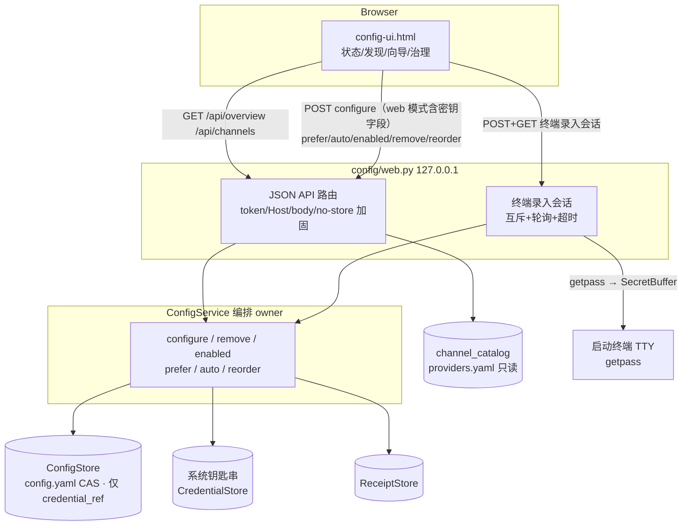
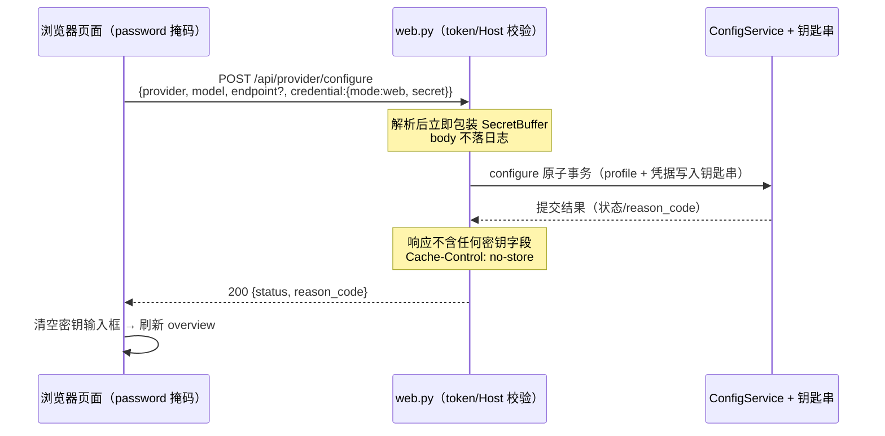
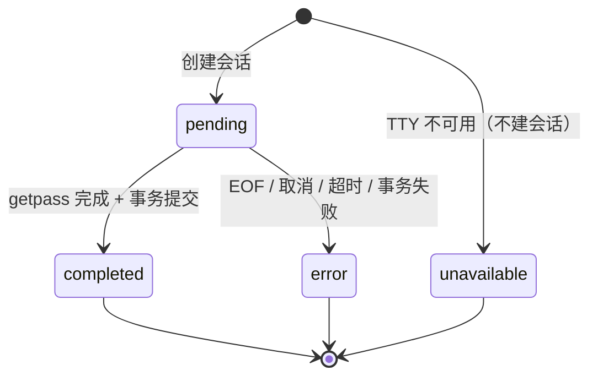

## Goal Capsule

- **目标**：把 `leo-ppt config ui` 从"状态查看页"升级为图片渠道管理控制台——支持渠道的发现、新增、修改（含密钥更换）、删除、切换与排序，全部在浏览器完成。密钥双通道：**网页一次性录入（推荐，直写系统钥匙串、永不回显）**与**终端安全录入会话（保留，页面触发、终端 getpass）**，另有环境变量引用与 CLI 等效路径。
- **推荐方案**：扩展 `ConfigService`（提升 remove/enabled 为服务方法）+ `config/web.py` 升级为小型 JSON API（token/Host/no-store 加固；configure 支持 web/terminal/env/keep 四种凭据模式，含终端录入会话编排）+ 完全重写 `assets/config-ui.html`（单文件、无构建、简体中文）。
- **决策焦点**：网页密钥录入的安全姿态（一次性、掩码、零回显、`no-store`）与终端会话的并发/降级契约（互斥、超时、无 TTY 降级）。
- **验证焦点**：`tests/test_config_web.py`（新）覆盖 API 路由/鉴权/零回显/终端会话三终态；一次真实浏览器冒烟记录 CRUD 与两条密钥录入路径证据。
- **最大风险/边界**：终端 getpass 与 HTTP 服务线程的交互（无 TTY 环境必须优雅降级）；网页录入的固有暴露面（DevTools/肩窥/扩展）；渠道目录是 checked-in 数据，UI 的"新增渠道"是 profile 配置而非编辑目录（AS1 需实施前与用户确认）。
- **停止条件**：若任一实现路径会把明文密钥回显到任何 API 响应、写入 config.yaml 或落入日志，停止并回到计划重审 KTD1。
- **尾部所有权**：收尾含 CHANGELOG（user-visible，需声明安全行为变化）、SKILL.md/README 同步与死按钮清理验证。

---

## Product Contract

### Summary

`leo-ppt config ui` 目前只有一个只读状态区、一个生效的"设为当前"按钮，以及三个指向 CLI 的 alert 死按钮（添加/修改/删除）。本计划将其重设计为真正的渠道管理控制台：上区治理已配置渠道（切换、排序、启停、修改、删除、更换密钥），下区发现可添加渠道（目录卡片 + 自定义中转站入口），配置向导内完成参数与凭据绑定。凭据四通道：**网页直接录入（推荐）**——密钥在网页输入、经 localhost 一次性提交、服务端直写系统钥匙串，任何响应与页面永不回显；**终端安全录入**——页面触发、启动 `config ui` 的终端 getpass、页面轮询感知完成；**环境变量引用**——零密钥流量；**保留现有凭据**（修改时）。CLI 命令始终是等效替代路径。

### Problem Frame

用户（本机开发者/内容创作者）配置图片渠道时面临两个割裂的世界：网页能看到状态却做不了操作，CLI 能做操作却看不到全景。现有页面的"添加渠道"对话框是一个假表单——填完点保存只弹出"请去终端执行 CLI"，这在产品上比没有按钮更糟。密钥录入被完全推给终端，导致"加一个渠道"要在浏览器与终端之间往返多次。同时渠道目录（providers.yaml）已经沉淀了丰富的发现型数据（中文显示名、portal、密钥页、模型列表、推荐标记、notes），页面完全没有暴露，用户不知道"能加什么、去哪拿密钥"。

### Requirements

**渠道发现与状态**
- R1. 页面展示全部可配置渠道：目录渠道（含推荐标记、显示名、模型列表、"获取密钥"portal 链接、notes 摘要）、`openai-compatible` 自定义中转站入口；已配置渠道不再出现在添加区。
- R2. 已配置渠道卡片展示模型、自定义端点（如有）、凭据可用性徽标、验证状态徽标、启用开关、优先级顺序（自动模式）与"当前使用"标记；顶部展示全局就绪状态与 fixed/automatic 选择模式及切换入口。

**渠道管理（CRUD）**
- R3. 新增渠道：在页面完成模型选择（目录模型列表 + 自由输入）、端点确认（目录默认预填、可改）与密钥录入（网页或终端），保存后渠道立即可用。
- R4. 修改渠道：修改模型、端点与启用状态；凭据可保留或更换——网页直接输入新密钥、终端安全录入或改用环境变量引用；向导凭据步默认选中"保留现有凭据"，选择其他选项时显示"将覆盖已保存的密钥"提示。
- R5. 删除渠道：页内确认对话框展示影响说明（移除配置与凭据引用、钥匙串历史条目不自动删除、未完成 run 需重新确认样张、已完成交付不受影响），确认后删除并清理 preferred 选择。

**凭据安全契约**
- R6. 网页录入的密钥经一次性提交后由服务端直写系统钥匙串；任何 API 响应、页面 DOM、日志不回显明文密钥；config.yaml 仍只存 credential_ref；密钥输入框为 password 掩码 + `autocomplete="off"`，提交成功后输入框清空；API 响应带 `Cache-Control: no-store`。
- R7. 凭据路径多样性：终端安全录入会话与环境变量引用始终作为网页录入的替代路径；可复制的 CLI 命令指引（`config credential set --provider X --key-stdin`）始终可见；服务无 TTY 时终端录入选项自动隐藏并给出降级指引，其余路径不受影响。

**选择治理与反馈**
- R8. 支持设为当前（fixed）、恢复自动选择（automatic）与自动模式下的权重配置：直接编辑各渠道权重（1-1000，小值优先，`POST /api/provider/priority`）或 ↑↓ 一键重排，列表按权重排序展示。
- R9. 所有写操作具备 pending/success/error 反馈（toast + 按钮 pending 防重复提交），reason_code 映射为中文可读文案（含 CAS 冲突 → "配置已被其他操作修改，请刷新后重试"），操作成功后状态自动刷新。

**服务端加固**
- R10. 写操作要求 token（`X-Leo-UI-Token` header 或引导时下发的 HttpOnly SameSite=Strict cookie，兼容 query 传递）；服务仅绑定 127.0.0.1，校验 Host 头，限制 JSON 请求体大小；读接口保持 localhost 开放。

### Actors

- A1. 本机用户：终端或快捷方式启动 `leo-ppt config ui`，浏览器完成全部渠道管理；密钥按偏好走网页录入或终端录入。
- A2. 宿主 agent：可能以无交互方式启动 config ui 嵌入引导；页面无终端依赖，网页录入/环境变量引用/CLI 指引均可用（终端录入选项自动降级隐藏）。

### Key Flows

- F1. 网页录入新增渠道（推荐路径）
  - **Trigger:** 用户在添加区选择渠道，向导凭据步选择"网页直接录入（推荐）"。
  - **Actors:** A1。
  - **Steps:** 页面以 password 掩码收集密钥 → 单次 POST /api/provider/configure（token 校验、no-store）→ 服务端立即包装 SecretBuffer 走 ConfigService.configure 原子事务写入钥匙串 → 响应只含状态与 reason_code（无密钥字段）→ 输入框清空、页面刷新概览。
  - **Outcome:** 渠道就绪（configured_unverified），密钥仅存在于本机钥匙串。
  - **Covered by:** R3, R6。
- F2. 终端安全录入（保留路径）
  - **Trigger:** 用户选择"终端安全录入"。
  - **Actors:** A1。
  - **Steps:** 页面提交配置请求（terminal 模式）→ 服务端校验 TTY 可用并创建录入会话（互斥）→ 启动终端出现 getpass 提示 → 用户输入密钥 → 服务端以 SecretBuffer 走 configure 原子事务 → 页面轮询感知完成 → 自动刷新概览；页面轮询等待态显示"请在启动 config ui 的终端中输入密钥…可在终端按 Ctrl-C 取消输入"，点击"取消"调用取消端点并停止轮询，迟到的终端输入被服务端丢弃、不落任何配置。
  - **Outcome:** 渠道就绪；密钥字节仅经过终端输入与系统钥匙串，不经过浏览器。
  - **Covered by:** R3, R4, R7。
- F3. 环境变量引用配置（零密钥路径）
  - **Trigger:** 用户选择"环境变量引用"，或不希望任何形式的密钥录入时。
  - **Actors:** A1/A2。
  - **Steps:** 页面展示该渠道的环境变量名与 `export` 示例（复制按钮）→ 用户在 shell 中设置后确认保存 → 服务端以 env-reference 保存 profile（零密钥流量）。
  - **Outcome:** profile 保存为 environment-reference；环境变量未设置时凭据徽标显示"环境变量缺失"。
  - **Covered by:** R4, R7。
- F4. 删除渠道
  - **Trigger:** 已配置渠道卡片"删除"按钮。
  - **Actors:** A1。
  - **Steps:** 确认对话框展示影响说明 → 确认 → 服务端移除 profile、清理 preferred、失效验证 receipt → 页面刷新，渠道回到添加区。
  - **Covered by:** R5。

### Acceptance Examples

- AE1. **Covers R6。** Given 用户经网页录入完成渠道配置，When 检查该次及之后所有 HTTP 响应体与页面渲染后 DOM，Then 任何位置不出现明文密钥（凭据仅以 credential_ref/状态徽标形式呈现），且密钥输入框已清空。
- AE2. **Covers R5。** Given 已配置渠道 qianxing 且为 preferred，When 在页面删除该渠道并确认，Then config 中 profile 与 preferred_provider 均被移除，验证 receipt 失效，页面添加区重新出现 qianxing 卡片。
- AE3. **Covers R7。** Given config ui 由无 TTY 的宿主进程启动，When 打开配置向导，Then 终端录入选项不可见，网页录入/环境变量引用与 CLI 指引可用，配置流程仍可完成；Given 有 TTY，When 终端录入会话进行中重复触发，Then 返回同一会话而非新建。
- AE4. **Covers R9。** Given 任一写操作触发，When 请求进行中，Then 触发按钮进入 pending 态且重复点击被忽略；失败时 toast 展示中文原因而非裸 reason_code。

### Scope Boundaries

**非目标（本产品身份外）**
- 编辑 checked-in 渠道目录（providers.yaml）：目录是仓库源数据，新增渠道条目走仓库贡献流程（`leo-ppt-generator/references/provider-catalog.md`）；页面只提供"没有想要的渠道？"的指引链接。
- 同一 provider 多实例（如两个不同中转站并存）：架构上一 provider 一 profile，UI 必须诚实表达，不伪装多实例。
- 付费验证触发：Provider smoke executor 尚未接入 CLI（`config verify --yes` 目前诚实返回 `provider_smoke_executor_unavailable`），页面只读展示验证状态，不伪装验证能力。
- i18n：界面保持简体中文单语（仓库默认语言）。

**Deferred to Follow-Up Work**
- 验证按钮（触发 paid smoke）：owner 为 smoke executor 接入计划，trigger 是 CLI 侧 executor 落地。
- 拖拽排序：上移/下移按钮先行（可测试、a11y 友好），拖拽作为体验增强后置。
- 渠道目录贡献指引页（站内引导页）：先用外链到 provider-catalog.md。

---

## Planning Contract

### Key Technical Decisions

- KTD1. **网页密钥录入的安全姿态：一次性、不回显、直写钥匙串。** (session-settled: user-directed — chosen over 保留"浏览器零明文密钥"边界: 用户明确要求网页支持密钥录入与渠道新增)。密钥仅在提交瞬间经过浏览器（password 掩码、`autocomplete="off"`、提交后清空），经 localhost + token 的单次 POST 到达服务端，立即包装为 SecretBuffer 走既有 `ConfigService.configure` 原子事务写入系统钥匙串；config.yaml 仍只存 credential_ref（现有架构不变）。响应与日志永不携带密钥（`log_message` 已禁用，body 不落日志）；API 响应统一 `Cache-Control: no-store`。残余风险如实披露：DevTools 网络面板在会话内可见请求体、肩窥、恶意浏览器扩展——这是网页录入的固有暴露面，作为已接受风险记录；不愿接受该面的用户由 KTD2 终端会话与 F3 环境变量引用承接。
- KTD2. **终端安全录入会话保留，与网页录入并存。** (session-settled: user-directed — 用户明确要求终端 CLI 模式保留，与网页录入并存)。架构姿态 `compose / thin-glue`：参与方为 ConfigService.configure（原子事务 owner）、系统钥匙串（凭据 truth）、终端 stdin（密钥入口）；web.py 的会话编排只负责触发、互斥、轮询状态与失败传播，不新增凭据通道、不复制校验规则。会话状态机：`pending → completed | error`（页面"取消"调用标记端点 `POST /api/credential/session/{id}/cancel`，会话立即进入 error/`terminal_session_cancelled`，worker 收到迟到输入直接丢弃、不落任何配置；服务端仍不中断 getpass，未取消时由超时/EOF/正常完成收束），TTY 不可用时直接返回 `unavailable`（不建会话，页面隐藏该选项）；同一时间至多一个活跃会话（互斥锁 + 服务进程 stdin 串行化，重复触发返回既有会话）；getpass 的 EOF/超时（默认 300s）路径让会话进入 error 且**不落任何半配置状态**（configure 单事务语义：密钥到位前不写 profile）。
- KTD3. **remove/enabled 提升为 ConfigService 方法（extend）。** 现状 `_remove_provider_profile` / `_update_provider_preference` 是 cli.py 私有 helper（直接操作 config_store CAS 与 receipt_store.invalidate）。提升为 `ConfigService.remove_provider()` / `ConfigService.set_provider_enabled()` 后，CLI 与 web 共享同一编排 owner，web 层不复制任何 profile 写规则。
- KTD4. **渠道目录对 UI 只读。** `/api/channels` 仅暴露 checked-in 公开数据（id、display_name、portal、key_page、models、default_model、endpoint_origin、notes、featured、credential_environment），无任何秘密；"新增渠道"在 UI 语义上等价于"配置一个 provider profile"。
- KTD5. **前端保持单文件、零构建、零 CDN。** 重写 `assets/config-ui.html`（vanilla JS + 内联 CSS），与仓库 vendored/离线约定一致；状态刷新用 fetch 轮询（stdlib http.server 无 WS）。
- KTD6. **token 模型升级而非替换。** 保留 `?token=` 引导与 query 传递（向后兼容现有脚本），首次命中时 `Set-Cookie: leo_ui_token=...; HttpOnly; SameSite=Strict; Path=/`；写操作接受 header / cookie / query 三通道任一。新增 Host 头校验（必须是 `127.0.0.1:<port>` 或 `localhost:<port>`，防 DNS rebinding）与 JSON 请求体大小上限（64 KiB）。携带密钥的请求与所有 API 响应均 `Cache-Control: no-store`。
- KTD7. **密钥请求的处理纪律。** 服务端解析 JSON 后立即将 secret 字段包装为 `SecretBuffer`（与 CLI `--key-stdin` 路径同构），事务完成或失败后 `close()` 清零；请求体不写日志、不持久化、不进入任何响应字段。诚实边界：Python str 不可变，JSON 解析产生的文本副本无法真正擦除——该限制与现有 CLI stdin 路径同级，接受并在代码注释说明。
- KTD8. **验证状态只读展示。** 页面徽标呈现 report 的 verification_state（not_run/passed/failed/stale），与凭据徽标并列；不提供触发按钮（见 Scope Boundaries）。
- KTD9. **前端 XSS 纪律。** 所有动态值（渠道名、模型、reason 文案、notes、URL）经统一 escape 或以 `textContent` 注入；内联事件属性中拼接动态字符串的模板一律禁止，事件绑定走 `addEventListener` + data 属性。目录数据虽是 checked-in 可信源，仍统一转义（纵深防御）。

### High-Level Technical Design

组件与数据流（web 层为 thin-glue，业务 owner 在 ConfigService；两条密钥路径——浏览器输入框单次 POST / 终端 getpass——最终都汇入同一原子事务）：

网页密钥录入时序（F1，never-echo 保证）：

终端录入会话状态机（KTD2）：

### Alternatives Considered

- **方案一：保留零明文密钥边界，仅终端 getpass 会话（本计划初版）。** 被用户决策否决——要求网页直接支持密钥录入与渠道新增；随之产生 KTD1 的网页录入安全姿态。
- **方案二：网页录入落地后按 YAGNI 移除终端会话。** 被用户决策否决——终端 CLI 模式明确要求保留；终端会话作为不愿在浏览器输密钥用户的一等公民路径与网页录入并存（KTD2）。

### Implementation Scope Boundaries

- web.py 保持 stdlib-only（http.server + json + threading），不引入框架；移除 `_html()` 的内嵌兜底页，资产缺失时返回明确的错误响应（避免双真相）。页面资产随包内分发：`runtime/src/leo_ppt_generator/config/assets/config-ui.html`（与 providers.yaml 同范式，`pyproject` package-data 声明 `config/assets/*.html`），解析为包内相对路径——源码树与受管 venv 安装态同源，不依赖技能根相对位置（安装态 `config_ui_asset_missing` 缺陷的修复决策）。
- CLI 行为零变化：`config provider remove/enabled` 等子命令的外部契约（参数、reason_code、lifecycle_hint）不变，仅内部委托提升后的服务方法。
- 不改动 `evals/`（skill-up 评测面向 agent 行为，不覆盖 runtime UI；运行时行为由单测守护）。

### Assumptions

- AS1.（**planning-time assumption，实施前必须与用户确认**）"新增/删除/修改渠道"指用户侧 provider profile 管理，不含编辑 checked-in 渠道目录——依据 `channel_catalog.py` 模块注释的架构红线（"目录是 checked-in 数据而非用户输入"）。UI 语义："新增渠道" = "为目录中已有渠道配置 profile"，添加全新渠道类型需走仓库贡献流程（provider-catalog.md）。若用户期望不同（如直接编辑 providers.yaml），本计划方向需调整。
- AS2.（planning-time assumption）界面简体中文单语，沿用现有页面语言。
- AS3.（planning-time assumption）网页录入为向导内推荐项、终端会话为次选的排序由 UI 呈现层决定；两条路径能力等价，不构成计划级分叉。

### Evidence & Limitations

- 直接源证据：`runtime/src/leo_ppt_generator/config/web.py`（现 2 个端点、query/header 双通道 token、无 body 解析）、`assets/config-ui.html`（7 行压缩单文件，三个 alert 死按钮）、`config/service.py`（configure/set_preferred/clear_preferred/reorder 就绪，缺 remove/enabled）、`cli.py` 的 `_remove_provider_profile`/`_update_provider_preference`（提升来源，含 receipt invalidate 与 preferred 清理语义）、`config/channel_catalog.py` + `config/providers.yaml`（7 渠道 + featured）、`credentials.py`（CredentialInputChannel 四通道 + SecretBuffer + `--key-stdin` 同构路径）、`cli.py` config verify 分支（smoke executor 诚实不可用）。读取时工作树有大量与本计划无关的未提交改动（风格库批次）；本计划目标文件（web.py、config-ui.html、service.py、cli.py）实施前须以当前工作树为基线复核，避免与在途改动纠缠提交。
- 决策证据：KTD1 网页密钥录入与 KTD2 终端会话保留均来自当前会话用户显式选择（"支持网页修改秘钥，新增渠道"；"终端cli模式还是继续保留"）。
- 外部研究：未执行（本地模式充分：ConfigService 全部所需能力已存在，无显式外部研究请求）。

---

## Implementation Units

### U1. ConfigService 提升 remove/enabled 编排

- **Goal:** `remove_provider()` 与 `set_provider_enabled()` 成为服务方法，CLI 委托，web 层可消费。
- **Requirements:** R4, R5。
- **Dependencies:** 无。
- **Files:** `leo-ppt-generator/runtime/src/leo_ppt_generator/config/service.py`（改）、`leo-ppt-generator/runtime/src/leo_ppt_generator/cli.py`（改，`_remove_provider_profile`/`_update_provider_preference` 委托）、`leo-ppt-generator/tests/test_config_service_profile_ops.py`（新）。
- **Approach:** 语义照搬现有 CLI helper（CAS 写、preferred 清理、`receipt_store.invalidate(provider, "provider_removed", ...)`、`provider_not_found` 路径、enabled 的 `provider_profile_invalid` 校验），失败统一抛 `ConfigServiceError`（携带现有 reason_code），返回 `ConfigReport` 或轻量结果对象；CLI envelope/lifecycle_hint 留在 CLI 层不搬家。
- **Patterns to follow:** `service.py` 现有 `set_preferred_provider`/`reorder_provider_priorities` 的 CAS + reason_code 风格；测试参照 `tests/test_channel_catalog.py` 的 sys.path 注入 + SimpleNamespace fake 风格。
- **Test scenarios:**
  - remove 移除已配置 provider 后 profile 消失且 overview 不再列出（happy）。
  - remove 的目标是 preferred_provider 时 preferred 同步清除（edge，Covers AE2 前半）。
  - remove 不存在 provider 返回 `provider_not_found` 且不触碰存储（edge）。
  - remove 后 receipt_store 收到 invalidate 调用（integration）。
  - enabled 切换 true/false 写入 profile 且保留其余字段（happy）。
  - enabled 对未配置 provider 抛 `provider_profile_invalid`（error）。
  - CAS 冲突（fake store 注入 digest 不匹配）时抛冲突 reason_code 且不半写（error）。
- **Verification:** 新测试文件全绿；`config provider remove/enabled --json` 输出与提升前一致（reason_code 字段对齐）。

### U2. config/web.py API v2 与服务端加固

- **Goal:** 提供 `/api/overview`（含 `capabilities.terminal_entry`）、`/api/channels`、`/api/provider/{configure,remove,enabled}`、`/api/prefer`、`/api/auto`、`/api/provider/reorder`、终端录入会话端点；configure 支持 web/terminal/env/keep 四种凭据模式；完成 token/Host/body/no-store 加固。
- **Requirements:** R3, R4, R5, R6, R7, R8, R9（后端半：reason_code 透传与结构化错误，中文文案映射在 U3）, R10。
- **Dependencies:** U1。
- **Files:** `leo-ppt-generator/runtime/src/leo_ppt_generator/config/web.py`（改）、`leo-ppt-generator/tests/test_config_web.py`（新）。
- **Approach:** Handler 内路由表化（method + path → 处理函数），POST 读 JSON body（大小上限、Content-Type 校验）；configure 接受 `credential.mode ∈ {web, terminal, env, keep}`：web → body 携带 `secret` 字段，服务端立即包装 SecretBuffer 后以 EXPLICIT_STDIN 通道走 `service.configure`（响应构造时剔除一切密钥字段，KTD7）；对已持有 os-store 凭据的渠道，web/terminal 新密钥即"更换密钥"——向导中用户显式选择输入新密钥视为覆盖确认，后端以 `overwrite_credential=True` 提交（否则事务以覆盖确认类 reason_code 拒绝）；terminal → 创建录入会话，getpass 完成后以 EXPLICIT_STDIN + SecretBuffer 走 `service.configure`（会话编排见 KTD2，getpass 在独立线程 + 全局 stdin 锁执行，提示打印到服务进程 stdout，会话轮询端点 `GET /api/credential/session/{id}`，会话 id 用 `secrets.token_urlsafe` 生成且轮询同样校验 token；getpass 绑定控制终端而非 stdin，能力探测以 `sys.stdin.isatty()` 为保守近似，个别 stdin 被重定向但控制终端可用的场景会被降级隐藏，属可接受近似）；env → `CredentialInputSelection(channel=ENVIRONMENT, credential_ref=<渠道环境变量名>)`；keep → 复用 profile 现有引用（缺失时报 `credential_input_channel_unavailable`）。overview 返回 `overview()` 全量（providers/mode/actions/report 含 verification_state）+ `capabilities.terminal_entry`（基于 `sys.stdin.isatty()`）；channels 返回目录 + 内置 provider 最小条目 + 各渠道 `credential_environment` 与 CLI 指引命令文案所需字段。所有 `/api/` 响应附 `Cache-Control: no-store`。保留 `/api/status` 兼容旧字段（过渡期）。
- **Execution note:** 终端会话与线程交互是本计划最高风险区；实施建议顺序：先实现网页录入 + 环境变量引用（风险低、可独立交付），终端会话作为最后子任务（确保即使失败也不阻塞主流程）；会话实现前先写失败测试（无 TTY 降级、EOF、互斥）再实现编排。
- **Patterns to follow:** 现有 `_json()`/token 解析骨架；`credentials.py` 的 `CredentialInputSelection` 构造约束（reference 通道与 secret 通道互斥）。
- **Test scenarios:**
  - 无 token 的每个 POST 均 403 `forbidden`（Covers R10）。
  - GET `/api/overview` 返回 providers 全字段 + mode + actions + `capabilities.terminal_entry`（happy）。
  - GET `/api/channels` 含 featured 渠道排首、字段齐全、无凭据值类字段（happy，Covers R1）。
  - configure web 模式端到端：fake credential store 收到密钥写入、profile 落 os-store-reference、**响应体不含 secret/密钥字段**（happy，Covers F1 + AE1 后端半）。
  - configure web 模式更换既有钥匙串凭据：fake store 已 available 时以新密钥提交 → 以允许覆盖提交成功（happy，Covers R4 更换密钥路径）。
  - configure web 模式密钥为空/缺失 → 4xx reason_code（error）。
  - configure env 模式端到端写入 env-reference profile（happy，Covers F3）。
  - configure 校验失败（非法 origin / 未知 provider / 非法 model）返回 4xx + reason_code（error）。
  - configure keep 模式在无既有凭据时返回 `credential_input_channel_unavailable`（error）。
  - 事务失败（fake service 抛 ConfigServiceError）时 secret 已 close、响应 4xx、无密钥回显（error，Covers KTD7）。
  - 终端录入：fake stdin 注入 EOF → 会话 error 且 config 无任何写入（error，Covers KTD2）。
  - 终端录入：无 TTY（fake `sys.stdin` 非 tty）→ 直接 `unavailable`，不建会话（edge，Covers AE3 后端半）。
  - 终端录入：注入密钥行 → 会话 completed + profile/凭据写入（happy，Covers F2 后端半）。
  - 终端录入：会话进行中再次创建 → 返回既有会话（并发，Covers AE3 后半）。
  - 终端录入：取消端点后会话立即 error/`terminal_session_cancelled`，迟到的终端输入被丢弃且不触发 configure（happy，Covers KTD2 取消语义）。
  - configure 校验失败（早退 raise）路径下 web 模式的 SecretBuffer 已被兜底关闭（error，Covers KTD7）。
  - GET `/api/overview` 透传嵌套 `verification.status` 契约（结构，防徽标键名回归）。
  - 所有 `/api/` 响应含 `Cache-Control: no-store`（安全，Covers R6）。
  - Host 头非 127.0.0.1/localhost → 403（安全）。
  - 请求体超限 → 413（安全）。
  - `/api/prefer`、`/api/auto`、`/api/provider/reorder`、`/api/provider/enabled`、`/api/provider/priority`、`/api/provider/remove` 各自路由到 fake service 的对应方法且透传 reason_code（happy + error；priority 越界/非整数返回 `provider_priority_invalid`）。
- **Verification:** `test_config_web.py` 全绿；无明文密钥出现在任何响应断言（Covers AE1 后端半）。

### U3. config-ui.html 渠道控制台重写

- **Goal:** 单文件页面实现发现/治理双区、配置向导（凭据四选 + 无 TTY 降级）、删除确认、排序、toast 与状态徽标。
- **Requirements:** R1–R9。
- **Dependencies:** U2。
- **Files:** `leo-ppt-generator/runtime/src/leo_ppt_generator/config/assets/config-ui.html`（重写；自技能根 `assets/config-ui.html` 迁入包内以随包分发，`pyproject` 声明 package-data）；静态断言并入 `leo-ppt-generator/tests/test_config_web.py`。
- **Approach:** 布局：顶栏（就绪徽标 + 当前选择 + fixed/automatic 切换）→ 主区（已配置渠道卡片列表：徽标组 + 启用开关 + 上移/下移 + 设为当前/修改/删除）→ 添加区（featured 渠道卡片排首标"推荐"、目录卡片、`openai-compatible` 自定义中转站卡）。配置/修改向导 `<dialog>` 两步：参数步（模型 datalist、端点默认预填 + origin-only 提示）→ 凭据步（radio：**网页直接录入（推荐）**——password 掩码输入框 + 显示/隐藏切换 + `autocomplete="off"` + "密钥仅写入本机系统钥匙串，但浏览器 DevTools 网络面板在会话内可见请求体。密钥不会显示、保存或回传本页。"说明文案，提交成功后清空；**终端安全录入**——按 `capabilities.terminal_entry` 显隐，选中后提交进入轮询等待态（文案"请在启动 config ui 的终端中输入密钥…可在终端按 Ctrl-C 取消输入"，完成/失败自动退出；"取消"= 调用取消端点并停止轮询，迟到的终端输入被服务端丢弃）；**环境变量引用**——变量名与 export 复制按钮；**保留现有凭据**——仅修改已有渠道时可选且默认选中，选择其他选项时显示"将覆盖已保存的密钥"警告文案）。删除走独立确认 dialog（危险样式 + 影响说明）。全部动态渲染经 KTD9 转义；按钮 pending 防重；toast 组件替代 alert；reason_code → 中文文案映射表（未知码回退显示原码；CAS 冲突映射为"配置已被其他操作修改，请刷新后重试"并自动触发刷新）；R7 的 CLI 指引做成可复制命令卡（凭据步内始终可见）。外链（portal/key_page）统一加 `rel="noopener noreferrer"`（引导 URL 携带 token，防 referrer 泄漏）；排序请求按"全部启用渠道的完整有序列表"构造（服务端为全集重排约束）；自动模式下每张已启用渠道卡片提供内联权重编辑（number 输入 1-1000 + "设"按钮 → `/api/provider/priority`，保存后列表按权重重排并刷新选中，小值优先；固定模式隐藏编辑器并在 hint 注明权重不参与选择）。无 JS 渐进：首屏由服务端注入的初始 overview JSON 直出（避免白屏）；JS 加载失败时显示降级提示："此页面需要 JavaScript。您也可以使用 `leo-ppt config provider` 命令管理渠道。"。a11y：dialog 焦点圈定与关闭恢复、表单 label 关联、按钮语义化、44px 触达、对比度沿用现有蓝色系；响应式 760px 断点单列。
- **Execution note:** 前端无自动化浏览器测试，先以静态断言锚定结构与安全纪律，再走一次人工冒烟（Verification Contract）。
- **Test scenarios:**
  - 资产文件存在且被 `/` 正确 serving（happy）。
  - 静态断言：不含 `alert(`、不含内联 `onclick=` 拼接动态值、含 escape 工具函数、含 token bootstrap（query/cookie）、外链含 `noopener noreferrer`（结构，Covers R6/R9 页面半）。
  - 静态断言：密钥输入为 `type="password"` 且 `autocomplete="off"`，提交处理函数含清空逻辑；含终端轮询函数与 `terminal_entry` 显隐分支；终端等待态文案含 Ctrl-C 提示；修改向导凭据步"保留现有凭据"默认选中且其他选项含覆盖警告（结构，Covers AE1/AE3 页面半 + R4 更换密钥 UI）。
  - 静态断言：含已配置区/添加区/向导 dialog/删除确认 dialog/toast 容器的稳定 id 或 data 钩子（结构，Covers R1–R5 页面半）。
  - Test expectation: none -- 视觉与交互细节（动画、间距、浏览器行为）由人工冒烟覆盖，自动化只锚定结构与纪律。
- **Verification:** 静态断言绿；人工冒烟记录（见 Verification Contract）。

### U4. 文档与变更记录同步

- **Goal:** 面向用户的文档反映控制台新能力与安全行为变化，CHANGELOG 履约。
- **Requirements:** 全部（可发现性）。
- **Dependencies:** U1, U2, U3。
- **Files:** `leo-ppt-generator/SKILL.md`（改，命令说明补 config ui 能力面）、`leo-ppt-generator/README.md`（改）、`leo-ppt-generator/references/provider-catalog.md`（改，补"控制台入口"一句与目录贡献指引衔接）、`CHANGELOG.md`（改，`(user-visible)` 条目，显式声明安全行为变化：从"不在浏览器处理明文密钥"到"网页一次性录入直写系统钥匙串、永不回显，但浏览器 DevTools 网络面板在会话内可见请求体。不愿接受此暴露面的用户可使用终端安全录入或环境变量引用。终端录入与环境变量引用作为替代路径保留"）。
- **Approach:** 文档措辞如实描述新姿态（双通道录入、不回显、不落 config.yaml、CLI 等效路径仍在）；不复制操作手册级截图（仓库惯例：仅输出展示变化时附样例）。CHANGELOG 条目具体说明网页录入的固有暴露面与替代路径，而非仅说"支持网页配置"。
- **Test scenarios:** Test expectation: none -- 文档-only 单元，由 lint/评审覆盖。
- **Verification:** `rg -n "TODO|FIXME"` 无新增；CHANGELOG 条目含 `(user-visible)` 且安全变化说明具体可理解。

---

## Verification Contract

| 命令 / 证据 | 适用范围 | 通过信号 |
|---|---|---|
| `cd leo-ppt-generator && python3 -m unittest discover -s tests -p 'test_config*'` | U1, U2, U3 静态断言 | 全绿，0 fail |
| `python3 -m unittest tests.test_channel_catalog`（回归） | 目录解耦红线不被波及 | 全绿 |
| `git diff --check`（仓库级） | 空白错误 | 无输出 |
| 人工冒烟：在 runtime 环境 `leo-ppt config ui`，浏览器完成 添加（网页密钥录入 + 终端录入 + 环境变量引用三路）→ 修改模型 → 更换密钥（网页录入）→ 启停 → 排序 → 设为当前/恢复自动 → 删除；另以 `--no-browser` + 无 TTY 方式验证终端选项降级隐藏；检查 DevTools 网络面板确认响应无密钥回显 | U2, U3 浏览器行为 | 流程全通；页面无 JS 报错；所有响应体不含明文密钥（Covers AE1）；**冒烟记录包含**：测试时间、环境（OS/Python/浏览器版本）、操作序列清单（checkbox）、零回显验证截图（DevTools Network）、Ctrl-C/超时/多窗口并发等边界情况测试结果、发现的问题或"无异常" |

- **largest unproven risk**：终端 getpass 与 `ThreadingHTTPServer` 在真实终端的交互（Ctrl-C/中断/多客户端并发）——单测只能以 fake stdin 覆盖协议，真实 TTY 行为依赖人工冒烟；若冒烟发现会话卡死或不可解决的交互问题，回退方案是 terminal 模式降级为 CLI 指引（KTD2 的 unavailable 分支已预留），网页录入 + 环境变量引用 + CLI 等效路径仍可完整交付。次级风险：网页录入的真实浏览器暴露面（DevTools/自动填充），冒烟中检查零回显。
- **proof-intent**：单元层证明 API 契约、鉴权、零回显与终端会话三终态；浏览器层以一次记录在案的人工冒烟作为运行时证据；不做自动化浏览器覆盖的声明。
- **evidence authority**：源码与测试为准；本计划的分析结论（如 verify executor 未接入）以当前源码为准，实施时复核。

---

## Definition of Done

- 全局：`test_config*` 全绿；渠道目录一致性测试回归通过；人工冒烟记录已写入交付说明（包含测试环境、操作清单、零回显截图、边界情况结果）；页面不存在任何 alert 死按钮或不可达操作；任何代码路径中明文密钥不进入响应、config.yaml 或日志（KTD1 停止条件未触发）；AS1（新增渠道 = 配置 profile）已与用户确认且一致。
- U1：CLI `config provider remove/enabled` 行为与提升前一致（--json 输出对齐）。
- U2：全部 API 端点有无 token 双路径测试；configure 四种 credential.mode 均有测试；零回显与 no-store 断言全覆盖；终端会话三终态（completed/error/unavailable）均有测试。
- U3：静态断言绿；冒烟中 CRUD/双通道密钥录入与更换/排序/切换/降级全部可完成；修改向导凭据步"保留现有凭据"默认行为验证；CAS 冲突时自动刷新验证；无 JS 降级提示验证。
- U4：CHANGELOG 含 `(user-visible)` 条目并具体声明安全行为变化（含 DevTools 可见性说明与替代路径）；SKILL.md/README/provider-catalog.md 与实际能力一致。
- 清理：实施中产生的实验性/死代码（如旧 `/api/status` 过渡逻辑若最终移除）不留在 diff。
