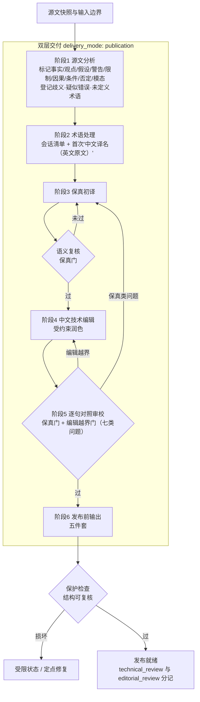

# 软件工程英译中双层发布交付模式与评测升级

## Goal Capsule

- **目标：** 把 `software-article-en-zh` 的交付模式固化为"保真优先、编辑润色受约束"的双层模型：默认 `delivery_mode: publication`，五轴交付合同成文，六阶段流程与五件套发布产物落地，并以三类真实任务评测族验证。
- **推荐路径：** 最小 diff 改写 SKILL 合同与默认值；新建 `references/publication-delivery.md` 作为六阶段、五件套与合取判定的唯一真相源；`review.schema.json` 增量扩展七类问题分类；评测新增约 9 个用例并扩展 judge 元信息剥离。
- **决策焦点：** 默认从 `faithful` 翻转为 `publication`；五轴作为模式常量而非新任务参数；存量无模式词用例保留为"新默认不破坏保真"的回归证据。
- **验证焦点：** `skill-up` 全量通过率不低于存量水位（约 69-70/70 等价）；新用例定向 3 轮稳定；schema 单测与保护检查器单测全绿；宿主镜像同步含 internal 标记。
- **最大边界：** 不引入独立审校 Agent、不宣称机器可判定"自然度"、不修复原文事实；单 Agent 上下文下 `independent_review` 仍只有真实独立复核才可标注。
- **停止条件：** 若默认翻转导致存量回归显著跌破水位且无法归因修复，回退默认值、只保留显式 publication 合同——该分叉回到用户决策。

---

## Product Contract

### Summary

将技能默认交付升级为发布型双层模式：先生成严格保真的技术译文，再在不改变语义、事实、逻辑与语气强度的前提下做受约束的中文编辑润色；发布产物固定为五件套，验收采用保真与编辑的合取判定；评测补三类真实任务族。

### Problem Frame

`software-article-en-zh` 已具备 `faithful` / `polished` / `publication` 三档交付与编辑/审校分离（见 `docs/plans/2026-09-06-001-feat-software-article-en-zh-skill-plan.md` 及 CHANGELOG 三批迭代），但发布级交付仍是 opt-in：默认 `faithful`，编辑约束散落在 `editorial-style.md` 与 `review-rubric.md`，缺一个把"保真优先、编辑受约束"作为默认交付定义的统一合同；发布产物与歧义披露没有固定清单；评测以单点保真/编辑用例为主，缺发布任务的复合验证。用户于 2026-09-07 给出完整双层交付定义（核心原则、六阶段流程、默认参数、五道验收门槛、三类评测任务与最终验证取向），要求落实到 Skill 合同与评测。

### Requirements

**交付模式与合同**

- R1. 技能整体采用双层交付模型：保真初译在前，中文技术编辑润色在后；润色不得改变原文语义、事实、逻辑与语气强度。
- R2. 默认交付为 `delivery_mode: publication`，其合同常量为：`fidelity_priority: strict`、`editorial_polish: constrained`、`source_correction: prohibited`、`ambiguity_handling: preserve_and_disclose`、`technical_review: required`。
- R3. `faithful` 与 `polished` 保留为显式降档且现行语义不变；显式 `faithful` 不执行编辑润色、不强制五件套。

**六阶段双层流程**

- R4. 源文分析识别文章类型、受众、领域与结构，标记事实、观点、假设、警告、限制、因果、条件、否定与模态，并登记原文歧义、疑似错误与未定义术语。
- R5. 术语处理沿用现行优先级链；publication 模式下术语首次出现采用"中文译名（英文原文）"形态；API、类名、命令、配置键、协议名与代码标识保留原文。
- R6. 保真初译保留判断强度、数字/单位/版本/范围/时间/条件/否定，保护代码与 Markdown 结构；不修正原文错误，只标记并说明。
- R7. 中文技术编辑调整长句、段落节奏、指代与术语解释，消除欧化与机翻腔；不新增事实、例子、因果、承诺或结论；不把 may/can/could/might 强化成确定性表达；不把建议改成要求、限制改成保证。
- R8. 最终审校对润色后译文逐句对照原文，按七类问题（漏译、误译、语义强化、语义弱化、术语不一致、结构损坏、编辑越界）检查语义、模态、因果、条件、量词、风险与责任主体；`technical_review` 与 `editorial_review` 分开记录。
- R9. 发布前输出为五件套：译文正文、简短翻译说明、技术术语表、歧义与原文问题清单、未解决事项与需作者确认事项。

**验收门槛**

- R10. 合取判定：保真失败即整体失败（漏译、误译、因果变化、模态强化、数字错误、代码破坏不可被流畅度抵消）；润色越界即整体失败；中文流畅本身不判发布就绪。
- R11. 原文歧义必须保留并披露，不得为"读起来顺"替作者选定解释。
- R12. 代码、Markdown、链接、图片、公式与占位符必须可复核；保护检查通过是发布前置条件。

**评测**

- R13. 新增三类真实任务评测族：复杂模态/条件/因果/风险表述的发布型工程文章；含代码/命令/日志/配置/Markdown/链接/图片的长文；原文有歧义、错误或立场不完整但要求发布级中文的文章。
- R14. 最终验证取向：中文工程读者愿意阅读，技术专家逐句对照时找不到未经授权的语义漂移。

### Scope Boundaries

- 本轮范围：合同默认翻转与五轴成文、六阶段映射、七类问题分类、五件套模板、三类评测族与 judge、存量回归与元信息剥离扩展、README/CHANGELOG、宿主镜像同步。

**Deferred to Follow-Up Work**

- doc 轨 publication 人工/专家取样用例（触发：主轨全绿后按需增设）。
- 跨会话术语沉淀、独立审校 Agent、网页/PDF/OCR 适配（沿 2026-09-06-001 计划 deferred 项）。

**Outside this product's identity**

- 修复原文事实、自动发布、双语对照交付、宣称机器可判定"自然度"。

---

## Planning Contract

### Key Technical Decisions

- **KTD1 — extend（合同层最小 diff）：** 默认翻转与六阶段映射通过改写 SKILL.md 现有不变量与工作流措辞落地，不重排工作流步骤编号；六阶段与现行 8 步一一对应、以阶段名标注呈现，不引入第二套流程描述。
- **KTD2 — new（有界新参考面）：** 新建 `references/publication-delivery.md` 作为六阶段细则、五件套模板与合取判定的唯一真相源，SKILL.md 只放不变量与指针。拒绝并入 `editorial-style.md`：其职责是润色规则，混入端到端交付合同会混淆关注点。
- **KTD3 — extend（审校增量兼容）：** `assets/review.schema.json` 新增可选 `issue_type` 七类枚举，与既有 `category` 四分类正交（category = 审校维度，issue_type = 问题类型）；存量记录无需迁移。
- **KTD4 — reuse/extend（judge 纪律）：** 新 judge 沿用仓库已实证的三件套纪律——句级否定感知、元信息区剥离、内容词在场防回显；剥离正则同步扩展五件套节名（术语表、歧义与原文问题、未解决事项）。
- **KTD5 — extend（回归策略）：** 存量无模式词用例不补模式词，使其成为"publication 默认不破坏保真不变量"的回归证据；只扩展受影响 judge 的剥离面。
- **KTD6 — compose（镜像同步）：** 实施尾步组合既有 `spec-first update` 与 `scripts/mark-mirror-skills-internal.py`（AGENTS.md 纪律），不新增同步逻辑。

### Assumptions

无人值守运行，以下推断未获用户逐项确认，显式标注为假设；如与意图不符，以用户裁决为准。

- A1. "默认交付 `delivery_mode: publication`" 解读为任务参数默认值翻转：未指定模式的翻译请求按 publication 双层交付。拒绝的替代读法（仅文档口径、运行时默认仍 faithful）与"落实到 Skill 合同和评测中"的要求矛盾。
- A2. 五轴作为 publication 模式的合同常量成文于 SKILL.md 与 publication-delivery.md，不新增 5 个任务参数（参数面保持 15 项）。理由：避免参数膨胀与"可调松保真"误用；轻量诉求由 faithful/polished 显式降档承担。
- A3. 五件套最小合规形态：无歧义、无问题时对应节可写"无已知…"，但节必须在场且不得虚构内容；短文 publication 任务同样适用。
- A4. "独立保真审校"在单 Agent 上下文按现行诚实口径执行：复核如实记录为 `technical_review`，不虚标 `independent_review`（沿用 2026-09-06-001 计划 KTD5）。

### High-Level Technical Design

双层流水线与回修门（阶段 5 审校对象是润色后文本，保真与越界问题分别回修）：

六阶段与现行工作流的映射（改写为标注，不重排编号）：

| 双层阶段 | 现行 SKILL 工作流 | 规则/模板 owner |
|---|---|---|
| 1 源文分析 | 步骤 2 全篇分析（新增三项登记） | `references/refined-workflow.md` |
| 2 术语处理 | 步骤 3 术语清单 | `references/terminology-policy.md` |
| 3 保真初译 | 步骤 4 初译 + 语义复核 | `references/translation-rules.md` |
| 4 中文技术编辑 | 步骤 5 编辑润色 | `references/editorial-style.md` |
| 5 独立保真审校 | 步骤 7 逐块对照（扩展为逐句 + 七类） | `references/review-rubric.md` |
| 6 发布前输出 | 步骤 8 输出（扩展五件套） | `references/publication-delivery.md` |

发布判定采用合取矩阵（R10）：

| 保真门（漏译/误译/因果/模态/数字/结构） | 编辑门（越界/自然度） | 发布判定 |
|---|---|---|
| 通过 | 通过 | 发布就绪，两类审校分开记录 |
| 未通过 | 任意 | 不可发布——流畅度不可抵消，按七类回修 |
| 通过 | 越界 | 不可发布——编辑回退或重润 |

### Evidence & Limitations

- 产品要求全部来自用户 2026-09-07 会话消息（双层模型、五轴默认、五道门槛、三类评测任务、最终验证取向），是本计划唯一产品来源。
- 包现状（SKILL.md 15 参数合同、70 用例、三个 JSON schema、references 结构、judge 剥离模式）读取自当前源码（2026-09-07）；README 所记 69-70/70 通过水位为自述，实施时以实跑为准。
- 当前工作树存在大量与本计划无关的未提交改动（leo-ppt-generator 等）；实施只触碰 `software-article-en-zh/`、`CHANGELOG.md` 与本计划文档，不得归因或覆盖无关改动。
- 宿主镜像再生成行为未在计划期验证，按 AGENTS.md 纪律在实施尾步执行并核对。

---

## Implementation Units

### U1. 合同层：默认翻转与五轴交付合同

- **Goal:** SKILL.md 与 README 将默认交付翻转为 publication，五轴合同、六阶段映射与五件套输出成文。
- **Requirements:** R1, R2, R3, R9
- **Dependencies:** none
- **Files:** `software-article-en-zh/SKILL.md`, `software-article-en-zh/README.md`
- **Approach:** 不变量"翻译准确性与中文编辑质量分开判断"条改写为：默认 `publication`（附五轴合同常量），`faithful`/`polished` 为显式降档；工作流 8 步保留编号、按六阶段名标注映射；步骤 8 输出清单在 publication 模式下扩为五件套；README 交付模式节同步改写。`analysis_depth: skip` 快路径仍仅限显式 faithful 短文。
- **Test scenarios:** 默认值、五轴值、六阶段名、五件套清单在 SKILL.md、README、publication-delivery.md 三处一致（rg 锚点核对）；显式 faithful 不强制编辑润色与五件套的表述核对；无残留"未指定时使用 faithful"旧表述。
- **Verification:** 三处合同表述一致，参数面仍为 15 项。

### U2. 参考层：发布交付参考与受约束编辑细则

- **Goal:** 新建六阶段细则与五件套模板的唯一真相源；受约束编辑、歧义披露与术语交付规则成文。
- **Requirements:** R4, R5, R6, R7, R9, R10, R11
- **Dependencies:** U1
- **Files:** `software-article-en-zh/references/publication-delivery.md`（新建）, `software-article-en-zh/references/editorial-style.md`, `software-article-en-zh/references/refined-workflow.md`, `software-article-en-zh/references/terminology-policy.md`
- **Approach:** publication-delivery.md 定义六阶段各自的输入/输出/门：阶段 1 标记清单与三项登记（歧义、疑似错误、未定义术语并入会话挑战清单）；阶段 3 引用既有 translation-rules 保真规则与"标记不修正"口径；阶段 4 编辑越界反例（新增事实/例子/因果/承诺/结论、模态强化、建议变要求、限制变保证）；阶段 5 逐句对照与七类问题引用；五件套模板与最小合规形态；合取判定矩阵。editorial-style.md 增补越界反例并与 issue_type 关联；refined-workflow.md 全篇分析清单补三项登记、产物顺序对齐阶段名；terminology-policy.md 成文 publication 首次形态"中文译名（英文原文）"与交付术语表列形态（source/target/sense 备注）。
- **Test scenarios:** publication-delivery.md 与 SKILL 不变量、review-rubric 七类名、schema 枚举无矛盾；五件套节名与 U5 剥离正则一致；越界反例覆盖 R7 全部禁项；术语首次形态规则不波及 API/标识符保留原文的既有规则。
- **Verification:** 关键名词（五轴值、七类问题、五件套节名）单一来源、其余文件指针引用；无重复真相源。

### U3. 审校层：七类问题分类与合取判定

- **Goal:** review 资产支持七类问题记录，rubric 定义分类、严重性映射与最终审校语义。
- **Requirements:** R8, R10, R12
- **Dependencies:** U1
- **Files:** `software-article-en-zh/assets/review.schema.json`, `software-article-en-zh/references/review-rubric.md`, `software-article-en-zh/tests/test_review_schema.mjs`（新建）
- **Approach:** schema 新增可选 `issue_type` 枚举（`omission` / `mistranslation` / `intensification` / `weakening` / `terminology_inconsistency` / `structure_damage` / `editorial_overreach`），与 `category` 正交；rubric 定义七类中英对照、严重性映射（漏译/误译/结构损坏 ≥ major；强化/弱化按影响 major 或 critical；编辑越界 ≥ major）、最终审校对象为润色后文本逐句对照原文、合取判定（编辑通过不抵消保真失败）。
- **Test scenarios:** 含 `issue_type` 的记录通过且缺省仍通过（向后兼容）；非法 `issue_type` 拒绝；七类枚举与 rubric 名称一一对应。
- **Verification:** `node --test software-article-en-zh/tests/` 全绿（含既有 test_protection.mjs）。

### U4. 评测层：三类真实任务新用例与 judge

- **Goal:** 新增三类评测族（约 9 用例）与配套 script judge，验证双层合同与合取门槛。
- **Requirements:** R2, R7, R8, R9, R10, R11, R12, R13, R14
- **Dependencies:** U1, U2, U3
- **Files:** `software-article-en-zh/evals/eval.yaml`, `software-article-en-zh/evals/cases/`（新增约 9 个 `publication-*.yaml`）, `software-article-en-zh/evals/fixtures/scripts/`（新增对应 judge）
- **Approach:** eval.yaml 新增分组 D12"发布型双层交付"。族 A 保真复合：一段含 MUST/SHOULD/MAY、条件链、相关性与风险弱化的工程文本，请求发布级润色；judge 用保真锚点（应当/可以/只有在…时/与…相关）+ 承诺词句级否定感知（无原文依据不得出现"保证/一定/确保"）+ 自然度锚点；另设建议强度与风险弱化两个变体。族 B 长文混合结构：内联合成长文（约 600-800 词，多代码块、命令、日志、配置、链接、图片、脚注），judge 检查围栏/行内代码/链接目标/图片路径计数一致、硬段内容词覆盖、术语首现与同篇一致锚点、保护检查报告在场；另设五件套在场用例（含最小合规形态）。族 C 原文缺陷 + 发布要求：辖域歧义句须披露两种读法并邀请作者确认、不得静默选定；原文事实错误须标记不修正；立场不完整时不得替作者补立场。另加 1 例无模式词默认请求走双层并交付五件套。新 judge 遵守 KTD4 纪律，锚点集先经构造的假阴/假阳样本自检再定稿。
- **Execution note:** 每个 judge 先写构造样本（应过/应拒各一组）自检，再接入 eval.yaml，沿用仓库"先取证后定稿"的评测纪律。
- **Test scenarios:** 每个新用例定向实跑校准至少 3 轮全过；假阴/假阳构造样本行为符合预期；`skill-up validate evals/eval.yaml` 通过。
- **Verification:** 新用例全部纳入 eval.yaml 且定向 3 轮稳定；judge 均为句级否定感知检查而非全文包含。

### U5. 评测层：存量回归与元信息剥离扩展

- **Goal:** 默认翻转下存量 70 用例回归不低于水位，judge 剥离正则覆盖新交付节。
- **Requirements:** R10, R12, R13, R14
- **Dependencies:** U4
- **Files:** `software-article-en-zh/evals/fixtures/scripts/`（受影响存量 judge）, `software-article-en-zh/README.md`（用例数与维度描述 70 → 约 79）
- **Approach:** 排查全部存量 judge 的输出面假设，扩展元信息剥离正则至五件套节名（术语表、歧义与原文问题、未解决事项、翻译说明）；存量无模式词用例保持原输入（KTD5）；全量 run + 历史抖动用例定向复跑；README 用例数与 D12 维度描述同步。
- **Test scenarios:** 剥离正则用构造样本自检（含五件套标题的样本正确剥离、纯正文样本不受影响）；全量 run 通过率不低于存量水位等价；`--iteration 3` 抽样新增与历史抖动用例无系统性失败；失败样本逐个归因。
- **Verification:** `cd software-article-en-zh && skill-up run evals/eval.yaml` 结果记录在案；抽样记录在案；无未归因失败。

### U6. 文档、变更记录与宿主镜像同步

- **Goal:** 包文档与仓库变更记录一致，宿主镜像含新合同并保持 internal 标记。
- **Requirements:** R2, R9
- **Dependencies:** U1-U5
- **Files:** `software-article-en-zh/README.md`, `CHANGELOG.md`
- **Approach:** CHANGELOG Unreleased 增条目（(user-visible)）：默认翻转、五轴合同、六阶段、七类问题、五件套、三类评测族与回归结果；README 能力面/交付模式/评测节复核；执行 `spec-first update` 后重跑 `python3 scripts/mark-mirror-skills-internal.py` 并核对镜像技能含 `metadata.internal: true`。
- **Test scenarios:** Test expectation: none -- documentation, changelog and mirror sync only.
- **Verification:** README、SKILL.md、eval.yaml 用例数一致；镜像标记核对通过；CHANGELOG 条目含验证命令与结果。

---

## Verification Contract

| Gate | Applies to | Command / signal |
|---|---|---|
| 合同一致性 | U1-U3 | rg 锚点核对：默认值、五轴值、六阶段名、五件套节名、七类问题名在 SKILL/README/references/schema 单一来源且一致 |
| Schema 兼容 | U3 | `node --test software-article-en-zh/tests/` 全绿 |
| 保护检查器回归 | U2-U5 | `node --test software-article-en-zh/tests/test_protection.mjs` 全绿 |
| 评测配置校验 | U4-U5 | `cd software-article-en-zh && skill-up validate evals/eval.yaml` 通过 |
| 全量评测 | U4-U5 | `skill-up run evals/eval.yaml` 通过率不低于存量水位等价（约 69-70/70），失败逐个归因 |
| 稳定性抽样 | U4-U5 | `skill-up run evals/eval.yaml --iteration 3`：新增与历史抖动用例无系统性失败 |
| 镜像同步 | U6 | `spec-first update` 后 `python3 scripts/mark-mirror-skills-internal.py`；镜像技能含 `metadata.internal: true` |

---

## Definition of Done

- 默认 `delivery_mode: publication` 与五轴合同在 SKILL.md、README、publication-delivery.md 三处一致成文；faithful/polished 显式降档语义保持，参数面仍为 15 项。
- 六阶段映射落进工作流；五件套模板与最小合规形态成文；合取判定（保真失败或润色越界即不可发布）成文。
- review.schema `issue_type` 七类落地且向后兼容；rubric 映射与最终审校语义一致。
- 新增三类评测族（约 9 用例）定向 3 轮全过；judge 经假阴/假阳样本自检；元信息剥离扩展覆盖五件套节名。
- 存量回归不低于水位；README 用例数与维度同步；CHANGELOG 条目含验证命令与结果；镜像同步完成。
- 无 Critical 未闭环；实施 diff 未触碰 `software-article-en-zh/`、`CHANGELOG.md` 与计划文档之外的无关改动。

---

## Risks & Dependencies

- 默认翻转抬升简单请求的输出重量：以五件套最小合规形态与显式 faithful 降档缓解；全量轮观察耗时变化。
- 新交付节触发存量 judge 正文检查（仓库已知的系统性问题模式）：剥离正则先行扩展、构造样本自检、定向回归兜底。
- publication 自然度无法由脚本完全判定：锚点式判定 + doc 轨人工取样（deferred），不宣称机器可判自然度。
- judge 锚点字面过窄的历史复发风险：沿用否定感知与实测锚点迭代纪律，新 judge 必须经构造样本校准。
- 当前工作树含大量无关未提交改动：实施隔离本包与文档文件，提交前单独核对。
