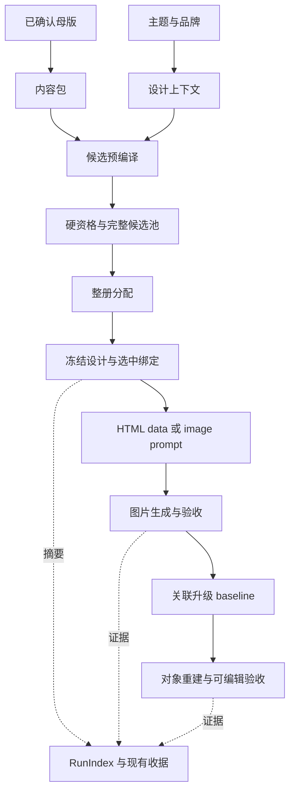
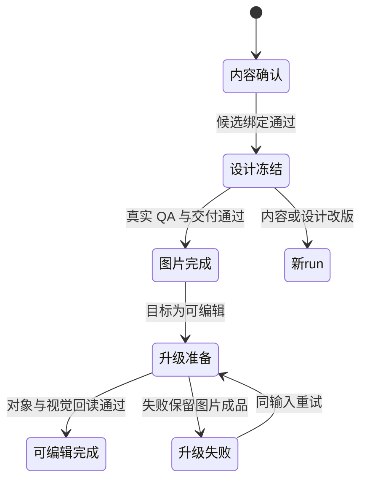

# 接通内容投影与整册版式分配

## Goal Capsule

将已确认母版、候选承载检查、冻结设计、正式页图生成和关联可编辑升级接成可验证的完整路径，提高内容保真、恢复能力和整册表达质量。
采用分析方案 v3 的 U1–U7 全范围，复用现有 resolver、主题/容量所有者、RunIndex、四条执行路线和交付收据。
当前用户调用 spec-lfg 授权本期实现与 PR 交付；分析文档是设计输入，源码与真实产物决定证据结论。
最大风险是内容映射只在测试中生效，正式入口继续消费独立数据，以及将图片阶段成功误记成可编辑目标完成。
所有单元、本地行为验证、真实路线和整册对照均完成才算实施完成；Provider 费用预算未确定只阻塞付费验收，不阻塞本地实现。

---

## Product Contract

### Summary

母版保持唯一可编辑内容源。确定性内容包经过候选槽位编译、硬资格检查和整册分配后冻结设计，生成消费同一绑定。可编辑目标从真实图片交付进入独立关联升级 run。

### Problem Frame

现有推荐软分能掩盖容量失败，推荐缺少媒体承载检查；内容与设计组合尚未成为正式生成共同输入。模板依赖采集仍引用旧目录，无法完整解释成品的新鲜度。增加模板数量不能单独解决这些问题。

### Requirements

| ID | 要求 | 实施 |
|---|---|---|
| R1 | image/HTML 页图及后续 editable 重建保持必需事实、数值、单位、期间、来源和页面身份 | U2/U3/U4/U7 |
| R2 | 自动候选必须通过角色、结构、容量、媒体、backend 和映射覆盖检查；预检不冒充成品检查 | U1/U3/U5 |
| R3 | 样张、生成、重试、恢复与交付使用同一冻结输入，实际依赖改变使关联证据失效 | U1/U4/U7 |
| R4 | 结构服务论点和证据，整册避免无意义重复，用真实成品对照验证收益 | U5/U6/U7 |
| R5 | 内容、几何、主题、渲染、状态和收据分别只有一个所有者，新增资产流程可验证 | U1–U7 |

### Scope Boundaries

实现范围为 `leo-ppt-generator/`，同步根 `CHANGELOG.md`。不移植 Dashi React 编辑器、主题库或 HTML-to-PPTX 引擎，不建立兄弟仓库运行时依赖，不引入业务 JSON 直编原生对象路线。
新协议直接切换，旧 run 无法证明合同则明确失效，既有成品保留。已 prepare 后内容/设计/顺序改版建立新 run；同冻结输入重试仍使用原 run。
direct-editable 保持可信源页权威；upgrade-selected 保持原有选页和 partial 规则。浏览器编辑、任意 bespoke 页面和大规模扩库不在本期。

### Acceptance Examples

- AE1：99999 字的封面候选被排除，即使角色和节奏分很高；无合格候选返回原因。
- AE2：母版插页或换序后未修改页的 page ID 不变，数值的单位和期间不被合并。
- AE3：compare 输入 1 或 3 组明确拒绝，2 组完整展示；增加媒体数量会改变候选资格。
- AE4：源图片交付成功而升级失败时，保留原图片交付，可编辑目标仍未完成；导入后移走源目录不影响目标恢复。
- AE5：完整候选池的第三候选能解决全局约束；预算耗尽与无候选分别报告。
- AE6：修改实际消费模板使收据 stale，修改未消费资产或计时日志不造成误失效。

---

## Planning Contract

### Evidence & Limitations

源码基线为 `f4f52d5a5f5c42645bafbfc4b060a6ba216aa05e`。当前工作树已有 workflow 镜像及治理文件修改，实施不接管这些路径。2026-09-10 恢复运行：目标包存在上一轮未提交的 U1 范围变更（共享容量判据、agenda schema、收据真实模板依赖采集及对应测试），spec-work 检查点 `dashi-20260910` 记录 U1 定向验证通过、U2 实验已回退、U3–U7 未开始；实施继续在该未提交基线上推进并在收尾时整体重新验证。
核对 `scripts/suggest_layout.py` 确认未知角色中性评分、容量软分和缺少媒体投影；`render/receipt.py` 实际扫描 `assets/render-templates`；`templates.py` 的 `compose_design()` 已拥有主题覆盖与表格容量；`reproject_derivatives.py` 已拥有图行与登记表解析，但 page ID 来源仍为序号。
以上路径位于 `leo-ppt-generator/`；`runtime/src/leo_ppt_generator/upgrade/baseline.py` 已复制源页及交付物，并校验摘要，适合作为关联升级扩展点。正式 CLI 目前分别提供 render、image、editable 和 upgrade，不另建执行引擎。
分析方案 E1–E10 的运行探针属于历史证据；本轮规划只核对源码，未执行测试或 Provider。Dashi 仅作为已完成分析的设计来源，无新增外部事实主张。

**2026-09-10 实施后真实路线验证补录**（用户授权"不限制预算，全力投入开发"）：

- 正式路线六项全部以真实入口执行并留档于 `/tmp/dashi-realrun/`：全 HTML（gen-1，真实 chromium 三页渲染，逐页视觉核验与冻结绑定逐字一致，收据 fresh 含 content_binding）；含真实 image（gen-3，ark/doubao-seedream-4-0-250828 真实付费 4 次调用：3 次拒绝——字体名被画成伪表格、风格锁色号回显、画幅规格被画出——第 4 次过闸，必需文本逐字核对通过，收据 fresh）；generate→upgrade-full（gen-1 → upg-1：inspect 携带 content_digest/design_digest、import-baseline 复制双快照、`load_baseline` 无源恢复成功）；direct-editable（dir-1：3 页 worker 手写对象 manifest、upstream build+validate 通过、finalize 后 python-pptx 回读真实文本对象逐字吻合）；upgrade-selected（ups-2：混合 3 页 = 1 可编辑 + 2 基线图片，页尺寸合同对齐 10.0×5.625in）；父成功/升级失败（ups-fail：选定页未落成时组装被 `partial_hybrid_confirmation_required` 拒绝，无 final 产物，基线与源交付 sha 不变）。
- 真实运行暴露并修复一个收据缺陷：模板根回退 canonical 库且存在冻结设计绑定时，run 外模板文件按 run 相对路径取键直接崩溃；修复为按模板库根锚定并以 `library/` 前缀入指纹（`tests/test_delivery_receipt.py` 红绿回归，全套 1807 用例重跑 OK）。
- 坏 supplemental 输入（如缺 `kind` 的 layout-selection）会先 CAS 冻结再被合同校验拒绝，导致该 run 对同名输入永久指纹冲突——fail-closed 但把 run 卡死；与审查 residual 已登记的「freeze 顺序」类问题同源，留待该渠道跟踪（复现于 gen-2，未修复）。
- 4 组管理层盲评未执行（独立评审不可得，blocked/not_run）；成本账：真实付费调用共 4 次 image generate（2560×1440，3 弃 1 收），无其他费用。

### Key Technical Decisions

- KTD1（extend/new）：公共母版解析进入 runtime `content_pack.py`，现有重投影脚本和检查器共同消费；复用最高 confirmed 基线算法。新内容包是有版本、母版 SHA、revision 和内容摘要的单向派生物，不允许反写。稳定页/项身份写在母版，展示顺序独立。来源流程字段仅在 page ID、figure ID、素材输入摘要均匹配时继承。
- KTD2（extend）：从 `templates.py` 抽取设计上下文，沿用 `compute_effective_theme()` 与 `render/layout.py`。候选和冻结设计使用相同主题、品牌、字体、约束与资产摘要。未知角色或必要能力未知均不能自动选中；显式 layout 也执行硬检查。
- KTD3（new）：`content_projection.py` 只拥有内容项到槽位/数据路径的编译和执行物化。预编译先于设计冻结，选中绑定进入 resolved design；物化不得二次概括、改字号或重选布局。HTML 嵌套输入形状由 template manifest 定义，image 只作声明容量预检。
- KTD4（compose）：正式 run/image/render 入口绑定内容、设计、页 ID/number 和投影摘要。升级由既有 RunIndex 与 baseline 协调 source run、交付 SHA、内容/设计快照和 backend 合同；复制及校验全部完成才发布 baseline。幂等冲突拒绝，失败向上传播；不新增总任务状态。
- KTD5（new/extend）：`layout_selection.py` 对完整合格池做确定性有界搜索，Top-2 仅展示。structure 声明含阅读顺序、分组关系和编码，不含颜色、文案、资产名或第二套几何。引用重命名不改变结构身份；unknown 不获得多样性奖励。max_per_deck 只按现有禁复用合同生效。
- KTD6（reuse/extend）：首批为 7 个 HTML 绑定 profile 和四类任务所需 image profile，先验证现有承载能力再决定新增资产。`capability_manifest.py` 从 canonical 声明和真实验证记录派生准入，不另写注册名单。
- KTD7（extend）：RunIndex 从领域文件重建引用与进展；现有收据记录实际使用依赖和最终产物映射。库外资产冻结到 run，记录稳定 ID 和摘要；不通过整库扫描模拟实际使用。旧协议直接拒绝，撤回通过代码回退且保留交付物，不重写历史 run。

### Interface Contracts

| 接口 | 所有者与消费者 | 合同与验证 |
|---|---|---|
| 母版 → 内容包（new） | `runtime/src/leo_ppt_generator/schemas/page-content-pack-v1.schema.json`；U2 创建，重投影/候选/升级读取 | 稳定身份、正文/notes/engineering 隔离；未知必需字段报母版位置；schema 与解析测试共同验证 |
| 候选 → 冻结设计（evolution） | `templates.py`、`content_projection.py`；推荐与正式执行 | 同上下文/内容/资产/编译器摘要；映射完整，否则拒绝；U3/U4 集成测试 |
| layout/template（evolution） | `template-library/governance/schemas/`；resolver、渲染、lint | 槽位类型、容量、媒体、嵌套数据和 structure；直接切换；7 模板及真实资产验证 |
| 生成 → 升级（evolution） | `upgrade/baseline.py`；CLI、EditableAdapter、RunIndex | source run/交付/内容/设计/backend 绑定，不信任未知 Office；U4 真实关联及失败注入 |
| 状态/交付（evolution） | `application/run_index.py`、`render/receipt.py` | CAS、页身份与顺序、实际依赖摘要、QA/最终文件；U7 漂移与恢复验证 |

表中 runtime 路径均相对 `leo-ppt-generator/`。机器合同由 schema 或既有领域 manifest 拥有，文档只解释行为。

### High-Level Technical Design

### Risks & Dependencies

执行按 U1 → U2 → U3 → U4 → U5 → U6 → U7；U3 编译器验证不能替代 U4 正式接入，U7 必须使用 U5/U6 最终资产重跑。
真实图像/对象重建需要可用 Provider、预算及原有信任边界；当前用户已以"不限制预算，全力投入开发"答复预算问题，付费验证按既有授权与信任边界执行，逐次记录调用与费用，失败样本照常保留。4 组独立盲评另需实际独立评审证据，代码审查不能替代视觉评审。
本期无交互网站，但有真实 HTML 渲染与浏览器验收义务；LFG 浏览器检查适用，调用前须由调用方提供精确 target-origin，缺失时保留阻塞，不猜测端口。
API/CLI、数据合同、模板、Agent prompt、测试和交付均在范围内；配置 UI 无变更目标。

---

## Implementation Units

### U1. 修正现有合同缺口

**目标与要求：** R2/R3/R5；无依赖。先以失败用例重现 E1/E3/E4，再修容量硬排除、agenda schema 与真实模板依赖采集。
**文件：** `leo-ppt-generator/scripts/suggest_layout.py`、`leo-ppt-generator/scripts/check_deck_geometry.py`、`leo-ppt-generator/scripts/lint_layout_grid.py`、`leo-ppt-generator/runtime/src/leo_ppt_generator/render/layout.py`、`leo-ppt-generator/runtime/src/leo_ppt_generator/render/receipt.py`、`leo-ppt-generator/template-library/governance/schemas/layout-profile-v1.schema.json`。
**测试：** `leo-ppt-generator/tests/boundary/test_suggest_layout.py`、`leo-ppt-generator/tests/test_library_contracts.py`、`leo-ppt-generator/tests/test_delivery_receipt.py`。覆盖 AE1/AE6、正常容量边界、42 profile schema、模板修改/删除及日志不失效；U7 补齐完整依赖图。沿用 require_capacity 与 resolver，不另写容量策略。

### U2. 扩展母版解析与稳定身份

**目标与要求：** R1/R5；依赖 U1，落实 KTD1。
**文件：** 新增 `leo-ppt-generator/runtime/src/leo_ppt_generator/content_pack.py`、`leo-ppt-generator/runtime/src/leo_ppt_generator/schemas/page-content-pack-v1.schema.json`；扩展 `leo-ppt-generator/scripts/reproject_derivatives.py`、`leo-ppt-generator/scripts/check_master_contract.py`、`leo-ppt-generator/references/deck-master.md`，按需要扩展既有基线/影响计算所有者。
**测试：** 新增 `leo-ppt-generator/tests/test_content_pack.py`；扩展 `leo-ppt-generator/tests/test_reproject_derivatives.py`、`leo-ppt-generator/tests/boundary/test_master_contract.py`、`leo-ppt-generator/tests/test_check_content_baseline.py`、`leo-ppt-generator/tests/test_compute_impact.py`。覆盖 AE2、数字不同单位/期间、正文与图行完整、素材变更禁止继承旧 hash、pending 非基线、手改内容包拒绝、工程备注不入 notes、CAS 冲突拒绝。先刻画原解析行为再抽取公共模块；旧母版补身份须形成合法新母版。

### U3. 共用候选预编译与执行投影

**目标与要求：** R1/R2；依赖 U2，复用 U1 容量，落实 KTD2/KTD3。
**文件：** 新增 `leo-ppt-generator/runtime/src/leo_ppt_generator/content_projection.py`；扩展 `leo-ppt-generator/runtime/src/leo_ppt_generator/templates.py`、`leo-ppt-generator/runtime/src/leo_ppt_generator/render/page.py`、`leo-ppt-generator/runtime/src/leo_ppt_generator/render/layout.py`、模板/layout schema 与首批 canonical 资产、`leo-ppt-generator/scripts/lint_template_contract.py`。
**测试：** 新增 `leo-ppt-generator/tests/test_content_projection.py`；扩展 `leo-ppt-generator/tests/test_templates.py`、`leo-ppt-generator/tests/test_template_contract.py`、`leo-ppt-generator/tests/render/test_page.py`、`leo-ppt-generator/tests/render/test_overflow_sentinel.py`。覆盖 AE3、品牌字体一致、冻结前后绑定摘要一致、来源保留、未知媒体能力拒绝、隐藏/裁切必需项失败；image prompt 覆盖不能算最终保真。

### U4. 接通正式生成与关联升级

**目标与要求：** R1/R3；依赖 U3，落实 KTD4。先用合格候选接通，U5 替换选择接口后重跑。
**文件：** `leo-ppt-generator/runtime/src/leo_ppt_generator/cli.py`、`leo-ppt-generator/runtime/src/leo_ppt_generator/application/run_index.py`、`leo-ppt-generator/runtime/src/leo_ppt_generator/application/sample_decisions.py`、`leo-ppt-generator/runtime/src/leo_ppt_generator/upgrade/baseline.py`、image/editable adapter、`contracts.py`；同步 `leo-ppt-generator/scripts/check_sources_manifest.py`、来源/执行/图片/可编辑引用、`leo-ppt-generator/SKILL.md` 与三个 worker prompt。
**测试：** 新增 `leo-ppt-generator/tests/test_design_execution_binding.py`、`leo-ppt-generator/tests/test_generate_upgrade_binding.py`；扩展 `leo-ppt-generator/tests/test_design_projection.py`、`leo-ppt-generator/tests/test_sample_decisions.py`、`leo-ppt-generator/tests/test_sources_freeze.py`、`leo-ppt-generator/tests/test_library_bundle.py`。覆盖 AE4、篡改拒绝、重复创建重放、复制中断不发布、源目录移走后恢复、backend/内容冲突、未知 Office 信任门、prepare 后改版新 run、direct-editable 原路成功。

### U5. 结构声明与整册分配

**目标与要求：** R2/R4/R5；依赖 U3/U4，落实 KTD5/KTD6。
**文件：** 新增 `leo-ppt-generator/runtime/src/leo_ppt_generator/layout_selection.py`；扩展 canonical layout 与 schema、`leo-ppt-generator/runtime/src/leo_ppt_generator/layout_bank.py`、`templates.py`、`leo-ppt-generator/scripts/suggest_layout.py`、`leo-ppt-generator/scripts/capability_manifest.py`、`leo-ppt-generator/references/layout-dispatch.md`。
**测试：** 新增 `leo-ppt-generator/tests/test_deck_layout_selection.py`；扩展 `leo-ppt-generator/tests/boundary/test_suggest_layout.py`、`leo-ppt-generator/tests/boundary/test_layout_reuse.py`、`leo-ppt-generator/tests/test_library_contracts.py`、`leo-ppt-generator/tests/test_capability_manifest.py`。覆盖 AE5、改色改名指纹不变、阅读顺序/分组/编码改变指纹变化、无 regions 不伪造几何、unknown 准入、普通版式可重复、搜索超预算与空池区别、确定性重放、声明与真实样张一致。

### U6. 补齐四类结构与资产流程

**目标与要求：** R4/R5；依赖 U3/U5，按分析方案 K6 承载指标与基准、趋势与事件、决策矩阵、流程与责任。
**文件：** `leo-ppt-generator/template-library/canonical/layouts/`、`leo-ppt-generator/template-library/canonical/templates/` 及 README；`leo-ppt-generator/scripts/capability_manifest.py`；新增 `leo-ppt-generator/tests/fixtures/dashi-integration/`。图表继续复用 `render/chart.py`。
**测试：** `leo-ppt-generator/tests/test_capability_manifest.py`、`leo-ppt-generator/tests/test_template_contract.py`、`leo-ppt-generator/tests/render/test_chart.py`、`leo-ppt-generator/tests/test_render_theme_baseline.py`。四类各有正常、近容量、超容量和缺关键数据负例；换肤不改业务内容与结构；7 模板无回归；新资产经 lint、索引、正式生成可达。新增数量由真实缺口决定，不为模板虚构基准、时间或建议。

### U7. 状态、交付与整册收益验收

**目标与要求：** R1/R3/R4/R5；依赖 U1–U6，落实 KTD7 与分析方案第 7 节全部验收。
**文件：** `leo-ppt-generator/runtime/src/leo_ppt_generator/application/run_index.py`、`leo-ppt-generator/runtime/src/leo_ppt_generator/render/receipt.py`、`leo-ppt-generator/runtime/src/leo_ppt_generator/evidence.py`、`contracts.py`、`upgrade/baseline.py`、`hybrid/assembler.py`、`leo-ppt-generator/scripts/build_delivery_preflight.py` 和执行引用。
**测试：** 新增 `leo-ppt-generator/tests/test_deck_projection_view.py`；扩展 `leo-ppt-generator/tests/test_delivery_receipt.py`、`leo-ppt-generator/tests/test_compute_impact.py`、`leo-ppt-generator/tests/test_build_delivery_preflight.py` 和 U4 关联升级测试。状态可重建、CAS 冲突、页序/内容/实际依赖漂移、未用资产不失效、upgrade 快照不被源新版回写、对象/渲染/notes/页数/身份一致。
**验证：** 用最终资产重跑全部正式路线与下述整册对照，不能以局部 fixture 替代真实链路。

---

## Verification Contract

实现阶段确定当前 Python 3.12 环境并运行包级 unittest；以下路径以仓库根为基准，包内 lint 按其声明工作目录执行。

| 范围 | 必要检查 | 通过条件 |
|---|---|---|
| U1–U7 | `python3 -m unittest discover -s leo-ppt-generator/tests -p 'test_*.py'`，并明确递归子套件覆盖 | 所有适用测试通过，无把失败改成 skip |
| 资产 | `lint_style_briefs.py`、`lint_layout_grid.py`、`lint_template_contract.py` | 按各自 CLI 执行，新增资产无错误，无新增白名单逃逸 |
| 技能行为 | `skill-up run evals/eval.yaml`（包目录） | 记录真实引擎、范围与结果，未运行不能记通过 |
| 正式路线 | 全 HTML、含真实 image、generate→upgrade-full、direct-editable、upgrade-selected | 每条实际入口及成品、SHA、页序、notes、QA、收据可核对；含一次父成功/升级失败 |
| 浏览器 | HTML 可见 DOM、图表系列/标签、裁切/遮挡及 LFG 精确 origin 检查 | 实际可见且无缺陷，清理成功；缺 origin 记阻塞 |
| 整册质量 | 4 组管理层任务，每组 6–8 页，冻结材料、母版、环境、策略与评判规则 | 硬缺陷为 0；4 组有效配对独立盲评，至少 3 组偏好新版且无关键维度退步 |
| 成本 | 时间、人工返工、调用数、费用、重试、首次成功率，累计生成与升级两段 | 冻结预算后调用，保留失败样本；超限停止，不宣称未经证明的效率收益 |
| 完整性 | `git diff --check`，计划要求与实际变更/测试映射 | 无遗漏单元，现有无关修改保留 |

对照前保存原始基线和资产快照；共同可表达任务用于配对盲评，新增结构只算能力覆盖。先以植入的错数、漏项、来源错配、裁切、不可读、空媒体、错页序验证验收器能发现问题。配对不足如实报告，不换题或改分母。image 必须回读真实图片；editable 必须核对真实对象与渲染。不得用 Mock、prompt 文本或生成者自评替代这些证据。
预算、Provider 或独立评审不可用时，本地测试仍可继续，但对应必要验证为 blocked/not_run，整体不能完成或发布为已验收。

---

## Definition of Done

U1–U7 全部落实且每项验收有可追溯证据；正式 CLI、worker、恢复路径消费统一绑定，所有失败语义成立；新增资产经过真实样张准入；完整验证合同通过。
同步根 `CHANGELOG.md`，面向用户条目标 `(user-visible)`；清除本次废弃尝试和无价值临时产物，保留必要样本及证据，不提交缓存、凭据或机器配置。
独立代码审查、最终工作树验证与指纹一致后才进入 PR/CI；报告分别给出 structure_contract、behavior_quality、runtime_cost、field_outcome。未观测真实用户收益保留未验证，不由单测或模型评分外推。
