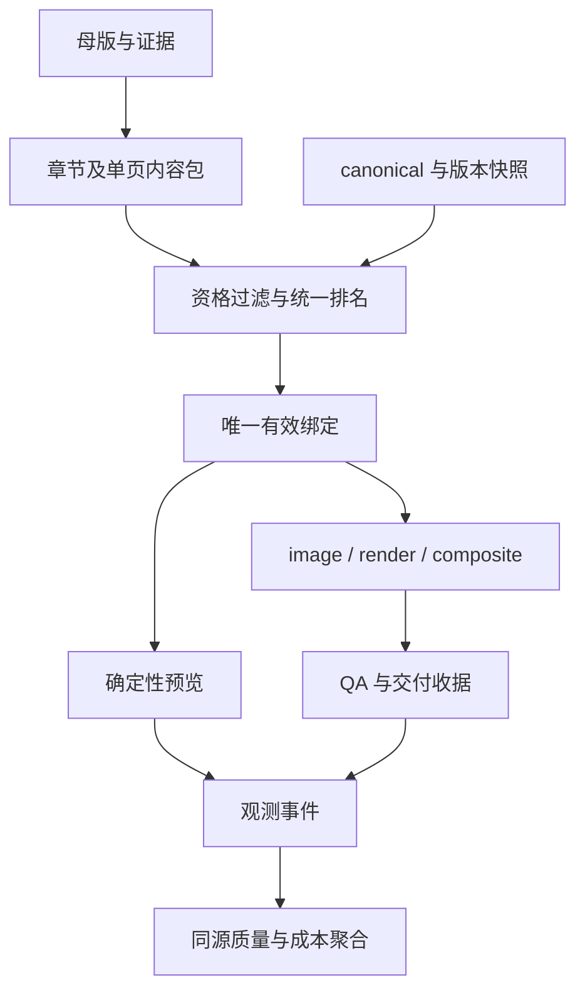
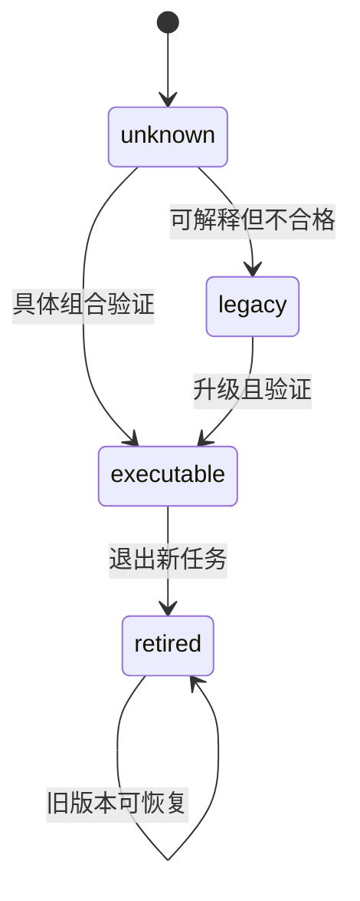
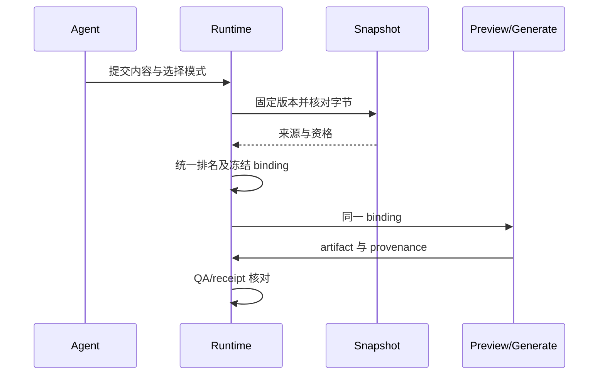

# PPT 内容驱动能力全量提升 - Plan

## Goal Capsule

把已签发 PRD 的全部 13 项活跃需求接入现有生成链：内容分析、设计资格与唯一绑定先行，预览消费同一绑定，度量记录真实事件，后续分批完成 composite、OCR、成本路由、披露和素材复用。
用户明确选择“全部签发”，本计划覆盖两波；条件门仍须依据真实证据决定是否晋升，不把功能代码存在当作验收完成。
推荐扩展现有 canonical/resolver/content pack/render/receipt，不重建第二条生成管线。
最大风险是全库语义升级与真实输出质量：缺少人工视觉、真实调用或完整统计证据时保留未验收状态。模板库结构迁移和兼容策略由关联的 004 方案单独拥有。
LFG 持有提交、推送、PR 与一次独立代码审查授权；本计划不授予新增付费调用、公开发布或 merge 权限。

## Product Contract

### Summary

为委托 Agent 制作管理汇报、答辩、技术与教学 PPT 的用户，保证内容表达、可执行资产、整册视觉与最终交付一致。产品真源为 origin v1.8.1；正文每项验收与例外均适用，本节仅作阅读索引，不替代原文。

### Problem Frame

当前 `suggest_layout.py` 的语义推荐和 `layout_selection.py` 的整册排序不同；catalog 的可发现不等于特定 lane、内容边界和版本组合可执行。现有费用 sidecar 缺调用唯一身份，不能用累计 tokens 再乘 attempts 或将缺失当零。

### Requirements

| 领域 | 原需求与验收 | 本计划承载 |
| --- | --- | --- |
| 最小观测与完整度量 | R-77 / AE-77 | U1、U2、U13 |
| 内容与风格库 | R-85a/b / AE-85 | U3、U4、U5、U6、U12 |
| 预览 | R-71 / AE-71 | U7 |
| composite | R-70a/b/c / AE-70 | U8 |
| OCR 与 blocked 口径 | R-73 / AE-73 | U9 |
| lane 成本选择 | R-74 / AE-74 | U10 |
| 容量提案与简报 | R-75、R-76 / AE-75、AE-76 | U11 |
| diff、alt 与讲稿 | R-78、R-79、R-82 / AE-78、AE-79、AE-82 | U14 |
| 本地素材缓存 | R-80 / AE-80 | U15 |
| 图表基线 | R-84 / AE-84 | U16 |

### Scope Boundaries

R-83/AE-83 保持暂缓，R-81/AE-81 保持关闭但正文列明残留债务进入 U13，R-72/AE-72 保持移除。色觉模拟、原生图表 XML、动态偏好、跨机同步、控制台重设计和兄弟技能不在实现范围。
不得降低 30 格、留出集、视觉、成本、TF、OCR、预览性能门槛；真实用户收益未观测单独披露，不阻断不依赖该收益的机制。
产品决定：用户“全部签发”选择全量范围，相对于仅波 1 的建议；这是整体批准，不是逐项人工测试。

## Planning Contract

模板库结构、协议、消费者和迁移相关内容以 004 为唯一活动 owner。004 在完成 catalog/fallback、composition 身份、消费者闭合和原子迁移合同复核前，003 不得把 `artifact_readiness` 或 U12 supersede 解释为可实施完成；其余能力单元继续保持独立 owner。

### Evidence & Limitations

基线为当前 dirty worktree，非纯 HEAD。既有源码与生成资产修改属于进入本任务前的工作，不归本轮成果；实现前保存每个拟修改文件的字节哈希和差异，提交只能包含本轮可归属增量。
已读源码：`leo-ppt-generator/runtime/src/leo_ppt_generator/content_pack.py`、`content_projection.py`、`layout_selection.py`、`asset_resolver.py`、`page_intent.py`、`render/page.py`、`render/receipt.py`、`cli.py` 的相关入口，以及 `scripts/suggest_layout.py`、`estimate_run_cost.py`、`library_catalog.py`。
源码确认：费用写方在 cli 而非独立 backend_stats 模块；render_page 每页创建字体 server 与 browser；receipt 枚举 reports JSON，但当前不枚举顶层 scorecard/previews/diffs。每项需要运行回归，不将静态读源码等同验证。
历史计划消歧：复用 `2026-09-11-002-page-intent-style-routing-plan.md` 已有 regime/意图层；补充 `2026-09-11-001-fix-leo-ppt-render-quality.md` 的渲染资格与视觉核验；`2026-09-08-001-feat-leo-ppt-template-quality-plan.md` 中不保留旧 run 的取舍在本范围由新 PRD 的版本恢复要求替代，**但模板库结构迁移、旧协议兼容和相关恢复能力由 004 U7–U11 supersede**；其他未验收项不能自动结项。旧文档不重写。
本计划其余关于旧 run、版本兼容、generation 回滚和用户库保留的条款，仅适用于 004 未接管的 R-85 表面；凡涉及 `template-library` 的结构、协议、消费者和迁移，均以 004 的 supersede 表和唯一新协议为准。
规划研究串行执行，无额外研究 worker 授权；独立文档审查未运行，不冒称专家评审。外部模型选型尚未实测，U15 的模型适配只在本地文件存在且许可登记后启用；无模型时按原需求降级。

### Key Technical Decisions

- KTD1（extend）：度量进入 runtime 新模块 quality_metrics，scripts 与 backend report 只作输入适配和呈现。JSONL 事件分 TF、调用、返工三类；稳定身份冲突拒绝计入可信合计，不能任选一条。金额用 Decimal，币种和价格版本分桶，跨币种不相加；跨页分摊尾差确定性归最后页。追加在既有写方后，不改 canonical 状态 hash。
- KTD2（extend）：content_pack 保留 page_id 与无损数据账本，在新版本中增加章节模型和单页表达；旧 v1 保留读取，旧缺失字段显式 unknown。模型抽取与确定性校验分离，输入信号不足保持 undecided。
- KTD3（compose / thin-glue）：layout_selection 拥有资格与排名合同，复用 page_intent 和 content_projection；suggest_layout 仅适配轻量输入与输出。薄层不复制容量、token 或业务事实；资格失败及搜索预算耗尽保留不同原因。完整 pack 优先，轻量输入缺资格材料不得声称 production-ready。
- KTD4（extend）：effective_binding 由现有 binding 和 design context 扩展，绑定 generation、style/theme/layout/template 或 recipe 的真实字节及 page 内容。run freeze 后消费者只校验此绑定，不重新推荐；旧 run 使用原快照，发布新 catalog 不触发重新选择。**涉及 `template-library` 结构/协议迁移的例外以 004 U7–U11 为准：旧开发 run 不提供恢复承诺。**失效源拒绝使用，无静默新版回退。
- KTD5（extend）：canonical 继续是资产真源，catalog 是派生版本。每个发布批先保存引用资产的不可变快照，写 registry 后原子切换 current；旧 generation 与快照共存至零引用后另行决定清理，本计划不删除用户库。**template-library 的迁移发布、清理和回滚边界由 004 锁定，不在本计划重复定义。**
- KTD6（compose / thin-glue）：预览编排复用 render_page 的安全校验与字体机制，把浏览器生命周期抽为显式可关闭 session；不降低 CSP、外部请求拦截或溢出检查。每个任务单独 context/page，异常 finally 清理，失败页有状态且允许仅重试失败页。
- KTD7（extend）：composite 复用 overlay_text 的白名单与锚点机制，新增受主题控制的文字层及双 provenance。只有阶段验证通过才更新 regime 的 lane 准入；常规 composite 与 TF-2 事件分开记录。
- KTD8（compose / thin-glue）：OCR 经现有 paddle_text_hints 接口获得 text blocks，适配文本到已存在消费路径；缺 token、超时、低置信分别披露，不能视为通过。离线 fixture 校验聚合不能冒充真实 OCR。
- KTD9（extend）：R-82 优先使用母版页级时长，缺失时使用显式 deck 总时长均分，双缺失报告 unknown；只作 advisory。R-75 提案永不自动改正文。R-76 统一人类摘要，工具 JSON 保留结构化全量证据。
- KTD10（new）：新增本地 embedding 适配边界，因为现有 library_catalog 只拥有资产和出处；语义索引是可删除重建的派生物，不更改 catalog 身份。可选模型由绝对本地路径加载、禁网络与自动下载，记录模型 hash/许可/维度。模型不可用回退原生成路径；无凭据时仍不能发起收费调用。

### Interface Contracts

所有路径以 `leo-ppt-generator/` 为前缀；新增 schema 使用当前 jsonschema 加载器与 unittest 验证，版本变化不得令旧 run 读取失败；**template-library 结构/协议切换除外，按 004 只支持新协议。**

| 接口 | 类型与唯一源 | 输入/输出与失败 | 消费与验证属主 |
| --- | --- | --- | --- |
| 质量事件 | 新建 `runtime/src/leo_ppt_generator/schemas/quality-event-v1.schema.json`，U1 | event_id/run/page/phase/window/source，类别载荷；冲突、不完整分开 | CLI 写方、quality_metrics、scorecard、backend report；U1/U2 |
| 内容模型 | 扩展 content_pack 及版本化 schema，U3 | 章节证据、页论点、关系、ledger refs；不支持版本拒绝，旧 v1 兼容（template-library 新协议例外） | 推荐、母版编译、QA；U3 |
| 推荐与绑定 | 扩展 layout_selection/content_projection，U4/U5 | 候选资格/排名/全局调整/最终绑定与 hash；unsupported 与 exhausted 区分 | preview/generate/receipt，U4/U5 |
| 资产状态与快照 | canonical brief/schema 和 catalog generation，U6/U12 | 四种互斥状态＋具体组合资格，snapshot hash；template-library 结构切换按 004 新协议 | resolver/生成；U6/U12 与 004 U7–U11 |
| 全册预览 | 新 CLI `content preview`，U7 | frozen run 输入；previews 下 HTML/PNG/状态与缓存；部分成功非全绿 | 用户浏览、后续控制台仅消费；U7 |
| composite/OCR | 既有 image/render 与 provenance/schema，U8/U9 | 不匹配 backend 拒绝；OCR not_run 不晋升通过 | record/QA/状态投影；U8/U9 |
| 提案/披露 | 新 disclosure JSON 与 CLI 输出，U11/U14 | ≤3 候选及代价、diff、alt；缺项显式披露 | Agent 简报/交付；U11/U14 |
| 语义缓存 | library_catalog 的可选适配，U15 | 本地 query embedding→SHA 候选；模型缺失返回 unavailable | 配图准备及 sources manifest；U15 |

### High-Level Technical Design

### Frontend And Execution Boundaries

U7 为静态响应式预览输出，不新建控制台服务。状态为加载、可用、无页面、部分失败、过期与重试提示；HTML 只读、文本转义，不嵌业务写入口。语义按钮/链接、可见焦点、图片 alt、键盘展开与回到缩略图；移动 375px 与桌面 1280px 核查，无强制动画。
全量 LFG browser_applicability=applicable（U7 新的用户可见预览交互）。调用方尚未提供 target-origin；可实现和本地渲染，但 LFG 浏览器阶段须取得精确 origin，不能推测端口；该条件不是 PRD 签发或编写代码的阻断。
单元测试、真实本地 render、image 生成、人工视觉和真实用户观测分别记账。未授权新增费用不调用 Provider；为依赖此证据的单元返回明确 blocked，不编造 paid/live evidence。

## Implementation Units

### 当前实施记录（2026-09-11）

- U6：只读 inventory 已实现；当前 565 个 manifest/565 个唯一身份、39 个别名冲突、302 个 style 缺默认主题。未验证组合保持 legacy，30 格仍未验收。
- U7：已接入 content preview、共享 browser/font session、页级 context 隔离与外部请求阻断；输出固定 previews/，含响应式单文件总览、逐页失败/缓存校验及重试。40 页 body-basic 冷启动 27.944 秒、收据 fresh；这是单模板工程 spike，30 格/image 骨架与移动端人工协议未验收。
- U7/U8 增量：预览缓存复用会校验并更新当前 binding/content 摘要且保留首次渲染摘要；TF-2 overlay 保留 required_text 原文并修复自动颜色参数。相关 focused 回归通过；R-70 真实 TF/成本与视觉阶段门仍 blocked。
- U13 增量：image sweep 无可复位页面时不再消耗轮次预算，新增回归通过；跨域 in-flight 保护与旧 operation 全量恢复仍待后续验证。

- U1：事件 schema、聚合器及八字段注册表已实现并完成局部验证；构造事件隔离、金额尾差、阶段费用隔离与完整反馈周期均有回归。此状态不代表 R-77 整体验收。
- U2：已接入 quality start/record/close、显式 TF 与实际 render 写方；固定回放包含两页真实本地渲染，TF K=0/N=2/U=0/T=2，费用缺账单仍 blocked，用户返工 not_yet_observed。只读记分卡及五类收据不变回归已纳入测试；完整调用账单与真实反馈验收仍未完成。
- U3：已实现章节/页面表达 v2、页级/整册时长字段和交叉校验，保留 v1；尚不代表讲稿时长功能完成。
- U4：已统一轻量推荐与完整资格池排序，保留 raw_score、全局调整解释与无解/预算耗尽区分；修正参考文献表格的共享角色资格。
- U5–U16：尚未完成。U5 已补实际字节固定、run 快照及物化/render/record/收据消费；两页真实渲染收据 fresh，图表与 composite 绑定范围仍待后续单元验收；R-70 仍受真实 TF/费用基线门约束，真实视觉/用户收益没有通过证据。
- 当前本地运行证据：`.spec-first/workflows/spec-work/leo-skills/20260911-capability-observation-content/local-runtime-run/`；固定回放：`leo-ppt-generator/evals/fixtures/quality-replay-v1/`，仅证明本地渲染与采集链。
- LFG：保留实施阶段，未进入独立审查、提交、推送、PR 或 CI；无全量完成声明。

| U-ID | 单元 | 主路径 | 依赖 |
| --- | --- | --- | --- |
| U1 | 质量事件合同与只读聚合 | `leo-ppt-generator/runtime/src/leo_ppt_generator/quality_metrics.py` | 无。 |
| U2 | 真实写方接入、记分卡与旧 ledger 容错 | `leo-ppt-generator/runtime/src/leo_ppt_generator/cli.py` | U1。 |
| U3 | 章节与页面表达合同 | `leo-ppt-generator/runtime/src/leo_ppt_generator/content_pack.py` | U1。 |
| U4 | 统一推荐资格与排序 | `leo-ppt-generator/runtime/src/leo_ppt_generator/layout_selection.py` | U3。 |
| U5 | 有效绑定贯通生成、QA 与收据 | `leo-ppt-generator/runtime/src/leo_ppt_generator/content_projection.py` | U4。 |
| U6 | 全库盘点与首批资产准入 | `leo-ppt-generator/scripts/capability_manifest.py` | U5。 |
| U7 | 全册预览与共享渲染会话 | `leo-ppt-generator/runtime/src/leo_ppt_generator/render/page.py` | U6。 |
| U8 | 组合页三阶段与门禁证据 | `leo-ppt-generator/scripts/overlay_text.py` | U2、U5、U7。 |
| U9 | OCR 通道及状态三口径一致 | `leo-ppt-generator/runtime/src/leo_ppt_generator/image_deck/adapter.py` | U8。 |
| U10 | lane 成本优化 | `leo-ppt-generator/runtime/src/leo_ppt_generator/layout_selection.py` | U2、U4、U8。 |
| U11 | 容量提案及六节点简报 | `leo-ppt-generator/runtime/src/leo_ppt_generator/layout_proposals.py` | U5、U7。 |
| U12 | 全库风格语义升级（结构迁移由 004 supersede） | `leo-ppt-generator/scripts/capability_manifest.py` | U6；结构前置依赖由 004 U7–U11 管理。 |
| U13 | 全量观测与调度残留债务 | `leo-ppt-generator/runtime/src/leo_ppt_generator/quality_metrics.py` | U2、U5。 |
| U14 | diff、alt 与讲稿时长 | `leo-ppt-generator/scripts/compute_impact.py` | U7、U8、U11。 |
| U15 | 本地语义素材缓存 | `leo-ppt-generator/scripts/library_catalog.py` | U2、U6。 |
| U16 | 图表与全量效果验收 | `leo-ppt-generator/evals/cases/` | U6、U7、U8、U10、U12、U14、U15。 |

### U1. 质量事件合同与只读聚合

**Goal:** 质量事件合同与只读聚合。

**Requirements:** R-77 / AE-77。

**Dependencies:** 无。

**Files:** `leo-ppt-generator/runtime/src/leo_ppt_generator/quality_metrics.py`；`leo-ppt-generator/runtime/src/leo_ppt_generator/schemas/quality-event-v1.schema.json`；`leo-ppt-generator/references/metrics-registry.md`；`leo-ppt-generator/tests/test_quality_metrics.py`。

**Approach:** KTD1。先建立三种事件的可验证身份与观测完整性，K/N/U、重复事件、金额分桶与返工生命周期均由纯聚合模块拥有；八字段指标注册表齐全。

**Test scenarios:**

- 正常 composite 不算 TF。
- TF 后成功仍算 K。
- 缺窗口不能算 N。
- 零目标 not_applicable。
- 重复调用仅一次收费。
- 同 ID 不同金额冲突。
- 跨币种/缺单价/跨页尾差。
- 同反馈多页一轮。

**Verification:** 对应可发现单测与跨层真实路径按 Verification Contract 运行，失败或缺 required 证据保持未完成。

### U2. 真实写方接入、记分卡与旧 ledger 容错

**Goal:** 真实写方接入、记分卡与旧 ledger 容错。

**Requirements:** R-77 / AE-77。

**Dependencies:** U1。

**Files:** `leo-ppt-generator/runtime/src/leo_ppt_generator/cli.py`；`leo-ppt-generator/runtime/src/leo_ppt_generator/image_deck/adapter.py`；`leo-ppt-generator/scripts/run_quality_scorecard.py`；`leo-ppt-generator/scripts/record_run_step.py`；`leo-ppt-generator/scripts/estimate_run_cost.py`；`leo-ppt-generator/tests/test_quality_scorecard.py`。

**Approach:** KTD1。在现有调用/反馈/TF 写方采集，stdout 默认只读，--out 仅允许 scorecard 目录；backend report 调同一聚合器。观察哨 page 字符串与 schema_version，排序容忍混合历史行；不得根据 manifest 猜 TF。

**Test scenarios:**

- CLI→事件→聚合实际本地 run。
- 输入 hash/五类指纹前后不变。
- 输出路径穿越/符号链接拒绝。
- 空/中断 run。
- 数字与字符串 page 混排不崩溃。
- 累计 tokens 不再乘 attempts。

**Verification:** 对应可发现单测与跨层真实路径按 Verification Contract 运行，失败或缺 required 证据保持未完成。

### U3. 章节与页面表达合同

**Goal:** 章节与页面表达合同。

**Requirements:** R-85a / AE-85；R-82 / AE-82。

**Dependencies:** U1。

**Files:** `leo-ppt-generator/runtime/src/leo_ppt_generator/content_pack.py`；`leo-ppt-generator/runtime/src/leo_ppt_generator/schemas/page-content-pack-v2.schema.json`；`leo-ppt-generator/references/deck-master.md`；`leo-ppt-generator/tests/test_chapter_content_model.py`。

**Approach:** KTD2/KTD9。在现有解析器扩展章节归属、主论点、证据关系、主风格与时长/提案字段，保持数字与 required_text 无损；新版本与旧 v1 各自验证。

**Test scenarios:**

- 章节换序不变 page_id。
- 无证据 undecided。
- 重复 ID、丢数据引用、混单位与非法版本拒绝。
- v1 fixture 仍可读取。
- 时长字段不进正文。

**Verification:** 对应可发现单测与跨层真实路径按 Verification Contract 运行，失败或缺 required 证据保持未完成。

### U4. 统一推荐资格与排序

**Goal:** 统一推荐资格与排序。

**Requirements:** R-85a / AE-85；R-74 / AE-74。

**Dependencies:** U3。

**Files:** `leo-ppt-generator/runtime/src/leo_ppt_generator/layout_selection.py`；`leo-ppt-generator/runtime/src/leo_ppt_generator/page_intent.py`；`leo-ppt-generator/scripts/suggest_layout.py`；`leo-ppt-generator/tests/test_unified_recommendation.py`；`leo-ppt-generator/runtime/src/leo_ppt_generator/content_projection.py`（共享角色资格的必要 owner）。

**Approach:** KTD3。抽出共享排名契约，角色/容量/runtime/来源硬过滤先行，语义偏好用排序分量保序；局部摘要和整册搜索共用，保留全局调整解释。

**Test scenarios:**

- 轻量与完整输入的可比分量一致。
- ID 改名不伪造语义排序。
- 缺能力不入池。
- 相邻重复配额导致调整可解释。
- 搜索耗尽不同于无解。
- 同输入确定性。

**Verification:** 对应可发现单测与跨层真实路径按 Verification Contract 运行，失败或缺 required 证据保持未完成。

### U5. 有效绑定贯通生成、QA 与收据

**Goal:** 有效绑定贯通生成、QA 与收据。

**Requirements:** R-85a / AE-85。

**Dependencies:** U4。

**Files:** `leo-ppt-generator/runtime/src/leo_ppt_generator/content_projection.py`；`leo-ppt-generator/runtime/src/leo_ppt_generator/templates.py`；`leo-ppt-generator/runtime/src/leo_ppt_generator/application/run_index.py`；`leo-ppt-generator/runtime/src/leo_ppt_generator/cli.py`；`leo-ppt-generator/runtime/src/leo_ppt_generator/render/receipt.py`；`leo-ppt-generator/tests/test_effective_binding.py`；`leo-ppt-generator/runtime/src/leo_ppt_generator/asset_resolver.py`；`leo-ppt-generator/runtime/src/leo_ppt_generator/layout_selection.py`；`leo-ppt-generator/runtime/src/leo_ppt_generator/render/assets.py`；`leo-ppt-generator/runtime/src/leo_ppt_generator/render/fonts.py`；`leo-ppt-generator/runtime/src/leo_ppt_generator/render/page.py`（资产、HTTP 与字体实际消费入口，避免快照校验后读取活动库）。

**Approach:** KTD4。从现有 binding 扩展固定 generation 与实际主题/layout/template/recipe/内容 hash，接通 precompile→allocate→freeze→materialize→freshness；消费者不重新推荐。

**Test scenarios:**

- 同页多消费者绑定一致。
- 手改资产拒绝。
- 发布新版不改变旧 run。
- 主动主题修订只影响关联页。
- 用户同名覆盖核对真实 hash。
- 绑定缺失不能静默选新版。

**Verification:** 对应可发现单测与跨层真实路径按 Verification Contract 运行，失败或缺 required 证据保持未完成。

### U6. 全库盘点与首批资产准入

**Goal:** 全库盘点与首批资产准入。

**Requirements:** R-85a / AE-85。

**Dependencies:** U5。

**Files:** `leo-ppt-generator/scripts/capability_manifest.py`；`leo-ppt-generator/runtime/src/leo_ppt_generator/asset_resolver.py`；`leo-ppt-generator/runtime/src/leo_ppt_generator/schemas/style-brief-v1.schema.json`；`leo-ppt-generator/template-library/canonical/`；`leo-ppt-generator/tests/test_executable_style_matrix.py`。

**Approach:** KTD5。基于真实清单冻结分母，按职责分类、四状态及组合资格登记；首批三风格族×十任务选择可复用布局/theme，补缺失实现及 image recipe 骨架声明；不为凑数复制模板。

**Test scenarios:**

- 30 格逐格典型和容量边界。
- 坏 token/hash/别名/未知 lane 硬拒。
- legacy/unknown/retired 入自动池为零。
- 真实 theme/prompt 消费。
- 未验证 lane 不获等级。

**Verification:** 对应可发现单测与跨层真实路径按 Verification Contract 运行，失败或缺 required 证据保持未完成。

### U7. 全册预览与共享渲染会话

**Goal:** 全册预览与共享渲染会话。

**Requirements:** R-71 / AE-71。

**Dependencies:** U6。

**Files:** `leo-ppt-generator/runtime/src/leo_ppt_generator/render/page.py`；`leo-ppt-generator/runtime/src/leo_ppt_generator/content_preview.py`；`leo-ppt-generator/runtime/src/leo_ppt_generator/cli.py`；`leo-ppt-generator/tests/test_content_preview.py`；`leo-ppt-generator/tests/render/test_render_session.py`。

**Approach:** KTD6。先做 40 页性能证据，抽 session 复用字体服务/browser；按 binding+content hash 缓存，失败隔离、关闭资源，输出响应式静态总览与风险/占位标记。

**Test scenarios:**

- 40 页≤60s/首屏≤30s。
- 无外部调用。
- 一页改动仅失效关联项。
- 中途异常关闭 browser。
- 恶意文本转义。
- image recipe 无骨架报 unsupported。
- 375/1280 键盘与移动复核。

**Verification:** 对应可发现单测与跨层真实路径按 Verification Contract 运行，失败或缺 required 证据保持未完成。

### U8. 组合页三阶段与门禁证据

**Goal:** 组合页三阶段与门禁证据。

**Requirements:** R-70 / AE-70。

**Dependencies:** U2、U5、U7。

**Files:** `leo-ppt-generator/scripts/overlay_text.py`；`leo-ppt-generator/runtime/src/leo_ppt_generator/render/`；`leo-ppt-generator/template-library/governance/rules/page-type-regime-v1.json`；`leo-ppt-generator/references/render-contract.md`；`leo-ppt-generator/references/image-deck-workflow.md`；`leo-ppt-generator/tests/test_composite_pipeline.py`。

**Approach:** KTD7。a 主题化白名单 overlay，b 三布局×两主题模板文字层，c 才晋升路由；阶段评估独立，效力与成本协议在实验前冻结，缺数据停止晋升；复用双 provenance 与 receipt。

**Test scenarios:**

- 逐字/单位正确。
- 任一层手改拒绝。
- 溢出/拉伸/缺字段失败。
- 同内容成本范围一致。
- 零事件/基线零/覆盖不足不可声称相对收益。
- 旧 run 恢复与 freshness。
- 真实配对视觉协议。

**Verification:** 对应可发现单测与跨层真实路径按 Verification Contract 运行，失败或缺 required 证据保持未完成。

### U9. OCR 通道及状态三口径一致

**Goal:** OCR 通道及状态三口径一致。

**Requirements:** R-73 / AE-73。

**Dependencies:** U8。

**Files:** `leo-ppt-generator/runtime/src/leo_ppt_generator/image_deck/adapter.py`；`leo-ppt-generator/runtime/src/leo_ppt_generator/ocr_alignment.py`；`leo-ppt-generator/runtime/src/leo_ppt_generator/cli.py`；`leo-ppt-generator/scripts/build_rendered_ledger.py`；`leo-ppt-generator/references/visual-qa.md`；`leo-ppt-generator/tests/test_ocr_alignment.py`。

**Approach:** KTD8。适配既有 paddle_text_hints 到消费方 OCR 文本；只处理 provenance 证明的 image 文字页；WARN 校准后硬门，blocked 的 status/next/projection 统一。

**Test scenarios:**

- 干净60/红30独立集。
- 红例全拦、误报≤5%。
- 超时/无凭据为未运行。
- composite 不重复 OCR。
- blocked 不派发。
- 豁免校验和旧 run 兼容。

**Verification:** 对应可发现单测与跨层真实路径按 Verification Contract 运行，失败或缺 required 证据保持未完成。

### U10. lane 成本优化

**Goal:** lane 成本优化。

**Requirements:** R-74 / AE-74。

**Dependencies:** U2、U4、U8。

**Files:** `leo-ppt-generator/runtime/src/leo_ppt_generator/layout_selection.py`；`leo-ppt-generator/scripts/estimate_run_cost.py`；`leo-ppt-generator/references/layout-dispatch.md`；`leo-ppt-generator/references/backend-selection.md`；`leo-ppt-generator/tests/test_lane_cost_routing.py`。

**Approach:** KTD1/KTD3。在资格集合比较成本，估算与真实账单分开，backend 与内容类正交；氛围保护，冻结 backend 不自动切换。

**Test scenarios:**

- clamp 不抹平非等价偏好。
- 独立标注 lane 一致率≥70%且硬约束违规0。
- 缺成本报告 unknown。
- report/caliber 对账。
- runtime 修订走原通道。

**Verification:** 对应可发现单测与跨层真实路径按 Verification Contract 运行，失败或缺 required 证据保持未完成。

### U11. 容量提案及六节点简报

**Goal:** 容量提案及六节点简报。

**Requirements:** R-75、R-76 / AE-75、AE-76。

**Dependencies:** U5、U7。

**Files:** `leo-ppt-generator/runtime/src/leo_ppt_generator/layout_proposals.py`；`leo-ppt-generator/scripts/compute_impact.py`；`leo-ppt-generator/references/execution-contract.md`；`leo-ppt-generator/references/decision-brief.md`；`leo-ppt-generator/tests/test_layout_proposals.py`；`leo-ppt-generator/tests/test_decision_brief.py`。

**Approach:** KTD9。基于现有容量校验生成最多三项方案和代价；不自动删内容。简报三行、计数及区间、术语通俗化；呈现缺席降级 CLI。

**Test scenarios:**

- overflow 正负闭环。
- 不可行不硬凑。
- 实际应用后容量校验。
- 六节点缺字段失败。
- 页数与 impact 一致。
- 委托模式保留生成而豁免呈现。
- 人工理解协议。

**Verification:** 对应可发现单测与跨层真实路径按 Verification Contract 运行，失败或缺 required 证据保持未完成。

### U12. 全库风格语义升级（结构迁移由 004 supersede）

**Goal:** 在 004 完成目录、协议和消费者切换后，继续完成全库风格语义升级、能力补齐和质量晋升。

**Requirements:** R-85b / AE-85。

**Dependencies:** U6；结构前置依赖由 004 U7–U11 管理。

**Files:** `leo-ppt-generator/scripts/capability_manifest.py`；`leo-ppt-generator/runtime/src/leo_ppt_generator/asset_resolver.py`；`leo-ppt-generator/template-library/catalog/`；语义升级相关的 schema、asset manifest、评测 fixture 和测试。结构迁移脚本、消费者切换和旧实现清理由 004 U7–U11 负责。

**Approach:** 复用 004 产出的唯一新协议、目录和 resolver；按资产能力完成 semantic metadata、执行资格和质量晋升。不得重新引入旧 reader、路径 fallback、别名兼容、旧 user library 自动迁移或历史 run 恢复；新 run 仅从自身冻结快照重现。

**Test scenarios:**

- 语义升级后的资产具备完整来源、能力和准入证据；unknown 不能称升级完成。
- 新 generation 的语义视图确定性构建；输入或规则漂移产生新代，不覆盖既有代。
- 新 run 冻结后修改活动 canonical 仍可从自身快照重现；损坏快照拒绝。
- 结构/协议/消费者迁移案例引用 004 U7–U11 的验证，不在本单元重复实现或恢复旧协议。

**Verification:** 对应可发现单测与跨层真实路径按 Verification Contract 运行，失败或缺 required 证据保持未完成。

### U13. 全量观测与调度残留债务

**Goal:** 全量观测与调度残留债务。

**Requirements:** R-77、R-81 / AE-77、AE-81。

**Dependencies:** U2、U5。

**Files:** `leo-ppt-generator/runtime/src/leo_ppt_generator/quality_metrics.py`；`leo-ppt-generator/runtime/src/leo_ppt_generator/image_deck/adapter.py`；`leo-ppt-generator/runtime/src/leo_ppt_generator/lifecycle.py`；`leo-ppt-generator/scripts/record_run_step.py`；`leo-ppt-generator/tests/test_observation_recovery.py`。

**Approach:** KTD1。接收样张、预览拦截、绑定变更、恢复与调度告警；按正文残留保护 in-flight，sweep 空轮不消耗复位预算，旧操作重放返回可解释结果，不裸 KeyError。

**Test scenarios:**

- 真实事件身份去重。
- CAS 冲突不重复采集成功。
- 空轮预算不变。
- in-flight 不跨域 reset。
- 旧 operation 重放。
- 同域限制不冒称并行收益。

**Verification:** 对应可发现单测与跨层真实路径按 Verification Contract 运行，失败或缺 required 证据保持未完成。

### U14. diff、alt 与讲稿时长

**Goal:** diff、alt 与讲稿时长。

**Requirements:** R-78、R-79、R-82 / AE-78、AE-79、AE-82。

**Dependencies:** U7、U8、U11。

**Files:** `leo-ppt-generator/scripts/compute_impact.py`；`leo-ppt-generator/scripts/export_speaker_notes.py`；`leo-ppt-generator/runtime/src/leo_ppt_generator/delivery_disclosure.py`；`leo-ppt-generator/runtime/src/leo_ppt_generator/render/receipt.py`；`leo-ppt-generator/tests/test_delivery_disclosure.py`。

**Approach:** KTD9。拼图写 diffs，alt 加性交付清单不入五类指纹；讲稿预算先页级后显式 deck 均分，双缺失 unknown；控制台仅消费文件。

**Test scenarios:**

- 拼图页集合严格相等且图注存在。
- 缺图/多图失败。
- 旧 receipt 仍有效。
- alt 缺失披露。
- 超时不阻断。
- 不同单位和章节页时长保留。

**Verification:** 对应可发现单测与跨层真实路径按 Verification Contract 运行，失败或缺 required 证据保持未完成。

### U15. 本地语义素材缓存

**Goal:** 本地语义素材缓存。

**Requirements:** R-80 / AE-80。

**Dependencies:** U2、U6。

**Files:** `leo-ppt-generator/scripts/library_catalog.py`；`leo-ppt-generator/runtime/src/leo_ppt_generator/semantic_cache.py`；`leo-ppt-generator/references/sources-manifest-schema.md`；`leo-ppt-generator/tests/test_semantic_cache.py`。

**Approach:** KTD10。先核对本地可用 embedding runtime 和许可，模型由配置的本地目录只读加载；缓存按素材 SHA 与模型 hash 增量更新，余弦检索仅给候选，真实采用继承出处并披露。

**Test scenarios:**

- 禁网络/自动下载。
- 无模型/维度不符可降级。
- 同意图第二次复用减少调用。
- 删素材后不再命中。
- 配置关闭。
- 原 catalog 与用户资产不被覆盖。

**Verification:** 对应可发现单测与跨层真实路径按 Verification Contract 运行，失败或缺 required 证据保持未完成。

### U16. 图表与全量效果验收

**Goal:** 图表与全量效果验收。

**Requirements:** R-84、R-85、R-70、R-71 / AE-84、AE-85、AE-70、AE-71。

**Dependencies:** U6、U7、U8、U10、U12、U14、U15。

**Files:** `leo-ppt-generator/evals/cases/`；`leo-ppt-generator/evals/fixtures/capability-improvement/`；`leo-ppt-generator/references/layout-dispatch.md`；`leo-ppt-generator/tests/test_capability_evidence.py`；`leo-ppt-generator/SKILL.md`；`leo-ppt-generator/references/reason-codes.md`。

**Approach:** 冻结至少60页/6册留出与3册10–14页真实对照，按原文各阈值验收，三图表维度用否定感知判官；结果 source-bound，分人工/模型/工程/真实反馈；回写 PRD §8 与 CHANGELOG。

**Test scenarios:**

- 标注与开发集按 deck 分离。
- 支持域分母不事后删页。
- 双 lane 必须各有真实证据。
- 严重缺陷为0。
- binding一致100%。
- 缺人工/Provider/浏览器任一 required 证据不得全量 complete。

**Verification:** 对应可发现单测与跨层真实路径按 Verification Contract 运行，失败或缺 required 证据保持未完成。

## Verification Contract

所有包级命令 cwd 为 `leo-ppt-generator/`。执行时先选符合 pyproject 的 Python 3.12 环境并安装声明依赖；缺依赖导致 skip 不算相关行为通过。

| Gate | 命令或证据 | 通过条件 |
| --- | --- | --- |
| 单元/合同 | `python -m unittest discover -s tests -p 'test_*.py'` | 全部必需用例被收集；新行为的正负例通过，已知基线失败单列且不能豁免受影响门 |
| 渲染专项 | `python -m unittest discover -s tests/render -p 'test_*.py'` | 真实 Chromium 渲染、安全、字体、资源清理与 PNG/receipt 通过 |
| 资产合同 | `python scripts/lint_style_briefs.py`、`python scripts/lint_layout_grid.py`、`python scripts/lint_page_type_regime.py`、`python scripts/lint_template_contract.py` | 新增资产无 ERROR；warning 只允许原有白名单 |
| 页型 | `python -m unittest discover -s tests -p 'test_page_intent_routing.py'` | 真实依赖存在，不用 skip 充数 |
| 技能行为 | `skill-up list-cases evals/eval.yaml` 后运行 `skill-up run evals/eval.yaml` | 先确认用例与执行授权；required 行为未执行不算通过，provider 调用费用按授权边界 |
| 指纹 | scorecard/preview/diff 写入前后 `delivery receipt verify` | 原收据有效，真实绑定修改必须失效 |
| 内容适配 | U16 冻结留出集 | 按 AE-85 三门同时通过，完整分母及无解负例另报 |
| 视觉及真实链 | U8/U16 的配对页、三册、人工协议及真实 image/render run | 按原 PRD 数值门；VLM 不代替人工，fixture 不代替真实调用 |
| 预览浏览器 | LFG 提供精确 origin 后 `spec-test-browser mode:pipeline` | 375/1280、键盘、失败/过期状态和 cleanup 全通过；未给 origin 记 not_run |
| 变更洁净 | repo 根 `git diff --check` | 无空白错误；只归属本轮改动进入提交 |

Product Contract confirmation=confirmed，basis=原 PRD 需求方决定及本轮“全部签发”。largest unproven risk=真实双 lane 绑定/视觉/旧版本恢复。上述 gate 为 required，除了明确只支持未观测声明的真实用户收益；每项 evidence 记录命令、退出码、source fingerprint 与 fixture/run hash。条件未触发项必须有依据，不以机器全绿抹去未运行证据。
独立审查、最终 fingerprint 复验、残留持久化和 PR/CI 由 LFG 在 implementation complete 后执行，未做时不得 DONE。

## Definition of Done

全部 13 项活跃需求由 U1–U16 覆盖；每项原文验收都有通过、合法条件不适用或明确未完成结论。仅当 required 项全部关闭才称全量完成。
新机制从既有公共 CLI/Skill 可达，旧 run、用户覆盖、真实版本恢复和错误传播有证据；没有孤立 helper 冒充功能。
不得以新增字段、目录数量、fixture、mock 或样张截图单独宣称视觉与用户收益。未通过条件阶段保留 blocked，不能把计划标 completed。
补齐文档/CHANGELOG/PRD §8 同步，清理失败实验与临时文件，保留复现和恢复证据。
提交只含 pipeline-owned 增量，既有 dirty 工作不随便收编；无 merge 或历史改写。
