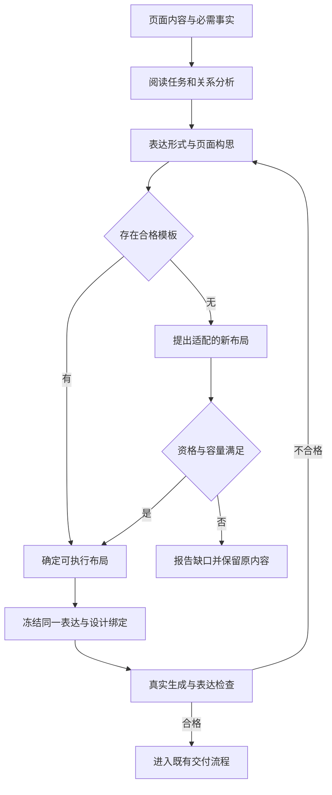
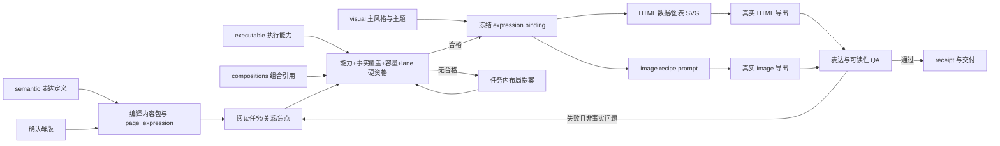
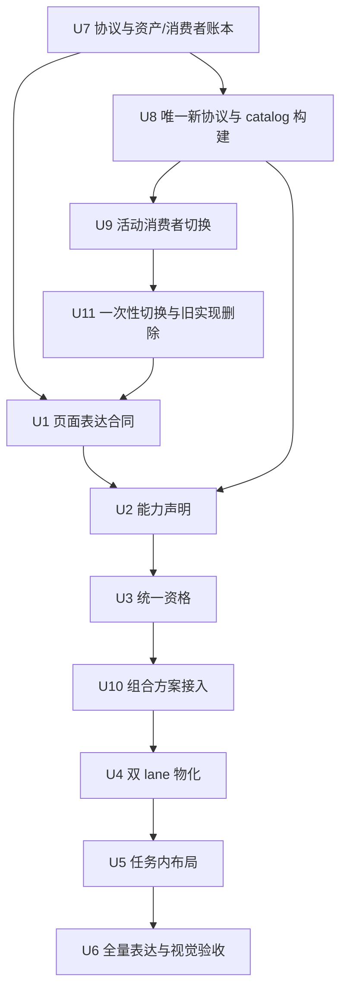

# PPT 单页表达优先、模板适配与模板库结构重构 - Plan

## Goal Capsule

提升单页表达：先理解内容中的论点、事实和关系，决定表格、图表、关系图或文字的作用，再选择模板或设计适配布局。
面向委托 Agent 制作 PPT 的用户，延续整册已确定的受众、目的和主风格。
用户已明确选择 B「表达优先」；本文已深化为待复核的实施方案，尚未开展本专项代码实施或视觉验收。

本文是 R-85 的单页表达专项细化，承接现有内容包、设计资格、绑定与渲染链。根据用户后续“跟随方案一起重构，补充这块的重构方案”，将模板库结构、协议与消费者迁移纳入同一实施链；不另建模板系统，也不替代原计划的全量范围和验收门槛。当前文档合同已完成五轮全量角色评审并收紧；代码尚未切换到本方案的新协议，实施前仍须完成本方案列出的实现与验证门。
产品方向已明确，无阻塞需求落盘的待决事项；具体差页尚未绑定到可回放任务，不能据此宣称已确定个案根因。

用户进一步明确“当前还在开发阶段，没有对外发布，不需要考虑向下兼容”。采用开发期一次性切换：冻结资产与消费者基线 → 新协议、新目录与消费者同步替换 → 表达能力与统一资格 → 组合方案、双 lane 与任务内布局 → 真实导出验收。旧 reader、兼容路径和旧 run 恢复不纳入交付；稳定 U-ID 不重编号。
内容真值继续由母版拥有，几何由 layout profile 拥有，主题由 effective theme 拥有；目录重构只改变职责归属和发现方式，组合方案仍进入同一资格池。最大的未验证风险是结构检查通过后页面仍难理解，以及消费者遗漏导致新链路未真正贯通。
本次只写计划与对应变更记录；实施、真实调用与发布遵循会话授权，不能从关联计划继承授权。
继续执行时先核对脏工作树中的既有成果；共享文件发生并行变更时重读合并，资产或内容漂移时停止使用旧绑定。

---

## Product Contract

### Summary

让单页内容先形成可理解的视觉表达，再由模板和布局承载。
模板不适配时保留表达需求，提出并验证新的布局方案；最终以导出页面的内容适配、阅读层次和图文有效性验收。

### Problem Frame

用户反馈“生成的单页样式非常差，没有按页内内容选择合适的模板，或者设计合适的布局”，并强调“文不如图，图不如表”。
这说明用户关注信息能否通过页面直接被理解，单纯换色、换模板名或将段落分装卡片不足以回应诉求。

当前源码已有结构与关键词驱动的意图分析、版式候选排名和设计冻结能力。
这些机制的存在不证明最终页面表达合适；本次未检查用户所指差页，也未运行真实生成对照，个案失败发生在理解、选择还是渲染阶段仍待核验。

### Key Decisions

- **采用 B「表达优先」**（session-settled: user-directed — chosen over 模板优先与全面自适应布局：先解决页内内容关系的表达，再决定模板载体）。用户在看到三种方向及代价后明确确认 B。Governs R1, R2, R3, R4, R5.
- **按内容选择图表表达**：将用户的原则落实为优先用表格和图解呈现可比较、可量化、可关联的信息；保留结论、必要解释与适合文字的页面，不设全局“表优于所有图”的机械排序。Governs R2, R7.
- **新布局作为有边界的补充**：先复用合格模板或既有组件；没有合适承载方式时设计本次任务的布局，并在生成资格与成品检查通过后使用，不将一次新布局自动晋升为共享模板。Governs R4, R5, R6, R8.

### Requirements

**理解与表达**

- R1. 每页明确一个主要阅读任务及其必需事实、证据和关系，信息不足时保留不确定性。
- R2. 根据页内关系选择表达形式，不能只因条目数量或关键词相同就套用相同结构。
- R3. 选择模板前形成页面构思，说明视觉焦点、阅读顺序及每项必需内容的呈现位置。

**模板与布局适配**

- R4. 候选必须能承载该页的表达结构、完整内容和实际渲染方式，再在合格集合内比较视觉适配与整册节奏。
- R5. 无合格模板时提出可保留内容关系的新布局；仍无法执行时明确报告该页不适配及具体缺口。
- R6. 页面沿用整册主风格，同时允许随表达任务变化采用不同布局与组件。

**生成与验收**

- R7. 图表转换保留事实、数值、单位、来源和必要限定，不通过删关键内容、缩小字号或编造关系适配模板。
- R8. 生成与适用的预览消费同一已选表达和有效绑定，渲染失败不得静默改成另一种表达。
- R9. 表达质量以真实导出页检查，分别记录语义适配、阅读层次、图文有效性与工程检查结果。

### Expression Guide

以下是表达选择的判断依据，不是内容类型到唯一模板的固定映射。
同一页可有一种主表达及少量必要支撑，支撑必须服务同一阅读任务。

| 阅读任务 | 可接受表达 | 需要保留 | 应避免 |
| --- | --- | --- | --- |
| 核对多方案的同维度差异 | 对照表、比较矩阵 | 相同维度、缺失项、选择依据 | 每个方案一段散文，维度无法对齐 |
| 看变化、趋势或分布 | 折线、条形等合适数据图表 | 时间、单位、基线、精确值及必要口径 | 无数值依据的上升箭头、不同单位共用数值轴 |
| 看步骤与先后依赖 | 流程图、时间线 | 起止、顺序、依赖或并行关系 | 有依赖的步骤只排成孤立卡片 |
| 理解因果或运行机制 | 因果图、结构图 | 节点、关系方向、关系含义 | 将相关性画成已证实因果、无语义连线 |
| 核对成果与收益 | KPI 配合比较图或明细表 | 分母、期间、统计口径、不可相加项 | 堆大数字、混淆直接收益与净收益 |
| 判断证据是否支撑结论 | 原图、截图或证据图加定位标注 | 来源、关键区域、支撑的结论 | 用装饰图片代替事实证据 |
| 记住一个判断或完成导航 | 结论文字、简洁列表 | 核心信息、必要限定或导航顺序 | 为图形化而编造数据或关系 |

### Key Flows

- F1. **常规选型：** Agent 从已确定的页面内容识别阅读任务与关系，形成表达构思，再筛选合格模板并选择布局；生成后对照构思检查真实页面。**覆盖 R1–R4、R6–R9。**
- F2. **模板不适配：** 保留原内容与表达要求，说明候选缺口，优先用既有能力组合本次任务的新布局；经容量、渲染资格与真实页面检查后才算可用，失败时报告具体阻塞。**覆盖 R4、R5、R7–R9。**
- F3. **信息不足：** 不确定内容仅形成待核实的表达候选；能用已有材料表达的部分继续，只有会改变关键事实或交付范围的缺口才询问用户。**覆盖 R1、R3、R7。**



### Acceptance Examples

以下均为待实施的验收案例，不是已生成页面或用户真实业务数据。

- AE1. **同维度比较，覆盖 R1–R4、R7：** 三个方案分别有成本、周期、风险，应按相同维度呈现并突出结论；缺失的成本标为未知，不填造数值，不能只把三个原段落放进三个卡片。
- AE2. **同数量不同关系，覆盖 R1–R3：** 三个独立职责可采用并列结构，三个依赖步骤应呈现顺序，三个有来源支持的因果节点应标明作用关系；三页不能只因都有三项而得到同一种无关系布局。
- AE3. **精确值与趋势，覆盖 R2、R7、R9：** 同一组月度数值用于解释变化时可用折线图，用于逐项核对时可用表格；两者都保留单位与数据，缺少时间或数值时不虚构趋势图。
- AE4. **没有模板，覆盖 R4、R5、R8：** 页面需要“关系图＋关键数据说明”，现有候选只能承载其中一项，应标明不适配并提出支持两者的新布局；不能以改成通用列表或删除说明宣布成功。
- AE5. **容量硬超，覆盖 R4、R5、R7：** 模板只能容纳部分对照行时改选或重排；若需要删关键事实、改变总页数或调整用户范围，应提出具体方案，不能静默执行。
- AE6. **用户点名模板，覆盖 R4、R5、R7：** 指定模板无法表达页面内容时，说明冲突并提出保留风格的适配方案；点名不绕过内容保真和容量要求。
- AE7. **文字适用，覆盖 R1、R2、R7：** 只有一句核心判断且无数据或关系证据时，清楚的文字页可以合格；不为提高图表占比生成伪数据或装饰性流程。
- AE8. **执行与视觉，覆盖 R6、R8、R9：** 构思选定对照表后，导出页仍须保留比较结构与主风格；即使机器检查通过，若标签不可读、重点不明或比较关系丢失，表达验收仍不通过。

### Success Criteria

本专项纳入 R-85 的既有回放、留出与真实导出验收，不另设较低通过线。
在同一批材料上允许多个正确表达，以必需事实和关系是否被准确呈现判定适配；不把旧推荐器的模板 ID 当作标准答案。
新增样例至少覆盖上述 AE1–AE8，包含有解、无解、信息不足、容量边界和文字适用情况，不能只选适合现有模板的输入。

成品应让评审者从页面识别主要结论、证据及关系，并读清图表标签和必要限定。
事实错误、关系误导、关键内容遗漏、截断重叠和不可读图表均为否决项。
模板数量、图表占比、换色、像素留白率、lint 及模型自评分均不能单独证明表达改善。
人工判读、模型辅助、工程检查及真实用户收益分开报告；尚未观测的改善保持未验证。

### Scope Boundaries

- 聚焦 `leo-ppt-generator/template-library` 的模板适配，以及现有 PPT 生成流程中消费模板的相关环节。
- 本文 R1–R9 是原 PRD R-85 的专项细化，局部编号不替代原需求编号；后续实施应接入既有 owner 和计划，避免平行推荐器或第二套绑定。下方“当前用户范围增补”仅 supersede 原 Product Contract 的全库迁移排除项；其余 Product Contract 条款继续有效。
- 本次纳入模板库结构、协议及活动消费者迁移；模板全库扩容、控制台、成本路由或新渲染引擎仍不属于本专项，原计划已承诺的这些工作继续由原 owner 负责，未被取消。
- 新布局限定为本次内容需要且已有执行能力可承载的适配；任务内布局提案不得自动修改共享 canonical。U11 的结构迁移是单独的、经账本和验证门保护的受控 canonical 变更，不属于任务内提案。

### Outstanding Questions

**规划前阻塞：** 无未决产品选择。B 已确认，具体实现方法交由规划决定。

**交由规划落实：** 表达分析如何接入现有内容包，语义不适配如何进入资格判断，新布局的支持范围与有界修订方式，以及固定案例的选择和证据记录。
复用原 R-85 的验收集与阈值；已能构造的案例可先行，用户所指差页在获得可定位材料后补入个案对照，缺少该页不阻塞通用规划。

### Sources and Limitations

源码观察时间为 2026-09-11，基线是元数据所列 HEAD 加当时工作树，不是干净提交。
下表 hash 为 SHA-256 前 16 位，用于识别本轮读取快照；文件变更后须重读相关结论。

| 来源（仓库相对路径） | 读取位置 | 观察事实 | 快照 hash 前缀 |
| --- | --- | --- | --- |
| `leo-ppt-generator/runtime/src/leo_ppt_generator/page_intent.py` | `analyze_page_intent` | 已按显式结构、结构字段、角色和关键词推断意图 | `d66c8fc275c62dc7` |
| `leo-ppt-generator/runtime/src/leo_ppt_generator/layout_selection.py` | `rank_page` | 已综合角色、容量、语义和节奏排列候选 | `7a716f386f59ec19` |
| `leo-ppt-generator/runtime/src/leo_ppt_generator/templates.py` | `compose_design` | 已组合设计上下文、解析页面、校验容量并冻结设计 | `c96f9c6a33f7cdcd` |
| `docs/prd/2026-09-11-leo-ppt-capability-improvement-prd.md` | R-85 | 已规定内容表达、候选资格、唯一绑定及真实导出验收 | `667535df7fe85e72` |
| `docs/plans/2026-09-11-003-feat-leo-ppt-capability-improvement-plan.md` | Product / Planning Contract | 已有全量能力提升计划，覆盖本专项相关 owner | `5b2128afa47c2dbe` |

上述事实只证明可复用机制存在，不证明本专项已实现或用户差页根因已定位。
本轮进行了串行源码核对，未运行独立专家评审、测试、生成或视觉验收；没有额外 worker 派发授权，采用本 Agent 自查。
## Planning Contract

Product Contract baseline retained (byte-preserved upstream source slice), except for the single scope exclusion explicitly superseded below.

### 当前用户范围增补

2026-09-11，用户在比较现状和彻底重构目标后要求“跟随方案一起重构，补充这块的重构方案”。该指令将**全库结构、路径、协议及消费者迁移**加入本专项，覆盖原 Product Contract 中“本次不将……全库迁移……纳入专项”的结构迁移排除项；上游 Product Contract 原文保持字节不变，其余产品目标和验收不变。

这里区分两项工作：本计划 U7–U11 负责结构迁移与表达组合接入，细化关联能力计划 U6 的盘点/准入和 U12 的结构迁移部分；R-85b 的全库风格语义升级、补齐执行能力和质量晋升仍由原 U12 负责。复用同一 resolver、builder、迁移脚本和逐资产账本，结构搬迁不把 `legacy/unknown` 自动升级为 `executable`。本轮授权是补充方案，不表示目录已经搬迁、逐项人工验收或代码已获实施确认。

**兼容范围以最新指令为准：** 用户明确系统尚未对外发布，不需要向下兼容。因此取消本专项及所承接结构迁移中的双版本 reader/writer、旧路径 fallback、旧 asset ID/别名兼容桥、旧 pack/run/catalog 恢复和旧用户库自动迁移要求；关联计划关于这些内容的旧约束在本次重构范围内不再作为验收门。有效资产内容与来源仍需完整对账，必要 ID/分类可以统一调整并同步改完引用。只运行一套新协议；旧开发产物按来源材料重新编译/生成，不能伪装成新合同产物。原 R-85 的表达、覆盖率、事实保真和视觉质量门槛不降低。

### 关联方案的 supersede 关系

004 对 003 的 owner 关系如下，遇到冲突时以本节为准：

| 事项 | 唯一 owner | 004 对 003 的处理 |
| --- | --- | --- |
| R-85b 全库风格语义升级、能力补齐和质量晋升 | 003 U12 | 保留在 003 U12；不因本专项结构完成而自动结项。 |
| 目录/协议/消费者结构迁移 | 004 U7–U9、U11 | supersede 003 U12 的同名结构部分，004 的新目录和唯一新协议为执行真值。 |
| 旧 reader、fallback、别名桥、旧 user library 自动迁移 | 004 U8/U9/U11 | 以用户“不需要向下兼容”指令 supersede 003 中相反的兼容要求。 |
| 旧 run 恢复、历史字节仓库和按批回滚 | 004 U8/U11 | 003 U12 的恢复/回滚测试在本专项范围内不再适用；新 run 仅从自身冻结快照重现。 |

003 仍可保持 `status: active`，但其 U12 只能驱动上表第一行；不得再以 003 U12 作为结构迁移或兼容恢复的实施入口。

### Key Technical Decisions

- KTD1（extend）：把 `page_expression` 扩展为版本化的页面表达合同，保存主阅读任务、视觉焦点、阅读顺序、关系类型、主表达、支撑表达和事实引用。表达字段不复制文案或几何；引用解析到既有 page item、structures 和 numbers，表达变更进入内容摘要。`undecided` 只能产生待裁决候选，不能获得自动合格资格。Governs R1–R3, R7。
- KTD2（extend）：在 layout profile 的 `structure` 声明中增加 lane-aware 表达能力；模板 manifest 增加声明式 `expression_bindings`，描述表达类型如何落到现有 input field/slot。能力声明只缩小候选集合，最终资格仍由 `content_projection` 对事实覆盖、数量、容量和 renderer 支持的联合检查决定。禁止在推荐器维护第二份模板语义表。Governs R2, R4–R6。
- KTD3（compose / thin-glue）：继续使用 `page_intent`、`qualified_pool`、`precompile_binding`、`compose_design` 和现有 render lanes；新增表达投影只负责把冻结表达转换成模板数据或图表/关系图输入，不重选 style、layout 或 asset。失败原因沿现有 `excluded`、`unsupported`、`budget_exhausted` 语义传播。Governs R4, R8。
- KTD4（replace）：有效绑定统一为新表达绑定合同，包含表达摘要、能力命中、事实引用摘要和任务内布局身份，并由 `compute_binding_digest` 覆盖。预览、HTML、image、QA、receipt 全量切换；删除旧 pack/binding 解析分支，旧开发产物提示从母版重新生成，不补造新表达证据。Governs R7–R9。
- KTD5（compose / task-local）：无合格共享模板时，只允许基于已存在模板 manifest、layout profile、HTML 组件或 image recipe 生成任务内布局提案。提案只能新增/调整声明区域、表达映射和受限几何，不能注入自由 CSS、修改共享 canonical 或丢弃必需字段；提案需经过同一 resolver snapshot、容量、lane 和真实导出检查。Governs R4–R6, R8。
- KTD6（extend）：把关系覆盖作为硬资格而非语义加分。`comparison` 至少需要可对齐维度，`trend` 需要时间与数值编码，`process` 需要顺序/依赖编码，`causal` 需要有向关系编码；无法由模板现有表达绑定承载时进入不适配或任务内提案分支。Governs R2, R4, R5。
- KTD7（extend）：保留 canonical、catalog、governance、evidence、reference 五区，canonical 内按 semantic、visual、executable、compositions、collections 分责。`staging/` 是非真值的事务工作区，不参与推荐、打包或缺索引扫描。用户确认的是结构重构纳入方案，具体目录与协议由本计划制定。覆盖本次范围增补、R2、R4–R6。
- KTD8（replace；session-settled: user-directed）：采用开发期一次性切换。用户已明确否决向下兼容，因此在同一重构交付中替换库协议、reader/writer、消费者和当前 fixture，删除旧分支/路径/别名桥。允许内部按依赖分步开发，但不发布新旧混用的中间版本。旧 ID 可在账本中映射到新 ID，运行时只认识新身份；不实现兼容窗口和旧 run 恢复。覆盖本次范围增补、R7–R9。
- KTD9（compose / thin-glue）：新增 expression 定义、composition 组合和 renderer 能力描述三类资产；composition 只引用表达、layout、template、可选 component 与 QA 规则，展平后复用 U3 的资格计算，不提供独立评分或推荐路径。renderer 只声明与 runtime 的连接及适用能力，不搬入引擎实现；可用性由实际 lane/依赖探针核实。覆盖 R2、R4–R6、R8。
- KTD10（extend）：新协议生成的 catalog 保持确定性与代内不可变，构建器/协议版本和有效输入共同决定 generation；同代不同输出报冲突。新 run 沿用现有字节快照机制保证本次生成可追溯，不新增全历史 generation 字节仓库。重构前开发 catalog/cache 可退出活动链并重建，旧 run 不提供恢复承诺。覆盖本次范围增补、R8、R9。
- KTD11（extend）：每次实施或复审先生成可重放的 source snapshot，固定 HEAD、dirty path、扫描 roots/excludes、文件分母、源码/JSON 解析结果和关键文件 hash；任何引用文件漂移都使旧评审结论失效，必须重读后才能继续。覆盖所有 U，属于实施准入门，不代表代码完成。
- KTD12（replace）：表达投影只接受声明过的 `source` 与 slot 语义；未声明的 point、relation、fact、focus 或 reading-order 一律返回 `expression_incomplete`，不得回填 title/label。v1 binding、旧 pack 和隐式兼容路径在 U11 后明确拒绝。覆盖 R1–R3、R7、R8。
- KTD13（replace）：resolver 将 `catalog_missing`、`catalog_invalid`、`catalog_stale` 与离线 `canonical-rebuild` 分离；后者只能用于 inventory/diagnostic，不能进入推荐、执行、冻结或 receipt。覆盖 R4、R8、R9。
- KTD14（replace）：R75 容量重排与 U5 task-local layout proposal 使用不同模块、schema、命令和测试。R75 可以提出用户确认的内容减法；U5 只能提出基于共享资产的 bounded patch，不得删除必需字段或旁路资格检查。覆盖 R4–R6、R8。
- KTD15（extend）：关系类型必须有可验证的最小编码：comparison 有 dimension IDs，trend 有 ordered time/value pairs，process 有 ordered dependency edges，causal 有 directed edges；generic `system` 不能替代这些关系。覆盖 R1–R5、R7。
- KTD16（extend）：视觉验收采用固定四维 rubric（语义适配、阅读层次、图文有效性、整册一致性），记录评审者、逐页分数、否决项、分歧裁决和环境指纹；没有真实导出或裁决记录只能是 `not_run`/`blocked`。覆盖 R6、R9。

### Interface Contracts

| Contract | Canonical owner | Consumers | Evolution and failure |
| --- | --- | --- | --- |
| `page-expression-v1` | 新增 `runtime/src/leo_ppt_generator/schemas/page-expression-v1.schema.json`、`page-content-pack-v3.schema.json` 与现有 `content_pack.py`；U1 | `page_intent.py`, `layout_selection.py`, `content_projection.py`, QA | 新 pack 必须包含表达合同；非法关系、悬空事实引用或旧版本输入明确拒绝，指向母版重编译，不走旧解析分支。 |
| Layout expression capability | `template-library/governance/schemas/layout-profile-v1.schema.json` 与目标 layout JSON；U2 | `render/layout.py`, `qualified_pool`, catalog lint | 能力缺失不自动匹配；全部可执行候选声明支持的关系编码和 lane，未完成的资产保留未准入状态。 |
| Template expression binding | `template-library/governance/schemas/template-v1.schema.json` 与目标 `canonical/executable/templates/*/template.json`（U11 迁移，U2 补能力） | `content_projection`, `lint_template_contract.py` | 映射必须指向声明的 input field/slot；无映射的资产不进入表达执行池，不保留旧页面旁路。 |
| Effective expression binding | `content_projection.py` binding schema and run `input/layout-selection.json` | `render/page.py`, `image_deck/adapter.py`, `render/receipt.py`, preview | Digest covers expression and task-local asset bytes. Any content, asset, theme or expression drift is a hard mismatch; no silent fallback. |
| Task-local layout proposal | `runtime/src/leo_ppt_generator/task_local_layout_proposals.py` (new) and proposal JSON schema | resolver snapshot, `layout_selection`, render lanes, disclosure | Proposal is run-scoped and names a base asset plus bounded patch. Unsupported patch, missing component or cross-root path is rejected; proposal is never inserted into the shared catalog automatically. R75 `layout_proposals.py` remains a separate capacity-menu owner. |

新增结构合同如下；本表相对路径以 `leo-ppt-generator/` 为基准，标“新增”的合同由对应单元创建，并非已存在能力。

| 合同与演进 | 真值与创建 owner | 消费者 | 切换、失败与验证 owner |
| --- | --- | --- | --- |
| 库协议与实体位置（替换为 v2） | `template-library/library.json` 引用新增 `governance/schemas/library-v2.schema.json`；新增 `governance/rules/asset-locations-v2.json` 唯一声明 kind、分组路径和实体文件；U7 | resolver、builder、inventory、导入器、lint | U8 只实现当前 v2；旧/未知版本明确拒绝。U9/U11 同步替换所有活动消费者和资产，严格校验根边界，不保留旧 glob/fallback。 |
| 表达定义（新增） | 新增 `canonical/semantic/expressions/<slug>/expression.json`、`governance/schemas/expression-v1.schema.json`；U7 定合同，U1 创建首批定义 | `page_intent`、表达编译、能力 lint | 定义关系编码与必要事实类型，不保存页面事实和几何；枚举仍引用 governance 词表。U1/U2 验证引用、版本和 capability，未知定义不授予资格。 |
| 组合方案（新增） | 新增 `canonical/compositions/<slug>/composition.json`、`governance/schemas/composition-v1.schema.json`；U7 定合同，U10 创建及验证 | `qualified_pool`、`precompile_binding`、`compose_design` | 引用闭合后仍须按本页内容检查；禁止循环组合、跨 scope 冒用、重复真值和缺执行依赖。无合格组合沿既有不适配分支处理。 |
| renderer 描述（新增） | 新增 `canonical/executable/renderers/<slug>/renderer.json`、`governance/schemas/renderer-v1.schema.json`；U7 定合同，U2 对接已有 lane | capability 视图、renderer 资格检查 | 只允许受支持的 runtime 入口引用，不能将任意命令当引擎运行。描述存在不等于可执行；U2/U4 验证实际能力和缺依赖拒绝。 |
| registry 与派生视图（替换为 v2） | 新增 `governance/schemas/catalog-registry-v2.schema.json`；`scripts/capability_manifest.py` 构建 `catalog/generations/<generation>/`；U8 | resolver、推荐、gallery、library-check | 新代固定 registry、views 和输入/输出 hash；构建策略改变产生新代。U8 验证幂等、冲突和原子发布；旧开发 catalog 不接入恢复。 |
| 结构迁移账本（新增一批） | `governance/migration/structure-v2/` 保存资产/消费者账本；`evidence/migrations/structure-v2/` 保存实际核对结果；U7/U11 | 原 `migrate_template_library.py`、资产维护者 | 逐项记录旧/新路径、身份、hash、处置和引用替换；U11 验证内容无丢失、新链贯通及旧活动路径/分支清零，不提供历史运行协议。 |

### 目标目录与单一真值

下列为实施后的目标形态；不是当前目录。实体名仅表示包结构，不表示已经有对应可执行资产。

```text
leo-ppt-generator/template-library/
  README.md
  library.json
  canonical/
    semantic/
      expressions/<slug>/expression.json
      expressions/guides/{chart,infographic}/<slug>/{manifest.json,body.md}
      argument-modes/<slug>/{manifest.json,body.md}
      page-types/<slug>/{manifest.json,body.md}
    visual/
      styles/<slug>/brief.json
      themes/<slug>/theme.json
      brands/<slug>/brand.json
      fonts/<slug>/{manifest.json,font-files}
      ornaments/<slug>/manifest.json
    executable/
      layouts/<slug>/{layout.json,notes.md}
      layouts/guides/<slug>/{manifest.json,body.md}
      templates/<slug>/{template.json,page.html}
      components/<slug>/component.json
      renderers/<slug>/renderer.json
      renderers/guides/<slug>/{manifest.json,body.md}
    compositions/<slug>/
      composition.json
      examples/
    collections/presets/<slug>/preset.json
  catalog/
    current.json
    generations/<generation>/
      registry.json
      build-manifest.json
      views/
        expression-capabilities.json
        composition-index.json
        style-index.json
        lane-capabilities.json
  governance/
    schemas/
    rules/
    vocabularies/
    authoring/
    curation.json
    migration/structure-v2/
  evidence/
    migrations/structure-v2/<batch-id>/
    <validation-id>/
    revocations/
  reference/
    sources/
    pools/
    historical-gallery/
  staging/<transaction-id>/            # 临时构建区，不是第六个内容真值区
```

- **semantic** 拥有可复用表达定义、论证方式与页型解释；页面实际阅读任务仍归母版/内容包。现有 axis 指南继续作为指南管理，指南不能因进入此目录就升级为 expression 资产；需要统一命名时通过账本改完所有引用，不留运行时别名桥。
- **visual** 拥有风格、主题、品牌、字体与装饰。主题继续拥有颜色/字号 tokens，暂不另设 `tokens/`；需要独立 token 资产时另行证明复用需求和消费者。
- **executable** 中 layout 拥有几何与容量，template 拥有输入/槽位与渲染实体。components 只容纳有合同且经验证的组件；当前组件实体为 0，不能以空目录或参考池宣称可组合能力。renderer 描述引用 runtime，不复制其实现。
- **compositions** 拥有跨表达与执行资产的组合引用、适用条件和示例。QA 阈值仍归 `governance/rules/`，composition 只引用既有 `qa_profile`，不放第二份 `qa-profile.json`；运行结果只进 evidence。例子不进入自动候选池。
- **collections** 只做精选/场景组织，首批迁入 preset 且保留原 kind。行业、受众、明暗与密度继续用 metadata/派生视图表达，不按这些维度复制实体树。
- **governance** 继续独占 schema、词表、准入/页型规则和迁移规则。`page-type-regime-v1.json` 保留在 rules；semantic/page-types 只放解释材料，引用规则，不复制其映射。catalog views 全部由同一 generation 构建，不能手改。

### 旧目录到新目录的处置

本表省略共同前缀 `leo-ppt-generator/template-library/`。U7 在实施开始时补成逐文件账本；下表负责类别映射，不替代逐项 hash 与依赖核对。

| 当前来源 | 目标 | 身份和内容处理 |
| --- | --- | --- |
| `canonical/axes/argument/`、`axes/page-semantics/` | `canonical/semantic/argument-modes/`、`semantic/page-types/` | 保留有效 body 与来源，统一 manifest/引用；不冒充新 expression 或页型规则。 |
| `canonical/axes/chart/`、`axes/infographic/` | `canonical/semantic/expressions/guides/chart/`、`guides/infographic/` | 保留指南属性；表达资产另经 U1 创建，不能将图例自动当执行能力。 |
| `canonical/axes/structure/`、`axes/rendering/` | `canonical/executable/layouts/guides/`、`renderers/guides/` | 按当前指南合同管理，不冒充 layout/renderer 资产；身份更名同步替换引用。 |
| `canonical/styles/`、`themes/`、`brands/`、`fonts/`、`ornaments/` | `canonical/visual/` 下同名目录 | 有效内容与字节对账；允许规范化 ID/字段并同步更新引用，变更独立记账，不做旧身份兼容。 |
| `canonical/layouts/`、`templates/` | `canonical/executable/layouts/`、`templates/` | 实体包整体移动，模板内 HTML/媒体与布局附属文件一同冻结。聚合 manifest 若仍为作者配置一并迁入；派生数据改由 view 生成，不丢弃未盘点文件。 |
| `canonical/components/` | 合格实体到 `canonical/executable/components/`；现有 `chart-palettes/pool.json` 到 `reference/pools/chart-palettes/` | 当前无 `component.json`；palette pool 保持参考身份。U9 将实际引用切到正确 owner，不提升为 executable。 |
| `canonical/presets/` | `canonical/collections/presets/` | 保留精选用途，不批量改成 composition；身份按新合同统一。 |
| `governance/`、`reference/`、`evidence/` | 保持分区，追加本批账本与证据 | 历史资料和验证包不重写；仅迁移需要改位的参考池。 |
| 旧 `catalog/generations/`、cache 与开发 run | 不进入新活动链；从新 canonical 重建 catalog，从来源重建所需 run | 不迁移旧协议、不维护恢复能力、不补历史字节仓库。清理仅限本次账本确认的废弃开发产物，保留未归本任务所有的材料。 |

组合方案以 `builtin:layout:p25-spec-table` + `builtin:template:spec-table` 为候选示例，这一配对来自当前 manifest；`table-pro` 实际绑定另一 layout，不能混用。新增 `builtin:expression:comparison` 与 `builtin:composition:comparison-table` 仍需 U1/U10 创建并检验维度对齐、精确值、容量和来源落位；现有配对不证明这些能力全部满足。image lane 没有验证映射时保持不支持，不能照抄 HTML 资格。

### 开发期一次性切换顺序

1. **盘点与取舍（U7）：** 固定 HEAD 加脏文件 hash、全部 manifest/附属文件、身份/引用、有效来源与消费者。当前 565 个实体只是起点；执行时重冻分母，坏文件、重复身份和未识别文件须有处置。无需盘点全历史 run 或补历史恢复包。
2. **实现唯一新协议（U8）：** resolver、builder、inventory 共用新位置规则；新增 `expression/composition/renderer` kinds 并更新依赖、fingerprint/freeze 与 CLI。删除旧版本判断与目录 fallback，旧输入返回需要重新生成的明确错误。scope 仍是 builtin/user，proposal 保持 run 内。
3. **同步改消费者（U9）：** runtime、导入器、lint、gallery、文档和当前 fixture 一起切换。builtin 与新建 user 库使用同一新合同；不实现旧 user 库双读/双写。缺索引只按新规则只读扫描，排除非实体参考、examples、staging 和生成物。
4. **一次性迁移源资产（U11）：** 在隔离副本完成目录/身份/字段改造，核对有效内容、来源和所有引用；根据账本移动目标资产、更新 library 声明，重建 catalog。迁移脚本只负责一次性源数据转换，不作为 runtime 旧协议适配器。
5. **新链核验与旧实现删除（U11）：** 新协议、所有消费者、隔离安装和迁移前后离线内容对照通过后，删除本次替换的旧目录、旧解析分支和废弃 fixture，重建所需开发样例。U8/U9/U11 是一个切换交付，内部可分步提交但不承诺中间态可运行。
6. **表达与视觉验收（U1–U6）：** 直接在新目录新增表达/能力/组合，所有新 run 使用同一有效绑定和字节快照。U6 按原 R-85 固定案例与真实导出门槛验收，不以搬迁完成代表表达改善。

新协议下 catalog 构建仍要求确定性、幂等和完整写入后原子更新 current，避免并发或中断暴露半成品；generation 身份纳入 builder 策略及有效规则变化。沿用现有 run 快照保存本次实际使用的资产，不为无对外发布的旧开发代新增 `sources/` 仓库、迁移服务或长期回滚机制。失败时修复/重跑隔离迁移；必要的操作前备份用于防误删，不等于旧运行时兼容支持。

### High-Level Technical Design



页面表达的确定性投影遵循以下顺序：

1. 解析 `page_expression` 的关系和事实引用，核对引用值仍存在且与内容摘要一致。
2. 从固定 catalog generation 取得候选；composition 展平为对 expression/layout/template/可选 component/renderer 的引用，再读取 lane 能力和声明映射。关系编码、焦点区域和阅读顺序必须有落点，组合名称不产生加分或默认合格。
3. 复用现有 `precompile_binding` 生成 slot map，并额外记录 `expression_coverage`（覆盖的关系、事实引用、未覆盖原因）。覆盖不足是硬失败，不改成 `text_list`。
4. 对趋势/流程/因果等数据输入调用已有 chart/diagram render 能力；缺少必要数据或 renderer 时返回可诊断的 `unsupported`。
5. 绑定通过后，HTML 与 image 由同一绑定分别物化；image 只把确定性结构、required text 和来源要求投影给既定 recipe，文字保真仍以成品 QA 为准。

表达覆盖的硬规则：未声明映射的 point、relation、fact、focus 或 reading-order 不得自动填入任意 title/label 字段；必须返回 `expression_incomplete` 并保留未覆盖项。只有模板合同明确声明 `source=point` 且 slot 语义为 points/list 时，才允许按声明顺序投影。

结构重构先于新表达资产写入，依赖顺序如下。U1–U6 的原身份保留，新增 U7–U11 不代表必须按编号顺序执行。



### Assumptions

- `page_expression` 的语义由上游 Agent 在母版确认范围内产生；本计划不引入新的外部模型调用或第二个内容真值。
- 首批关系编码限定为比较、趋势、流程、因果、证据、KPI、表格、陈述和列表；更复杂的网络图或自由画布进入明确不支持。
- 任务内布局提案使用已有模板/布局组件和现有 renderer；若现有输入字段无法表达所需关系，仍应返回不适配，不通过任意 HTML 拼接规避合同。
- 系统尚在开发且未对外发布，这是用户明确提供的前提；目标只有一套新协议。用户库只验证新建/导入新合同，不承担旧库兼容，也不扫描或改写未纳入本任务的个人库。

### Implementation Scope Boundaries

- 本专项修改内容包、推荐/资格、模板与布局声明、绑定和双 lane 消费所需的 canonical source、runtime、schema、lint、测试和评测 fixture；按当前用户范围增补，同时完成库结构、新协议、消费者、打包/导入和旧实现清理。
- 不在本专项扩充全库风格数量、重写控制台、新建渲染引擎、改变 R-85 原有样本分母/阈值或进行真实 Provider 付费调用。
- 本专项 U7/U8/U9/U11 是原大计划 U6/U12 的结构迁移细化，使用原脚本与一份账本；U10 组合方案细化原 U4/U5/U6 的选择/绑定/准入。原大计划其他 owner 继续负责其既定能力，不因本地 U-ID 同名转移职责。

### Risks and Dependencies

- 关系声明可能比模板能力更丰富，导致有解覆盖率下降；以 R-85 的有解/无解独立分母报告，不能把拒答改标为域外。
- 现有工作树含其他任务修改，实施前必须按文件 owner 重读并保留非本专项变更；合并冲突或 schema 漂移时停止而非覆盖。
- 图表或 image provider 的真实输出仍可能让结构不可读；工程绑定通过不能提升为视觉通过，必须保留真实导出证据。
- 当前 builder 存在同代原地刷新 registry 的分支，必须由 U8 改为新版本身份/同代冲突拒绝；该修正未通过前不得运行 U11 的新结构发布。
- 一次性切换会使旧开发 pack/run/catalog 失效；所需样例从原始材料重新生成。不能修改旧收据冒充新结果，也不以缺历史字节阻塞重构。
- ID、字段和路径变化会改变 fingerprint/binding；验收比对有效内容、引用闭合与新绑定一致性，不要求新旧摘要相同。新协议运行中的漂移仍须拒绝。
- 删除兼容代码时容易遗漏活动消费者或误删原始材料；U7/U9/U11 用资产与消费者对账、隔离构建和新链集成验证控制，清理范围只限本次替换的对象。

## Implementation Units

### U1. 页面表达合同与内容包编译

**Goal:** 为每页生成可校验的阅读任务、关系、焦点、顺序、主/支撑表达及事实引用，统一新内容包合同。

**Requirements:** R1–R3, R7; KTD1; AE1–AE3、AE7。

**Dependencies:** U7, U11。

**Files:** `leo-ppt-generator/runtime/src/leo_ppt_generator/schemas/page-expression-v1.schema.json`; 新增 `leo-ppt-generator/runtime/src/leo_ppt_generator/schemas/page-content-pack-v3.schema.json`； `leo-ppt-generator/runtime/src/leo_ppt_generator/content_pack.py`; `leo-ppt-generator/runtime/src/leo_ppt_generator/page_intent.py`; 新增 `leo-ppt-generator/template-library/canonical/semantic/expressions/*/expression.json`；`leo-ppt-generator/tests/test_content_pack.py`; `leo-ppt-generator/tests/test_chapter_content_model.py`; `leo-ppt-generator/tests/test_page_expression.py`。

**Approach:**

1. 以嵌套版本字段增加表达合同，引用稳定 `item_id`、数字账本和结构字段，不把新文案复制进合同。
2. 编译时验证关系所需事实、焦点与阅读顺序；缺失信息保留 `undecided` 和不确定性。
3. 将表达摘要纳入新 pack 的 page digest/required text 派生；删除旧 pack/binding 读取分支、无调用的旧 schema 和当前 fixture，从母版重新编译新样例，保留版本不符的明确拒绝。
4. 在迁移后的 semantic 下创建首批表达定义，引用 governance 词表；页面合同固定所用 definition ID/revision，定义缺失或未知版本不得默认为同名旧关键词。

**Test scenarios:**

- Covers AE1. 三方案同维度输入生成 comparison 表达，缺失值保持 unknown，禁止补数。
- Covers AE2. 相同三项分别声明 independent、process、causal，得到不同关系结构；非法边或未知关系被拒绝。
- Covers AE3/AE7. 有时间和数值才生成 trend 候选；只有一句判断时保留 statement，不生成伪图。
- 表达合同显式声明 `focus` 与 `reading_order` 时，编译结果必须逐项保留并可被投影断言；任一未声明 slot 的 point、relation、fact、focus 或顺序项均返回 `expression_incomplete`，不得回填到任意 title/label 字段。
- 输入引用已删除 item 或修改 ledger 值时，编译失败并指出 page/fact ref。

**Verification:** 新 schema、编译器及 fixture 验证通过；测试同时断言 relation、focus、reading_order 的完整覆盖和 `expression_incomplete` 负例；表达变更必然改变内容摘要，旧 pack 被明确拒绝，不保留旧解析路径。

**Patterns to follow:** `content_pack.py` 的 metadata 解析、`required_text` 派生和 schema Draft202012Validator。

### U2. 模板/布局表达能力与资产准入

**Goal:** 让模板声明其能表达的关系和 lane，且声明能被 catalog/lint/resolver 复核。

**Requirements:** R2, R4, R6; KTD2、KTD6; AE2、AE4、AE6。

**Dependencies:** U1, U8。

**Files:** `leo-ppt-generator/template-library/governance/schemas/layout-profile-v1.schema.json`; `leo-ppt-generator/template-library/governance/schemas/template-v1.schema.json`; U11 迁移后的 `leo-ppt-generator/template-library/canonical/executable/layouts/*/layout.json`、`leo-ppt-generator/template-library/canonical/executable/templates/*/template.json`；新增 `leo-ppt-generator/template-library/canonical/executable/renderers/*/renderer.json`；`leo-ppt-generator/scripts/lint_layout_grid.py`; `leo-ppt-generator/scripts/lint_template_contract.py`; `leo-ppt-generator/scripts/capability_manifest.py`; `leo-ppt-generator/tests/test_template_contract.py`; `leo-ppt-generator/tests/render/test_layout_profile.py`; `leo-ppt-generator/tests/test_executable_style_matrix.py`。

**Approach:**

1. 在 layout 的 `structure` 增加 lane-aware expression capability，声明 relation、encoding、焦点和阅读顺序支持，不复制容量数值。
2. 在 template manifest 增加声明式 expression binding，逐项校验 input field、slot 和模板 HTML anchor 闭合。
3. 为首批矩阵的比较、表格、流程、趋势、证据和 KPI 资产登记真实支持；未登记不获得自动池资格。
4. renderer 描述与实际 runtime lane/图表/关系图支持取交集；从新代构建表达与 lane 能力视图，缺 manifest、执行依赖或映射的组合保持不合格。

**Test scenarios:**

- Covers AE2. 同结构不同关系的模板只在对应 relation capability 命中时进入 qualified pool。
- Covers AE4/AE6. 缺少关系映射或用户点名模板不匹配时返回具体 capability gap，不能以 legacy list 通过。
- schema/lint 发现未知 lane、重复字段、slot anchor 缺失、关系编码与 input field 不闭合时退出失败。

**Verification:** canonical layout/template lint 全通过；新 catalog generation 可确定性重建声明和 hash；legacy/unknown/retired 资产不会进入新表达自动池。

**Patterns to follow:** `layout-profile-v1`、`template-v1` 的 additionalProperties 约束、`lint_template_contract.py` 的 HTML anchor 检查。

### U3. 关系覆盖与统一候选资格

**Goal:** 将表达覆盖纳入正式候选池和整册分配，保持现有排序、容量、复用与预算语义。

**Requirements:** R2–R5; KTD3、KTD6; AE1–AE6。

**Dependencies:** U1, U2。

**Files:** `leo-ppt-generator/runtime/src/leo_ppt_generator/page_intent.py`; `leo-ppt-generator/runtime/src/leo_ppt_generator/layout_selection.py`; `leo-ppt-generator/runtime/src/leo_ppt_generator/content_projection.py`; `leo-ppt-generator/runtime/src/leo_ppt_generator/render/layout.py`; `leo-ppt-generator/tests/test_page_intent_routing.py`; `leo-ppt-generator/tests/test_layout_capacity_filter.py`; `leo-ppt-generator/tests/test_unified_recommendation.py`; `leo-ppt-generator/tests/test_content_projection.py`; `leo-ppt-generator/tests/test_deck_layout_selection.py`。

**Approach:**

1. 保留关键词分析作为补充，优先使用显式表达关系和 template/layout capability。
2. `precompile_binding` 先跑事实引用、关系编码、必需覆盖和容量，再让 semantic/rhythm 分数排序。
3. `qualified_pool` 的 excluded 记录 `expression_unsupported`、`expression_incomplete`、`expression_over_capacity`；整册区分 no_candidates 与 budget_exhausted。
4. explicit template 仍走相同硬资格；不能用显式选择越过缺关系、缺事实或容量。

**Test scenarios:**

- Covers AE1/AE2. comparison、process、causal 页的 qualified pool 只保留能表达对应关系的候选。
- Covers AE3. trend 的时间/单位/数值缺一即排除；表格页保留精确值与单位。
- Covers AE5. 结构覆盖但容量超限时改选或返回 overflow，绝不缩字号/删事实。
- Covers AE6. explicit 不适配模板返回 explicit_unqualified，并保留候选缺口。
- 复用限制或搜索预算耗尽时维持既有状态和解释，不把预算耗尽伪装无解。

**Verification:** 统一排名入口、hard-qualified 池和整册分配均使用同一 binding 结果；原有 layout selection 回归保持通过。

**Patterns to follow:** `qualified_pool`、`rank_page`、`allocate_deck` 的硬约束优先和稳定 tie-break。

### U4. 表达投影、图表/关系图与双 lane 物化

**Goal:** 让已选表达以同一绑定物化到 HTML 和 image，使用既有图表/关系图 renderer，不在消费端重选。

**Requirements:** R2, R7, R8; KTD3、KTD4; AE3、AE4、AE8。

**Dependencies:** U3, U10。

**Files:** `leo-ppt-generator/runtime/src/leo_ppt_generator/content_projection.py`; `leo-ppt-generator/runtime/src/leo_ppt_generator/render/chart.py`; `leo-ppt-generator/scripts/diagram_render.py`; `leo-ppt-generator/runtime/src/leo_ppt_generator/render/page.py`; `leo-ppt-generator/runtime/src/leo_ppt_generator/image_deck/adapter.py`; `leo-ppt-generator/runtime/src/leo_ppt_generator/templates.py`; `leo-ppt-generator/tests/test_content_projection.py`; `leo-ppt-generator/tests/render/test_chart.py`; `leo-ppt-generator/tests/boundary/test_diagram_render.py`; `leo-ppt-generator/tests/test_render_lane_contract.py`。

**Approach:**

1. 为 binding 增加 expression digest、source refs、coverage 和 materialization mode，纳入 digest 验证。
   使用 composition 时一并固定 composition ID/revision 与传递依赖字节；复用 layout/template 的原引用，不复制其事实、容量或主题。
2. HTML 将表格、结构字段、chart SVG 和关系图输入落入 manifest slot；image 将同一表达、required text、焦点和 recipe 约束传给 prompt。
3. 物化时若 renderer 不支持或媒体/数据缺失，返回明确错误；不得自动换成另一表达。

**Test scenarios:**

- Covers AE3. 同一趋势表达在 HTML 和 image 的 materialize 结果保留相同数据、单位、顺序和 binding digest。
- Covers AE4. 关系图和关键数据无共同承载时，双 lane 均返回 unsupported/不适配，不生成列表替代品。
- 篡改表达、内容或 effective theme 后 verify_effective_binding 拒绝，render 不读活动库回退。
- chart/diagram renderer 缺失或输入非法时错误可定位到 page、expression 和 lane。

**Verification:** `materialize_page`、`render_page`、image adapter 和 prompt 投影均消费同一有效绑定；双 lane 各至少有一条可回放 fixture。

**Patterns to follow:** `materialize_html`、`materialize_image_prompt`、`verify_effective_binding`、`render/chart.py` 的 SVG 安全策略。

### U5. 任务内布局提案与安全快照

**Goal:** 在没有合格共享模板时提供有边界的可执行布局提案，或报告不可执行缺口。

**Requirements:** R4–R6, R8; KTD5; AE4–AE6。

**Dependencies:** U2, U3, U4。

**Files:** 新增 `leo-ppt-generator/runtime/src/leo_ppt_generator/task_local_layout_proposals.py`; `leo-ppt-generator/runtime/src/leo_ppt_generator/schemas/layout-proposal-v1.schema.json`; `leo-ppt-generator/runtime/src/leo_ppt_generator/asset_resolver.py`; `leo-ppt-generator/runtime/src/leo_ppt_generator/cli.py`; `leo-ppt-generator/runtime/src/leo_ppt_generator/render/layout.py`; 新增 `leo-ppt-generator/tests/test_task_local_layout_proposals.py`; 既有 R75 `leo-ppt-generator/runtime/src/leo_ppt_generator/layout_proposals.py` 与 `tests/test_layout_proposals.py` 保持独立；`test_asset_resolver.py`、`test_effective_binding.py`。

**Approach:**

1. `task_local_layout_proposals` 接受页面表达、候选排除原因和允许的 base asset，输出 run-scoped proposal；不修改 canonical。R75 容量提案不得被当作 U5 proposal 消费。
2. 只允许现有五类 layout type、已声明区域、已有 template anchors 和有限数量/间距调整；任何自由 CSS、外部路径或未知字段拒绝。
3. 将 proposal 文件纳入 run 的 resolver freeze、asset pins、receipt 和 binding digest；同时记录所基于的共享 generation，但不将 proposal 写入该 generation 或共享 catalog。重构后的 run 只读取自身冻结的 proposal。
4. 提案仍回到 U3 的 qualified_pool 和 U4 的双 lane 物化；不能用 proposal 旁路硬资格。

**Test scenarios:**

- Covers AE4. 关系图＋关键数据缺口生成包含两个既有承载区的任务提案，并能通过同一容量/renderer 检查。
- Covers AE5. 基础模板容量不足时提案不能删除字段、缩字号或跨越画布，返回具体 gap。
- Covers AE6. 用户指定的模板不适配时提出同主风格的 task-local proposal，canonical 文件 hash 不变。
- proposal 路径穿越、未知 anchor、跨 resolver root、重复 asset identity 和篡改快照均拒绝。

**Verification:** proposal 可由新 run 复现、可审计；快照缺失时明确失败；catalog 中不出现未验收的任务资产，失败语义区分 no_candidates 与 proposal_invalid。

**Patterns to follow:** `AssetResolver.freeze_assets/from_snapshot`、`render/layout.py` 的五类布局限制、现有 CLI contract errors。

### U6. QA、收据与回放评测

**Goal:** 以真实导出页验证表达、阅读层次和图文有效性，并将结果与机器合同分开记录。

**Requirements:** R6–R9; KTD4; AE1–AE8；承接 R-85 原验收阈值。

**Dependencies:** U1–U5, U11。

**Files:** `leo-ppt-generator/runtime/src/leo_ppt_generator/render/receipt.py`; `leo-ppt-generator/runtime/src/leo_ppt_generator/quality_metrics.py`; `leo-ppt-generator/scripts/run_quality_scorecard.py`; `leo-ppt-generator/scripts/compute_impact.py`; `leo-ppt-generator/tests/test_quality_metrics.py`; `leo-ppt-generator/tests/test_quality_scorecard.py`; `leo-ppt-generator/tests/test_compute_impact.py`; `leo-ppt-generator/evals/eval.yaml`; `leo-ppt-generator/evals/fixtures/quality-replay-v1/`；新增表达回放 fixture 与人工评分记录。

**Approach:**

1. receipt 记录 page expression digest、binding digest、layout/template/proposal provenance、lane、导出文件和 QA 状态。
2. 机器检查覆盖 schema、事实/数值、容量、溢出、绑定和像素尺寸；人工/模型辅助记录内容适配、阅读层次、图文有效性、整册一致性，四维分开。
3. 回放固定 3 主风格族×10 任务、≥60 页/6 deck 留出与 R-85 阈值；AE1–AE8 作为定向负/正例，不替代原分母。
4. 真实 HTML 和 image 各至少贯通一条导出证据；任一路未运行则在 scorecard 标注 not_run，不宣称双 lane 通过。

**Test scenarios:**

- Covers AE8. 绑定和机器检查全通过但导出页丢失比较关系、标签不可读或重点不明时，表达 QA 仍为 fail。
- Covers AE1–AE7. 回放结果分别记录有解命中、无解拒答、信息不足和容量边界，拒答使用独立分母。
- 内容/主题/资产变更后 `compute_impact` 只重建受影响页，重构后的固定 run 仍能从自身快照重现；发布新 generation 不改已记录的 receipt，重构前旧 run 只作为对照输入重新生成。
- 缺少真实 image 或 HTML 路径时状态为 not_run/blocked，不能把 fixture 或 lint 当真实证据。

**Verification:** scorecard 可追溯到 page/run/asset hash 和导出文件；达到原 R-85 所有门槛后才可称专项完成，视觉和用户收益未观测时保持未验证。

**Patterns to follow:** `render/receipt.py` 的 fingerprint/verification、`quality_metrics.py` 的事件分层、R-85 原计划 U16 的分母与阈值。

### U7. 结构协议、资产边界与迁移基线

**Goal:** 将目标目录落实为可被 reader/builder 共同消费的版本合同，并冻结全库与消费者分母。

**Requirements:** 当前用户范围增补；R4、R6、R8、R9；KTD7–KTD13；细化关联能力计划 U6/U12。

**Dependencies:** 无；先核对现有脏工作树和既有账本，不重做已经证明完成的盘点能力。

**Files:** 既有 `leo-ppt-generator/template-library/library.json`、`leo-ppt-generator/scripts/capability_manifest.py`、`leo-ppt-generator/tests/test_library_contracts.py`；新增 `leo-ppt-generator/template-library/governance/schemas/library-v2.schema.json`、`catalog-registry-v2.schema.json`、`expression-v1.schema.json`、`composition-v1.schema.json`、`renderer-v1.schema.json`、`consumer-closure-v1.schema.json`（后六项均在同一 schemas 目录）；新增 `leo-ppt-generator/template-library/governance/rules/asset-locations-v2.json`、`template-consumer-legacy-signatures-v1.json`、`leo-ppt-generator/template-library/governance/migration/structure-v2/asset-ledger.json`、`leo-ppt-generator/template-library/governance/migration/structure-v2/consumers.json`；新增 `leo-ppt-generator/scripts/check_template_consumer_closure.py`、`leo-ppt-generator/tests/test_library_structure_migration.py`、`leo-ppt-generator/tests/test_template_consumer_closure.py`。

**Approach:**

1. 复用 `--library-inventory` 采集原始 manifest、唯一身份、附属文件、别名、依赖、来源和 hash；单独列出坏文件、冲突、未识别文件和来源缺口；不建立旧 generation/run 恢复清单。
2. 建立逐资产旧→新映射，区分移动、规范化/更名、合并、转参考与待核实项；更名同步替换全部引用，不留运行时旧身份别名。盘点分母与新增资产分开，历史账本只作 provenance。
3. 新位置规则唯一声明 entity file/限定扫描层级，覆盖分散的 axis 指南和保留 kind；schema 与 ID 校验同步支持 `expression`、`axis-guide`、`composition`、`renderer` 四种新增 kind，禁止消费者各自推断目录结构。现有 124 个 `axis` 实体在迁移账本中逐项保留稳定 ID，统一改写为 `kind: axis-guide`；U9 必须把 `templates.py`、`layout_bank.py`、gallery 和相关测试的 resolver 查询同步切换到 `axis-guide`，U11 后运行时拒绝旧 `axis` kind，不保留别名桥。`guides`、`examples` 等容器名保留，不能用作同层资产 slug，显式扫描规则避免指南与实体混淆。此阶段先确定合同，活动 `library.json/current` 在 U11 统一切换。
4. 以实际源码搜索建立消费者账本，逐项标 runtime 读/写、CLI、lint、gallery、导入/安装、prompt/doc、当前 fixture、历史证据；名称相同的原计划 U-ID 标明来源，避免双 owner。账本必须逐文件记录处置类别：`active-consumer`、`migration-input`、`provenance`、`test-fixture`、`plan-control` 或 `delete`，禁止只登记目录 glob。`consumer-closure-v1.schema.json` 固定 `repo_root`、`scan_roots`、`exclude_roots`、`generated_patterns`、`legacy_signatures`、`classifications` 和 `report_digest`；`check_template_consumer_closure.py` 只能扫描声明的 `scan_roots`，默认排除 `runtime/build`、`__pycache__`、`.pytest_cache`、git-ignored workspace 和 catalog generations。活动文档范围包含 `docs/plans/`、`docs/prd/` 与本包 `docs/`；当前活动计划及其明确关联计划登记为 `plan-control`，其中出现的旧路径/旧 CLI 仅计入 `declared_plan_hits`，不得计入 `active_legacy_hits`；历史 review/evidence 标为 `provenance`，不得作为活动消费者。排除规则必须逐目录登记，不能用未扫描 `docs/` 的方式得到零命中。每个命中文件/符号必须被账本分类；未登记命中、活动消费者直拼旧路径、旧 fallback/reader 均为错误，迁移输入和 provenance 必须位于显式固定目录。

**Consumer closure invocation contract:**

```text
python3 scripts/check_template_consumer_closure.py \
  --repo-root <isolated-repo> \
  --ledger template-library/governance/migration/structure-v2/consumers.json \
  --schema template-library/governance/schemas/consumer-closure-v1.schema.json \
  --signatures template-library/governance/rules/template-consumer-legacy-signatures-v1.json \
  --scan-root runtime/src --scan-root scripts --scan-root tests \
  --scan-file SKILL.md --scan-root references --scan-root prompts \
  --scan-root docs/plans --scan-root docs/prd --scan-root docs \
  --exclude runtime/build --exclude '**/__pycache__/**' \
  --exclude '**/.pytest_cache/**' --exclude '**/*-workspace/**' \
  --report <report.json>
```

`--repo-root` 必须是隔离 checkout；所有 `--ledger`、`--schema`、`--signatures`、`--report` 路径必须解析到该 root 内。报告必须分别给出 `raw_hits`、`declared_plan_hits`、`excluded_generated_hits`、`unclassified_hits` 和 `active_legacy_hits`；`plan-control` 命中只能进入 `declared_plan_hits`，不能通过把普通活动文件标成 `plan-control` 降级。只有 `unclassified_hits=0`、`active_legacy_hits=0` 且账本分类完整时成功，不能用排除生成物或计划自命中掩盖未分类活动入口。

**Asset location contract (asset-locations-v2):**

| kind | entity root | entity file | scan depth | catalog / status |
| --- | --- | --- | --- | --- |
| `expression` | `canonical/semantic/expressions/<slug>/` | `expression.json` | exactly 2 directories below `canonical/semantic/expressions` | catalog candidate when schema and references pass |
| `axis-guide` | `canonical/semantic/{expressions/guides,argument-modes,page-types}/<slug>/` | `manifest.json` plus optional `body.md` | exactly 3 directories below `canonical/semantic` | stable migrated identity; reference view only; never executable |
| `style` | `canonical/visual/styles/<slug>/` | `brief.json` | exactly 2 directories below `canonical/visual/styles` | executable only when active and qualified |
| `theme` | `canonical/visual/themes/<slug>/` | `theme.json` | exactly 2 directories below `canonical/visual/themes` | visual catalog |
| `brand` | `canonical/visual/brands/<slug>/` | `brand.json` | exactly 2 directories below `canonical/visual/brands` | visual catalog |
| `font` | `canonical/visual/fonts/<slug>/` | `manifest.json` | exactly 2 directories below `canonical/visual/fonts` | executable only with readable font files and hash |
| `layout` | `canonical/executable/layouts/<slug>/` | `layout.json` | exactly 2 directories below `canonical/executable/layouts` | executable candidate; `guides/` subtree excluded |
| `template` | `canonical/executable/templates/<slug>/` | `template.json` plus `page.html` | exactly 2 directories below `canonical/executable/templates` | executable candidate |
| `component` | `canonical/executable/components/<slug>/` | `component.json` | exactly 2 directories below `canonical/executable/components` | executable only after qualification; empty/absent entities are not capabilities |
| `renderer` | `canonical/executable/renderers/<slug>/` | `renderer.json` | exactly 2 directories below `canonical/executable/renderers` | description only until runtime lane probe passes; `guides/` excluded |
| `composition` | `canonical/compositions/<slug>/` | `composition.json` | exactly 2 directories below `canonical/compositions` | derived candidate; `examples/` excluded |
| `preset` | `canonical/collections/presets/<slug>/` | `preset.json` | exactly 3 directories below `canonical/collections` | curated collection only |
| `reference-pool` | `reference/pools/<slug>/` | `pool.json` or documented source file | fixed named subtree | reference/provenance only; never executable |

Unknown kinds, symlinks, files at another depth, and directories named `guides`, `examples`, `staging` or `generations` in an entity position are rejected or excluded according to this table; consumers may not infer a different root.

目录深度以实体文件的相对路径模式为准，不再使用“向下 N 层”的自然语言解释。实现必须直接匹配：`canonical/semantic/expressions/*/expression.json`、`canonical/semantic/{expressions/guides,argument-modes,page-types}/*/manifest.json`、`canonical/visual/{styles,themes,brands,fonts}/*/{brief.json,theme.json,brand.json,manifest.json}`、`canonical/executable/{layouts,templates,components,renderers}/*/{layout.json,template.json,component.json,renderer.json}`、`canonical/compositions/*/composition.json`、`canonical/collections/presets/*/preset.json`。`body.md`、`page.html`、`examples/`、`guides/` 和 `staging/` 是附属文件或排除目录，不能被当作实体。`axis-guide` 的 `manifest.json` 必须包含 `kind: axis-guide` 与迁移前 `legacy_kind: axis`，二者只用于一次性对账，运行时只接受新 kind。

**Test scenarios:**

- 冻结分母能包含全部旧 manifest/附属文件；坏 JSON、重复 ID、未知文件不会在扫描中静默消失。
- 资产移动或更名均能对账到原始内容；124 个旧 `axis` 均映射为同 ID 的 `axis-guide`，旧 kind 不得因改目录被识别成新增 expression/component。
- 位置规则含越界路径、symlink、重复归属或未知 kind 时拒绝；只建立新合同不改变活动指针与旧资产 hash。

**Verification:** 账本可逐文件对账，全部位置与协议都有唯一 owner；旧→新身份映射仅供一次性转换与来源追溯。按上述固定 roots/excludes 运行 `check_template_consumer_closure.py`，必须输出 `unclassified_hits=0`、`active_legacy_hits=0`、`active-consumer=0`，并保留 raw/excluded 分项统计。schema 和位置规则测试通过仅表示可进入 U8，不表示完成迁移或质量晋升。

### U8. 唯一新协议与确定性 catalog 构建

**Goal:** 用一套新 reader/builder 统一目录发现、依赖解析与 catalog，删除旧协议分支。

**Requirements:** 当前用户范围增补与不做向下兼容指令；R4、R8、R9；KTD8–KTD14。

**Dependencies:** U7。

**Files:** `leo-ppt-generator/runtime/src/leo_ppt_generator/asset_resolver.py`、`leo-ppt-generator/scripts/capability_manifest.py`、`leo-ppt-generator/template-library/governance/schemas/asset-common.schema.json`、`leo-ppt-generator/template-library/governance/schemas/resolved-design-v1.schema.json`、U7 新协议合同；`leo-ppt-generator/tests/test_asset_resolver.py`、`leo-ppt-generator/tests/test_library_contracts.py`、`leo-ppt-generator/tests/test_library_bundle.py`；新增 `leo-ppt-generator/tests/test_catalog_publication.py`。

**Approach:**

1. resolver、builder 和 inventory 只按新位置规则发现实体；删除旧 kind 目录映射、版本分支和 fallback。`current.json` 不存在时允许返回显式的 `catalog_missing` 只读状态，但损坏、格式错误、generation 缺失或 generation 文件不可读的 catalog 必须拒绝，不能重建为成功视图。`canonical-rebuild` 只用于离线 inventory/诊断，不能进入推荐、执行、冻结或 receipt。
2. 接入新 kind、依赖闭包、循环检查、fingerprint/freeze 和消歧，保留 builtin/user 边界。新 run 快照写入匹配的新库声明和位置规则；layout/template 双向适配引用与递归组合依赖分开验证。
3. 从新 canonical、schema、位置规则、词表和实际准入证据构建 registry/views，输入摘要纳入 builder 策略版本；排除生成物和本次迁移报告，避免 hash 自引用。无需维护旧 generation 的字节仓库。
4. 同输入同输出幂等，同代不同输出拒绝，构建策略、协议版本、位置规则、词表和准入规则变化产生新代；复用发布锁和 staging，在输出完整后原子切 current。删除现有同代原地刷新 registry 的分支；已存在 generation 的内容差异均返回 `registry_generation_conflict`。
5. library-check 拒绝源/构建输出漂移；新 run 使用自身冻结资产继续重现，缺字节或 hash 不符明确失败，不能回退活动库。重构前旧快照不支持运行。builder 的输入摘要必须包含 canonical 有效文件、library 声明、所有新 schema、asset-locations 规则、词表、准入策略版本和排除规则；不得把 catalog、migration report、evidence 输出重新纳入输入。

**Test scenarios:**

- 新库 catalog 与离线 inventory 扫描得到一致身份；新 kind 可解析，旧声明/旧快照/未知协议拒绝，builtin/user 不冒名、不越界。
- 只改变 builder 策略或有效规则产生新代；同代同输出幂等，同代不同输出报冲突，生成物不进入输入 hash。
- 写 registry/views、发布目录、切 current 时中断，不能暴露半代；并发发布不互删临时目录、不混合视图。
- 新 run 冻结后修改活动 canonical，仍从自身快照重现；快照损坏、缺 HTML/字体或依赖循环时拒绝。该案例验证新协议自身一致性，不涉及旧协议恢复。
- `current.json` 缺失、损坏、generation 缺失、generation registry 缺失分别得到 `catalog_missing` 或明确拒绝，不得全部归并为 canonical rebuild；canonical rebuild 只能出现在 inventory/诊断响应中。

**Verification:** 新协议解析、依赖闭合、确定性/幂等、故障注入和原子发布通过；活动入口不再包含旧 reader 或兼容映射。U9/U11 完成前不交付混合版本。

### U9. 活动消费者、导入与安装链切换

**Goal:** 所有活动读写入口依赖身份和版本合同，目录变化不再要求每个消费者独立改 glob。

**Requirements:** 当前用户范围增补；R4、R6、R8；KTD7、KTD8。

**Dependencies:** U8。

**Files:** `leo-ppt-generator/runtime/src/leo_ppt_generator/` 下既有 `styles.py`、`templates.py`、`layout_bank.py`、`style_validation.py`、`cli.py`、`render/assets.py`、`render/fonts.py`、`render/page.py`、`render/receipt.py`；`leo-ppt-generator/scripts/` 下既有 `style_pack.py`、`style_hard_rules.py`、`generate_style_gallery.py`、`suggest_layout.py`、`lint_style_briefs.py`、`lint_template_contract.py`、`lint_render_templates.py`、`lint_layout_grid.py`、`lint_page_type_regime.py`、`check_deck_geometry.py`、`check_layout_reuse.py`、`generate_capacity_draft.py`；`leo-ppt-generator/SKILL.md`、相关 `references/` 和 `prompts/render-worker.md`；`leo-ppt-generator/tests/test_style_scope_resolution.py`、`test_template_adoption.py`、`test_library_bundle.py`、`test_delivery_receipt.py`、`tests/render/test_template_resolution.py`（后几项按前述 tests 根解析）；U7 消费者账本中其余已核实活动入口。

**Approach:**

1. 替换 runtime、导入器、lint、gallery 中直拼旧 `canonical/<kind>` 的活动读写；作者写入使用位置规则，资产消费使用 resolver。布局聚合配置和 palette 引用按 U7 盘点结果保留唯一 owner。
2. 新建/导入用户库只使用新合同；旧库拒绝并提示重新初始化，不做双读、双写或自动迁移。导入仍验证根、类型、hash 与新身份，不改写范围外用户材料。
3. 安装/bundle 实测分别覆盖完整复制与现有链接安装，验证目录重定位和只读安装可用；当前 runtime wheel 不携带 template-library，继续使用既有 bundle root，不以 wheel 测试冒充资产安装成功。
4. 更新当前 SKILL、prompt、引用文档与 fixture；旧协议 fixture 删除或仅作一次性迁移输入，历史来源路径仅作 provenance，不进活动运行。根 README/模板 README 使用当前 resolver 结果，消除“7 个模板”之类活动文档漂移；此项修改范围仍限本包。

**Test scenarios:**

- 同一选择分别经过 CLI、gallery、HTML/image、receipt 解析，得到同一 asset ID 与各自固定版本的来源；新路径可读，不发生跨根 fallback。
- 新用户库导入合法包写到唯一目标路径；旧协议、重复身份、路径穿越和缺依赖拒绝，未涉及的用户文件 hash 不变。
- 将 bundle 完整复制到隔离目录或用既有链接安装后，style/template/font 和新 catalog 可读取；移除仓库原路径不影响隔离副本。
- 去除旧活动路径的隔离样本中，各 lint、gallery 与生成入口均不回读旧目录；活动测试不再依赖旧协议 fixture，旧输入仅验证明确拒绝。

**Verification:** 消费者账本逐项有切换依据，活动消费者零旧路径直拼和兼容分支；安装与导入新路径通过。与 U11 一起交付唯一新链，不保证中间混合态可运行。

### U10. 组合方案资产与统一表达资格接入

**Goal:** 用可审计组合连接表达与执行能力，让模板选择直接服务当前页的阅读任务。

**Requirements:** R2、R4–R6、R8；KTD2、KTD3、KTD6、KTD9；AE1–AE8。

**Dependencies:** U3, U8, U11。

**Files:** 新增 `leo-ppt-generator/template-library/canonical/compositions/*/composition.json` 与同包 `examples/`；U7 的 composition schema；`leo-ppt-generator/runtime/src/leo_ppt_generator/asset_resolver.py`、`layout_selection.py`、`content_projection.py`、`templates.py`（位于同一 runtime 包）；`leo-ppt-generator/scripts/capability_manifest.py`、`lint_template_contract.py`；`leo-ppt-generator/tests/test_unified_recommendation.py`、`test_effective_binding.py`；新增 `leo-ppt-generator/tests/test_composition_qualification.py`。

**Approach:**

1. 为比较、趋势、流程、因果、证据、KPI/表格及文字适用场景建立有依据的组合候选与反例；按真实能力准入，不凑数量或用占位组件宣称有解。
2. composition 引用 expression、layout、template 和实际所需的 component/renderer；不嵌套引用其他 composition，不复制 page 内容、theme、容量或槽位映射。QA 只引用 governance 中已有规则身份。
3. builder 派生组合/能力视图，U3 展平组合后计算同一硬资格。多个组合引用相同执行绑定时按表达/依赖身份去重，避免重复候选影响 top3 与整册复用预算；用户点名组合也不绕过资格。
4. 输出绑定包含组合 ID/revision 与传递依赖 fingerprint。跨风格复用沿用整册主题，HTML/image 各自记录实际支持；缺共同承载能力时进入 U5，不自动造共享模板。

绑定字段必须分别记录 `composition_id`、`composition_revision`、`layout_id`、`template_id` 及各自 fingerprint。image prompt 的 `composition` 只能引用真实 composition 身份；无 composition 时为 `null`，不得用 template ID 代替。

**Test scenarios:**

- 同一内容分别经组合入口与直接资产入口，资格结论一致；组合中任一缺事实编码、容量不足或 renderer 不支持均排除。
- 同一比较组合换主风格后仍保留对齐维度，不能复制一个风格专用内容真值；statement 不因图表组合较多被强制图形化。
- 别名冲突、循环/嵌套组合、未知 component、HTML 与 layout 配错、声明 image 但无 recipe 均拒绝。
- 篡改组合或任一依赖后新校验报漂移，重构后本次冻结快照仍可重现；重复组合不占据三个 top3 席位，仍保留无解/预算耗尽的真实含义。

**Verification:** 合格组合能通过现有 qualified_pool/precompile_binding，绑定与派生视图可追溯；至少覆盖 AE1–AE8 的适配/拒绝案例，不把组合数量当视觉质量。

### U11. 一次性结构切换与旧实现清理

**Goal:** 按冻结账本完成 builtin 源资产迁移和新链集成，删除被替代的旧实现。

**Requirements:** 当前用户范围增补与不做向下兼容指令；R6–R9；KTD7、KTD8、KTD10、KTD11、KTD13；细化关联能力计划 U12 的结构部分。

**Dependencies:** U7, U8, U9。

**Ordering constraint:** U11 必须在 U1、U2 开始写入新表达/能力资产前完成；该顺序约束不是额外依赖，避免把依赖图解析成循环。

**Files:** 改造既有 `leo-ppt-generator/scripts/migrate_template_library.py`、`leo-ppt-generator/scripts/capability_manifest.py`；本计划目标映射涉及的 `leo-ppt-generator/template-library/` 源资产、声明、catalog；新增库根 `README.md`、目标 `canonical/executable/templates/README.md`；该库内 `governance/migration/structure-v2/`、`evidence/migrations/structure-v2/`；`leo-ppt-generator/tests/test_library_structure_migration.py`、`test_catalog_publication.py`、`test_library_bundle.py`、`test_effective_binding.py`、`test_delivery_receipt.py`；U7/U9 账本确认被替代的旧分支、旧路径和废弃 fixture。

**迁移命令合同（先于实现锁定）：** 脚本改为四个互斥子命令，所有命令都接受 `--worktree-root`；`--source-root`、`--target-root`、`--ledger`、`--plan`、`--report`、`--backup-dir` 和 `--delete-allowlist` 必须解析到该隔离 worktree 或其明确的 backup 子目录内。未知参数、路径越界、源摘要漂移、目标冲突和 dirty scope 均返回非零且不产生部分写入。

| 子命令 | 必填参数 | 写入行为 | 成功条件 |
| --- | --- | --- | --- |
| `preview` | `--worktree-root --source-root --target-root --ledger --report` | 只写 report；不改源和目标 | 生成逐文件计划、目标 hash 预期、`delete_allowlist` 及其 `allowlist_sha256`；未知文件/冲突直接失败。 |
| `apply` | `--worktree-root --plan --expected-source-sha --expected-plan-sha --backup-dir` | 只写隔离 staging 和 backup，完成后原子发布目标 | plan/source 摘要和目标前置 hash 全匹配；scope 内无 dirty path；任何失败清理 staging，保留 backup，不切换 current。 |
| `verify` | `--worktree-root --target-root --ledger --report --expected-generation --expected-plan-sha` | 只写验证报告 | 资产/引用/字节/registry 对账通过，consumer closure 为零错误，报告绑定 plan 摘要和 allowlist 摘要。 |
| `cleanup` | `--worktree-root --verified-report --expected-report-sha --delete-allowlist --expected-allowlist-sha --backup-dir` | 仅删除 allowlist 中的精确文件/目录 | 报告状态为 `verified` 且摘要全部匹配；scope 内无 dirty path；禁止递归删除未列出的路径，删除后再次运行必须幂等。 |

`preview` 在当前 checkout 上只读采集并输出 `worktree_status`；`apply` 和 `cleanup` 必须在由 preview 记录的隔离 clean checkout 执行，检查范围限定为 source、target、ledger、plan、report、backup 和 allowlist 所在 scope。其他任务的 dirty 文件可存在于隔离 checkout 外，但不得复制进 scope 或写入。`--expected-source-sha`、`--expected-plan-sha`、`--expected-report-sha` 和 `--expected-allowlist-sha` 必须来自同一批次的上一步产物；失败状态至少区分 `source_drift`、`target_conflict`、`unknown_file`、`dirty_scope`、`path_escape`、`verification_failed` 和 `cleanup_forbidden`。上述命令是本次唯一迁移入口，现有 `--execute`、`--verify`、`--retire-old-tree` 必须在 U11 实施时删除，不得继续出现在新链路或验收命令中。账本唯一来源为 `governance/migration/structure-v2/asset-ledger.json`；脚本不得再隐式读取旧路径账本。

**Approach:**

1. 将现有迁移脚本收敛为上表四个子命令的一次性源资产转换入口，preview 产出带源摘要的 plan，apply 只接受同一 plan 和 expected source sha，verify 产出可被 cleanup 消费的 verified report，cleanup 只接受精确删除 allowlist；不保留多版本 runtime 迁移服务。以完整隔离副本和本次源文件备份防止误删。
2. 按目标职责移动资产，统一必要 ID/字段并同步替换所有依赖引用；记录有效内容和附属字节的去向、变更理由，结构批不虚构能力或自动晋升资格。源文件并发变化、未知文件或目标冲突先核对再继续，不能覆盖他人修改。
3. 新 runtime/脚本、library 声明、canonical、current fixture 同批切换，从新输入重建 registry/views；已有需保留的开发演示从原材料重新生成，不修补旧 pin/receipt。
4. 删除账本已确认替代的旧目录、reader、别名桥、fallback、废弃 schema/fixture 和活动文档引用；历史 provenance 可以只读保留，但不得被 runtime 自动发现。其他任务的原始材料、生成物和未提交修改不在删除范围。
5. 对新库运行全量对账、隔离安装和离线导出对照；通过后进入 U1。一次性转换脚本只作人工源资产工具，不被生成链依赖；需要撤回本次改动时用本次备份/Git，不建设旧二进制回滚机制。迁移前后必须至少回放一个已登记的用户差页 fixture，并保存表达结构、绑定、导出和视觉评分对照；没有差页身份时只能标记通用回放，不得宣称用户问题已修复。

**Test scenarios:**

- 每项旧源资产均有迁入、规范化、合并或转参考等处置；来源、有效内容与字节无无意丢失，计数变化可逐项解释，未合格资产不因迁移自动可执行。
- 同批应用可重复核对，目标冲突与源并发修改拒绝，未知文件不被删除；范围外用户材料保持原 hash。
- 删除旧目录/分支后，新 resolver、导入器、lint、gallery、HTML/image 入口和 receipt 在隔离 bundle 中运行；旧协议输入明确拒绝并提示重新生成，不能悄悄成功。
- 同一冻结内容用现有可运行 lane 做迁移前后离线导出对照；事实、关系、几何、主题和实际用到的资产内容一致，ID/路径/绑定摘要的必要变化按账本解释。
- 新 catalog 中断构建不产生可消费半成品，重跑可完成；不要求旧开发 generation/run 恢复。

**Verification:** 按 preview → apply → verify → cleanup 顺序执行并记录精确命令；全量资产/消费者对账通过，新链隔离安装与实际离线导出贯通，被替代旧活动路径和兼容分支为 0，才可称结构重构完成。表达质量仍由 U6 验收，R-85b 全库语义升级不因此视为完成。

## 五轮全量方案评审与强制修订

本轮按当前 HEAD 建立全量覆盖基线后，连续完成五轮角色化评审。每轮都以已登记分母为准，不使用抽查推断全库结论：runtime 109 个文件/35,339 行，scripts 82 个文件/31,823 行，tests 237 个文件/36,660 行，template-library/references/evals/docs 活动文件 2,151 个/159,866 行；482 个 Python 与 1,755 个 JSON 文件均完成解析，解析错误为 0。runtime reviewer 返回了完整覆盖报告；migration 与 quality reviewer 的独立派发因 429 未返回，因此以下结论是多领域角色评审结果，其中独立性状态明确为 degraded，不冒称三路独立专家通过。

| 轮次 | 评审角色与全量范围 | 结论 | 已落实修订 |
| --- | --- | --- | --- |
| Round 1 | 文档合同、metadata、范围、owner；完整读取 004/003 与关联 PRD | P1：`review-required` 不是合法 readiness；003/004 的 U12 责任边界需更硬 | readiness 改为 `implementation-ready`；更新 source revision；保留 003 U12 仅负责语义升级的 supersede 边界 |
| Round 2 | runtime/resolver/binding；完整覆盖 109 个 runtime 文件与关键调用链 | P1：`axis-guide` 与现有 `axis` 身份及消费者迁移未锁定；已有 catalog、fallback、composition 身份风险 | 固定 124 个 axis→axis-guide 同 ID 映射；U9 列出 templates/layout/gallery 消费者切换；保留 catalog 损坏 fail-closed、composition 分离和无隐式 fallback 合同 |
| Round 3 | migration/catalog/发布原子性；完整覆盖 82 个 scripts、迁移脚本、catalog builder 与资产规则 | P1：closure 扫描 `docs/plans` 会命中自身旧路径；分类与四阶段摘要绑定不足 | 增加 `plan-control`/`declared_plan_hits`；固定 active 命中判定；preview/apply/verify/cleanup、staging、allowlist、同代冲突和输入摘要绑定保持强制 |
| Round 4 | 表达质量、双 lane、视觉验收、对抗性失败；完整覆盖 237 个测试与 U1–U6/U10/U11 | P1：现有 page-expression 回归未明确断言 focus/reading order/隐式 point fallback；用户差页门可能被通用 fixture 代替 | U1 增加 focus/reading_order/`expression_incomplete` 负例；U6/U11 保留用户差页或等价 fixture 的迁移前后对照，缺身份只能报告未验证 |
| Round 5 | 跨方案一致性、依赖图、消费者闭合、验证与实施准入；完整扫描活动 docs 与所有 U-IDs | 无新增阻断；确认结构、表达、运行时、视觉与用户收益不能互相抵扣 | 清理重复 U8/Verification 条目；明确 `declared_plan_hits` 不得掩盖普通活动命中；`implementation-ready` 仅表示方案可进入实施，不表示代码或视觉已完成 |

本方案经过五轮评审后，以下项目是进入 `spec-work` 的前置条件，而不是实施中的可选优化：

1. **协议边界**：区分 catalog 缺失与 catalog 损坏；canonical rebuild 只能用于离线 inventory/诊断，不能进入推荐、执行、冻结或 receipt。
2. **表达完整性**：删除未声明 slot 的隐式 point 回填；任何 relation、fact、focus 或 reading-order 未落位都必须输出 `expression_incomplete`。
3. **身份与指纹**：composition、layout、template、renderer 分别记录 ID、revision 和依赖 fingerprint；image prompt 不得使用 template ID 冒充 composition。
4. **迁移原子性**：U11 必须实现 preview/apply/verify/cleanup 四阶段、隔离 staging、全批失败不发布、精确 allowlist 删除，并删除旧 CLI 参数和旧账本隐式路径。
5. **Catalog 不可变**：同代输出差异一律冲突；builder 策略、协议、位置规则、词表和准入规则进入 generation 输入摘要。
6. **消费者闭合**：扫描命令纳入活动 `docs/` 范围，逐文件区分 active-consumer、migration-input、provenance、test-fixture 和 delete；不能用漏扫 docs 得到零命中。
7. **用户问题回放**：至少登记一个用户差页或等价固定 fixture，完成迁移前后内容包、绑定、导出和视觉评分对照；否则完成状态只能是“通用能力已验证，用户问题未验证”。

任一项未满足时，不得宣称专项完成；必要时应将文档 readiness 降回 `requirements-only`，也不得将结构 lint、单元测试或通用 fixture 结果解释为用户视觉质量已改善。

## Verification Contract

| Gate | Applicability | Evidence and done signal |
| --- | --- | --- |
| Schema and asset lint | U1–U2 | `python3 scripts/lint_template_contract.py`、`python3 scripts/lint_layout_grid.py`、`python3 scripts/lint_page_type_regime.py` 全通过；新增表达 schema 与 catalog 可重建。 |
| Focused unit/boundary tests | U1–U5 | `python3 -m unittest discover -s tests -p 'test_*expression*.py'`、`test_page_intent_routing.py`、`test_content_projection.py`、`test_effective_binding.py`、`test_unified_recommendation.py`、`tests/render/test_page.py` 和相关 proposal/diagram tests 通过；`test_page_expression.py` 必须断言 focus、reading_order、relation/fact 覆盖和 `expression_incomplete`，不能只复用 v2 旧合同断言。 |
| 新合同与绑定一致性 | U1, U4, U5, U8–U11 | 新 pack、库声明、layout-selection、run 快照和用户导入使用唯一新合同；旧协议明确拒绝并提示重新生成。新运行的内容、资产、表达和 receipt 绑定一致，坏快照拒绝；不设旧版本恢复门。 |
| 库协议与源一致性 | U7–U9 | `python3 scripts/capability_manifest.py --template-library --library-inventory` 固定分母，`--library-check` 核对源/新代；既有 `lint_style_briefs.py`、`lint_render_templates.py` 与三项合同 lint 全通过。`test_library_contracts.py`、`test_asset_resolver.py`、`test_library_bundle.py` 覆盖唯一新协议、124 个 `axis-guide` 映射、缺索引路径和旧协议拒绝。 |
| 组合资格 | U2, U3, U10 | 新增 `test_composition_qualification.py`、既有 `test_unified_recommendation.py`、`test_template_contract.py` 通过；同页组合/直接路径资格一致、重复组合去重、错 lane/缺依赖拒绝；视图与绑定属于同一 generation。 |
| 一次性切换与旧实现清理 | U7–U9, U11 | 新增 `test_library_structure_migration.py`、`test_catalog_publication.py`、`test_template_consumer_closure.py` 覆盖全量对账、故障注入、幂等与原子发布；运行 `check_template_consumer_closure.py` 并达到零个未登记命中和 `active-consumer=0` 的旧路径直拼；隔离 bundle 运行全部活动入口并完成离线导出对照。不建设旧代/run 恢复测试。 |
| R-85 replay | U3, U6, U10 | `skill-up run evals/eval.yaml` 前先 `skill-up validate/list-cases`；3 主风格族×10 类任务的 30/30 格均有证据；≥60 页、6 个独立 deck 留出，每类≥4页；有解覆盖≥90%、有解 top3 命中≥90%、选中语义合格≥85%。依 `result.json`、逐 case evidence 和确定性 judge 报告，无解/拒答分母独立。 |
| Real export | U4, U6 | 至少一条 `render:html` 与一条实际 image 导出，核对 16:9/文字/标签/关系/绑定/receipt，同页绑定链一致率 100%；缺一路为 not_run，不可宣称双 lane 完成。 |
| Visual acceptance | U6 | ≥3 册、每册 10–14 页，四维人工评分均 ≥4/5、至少两维优于旧链；旧链已≥4时不退化并补覆盖。严重事实/视觉缺陷为 0。 |
| User-defect replay | U6, U11 | 至少 1 个用户差页或等价固定 fixture 在迁移前后均完成内容包、表达构思、最终绑定、HTML/image 导出和四维评分；缺少可定位差页时只能报告通用回放，不能宣称用户问题已修复。 |

表中脚本命令从 `leo-ppt-generator/` 执行；测试文件均由对应 unit 通过包级发现入口运行，新增测试文件在实施时创建。一次性迁移必须按 U11 已锁定的 preview/apply/verify/cleanup 合同执行并记录精确命令；本方案不将现有旧迁移命令当成新结构入口。

各行都是对应实施范围的必需证明；结构门、新合同一致性、表达回放门与视觉门分别记录结果，任一缺证据不可用其他门通过抵扣。迁移前旧输出只作为质量对照样本，不要求新 runtime 运行旧协议。测试在实施授权后运行；本计划阶段没有运行实现测试、生成、外部模型调用或视觉验收。实施前需单独核对项目约定的 `.venv` 是否存在且依赖可用，不将不存在的环境称为通过。

## Definition of Done

- 每页在模板选择前拥有可校验的表达合同；关系、事实引用、视觉焦点和阅读顺序可追溯，信息不足保留不确定性。
- 候选资格同时通过表达关系、必需内容、真实容量、renderer lane、资产来源和整册约束；explicit 选择与任务内提案不能旁路硬资格。
- 无合格模板时，系统输出可审计的任务内布局提案或具体不适配缺口；不静默降级列表、不删事实、不缩字号、不编造数据，不自动改 canonical。
- HTML、image、预览、QA 和 receipt 使用同一有效表达绑定；内容、主题、资产或表达漂移均 fail closed；新 run 可从自身快照重现，旧开发 run 重新生成。
- 目标五区及 canonical 职责落地；expression、composition 和 renderer 描述有单一合同与实际消费者，tokens、词表、QA、容量和页面内容不产生第二真值。没有合同/证据的参考资产不冒充组件。
- U7–U11 的资产/消费者对账、唯一新协议、确定性构建、原子发布和隔离安装全部通过；旧目录、旧 reader、别名桥、fallback 及废弃活动 fixture 清理完毕，不留兼容窗口。
- U1–U11 的适用测试场景、schema/lint、新合同 fixture 和原 R-85 真实导出门槛均有证据；机器合同或结构搬迁通过但视觉不合格的页仍判失败。
- 至少一个差页回放通过用户缺陷对照门；没有用户差页身份时，专项完成状态最多为“通用能力已验证，用户问题未验证”。
- 评测记录完整分母、逐页证据、失败分类、not_run/blocked/provider 限制与未观测用户收益；未满足原 R-85 阈值不得标记完成。
- 清理未采用的实验提案、临时输出和死代码；共享模板库只保留通过治理与验证的资产，任务内提案随 run 生命周期保存或按规则清理。

## System-Wide Impact

| Surface | Status | Plan impact |
| --- | --- | --- |
| 母版、内容包与 schema | in-scope | 表达合同是内容真值的派生字段；统一新 pack/binding，旧开发产物由母版重新编译。 |
| 模板库、layout profile、catalog/resolver | in-scope | 重组 canonical 语义/视觉/执行/组合/精选边界；唯一新位置合同与确定性 catalog；增加能力声明和任务提案快照，任务提案不自动晋升。 |
| 推荐、绑定、HTML/image render、preview、receipt | in-scope | 全部消费同一 expression binding，漂移 fail closed。 |
| CLI、Agent prompt 与质量评测 | in-scope | 输出不适配原因、proposal disclosure 和分层证据；不新增第二套调度入口。 |
| 导入、gallery、lint、bundle 安装与当前文档 | in-scope | 共用新 resolver/位置规则；补全隔离安装和活动旧路径清零证据，废弃 fixture 不再要求通过。 |
| 一次性源资产迁移与旧代码清理 | in-scope | 复用现有脚本改为新结构转换；全量对账并同步切换，不维护旧 reader 或 runtime 迁移服务。 |
| 旧版本恢复、双版本用户库与历史字节仓库 | out-of-scope：用户明确无需向下兼容 | 旧开发产物重新生成；不改写未纳入本任务的个人材料，不建设历史恢复基础设施。 |
| 全库风格语义升级 | deferred：原 R-85b owner | 本次结构通过不关闭原 U12 语义质量升级义务；其旧版本兼容要求按本次指令取消。 |
| 外部 Provider、控制台重设计、用户收益观测 | deferred: 原 R-85/R-77 owner 与真实运行授权 | 本专项只提供合同和接入点；真实调用、现场收益与控制台交付按原 owner/授权完成。 |

## Appendix

### Current source evidence used for planning

本轮只将当前源码作为实现约束，不把已有机制当作专项已完成：

- `content_pack.py` 当前验证 content model v2、required text、data refs、capacity 和 evidence；本次统一新表达合同与 pack，删除旧解析分支。
- `page_intent.py` 当前优先显式结构并提供语义调整，但因果仍归 system，不能单独证明关系覆盖。
- `layout_selection.py` 的 `qualified_pool` 已跑 `precompile_binding` 硬资格并统一排序；本专项在其上增加 expression coverage，不建第二排序器。
- `content_projection.py` 已有 HTML/image 物化和 v2 effective binding；`render/page.py` 会校验绑定、主题和实际 render data，适合扩展同一绑定。
- `render/chart.py` 提供本地 Mermaid SVG renderer；`render/layout.py` 只拥有五类布局几何与容量，不承载表达语义。
- `AssetResolver.freeze_assets/from_snapshot` 已提供资产字节快照与漂移拒绝；任务提案必须复用该边界。
- `deck-master.md` 要求视觉行标明容器落位、表格/对照结构和容量预检；新表达合同应在母版确认时形成而非生成后猜测。

### 结构重构的当前源码证据

2026-09-11 补充核对；以下是当前事实与计划修改点，不是迁移执行结果。路径以 `leo-ppt-generator/` 为基准。

| 当前来源 | 事实与对方案的约束 | SHA-256 前 16 位 |
| --- | --- | --- |
| `template-library/library.json` | 已有五区及 v1 协议；新结构应演进协议，不能只搬文件。 | `42e1eaef62d5be3a` |
| `runtime/src/leo_ppt_generator/asset_resolver.py` | kinds 无 expression/composition/renderer，扫描写死旧层级，已有字节快照，但当前冻结代码仍写死 v1 声明；U8 将其切换到新合同。 | `3acf9bc11ea5fe82` |
| `scripts/capability_manifest.py` | builder/inventory 复用 kind 映射但各自拼 glob；已有同 generation 原地覆盖分支，U8 必须修正。 | `94f46e24556b8fca` |
| `scripts/migrate_template_library.py` | 已有 execute/verify/retire 迁移器与旧账本；本次改造为源资产一次性转换，旧账本只作 provenance，不保留旧运行合同。 | `1e51dc5727fea2ed` |
| `scripts/style_pack.py` | 用户导入仍直写 `canonical/styles`，属于 U9 writer 迁移面。 | `779179a8dd6395ba` |
| `scripts/generate_style_gallery.py` | 已使用 resolver，仍包含旧目录常量和路径相关统计，需要逐入口核对，不能认为接过 resolver 就全部闭合。 | `22105f4e5380862a` |

当前 pointer 为 `e483ed0d93736774ab3142848dbec997`；registry 实读 565 个实体：style 320、axis 124、layout 42、brand 36、theme 18、template 15、preset 8、font 2。`component.json` 数量为 0；components 下 palette pool 是参考材料。计数只作为 U7 重冻基线的线索，不表示表达能力或视觉质量覆盖。

`runtime/pyproject.toml` 目前只打包 schema/config，库完整复制与链接行为由 `tests/test_library_bundle.py` 覆盖；因此 U9 验证现有 bundle 安装方式，不引入新打包系统。原大计划 U12 指向同一个迁移脚本/resolver，本专项细化其结构工作，并依用户最新指令取消这一切换的旧版本恢复要求。

### Evidence and limitations

来源快照仍以 Product Contract 中的五项 hash 作为 brainstorm 基线；当前读取 hash 为：`content_pack.py` `59da5eeb12777505`、`content_projection.py` `14c873951423dde5`、`asset_resolver.py` `3acf9bc11ea5fe82`、`render/page.py` `6489c941474d9eaf`、`render/chart.py` `12134332d5d3a53f`、`cli.py` `5f1c869fab823b97`、`layout_selection.py` `7a716f386f59ec19`。这些 hash 只标识读取快照，工作树为 dirty，不能代替提交或运行证据。

用户所指具体差页尚未提供可回放身份，因此本方案验证通用表达失败模式，个案根因和视觉改善仍 deferred to U6 的固定回放与人工协议。外部研究、独立 worker 和独立文档审查本轮未运行；依据仓内直接源码、schema、已有测试和关联 R-85 计划完成串行自查，不能称独立专家评审。

本次修复仍仅做文档核对：原 Product Contract 的 11,061 字节保持不变，U1–U11 身份唯一且依赖无环；范围 supersede、003 owner 分工、axis→axis-guide 映射、消费者分类/清零合同和迁移命令合同已落盘，并通过 `git diff --check` 与定向契约断言。文档复核状态为 `review_status: degraded`：runtime 方向获得全量 reviewer 报告，migration/quality 两路独立派发因 429 未返回，Round 3–5 由本 Agent 按同一全量基线完成角色化复核，`independent_review: partial`、`reason_code: worker_rate_limit_429`。当前证据仍不包括代码实施、迁移执行、真实双 lane 导出或视觉改善；`implementation-ready` 仅表示方案合同可作为 `spec-work` 输入。
