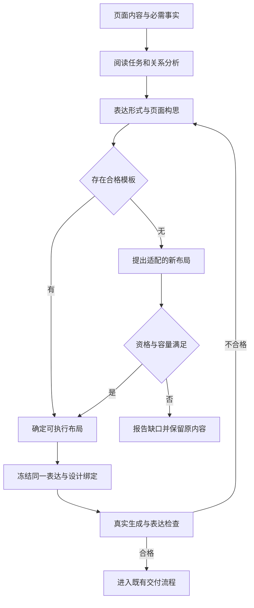
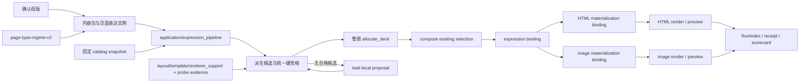
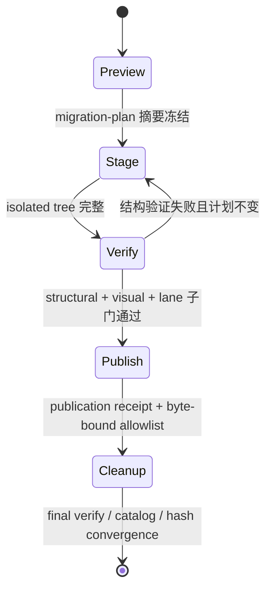
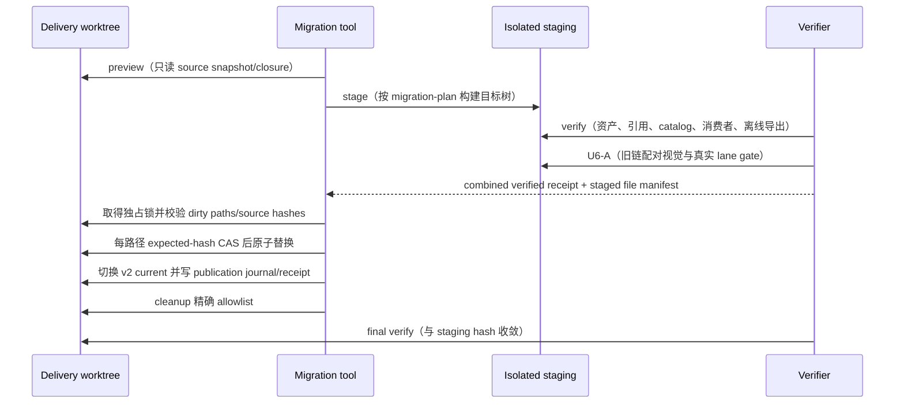
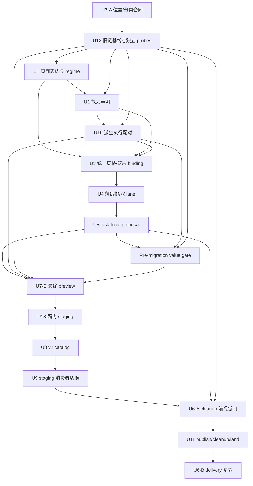

# PPT 单页表达优先、模板适配与模板库结构重构 - Plan

## Goal Capsule

提升单页表达：先理解内容中的论点、事实和关系，决定表格、图表、关系图或文字的作用，再选择模板或设计适配布局。面向委托 Agent 制作 PPT 的用户，延续整册已确定的受众、目的和主风格。

用户已明确选择 B「表达优先」。本计划保留该产品方向和 R1–R9、AE1–AE8，不重新发散 WHAT；本轮只重构 HOW。推荐实施顺序是：**先在现有资产结构上完成不发布的表达垂直切片，尽早证明关系理解、统一资格和双 lane 物化确有用户价值；再在隔离 staging 中迁移资产和消费者；验证通过后一次性发布并精确清理旧实现。** 全库搬迁不再阻塞价值证伪，也不能以结构搬迁成功替代表达质量成功。

系统仍处开发期且未对外发布，继续采用用户已确认的一次性 v2 切换，不建设双 reader、双写、旧路径 fallback、旧身份别名桥或旧 run 恢复。一次性切换不等于无保护迁移：切换前必须冻结旧链配对视觉基线、资产/消费者分母和关系能力探针；迁移必须经过 `preview → stage → verify → publish → cleanup`，且发布后的交付工作树必须与已验证 staging 逐文件摘要收敛。

内容真值继续由母版和内容包拥有，几何由 layout profile 拥有，模板输入与槽位由 template manifest 拥有，渲染支持由既有 `renderer_support` 拥有，主题由 effective theme 拥有。`page-type-regime` 是阅读任务及关系最小编码的唯一治理真值；执行候选由现有 layout↔template 配对、能力声明和可执行 probe 派生，不新增只做命名的资产层。最大的未验证风险仍是“结构检查通过但页面难理解”，其次是消费者遗漏和隔离验证未真正落到交付仓库。

本次只更新计划与 `CHANGELOG.md`；不实施代码、不运行实现测试、构建、catalog、Provider 或真实渲染。继续实施时须先重冻 source snapshot，并保留工作树中的无关变更。

---

## Product Contract

### Summary

让单页内容先形成可理解的视觉表达，再由模板和布局承载。模板不适配时保留表达需求，提出并验证新的布局方案；最终以导出页面的内容适配、阅读层次和图文有效性验收。

### Problem Frame

用户反馈“生成的单页样式非常差，没有按页内内容选择合适的模板，或者设计合适的布局”，并强调“文不如图，图不如表”。这说明用户关注信息能否通过页面直接被理解，单纯换色、换模板名或将段落分装卡片不足以回应诉求。

当前源码已有结构与关键词驱动的意图分析、版式候选排名和设计冻结能力。这些机制的存在不证明最终页面表达合适；本次未检查用户所指差页，也未运行真实生成对照，个案失败发生在理解、选择还是渲染阶段仍待核验。

### Key Decisions

- **采用 B「表达优先」**（session-settled: user-directed — chosen over 模板优先与全面自适应布局：先解决页内内容关系的表达，再决定模板载体）。用户在看到三种方向及代价后明确确认 B。Governs R1, R2, R3, R4, R5.
- **按内容选择图表表达**：将用户的原则落实为优先用表格和图解呈现可比较、可量化、可关联的信息；保留结论、必要解释与适合文字的页面，不设全局“表优于所有图”的机械排序。Governs R2, R7.
- **新布局作为有边界的补充**：先复用合格模板或既有组件；没有合适承载方式时设计本次任务的布局，并在生成资格与成品检查通过后使用，不将一次新布局自动晋升为共享模板。Governs R4, R5, R6, R8.

### Requirements

**理解与表达**

- R1. 每页明确一个主要阅读任务及其必需事实、证据和关系，信息不足时保留不确定性。
- R2. 根据页内关系选择表达形式，不能只因条目数量或关键词相同就套用相同结构。
- R3. 选择模板前形成页面构思，说明视觉焦点、阅读顺序及每项必需内容的呈现位置。

**模板与布局适配**

- R4. 候选必须能承载该页的表达结构、完整内容和实际渲染方式，再在合格集合内比较视觉适配与整册节奏。
- R5. 无合格模板时提出可保留内容关系的新布局；仍无法执行时明确报告该页不适配及具体缺口。
- R6. 页面沿用整册主风格，同时允许随表达任务变化采用不同布局与组件。

**生成与验收**

- R7. 图表转换保留事实、数值、单位、来源和必要限定，不通过删关键内容、缩小字号或编造关系适配模板。
- R8. 生成与适用的预览消费同一已选表达和有效绑定，渲染失败不得静默改成另一种表达。
- R9. 表达质量以真实导出页检查，分别记录语义适配、阅读层次、图文有效性与工程检查结果。

### Expression Guide

以下是表达选择的判断依据，不是内容类型到唯一模板的固定映射。同一页可有一种主表达及少量必要支撑，支撑必须服务同一阅读任务。

| 阅读任务 | 可接受表达 | 需要保留 | 应避免 |
| --- | --- | --- | --- |
| 核对多方案的同维度差异 | 对照表、比较矩阵 | 相同维度、缺失项、选择依据 | 每个方案一段散文，维度无法对齐 |
| 看变化、趋势或分布 | 折线、条形等合适数据图表 | 时间、单位、基线、精确值及必要口径 | 无数值依据的上升箭头、不同单位共用数值轴 |
| 看步骤与先后依赖 | 流程图、时间线 | 起止、顺序、依赖或并行关系 | 有依赖的步骤只排成孤立卡片 |
| 理解因果或运行机制 | 因果图、结构图 | 节点、关系方向、关系含义 | 将相关性画成已证实因果、无语义连线 |
| 核对成果与收益 | KPI 配合比较图或明细表 | 分母、期间、统计口径、不可相加项 | 堆大数字、混淆直接收益与净收益 |
| 判断证据是否支撑结论 | 原图、截图或证据图加定位标注 | 来源、关键区域、支撑的结论 | 用装饰图片代替事实证据 |
| 记住一个判断或完成导航 | 结论文字、简洁列表 | 核心信息、必要限定或导航顺序 | 为图形化而编造数据或关系 |

### Key Flows

- F1. **常规选型：** Agent 从已确定的页面内容识别阅读任务与关系，形成表达构思，再筛选合格模板并选择布局；生成后对照构思检查真实页面。**覆盖 R1–R4、R6–R9。**
- F2. **模板不适配：** 保留原内容与表达要求，说明候选缺口，优先用既有能力组合本次任务的新布局；经容量、渲染资格与真实页面检查后才算可用，失败时报告具体阻塞。**覆盖 R4、R5、R7–R9。**
- F3. **信息不足：** 不确定内容仅形成待核实的表达候选；能用已有材料表达的部分继续，只有会改变关键事实或交付范围的缺口才询问用户。**覆盖 R1、R3、R7。**



### Acceptance Examples

以下均为待实施的验收案例，不是已生成页面或用户真实业务数据。

- AE1. **同维度比较，覆盖 R1–R4、R7：** 三个方案分别有成本、周期、风险，应按相同维度呈现并突出结论；缺失的成本标为未知，不填造数值，不能只把三个原段落放进三个卡片。
- AE2. **同数量不同关系，覆盖 R1–R3：** 三个独立职责可采用并列结构，三个依赖步骤应呈现顺序，三个有来源支持的因果节点应标明作用关系；三页不能只因都有三项而得到同一种无关系布局。
- AE3. **精确值与趋势，覆盖 R2、R7、R9：** 同一组月度数值用于解释变化时可用折线图，用于逐项核对时可用表格；两者都保留单位与数据，缺少时间或数值时不虚构趋势图。
- AE4. **没有模板，覆盖 R4、R5、R8：** 页面需要“关系图＋关键数据说明”，现有候选只能承载其中一项，应标明不适配并提出支持两者的新布局；不能以改成通用列表或删除说明宣布成功。
- AE5. **容量硬超，覆盖 R4、R5、R7：** 模板只能容纳部分对照行时改选或重排；若需要删关键事实、改变总页数或调整用户范围，应提出具体方案，不能静默执行。
- AE6. **用户点名模板，覆盖 R4、R5、R7：** 指定模板无法表达页面内容时，说明冲突并提出保留风格的适配方案；点名不绕过内容保真和容量要求。
- AE7. **文字适用，覆盖 R1、R2、R7：** 只有一句核心判断且无数据或关系证据时，清楚的文字页可以合格；不为提高图表占比生成伪数据或装饰性流程。
- AE8. **执行与视觉，覆盖 R6、R8、R9：** 构思选定对照表后，导出页仍须保留比较结构与主风格；即使机器检查通过，若标签不可读、重点不明或比较关系丢失，表达验收仍不通过。

### Success Criteria

本专项纳入 R-85 的既有回放、留出与真实导出验收，不另设较低通过线。在同一批材料上允许多个正确表达，以必需事实和关系是否被准确呈现判定适配；不把旧推荐器的模板 ID 当作标准答案。新增样例至少覆盖上述 AE1–AE8，包含有解、无解、信息不足、容量边界和文字适用情况，不能只选适合现有模板的输入。

成品应让评审者从页面识别主要结论、证据及关系，并读清图表标签和必要限定。事实错误、关系误导、关键内容遗漏、截断重叠和不可读图表均为否决项。模板数量、图表占比、换色、像素留白率、lint 及模型自评分均不能单独证明表达改善。人工判读、模型辅助、工程检查及真实用户收益分开报告；尚未观测的改善保持未验证。

### Scope Boundaries

- 聚焦 `leo-ppt-generator/template-library` 的模板适配，以及现有 PPT 生成流程中消费模板的相关环节。
- 本文 R1–R9 是原 PRD R-85 的专项细化，局部编号不替代原需求编号；后续实施接入既有 owner，避免平行推荐器或第二套绑定。PRD 的完整需求仍由上游总账维护，本计划仅承接下表标明的实施面。
- 本次纳入模板库结构、协议及活动消费者迁移；模板全库扩容、控制台、成本路由或新渲染引擎仍不属于本专项。
- 新布局限定为本次内容需要且已有执行能力可承载的适配；任务内布局提案不得自动修改共享 canonical。受控 canonical 结构迁移是单独工作，不属于任务内提案。

### Outstanding Questions

**规划前阻塞：** 无未决产品选择。B 已确认，具体实现方法由本计划确定。

**实施期证据缺口：** 用户所指差页尚未绑定可回放任务；缺少该页不阻塞通用实现，但阻塞“用户问题已修复”的结论。真实 image Provider 调用仍需单独授权；无授权时必须记为 `blocked` 或 `not_run`。

### Sources and Limitations

源码核对时间为 2026-09-13，基线是元数据所列 HEAD 加当前工作树，不是干净提交。hash 为 SHA-256 前 16 位；实施前若文件变化，必须重读受影响 owner；文档 hash 以当前工作树为准。

| 来源（仓库相对路径） | 当前事实 | 快照 hash 前缀 |
| --- | --- | --- |
| `leo-ppt-generator/runtime/src/leo_ppt_generator/page_intent.py` | 已有意图推断，但不拥有关系治理真值 | `d66c8fc275c62dc7` |
| `leo-ppt-generator/runtime/src/leo_ppt_generator/layout_selection.py` | `allocate_deck` 已能冻结逐页 layout/binding，但当前无生产 caller | `7a716f386f59ec19` |
| `leo-ppt-generator/runtime/src/leo_ppt_generator/templates.py` | `compose_design` 当前会自行解析/选择 layout，可能覆盖已有 selection | `c96f9c6a33f7cdcd` |
| `leo-ppt-generator/runtime/src/leo_ppt_generator/content_pack.py` | 已有内容包与整册摘要 owner | `59da5eeb12777505` |
| `leo-ppt-generator/runtime/src/leo_ppt_generator/content_projection.py` | 已有 `precompile_binding` 与双 lane 投影 owner | `14c873951423dde5` |
| `leo-ppt-generator/runtime/src/leo_ppt_generator/asset_resolver.py` | 已有 catalog/snapshot 边界，位置规则仍需 v2 收敛 | `3acf9bc11ea5fe82` |
| `leo-ppt-generator/runtime/src/leo_ppt_generator/render/page.py` | HTML 渲染已验证冻结设计与主题 | `6489c941474d9eaf` |
| `leo-ppt-generator/runtime/src/leo_ppt_generator/render/chart.py` | 已有本地图表 SVG 能力 | `12134332d5d3a53f` |
| `leo-ppt-generator/runtime/src/leo_ppt_generator/cli.py` | 只冻结调用方传入的三类输入，不拥有完整生产编排 | `5f1c869fab823b97` |
| `leo-ppt-generator/scripts/capability_manifest.py` | 已从 layout `structure` 与 `renderer_support` 派生准入 | `e808f4e19a32d8b2` |
| `leo-ppt-generator/scripts/migrate_template_library.py` | 现有迁移器需要收敛为五阶段状态机 | `1e51dc5727fea2ed` |
| `leo-ppt-generator/scripts/style_pack.py` | 仍属于结构迁移 writer 面 | `779179a8dd6395ba` |
| `leo-ppt-generator/scripts/generate_style_gallery.py` | 已使用 resolver，但仍需纳入 closure | `22105f4e5380862a` |
| `docs/prd/2026-09-11-leo-ppt-capability-improvement-prd.md` | R-85 产品与验收上游（当前工作树） | `df640253bd2b8d91` |
| `docs/plans/2026-09-11-003-feat-leo-ppt-capability-improvement-plan.md` | 关联能力计划与 R-85b owner | `4ff65f52c595a857` |

上述事实只证明可复用机制存在，不证明本专项已实现。方案优化依据当前源码、已有协议和 `docs/leo-ppt-generator/reviews/2026-09-12-expression-first-multi-expert-review.md`：本轮采用 coherence、feasibility、adversarial、scope-guardian、product-lens 五种角色化审查；独立 worker 派发因宿主 429 未返回，因此不把角色化自审写成独立 reviewer 通过。外部研究未执行，因为关键取舍由仓内既有 owner、协议和迁移边界决定，外部材料不会改变本计划的核心证据链。

---

## Planning Contract

### 范围、owner 与 supersede

Product Contract 的 WHAT 不变。本计划仅把用户明确要求的全库结构、协议和消费者迁移纳入同一交付，并以开发期一次性 v2 切换 supersede 003 U12 中结构兼容与旧版本恢复部分。职责边界如下：

| 事项 | 唯一 owner | 本计划处理 |
| --- | --- | --- |
| R-85b 全库风格语义升级、资产补齐与质量晋升 | 003 U12 | 保留；结构迁移完成不自动关闭该义务 |
| 表达合同、资格、双 lane 绑定、任务内提案 | 004 U1–U6、U10、U12 | 本计划唯一实施入口 |
| 目录、位置合同、catalog、消费者和一次性迁移 | 004 U7–U9、U11、U13 | supersede 003 U12 的同类结构工作 |
| 旧 reader、fallback、别名桥、旧 run/catalog 恢复 | 不实施 | 由用户“不需要向下兼容”决策排除；PRD 中相反的历史表述按本计划 supersede |

003 可保持 active，但不得再次驱动本表第三、四行。所有顶层技能包仍是所有权边界；本计划只修改 `leo-ppt-generator/` 及明确关联的仓库文档。

### PRD 分层追踪与合并边界

下表是本计划与 `docs/prd/2026-09-11-leo-ppt-capability-improvement-prd.md` 的唯一合并口径。
“承接”表示本计划拥有实现与验证；“接口”表示只冻结消费关系，不转移上游 owner；“外置”表示保留在 PRD 或其他计划，不得由本计划的结构、表达或迁移门替代。

| PRD 需求 | 004 处理 | 唯一 owner / 验收边界 |
| --- | --- | --- |
| R-85a | 承接：页面表达、资格、binding、首批矩阵和表达回放 | 004 U1–U6/U10；遵守 AE-85，不以局部 fixture 代替全量门 |
| R-85b | 分层承接：结构迁移、catalog、consumer closure 由 U7–U13；语义升级与资产质量晋升留在 003 U12 | 两计划不得重复写入同一真值；结构完成不关闭语义 owner |
| R-71 | 接口：预览消费冻结 binding、影响范围和 publish 前置；全册性能、image、移动端协议仍按 PRD 独立验收 | R-71 预览 owner；004 不以 U4/U6 局部贯通宣称 R-71 完成 |
| R-74 | 接口：004 提供 qualified lane/pairing；成本路由与 lane 评测外置 | R-74 owner；不得在 004 复制第二 ranking |
| R-75 | 承接核心：U5 提案必须满足最多 3 项、代价说明、容量复检和不自动应用 | 004 U5；呈现格式由 R-76 负责 |
| R-77 | 接口：U6/KTD14 消费 scorecard 与 evidence 状态；事件、费用、返工指标 owner 不转移 | R-77 owner；缺账单/真实反馈仍按 blocked/not_yet_observed |
| R-84 | 接口：关系/图表语义作为 U1/U12 前置约束；完整图表 eval 和真实 run 基线外置 | R-84 owner；不得用关系 probe 代替三维构思评测 |
| R-70、R-73、R-76、R-78、R-79、R-80、R-82 | 外置：仅保留 binding、provenance、impact 或 schema 接口 | 各自 PRD 条目继续独立验收，不能被 U6 或迁移门抵扣 |
| R-83、R-81、R-72 | 排除：维持暂缓、关闭、移除状态 | 不重新激活，不新增实现单元 |

PRD 中“旧版本可恢复”“旧 run 可读”等要求与用户已确认的一次性 v2 切换冲突；本计划采用后者，仅保留迁移安全快照、冻结基线和 provenance，不建设旧 reader、fallback、别名桥或运行时恢复。

### 第一性原理与减法约束

1. **页面事实只有一个真值。** 母版/内容包拥有实例事实；`leo-ppt-generator/template-library/governance/rules/page-type-regime-v2.json` 只拥有阅读任务分类、关系词汇和最小编码，不复制页面文案、数值或几何。
2. **执行能力只由可运行资产证明。** layout `structure`、template `input_fields`/`slot_bindings` 与现有 `renderer_support` 是能力真值；声明必须绑定正向 probe、反例和 evidence digest。
3. **候选是派生结果，不是新资产。** canonical layout↔template 配对与 task-local proposal 统一投影为候选身份；不新增只做命名、重复引用和阻塞执行的长期实体层。
4. **选择与物化分层。** lane-neutral 表达绑定证明“本页选择什么表达、依据哪些事实与关系”；lane-specific 物化绑定证明“某条 lane 的执行配对为何合格、如何执行”。双 lane 共享前者而非强求最终摘要相同。
5. **迁移只改变位置与协议，不升级能力。** 指南、参考池、空组件和未验证声明不能因搬目录进入自动池；结构成功、表达成功、视觉成功分别验收。
6. **价值证伪早于大搬迁。** U1–U5、U10 先在当前结构上形成不发布垂直切片；U13/U8/U9/U11 再完成隔离迁移与一次性切换。

### Key Technical Decisions

- **KTD1（replace）：** 以 `leo-ppt-generator/template-library/governance/rules/page-type-regime-v2.json` replacement-first 扩展现有治理真值，定义 reading task、relation kind 和最小编码。U1 可先在不发布垂直切片中实现 v2 consumer；U9/U11 在同一次 cutover 中切完其余活动消费者并移除 active v1，不交付双 reader。页面实例表达作为内容包的版本化派生字段，引用既有 item/fact，不新增独立 canonical 表达实体。Governs R1–R3、R7。
- **KTD2（extend）：** layout `structure`、template `input_fields`/`slot_bindings`、既有 `renderer_support` 共同拥有执行能力；catalog 只派生能力视图。禁止在 template 或新资产中复制第二份表达能力映射。Governs R2、R4、R6。
- **KTD3（compose / thin-glue）：** 新增 `leo-ppt-generator/runtime/src/leo_ppt_generator/application/expression_pipeline.py` 作为最薄生产编排，固定 `pack → catalog snapshot → qualified candidates → deck selection → compose existing selection → run freeze` 的调用顺序、失败传播和证据聚合；不拥有内容、排名、模板、binding 或 run 真值。Governs R4、R8、R9。
- **KTD4（replace）：** 有效绑定拆成 `expression_binding_digest` 与 `materialization_binding_digest`。前者覆盖页面表达、事实引用和 lane-neutral `expression_choice_identity`；后者额外覆盖 lane-specific `execution_pairing_identity`、资格证据、lane/backend、layout/template/recipe、slot map、theme/assets/proposal。HTML 与 image 必须共享前者，各自拥有后者。Governs R7–R9。
- **KTD5（replace）：** 身份拆成两层。`expression_choice_identity` 只含 page expression digest、reading task/relation、focus/order、主/支撑表达、selection-policy revision 和 regime revision，不含 catalog generation、lane、layout、template 或 proposal。`execution_pairing_identity` 采用判别式来源 `canonical-derived-pairing` 或 `task-local-proposal`，共有字段为 scope、catalog generation、lane、layout identity、能力证据摘要；HTML 配对必须带 template identity，image-only 配对允许 `template_identity: null` 但必须带 recipe identity。proposal 额外带 run scope 与 patch digest。禁止仅按 layout ID、模板名或展示名去重。Governs R4–R6、R8。
- **KTD6（extend）：** `comparison`、`trend`、`process`、`causal`、`independent` 均有最小可执行编码和 probe。`independent` 是并列 item set、无有向边，但仍须有 reading order 与 focus；不得当成 unknown 或 `system`。无正向 probe、反例和 evidence digest 的声明不得进自动池。Governs R1–R5、R7。
- **KTD7（compose / task-local）：** 无合格共享候选时，任务内提案只能基于冻结的 layout/template/现有 renderer 能力做 bounded patch；不能自由 CSS、删必需事实、改变用户范围或自动晋升 canonical。缺口按现有 curation 流程聚合，晋升另行评审。Governs R4–R6、R8。
- **KTD8（replace）：** catalog 错误语义分离：`library_missing` 仅表示库根缺失；新增 `catalog_missing` 表示指针/代不存在，新增 `catalog_invalid` 表示结构或内容损坏；保留现有 `stale_catalog` 表示有效 catalog 与源不一致。resolver 只有显式 `execution` 与 `diagnostic` 两种构造模式：前者对上述错误 fail closed，后者才允许 `canonical-rebuild` 且输出不可冻结/不可执行标记。Governs R4、R8、R9。
- **KTD9（extend）：** 生成摘要按单向 DAG 计算：`asset_generation` 只由协议、builder 策略、位置规则、治理词表和 canonical 字节决定；relation probe receipts 绑定 `asset_generation` 后形成 `evidence_set_digest`；最终 `catalog_generation` 再由 `asset_generation + evidence_set_digest + builder policy` 派生。receipt 不反向写入自身生成摘要。三者同输入同输出，同代不同输出冲突，完整写入后才切 current；执行配对和关系能力均为同代派生 view。Governs R4、R8、R9。
- **KTD10（replace）：** 迁移只有一份 `migration-plan.json` 和最少 receipt，状态固定为 `preview → stage → verify → publish → cleanup`。`verify` 只有在结构验证、U6-A 配对视觉和真实 lane 子门都通过后才签发 publication-ready receipt；`publish` 只接受该 receipt，`cleanup` 只接受 publication receipt 与摘要/字节绑定的 delete allowlist。Governs 结构迁移与 R8–R9。
- **KTD11（extend）：** closure 扫描集成进迁移计划与 verify，不新增第二套长期 schema/signature/script 体系。U7 要求 `unclassified_hits=0`，允许冻结已分类的 `active_legacy_hits>0`；U9 staging 与 U11 final checkout 均要求 `active_legacy_hits=0`。Governs 结构迁移。
- **KTD12（replace；session-settled: user-directed）：** 只交付一套 v2 reader/writer/fixture，不发布新旧混合态。旧开发 pack/run/catalog 从来源重建；迁移的本地安全快照只用于防误删，不构成运行时兼容或恢复承诺。Governs R7–R9。
- **KTD13（extend）：** 保留整册 `content_digest` 作为完整性摘要，同时增加 page-level content/expression/materialization impact keys；`leo-ppt-generator/scripts/compute_impact.py` 扩展到主题、资产、候选和 lane 失效，不再用整册 pack hash 或只理解 old/new master 的结果证明页级 invalidation。Governs R8–R9。
- **KTD14（extend）：** 扩展现有 `leo-ppt-generator/scripts/run_quality_scorecard.py`，不建第二评分系统；既有 observability 聚合字段保持不变，新增 `deck_quality` 对象承载本专项证据。`deck_quality.overall_status` 按当前 receipt 计算，允许 `implementation_complete`、`html_validated`、`image_validated`、`visual_validated`、`failed`、`stale`、`error`、`blocked`、`not_run`；四个 evidence channel 允许 `passed|failed|stale|error|blocked|not_run`，并记录 receipt、blocker 和失效原因。状态优先级为 `error > failed > stale > blocked > not_run > visual_validated > image_validated > html_validated > implementation_complete`，不得用历史最高状态覆盖当前失败或失效。Governs R9。
- **KTD15（extend）：** task-local proposal 不自动晋升，但失败原因、使用频次、人工修订和视觉结果回流现有 curation；无证据不得转 canonical。Governs R5、R6、R9。
- **KTD16（extend）：** U12 在 cleanup 前冻结旧链配对导出、四维评分、环境指纹和可重放输入。U6 只能与该基线做同材料、同主题族、同 lane 的配对比较；不得在旧链删除后重建“基线”。Governs R6、R9。

### Interface Contracts

| Contract | Canonical owner | Consumers | Evolution / failure |
| --- | --- | --- | --- |
| `page-type-regime-v2` | `template-library/governance/rules/page-type-regime-v2.json`；U1 | `page_intent`、资格、probe、QA | replacement-first；未知 task/relation、缺最小编码拒绝；U11 删除 active v1 引用 |
| 页面表达实例 | `leo-ppt-generator/runtime/src/leo_ppt_generator/content_pack.py` 与内容包 schema；U1 | `layout_selection`、`content_projection`、QA | 只存引用、focus、reading order、relation encoding、uncertainty；悬空引用或隐式回填返回 `expression_incomplete` |
| 能力证据 | layout `structure`、template 输入/槽位、`renderer_support` 与 probe receipt；U2/U12 | catalog builder、资格、候选派生 | 声明与 probe 不一致即不准入；未验证不等于 unsupported，但不能自动执行 |
| 派生执行配对 | catalog generation view；U8/U10 | `layout_selection`、薄编排 | 由现有双向引用和证据构建，不手改；依赖缺失、lane 不闭合或 evidence 漂移即排除；image-only 配对允许无 template |
| Lane-neutral 表达选择身份 | `leo-ppt-generator/runtime/src/leo_ppt_generator/content_pack.py` / `leo-ppt-generator/runtime/src/leo_ppt_generator/layout_selection.py`；U1/U3 | 双 lane selection、receipt | 只描述表达决定、policy revision 和 regime revision，不含 catalog generation、执行资产或 lane；同页双 lane 必须引用同一 identity |
| 判别式执行配对身份 | catalog generation view 与 task-local proposal；U5/U10 | U3、U4、receipt | canonical 与 proposal 不可碰撞；lane、catalog generation、layout、template/recipe、evidence 全部属于本层；proposal 必须带 run scope |
| 双层 binding | `leo-ppt-generator/runtime/src/leo_ppt_generator/content_projection.py` 与 selection/run 输入；U3/U4 | HTML/image、preview、RunIndex、receipt | 双 lane 的 expression digest 必须一致；materialization digest 绑定各自 execution pairing 与资格证据，漂移 fail closed |
| 生产编排 | `leo-ppt-generator/runtime/src/leo_ppt_generator/application/expression_pipeline.py`；U4 | CLI/application routes | 只编排既有 owner；selection 缺失、compose 重选、冻结不一致均失败，不内建第二 ranking |
| Run input transaction | run-scoped immutable input generation + `input/current.json`；U4 | RunIndex、preview、render、receipt | 先写不可见 staging generation，交叉校验后原子发布 pointer；reader 只读 committed generation；崩溃和重试按摘要恢复 |
| Task-local proposal | run-scoped proposal schema；U5 | 候选派生、resolver snapshot、双 lane | bounded patch；不写共享库；未知 anchor、跨根路径、删事实或缺快照拒绝 |
| 迁移计划与 receipt | `leo-ppt-generator/scripts/migrate_template_library.py`；U7/U13/U11 | staging verifier、publisher、cleanup | 每阶段摘要绑定前一阶段；delivery drift、路径越界、目标冲突、未分类命中均 fail closed |
| 质量 scorecard | `leo-ppt-generator/scripts/run_quality_scorecard.py`；U6 | 发布判定、复审 | 既有 observability 聚合保持兼容；本专项使用 `deck_quality` 四通道；当前失败/失效优先于历史成功，缺证据不能升级状态 |

### 实施前必须冻结的接口

`artifact_readiness: implementation-ready
implementation_status: not-started
readiness_semantics: implementation-ready means the plan is sufficiently specified to begin implementation; it does not mean runtime implemented or verified` 要求以下接口在进入 U1 之前落成 schema、生产者、消费者和失败码；“不锁定尚不存在的精确参数签名”仅适用于实现语言细节，不能用于推迟这些跨模块合同。

| 接口 | 最小冻结内容 | 唯一生产入口 / 消费者 |
| --- | --- | --- |
| `expression_pipeline/v1` | `PipelineRequest`（pack、catalog generation、design context、lane matrix、run root）、`PipelineResult`（selection、resolved design、bindings、receipt refs）、`PipelineFailure`（reason code、phase、retryability）及幂等键 | `application/expression_pipeline.py`；`routes.generate` 与 CLI 只转发 |
| `library_context/v1` | library root、catalog pointer/generation、regime path、template/font/bundle roots、scope；禁止隐式默认根 | `LibraryContext`/`ResolverFactory`；resolver、builder、lint、bundle、render 共用 |
| `image-recipe/v1` | recipe identity、version、slot map、canvas、required text/data projection、prompt skeleton、provider/lane、probe evidence ref | `canonical/executable/recipes/<slug>/recipe.json`；resolver/catalog/U10/U4/U6 |
| `qualification/v1` | `lifecycle_status` 只允许 `unknown|legacy|executable|retired`；`qualification_status` 另定义 `unverified|provisional|publication-qualified|rejected` 及转换条件 | U2 evidence receipt；catalog、candidate view、publish gate 只消费映射结果 |
| `binding/v2` | 删除生产消费中的单一 `binding_digest`；明确 expression/materialization 两摘要的字段、缓存比较、receipt freshness、RunIndex/provenance 映射 | U3 生产，U4 物化；preview、render、receipt、RunIndex、CLI 必须全部迁移 |
| `impact/v2` 与 `deck-quality/v1` | 输入 digest、稳定 `page_id` join、reason/stale 优先级、receipt 引用、四通道状态与 CLI 输出 | U6/`compute_impact.py`/`run_quality_scorecard.py`；不得只输出旧 observability 聚合 |

### 关系最小编码与能力证明

| relation | 最小编码 | 正向 probe | 必须拒绝的反例 |
| --- | --- | --- | --- |
| `comparison` | `item_refs`、共同 `dimension_refs`、每格 fact/unknown | 同维度矩阵完整落位 | 维度不齐却拆成无对齐卡片 |
| `trend` | 有序 time/value pair、unit、period/baseline | 顺序、数值、单位均进入图/表 | 缺时间或数值却生成趋势箭头 |
| `process` | ordered nodes、dependency edges、显式 parallel branch | 顺序与依赖在图中可追踪 | 依赖步骤仅作无连线并列项 |
| `causal` | directed edges、edge meaning、source support | 方向和限定均可读 | 把相关性标成确定因果 |
| `independent` | item set、reading order、focus、`edges=[]` | 并列结构保留顺序和重点 | 自动补有向边或降为 unknown |

每个 relation×lane 的判定 oracle 由 U12 从 Product Contract/AE 固定，独立于 capability 声明、admission 代码、pairing projector 与 renderer；oracle 明确输出中必须出现的 item/dimension/node/edge/order/unit、必须缺失的误导边/伪值/降级结构，以及 `renderer_success_but_semantically_wrong` 反例。oracle owner/version/hash 在 U2 实现前冻结，U2 只能消费，不能从被测声明生成预期结果。

每个自动准入关系必须生成 capability evidence receipt，至少绑定 asset identity、generation、lane、oracle version/hash、probe fixture hash、实际渲染产物 hash、正向结果、反例结果、环境指纹和 evidence digest。声明、oracle、fixture、renderer 或执行依赖任一变化均使旧 evidence stale；无法由确定性 oracle 判断的可读性项必须在 U6-A 人工/模型裁决通过后才允许自动准入。

### 运行数据流



薄编排只能聚合既有 owner 的结果：`content_pack` 拥有内容，catalog/resolver 拥有固定 generation，`layout_selection` 拥有资格和整册选择，`templates` 只按已有 selection 组合设计，`content_projection` 拥有 binding，RunIndex 拥有冻结后的只读投影视图。CLI 只暴露入口，不成为第二编排真值。

迁移前垂直切片不引入临时 v2 reader：U10 的 pairing projector 只接受现有 `AssetResolver` 输出的规范化 asset records 与 U12 evidence，输出最终版 candidate-view schema；它不读取物理路径或 catalog 版本。切片固定当前 catalog generation，仅在非发布 fixture 中使用。U8 更换 resolver/catalog 内部到 v2 后原样复用同一 projector 和 view schema，因此没有第二真值或需长期保留的兼容 adapter。

### 表达选择、执行配对与双层绑定

`expression_choice_identity` 是 lane-neutral 对象，由内容/选择 owner 产生：page expression digest、reading task/relation、focus/order、主/支撑表达、selection-policy revision 和 regime revision。它回答“本页要表达什么”，不包含 catalog generation、lane、layout、template、renderer、slot 或 proposal。

`execution_pairing_identity` 是 lane-specific 判别式对象，回答“某条 lane 如何承载该表达”：

- canonical derived pairing：`source_kind`、scope、catalog generation、lane、layout identity、template identity 或 recipe identity、capability evidence digest。image-only pairing 的 `template_identity` 为 `null`。
- task-local proposal：上述字段加 proposal digest 与 run scope；base asset 与 bounded patch 均进入 materialization binding。
- 去重键覆盖完整执行身份；同 layout 在不同 template/lane/evidence 下是不同配对，同一完整身份的重复派生只保留一个。

`expression_binding_digest` 覆盖 page content/expression digest、fact refs、relation encoding、focus/order 与 `expression_choice_identity`。`materialization_binding_digest` 覆盖 expression digest，并增加 `execution_pairing_identity`、lane-specific qualification result、backend、layout/template/recipe、slot map、effective theme、asset pins 和 proposal。HTML 与 image 对同一页面的 expression digest 必须相同；只要 lane、执行配对、slot map 或资产不同，materialization digest 就应不同。任何消费端重选表达、layout 或 template 都是合同错误。

### 目标目录与位置合同

目标目录只保留四类长期职责，不建立额外组合真值区：

```text
leo-ppt-generator/template-library/
  library.json
  canonical/
    semantic/
      argument-modes/<slug>/{manifest.json,body.md}
      page-types/<slug>/{manifest.json,body.md}
      guides/{chart,infographic}/<slug>/{manifest.json,body.md}
    visual/
      styles/<slug>/brief.json
      themes/<slug>/theme.json
      brands/<slug>/brand.json
      fonts/<slug>/{manifest.json,font-files}
      ornaments/<slug>/manifest.json
    executable/
      layouts/<slug>/{layout.json,notes.md}
      layouts/guides/<slug>/{manifest.json,body.md}
      templates/<slug>/{template.json,page.html}
      components/<slug>/component.json
      recipes/<slug>/recipe.json
      renderers/guides/<slug>/{manifest.json,body.md}
    collections/presets/<slug>/preset.json
  catalog/
    current.json
    generations/<generation>/{registry.json,build-manifest.json,views/}
  governance/{schemas,rules,vocabularies,authoring,migration/}
  evidence/
  reference/{sources,pools,historical-gallery/}
```

Staging 采用**独立 worktree 模型**：目标直接是 `<isolated-worktree>/leo-ppt-generator/template-library/`，带自己的 `library.json`、canonical 与 catalog；builder、resolver、lint 和 bundle 命令都显式以该完整 shadow library 为 root。临时 transaction/backup 只能位于 git-ignored 的 worktree 外部工作区，不写进活动库，也不是 catalog 输入或第五码真值区。publish manifest 的相对基准固定为仓库根，因此 staged path 可一一映射到 delivery path。`asset-locations-v2` 必须逐项声明实体文件模式、scope、catalog 状态与排除路径，至少覆盖：

| kind / classification | 精确语义位置 | catalog 处置 |
| --- | --- | --- |
| argument axis guide | `canonical/semantic/argument-modes/*/manifest.json` | reference-only |
| page-semantics axis guide | `canonical/semantic/page-types/*/manifest.json` | reference-only |
| chart / infographic axis guide | `canonical/semantic/guides/{chart,infographic}/*/manifest.json` | reference-only |
| structure axis guide（8 个现存线索，实施重冻） | `canonical/executable/layouts/guides/*/manifest.json` | reference-only；排除于 layout 实体扫描 |
| rendering axis guide（43 个现存线索，实施重冻） | `canonical/executable/renderers/guides/*/manifest.json` | reference-only；排除于执行实体扫描 |
| style/theme/brand/font/ornament | `canonical/visual/<kind-plural>/*/<entity-file>` | 按各自 schema 与状态进入 visual view |
| layout/template/component/recipe | `canonical/executable/<kind-plural>/*/<entity-file>` | 只有 schema、依赖与 probe 通过才进入执行池；image recipe 必须有独立 identity 与版本 |
| preset | `canonical/collections/presets/*/preset.json` | curated-only，不产生执行资格 |
| reference pool | `reference/pools/*/pool.json` 或登记来源文件 | provenance-only |
| QA profile | `governance/rules/` 中的聚合治理规则 | **不是 catalog entity**；从 `ASSET_ID_RE`、`KIND_ENTITY_FILE` 和实体发现中移除 `qa-profile`，只允许通过治理规则引用 |

未知 kind、自由深度 glob、symlink 越界、`guides`/`examples`/`staging`/`generations` 被误识别为实体均失败。当前 565 个 registry 实体及 124 个 axis 只作为重冻线索；迁移时逐文件映射，不把计数当能力证明。

### Closure 扫描合同

`migration-plan.json` 内嵌 closure 配置、原始命中与分类，不新增长期平行工具。固定 roots：

- `leo-ppt-generator/runtime/src`
- `leo-ppt-generator/scripts`
- `leo-ppt-generator/tests`
- `leo-ppt-generator/evals`
- `leo-ppt-generator/SKILL.md`
- `leo-ppt-generator/references`
- `leo-ppt-generator/prompts`
- `docs/plans`
- `docs/prd`
- `docs/leo-ppt-generator`

分类仅允许 `active-consumer`、`migration-input`、`test-fixture`、`plan-control`、`provenance`、`generated-excluded`、`delete`。每个命中必须记录 path、line/symbol、signature、classification、owner 和 disposition；普通活动文件不能伪装成 `plan-control`。U7 成功口径是扫描完成、`unclassified_hits=0`，并冻结真实 `active_legacy_hits`；U9 staging 和 U11 final checkout 都必须达到 `active_legacy_hits=0`。`evals/` 内旧路径必须逐项处置，不能靠漏扫得到零命中。

### 迁移状态机与交付收敛



`VisualGate` 与 `FinalVerify` 是 `verify`、`publish` 和 `cleanup` 内的非持久化子门，不能产生额外状态或独立 receipt。唯一持久化状态仍为 `preview|stage|verify|publish|cleanup`；U6-A 的配对视觉与真实 lane receipt 是 `verify` 签发 publication-ready receipt 的必要字段，`publish` 只接受该 receipt，`cleanup` 只接受 publication receipt。



阶段合同：

- `preview` 只读，输出唯一 `migration-plan.json`（由 `--out-plan` 指定）；plan 内嵌 base revision、dirty path hashes、source snapshot、mapping、scan roots/excludes、closure classifications、target hashes、delete allowlist 及其摘要。不得另建未绑定 plan 的 report 或 allowlist。
- `stage` 只写独立 worktree 的完整 shadow library 与 worktree 外 git-ignored 安全快照；不改 delivery current，delivery resolver 不自动发现该 worktree。
- `verify` 只接受同一 plan，输出 verified receipt 和 staged file manifest；必须覆盖资产/附属字节、引用闭合、v2 catalog、关系 probes、consumer closure、隔离 bundle 和迁移前后内容完整性。
- `publish` 只接受含 U6-A receipt 的 publication-ready verified receipt。publisher 先取得交付根独占锁，重核 delivery 所有 touched path 的 base/dirty hash；每个 path 在原子替换前执行 expected-hash CAS，只复制 receipt 所列文件并比较 staging hash，最后才切 current。原字节/安全快照摘要、逐路径 CAS 与 current journal 必须进入 publication receipt；任一漂移或锁失败即停止。
- `cleanup` 只接受 publication receipt 和 plan 内摘要一致的精确 allowlist；每项绑定 path、预期类型、source hash、publication 后预期状态和 `already_absent` 规则，删除前重新拒绝 symlink/type/hash 漂移。禁止未列出的递归删除。完成后 final verify 必须证明 delivery 文件摘要与 verified staging 相等、`active_legacy_hits=0`、v2 current 自洽。

隔离 worktree 的“通过”只有在 final delivery convergence 通过后才成为交付证据。若 publish 发生部分写入，使用本批本地安全快照或 Git 恢复 touched paths 后重新从 publish 前置门开始；不为此建设旧 runtime 兼容层。

迁移器只暴露以下阶段命令，参数和产物固定：

```text
preview --source-root <delivery> --out-plan <migration-plan.json>
stage --plan <migration-plan.json> --staging-root <isolated-worktree>
verify --plan <migration-plan.json> --staging-root <isolated-worktree> --out-receipt <verified-receipt.json>
publish --plan <migration-plan.json> --receipt <verified-receipt.json> --delivery-root <delivery>
cleanup --plan <migration-plan.json> --publication-receipt <publication-receipt.json> --delivery-root <delivery>
```

`--execute`、`--retire-old-tree` 等旧入口必须删除；不接受缺 plan、缺 receipt、root 越界、摘要漂移或非本阶段产物。每个阶段重复执行必须按摘要幂等，不得隐式推进下一阶段。

### Implementation Unit Navigation（13 units）

| Unit | 主题 | 主要产物 | 关键依赖 |
| --- | --- | --- | --- |
| U1 | 页面表达合同与 regime v2 | 内容包实例表达、关系治理 | U7-A、U12 |
| U2 | 能力声明与 probe 准入 | layout/template/renderer_support 证据化 | U1、U12 |
| U3 | 统一资格与双层 binding | qualified pool、两级摘要 | U1、U2、U10 |
| U4 | 薄生产编排与双 lane 物化 | application pipeline、freeze/RunIndex | U3 |
| U5 | Task-local layout proposal | bounded proposal 与 curation feedback | U4 |
| U6 | Scorecard、真实导出与回放 | U6-A staging 视觉门；U6-B delivery 复验 | A：U4、U5、U9、U12；B：U11 |
| U7 | 位置、账本与 closure 合同 | U7-A 合同基线；U7-B 最终 preview | A：无；B：U5、U10、U12 |
| U8 | v2 catalog 与派生 views | staged generation、错误模型 | U13 |
| U9 | staging 消费者切换 | 全活动入口 v2、legacy hits=0 | U8 |
| U10 | 派生执行配对与候选身份 | pairing/candidate view | U2、U12 |
| U11 | Verify/publish/cleanup/land | delivery convergence 与旧实现清理 | U5、U9、U12、U6-A |
| U12 | 旧链基线与关系 probes | 配对视觉基线、能力证据 | U7-A；必须早于 U1 |
| U13 | 隔离 staging 迁移 | staged canonical 与 source manifest | U7-B、U12 |

共享文件采用单一写入 owner：`content_projection.py` 由 U3 写入、U4/U10 只消费；`asset_resolver.py` 由 U8 写入、U5/U10/U13 只消费；`capability_manifest.py` 由 U8 写入、U2/U9/U11 只消费；`lint_template_contract.py` 由 U2 写入、U10/U11 只调用。其他 unit 若需修改这些文件，必须拆成 owner unit 的子任务并重新生成下游快照，禁止并行追加第二份真值。

### Dependency Graph



此图无环。U12 先冻结真正旧链；U1→U5/U10 在当前结构中形成不发布垂直切片；U7-B 只在切片完成后冻结 U13 的执行快照；U6-A 在 staging 上以旧链基线完成配对视觉与真实 lane 门，未通过时不得 publish/cleanup；U6-B 只复验 delivery 与用户差页。

### Assumptions and Risks

- 上游 Agent 能在已确认母版范围内生成实例表达；本计划不新增外部模型依赖或第二内容真值。
- 现有模板只有 15 个、component 实体为 0、仅少量模板具备 chart SVG 证据；首批有解覆盖可能下降。下降必须如实进入有解/无解分母，不能靠声明扩池。
- image lane 的结构/文字保真可能弱于 HTML；没有真实 Provider receipt 时保持 blocked，不用 prompt fixture 冒充。
- 当前工作树有本计划前已存在修改；迁移 publisher 必须按 touched path hash 合并，不能覆盖无关成果。
- 一次性切换会使旧开发产物失效；这是已接受代价，但并不免除 verify-before-publish、精确 cleanup 和 delivery convergence。

---

## Implementation Units

### U1. 页面表达合同与 `page-type-regime-v2`

**Goal:** 让每页在选模板前拥有可校验的 reading task、focus、reading order、关系最小编码、事实引用与不确定性，并让治理枚举只有一个 active 真值。

**Requirements:** R1–R3、R7；AE1–AE3、AE7；KTD1、KTD6。

**Dependencies:** U7-A、U12。U12 先冻结未受本专项改动影响的旧链基线；随后 U1 在当前资产结构上实现，不等待全库迁移。

**Files:** `leo-ppt-generator/template-library/governance/rules/page-type-regime-v2.json`（替换）、`leo-ppt-generator/template-library/governance/schemas/page-expression-v1.schema.json`（新增）、`leo-ppt-generator/runtime/src/leo_ppt_generator/content_pack.py`、`leo-ppt-generator/runtime/src/leo_ppt_generator/page_intent.py`、`leo-ppt-generator/runtime/src/leo_ppt_generator/schemas/`、`leo-ppt-generator/scripts/lint_page_type_regime.py`、`leo-ppt-generator/tests/`、`leo-ppt-generator/evals/`。

**Approach:**

1. replacement-first 扩展 reading task 与 relation 最小编码；`independent` 明确为无边并列结构，不复用 `system`。
2. 页面表达只引用同页 item/fact/structure；不复制文案、数值、slot 或几何。信息不足保留 uncertainty，不能自动补关系。
3. 将 page-level content/expression impact key 纳入内容包；整册 digest 保持完整性用途。
4. 编译时拒绝悬空引用、重复 reading order、缺 relation 必需字段和未声明 point/fact/focus 落位；不隐式回填 title/label。
5. 删除 `page_intent._ROLE_TO_SHAPE` 与 `content_projection.ROLE_PAGE_TYPES` 的手写分叉，统一由 v2 regime 生成 role/page-type/relation 视图；旧 v1 loader、alias 和测试 fixture 在同一切换中移除。
6. 在 `references/authoring/` 增加母版表达字段语法、正负例和委托 Agent 指引；当显式 relation 与结构/事实冲突时返回可诊断的 `expression_declaration_conflict`，不得静默采用声明或关键词。

**Test scenarios:**

- Covers AE1/AE2：同样三项分别编译 comparison、process、causal、independent，关系结构不同。
- Covers AE3：缺 time/value/unit 的输入不能获得 trend 自动资格。
- Covers AE7：一句判断可保持 statement，不生成伪数据或伪关系。
- 任一 focus/order/fact ref 不存在或 relation 编码不完整时返回 `expression_incomplete`。
- role/page-type parity、未知 role、声明冲突和 v1 残留均有负例；authoring 示例可被 schema 与 lint 实际收集。

**Verification:** regime lint 与 schema 正负例通过；新增 AST/rg 负例要求 `_ROLE_TO_SHAPE`、`ROLE_PAGE_TYPES` 的定义与生产 import/reference 命中均为 0，并由 routing test 断言只消费 v2 regime；垂直切片涉及的 expression consumers 读取 v2，U9/U11 再证明全活动 consumer 完成切换；每种关系均有结构断言；实例表达变化只影响对应 page-level key，同时改变整册完整性摘要。

### U2. Layout/template/renderer 能力声明与证据准入

**Goal:** 让执行能力由现有 owner 与可运行 probe 共同证明，不用重复资产字段或人工名单授予资格。

**Requirements:** R2、R4、R6、R7；AE2、AE4、AE6；KTD2、KTD6。

**Dependencies:** U1、U12。

**Files:** `leo-ppt-generator/template-library/governance/schemas/layout-profile-v1.schema.json`、`leo-ppt-generator/template-library/governance/schemas/template-v1.schema.json`、`leo-ppt-generator/template-library/governance/schemas/qualification-v1.schema.json`（新增）、`leo-ppt-generator/template-library/canonical/layouts/`、`leo-ppt-generator/template-library/canonical/templates/`、`leo-ppt-generator/scripts/capability_manifest.py`、`leo-ppt-generator/scripts/lint_layout_grid.py`、`leo-ppt-generator/scripts/lint_template_contract.py`、`leo-ppt-generator/tests/`。U13 发布后前述 canonical roots 按 `asset-locations-v2` 映射到目标 executable roots。

**Approach:**

1. 只扩展缺失的结构编码，不复制容量、几何、slot 或 renderer 真值。
2. U12 只冻结独立 oracle 与 old-chain evidence；U2 必须先计算 `asset_generation`，再用同一 immutable oracle 对修改后的每个 relation×lane 重新运行正向 probe、反例和实际产物检查，生成绑定该 asset generation 的 evidence digest，不能用旧链 receipt 直接授予新能力。
3. `derive_structure_admission` 继续从真实声明与独立 oracle evidence 派生自动池；无证据声明保持 `qualification_status=unverified`。只能由视觉判断的能力在垂直切片中标 `qualification_status=provisional` 且仅供非发布 fixture，U6-A 通过后才晋升 `publication-qualified`；这两个值不是 lifecycle，资产 lifecycle 仍只能是 `unknown|legacy|executable|retired`。evidence receipt 只引用已存在的 `asset_generation`，不参与该摘要自身计算。
4. explicit template 同样经过能力门，点名不能绕过关系、事实、容量和 lane。

**Test scenarios:**

- Covers AE2：相同 item count 不会让不相干关系共享资格。
- Covers AE4：关系图与关键数据没有共同承载时返回具体 gap。
- Covers AE6：点名模板缺 capability 时为 explicit unqualified。
- probe 反例被错误接受、evidence 漂移或 lane 依赖缺失时准入失败。

**Verification:** 能力 view 可从 owner 与 receipts 重建；无 authored allowlist；所有自动池项均可追溯到正向/反例 evidence digest。

### 实施前置与合同落点

`implementation-ready` 只表示可以开始编码；在 runtime 尚未实现前，所有协议状态必须标为 `not_started`，不得把 lint、mock、fixture 或方案审查当作运行时完成。每个跨模块合同必须同时落到 schema、生产 owner、消费者和最小命令：`page-type-regime-v2`→`lint_page_type_regime.py`，`library_context/v1`→resolver/catalog/lint，`qualification/v1`→`capability_manifest.py`，`binding/v2`→`precompile_binding`/receipt，`impact/v2`→`compute_impact.py`，`deck-quality/v1`→`run_quality_scorecard.py`。缺任一映射即不得进入 publish。

LibraryContext 迁移必须逐调用点登记 runtime resolver、catalog/index、lint、bundle、render、CLI 与 staging；每个调用点均有缺 root、越界 root、未注入 staging root 的失败用例。U3/U4 先实现最小 schema、digest builder、HTML adapter、image adapter 和 contract tests，再接入完整 materializer。

### U3. 统一候选资格与双层 binding

**Goal:** 把表达覆盖、事实、容量、lane 与候选身份放进同一 hard-qualified pool，并冻结 lane-neutral 与 lane-specific 两级摘要。

**Requirements:** R2–R5、R7、R8；AE1–AE6、AE8；KTD4、KTD5、KTD13。

**Dependencies:** U1、U2、U10。

**Files:** `leo-ppt-generator/runtime/src/leo_ppt_generator/layout_selection.py`、`leo-ppt-generator/runtime/src/leo_ppt_generator/content_projection.py`、`leo-ppt-generator/runtime/src/leo_ppt_generator/schemas/`、`leo-ppt-generator/runtime/src/leo_ppt_generator/render/layout.py`、`leo-ppt-generator/tests/`。

**Approach:**

1. `precompile_binding` 先验证 relation/fact/focus/order 覆盖、真实容量和 lane，再进入现有 semantic/rhythm 排序。
2. 候选使用完整判别式身份去重；保留 no candidates 与 budget exhausted 的差异。
3. selection 输出 `expression_binding_digest`；各 lane 物化时产生自己的 `materialization_binding_digest`。
4. 扩展 page-level invalidation：内容/表达变化影响 expression；theme/asset/slot/lane 变化仅使相应 materialization stale。catalog generation 只进入 execution/materialization binding，不得改变 expression identity。
5. 一次性迁移 `content_projection`、`content_preview`、`render/page.py`、`render/receipt.py`、`application/run_index.py`、`cli.py` 及相关 fixtures/tests：生产 schema 删除 `binding_digest`，preview/cache 只比较 expression 摘要，lane 产物与 receipt/RunIndex/provenance 比较 materialization 摘要；缺任一摘要或新旧字段混用统一返回 `binding_schema_mismatch`。

**Test scenarios:**

- Covers AE1/AE2：comparison/process/causal/independent 只保留对应合格候选。
- Covers AE5：容量硬超时改选或报告 overflow，不删事实、不缩字号。
- Covers AE6：explicit 候选走同一资格。
- HTML/image 同页 expression digest 相同而 materialization digest 不同；篡改任一 lane 只使该 lane stale。
- preview、receipt、RunIndex、provenance 和 CLI 不再读取旧 `binding_digest`；旧字段、缺字段和跨 lane 错配均有失败用例。

**Verification:** `rank_page`、`allocate_deck`、projection 与 impact 使用同一资格/binding 结果；不存在按 backend/template/slot 差异仍要求最终 digest 相同的矛盾。

### U4. 薄生产编排、既有 selection 组合与双 lane 物化

**Goal:** 接通唯一生产路径，保证 pack、catalog、候选、整册 selection、design compose、run freeze 和双 lane 消费顺序一致，消费端不重选。

**Requirements:** R4、R7–R9；AE3、AE4、AE8；KTD3、KTD4、KTD14。

**Dependencies:** U3。

**Files:** `leo-ppt-generator/runtime/src/leo_ppt_generator/application/expression_pipeline.py`（新增）、`leo-ppt-generator/runtime/src/leo_ppt_generator/application/routes.py`、`leo-ppt-generator/runtime/src/leo_ppt_generator/application/run_index.py`、`leo-ppt-generator/runtime/src/leo_ppt_generator/templates.py`、`leo-ppt-generator/runtime/src/leo_ppt_generator/content_projection.py`、`leo-ppt-generator/runtime/src/leo_ppt_generator/cli.py`、`leo-ppt-generator/runtime/src/leo_ppt_generator/render/page.py`、`leo-ppt-generator/runtime/src/leo_ppt_generator/image_deck/`、`leo-ppt-generator/runtime/src/leo_ppt_generator/content_preview.py`、`leo-ppt-generator/runtime/src/leo_ppt_generator/render/receipt.py`、`leo-ppt-generator/runtime/src/leo_ppt_generator/schemas/expression-pipeline-v1.schema.json`（新增）、`leo-ppt-generator/tests/`。

**Approach:**

1. 编排只调用现有 owner，固定 catalog snapshot 和 selection；`compose_design` 必须消费已有 selection，禁止内部重排 layout。其 API 只接受带 `selection_digest` 的 immutable selection，并在入口校验 digest/identity；缺失或被重选立即返回 `selection_frozen_mismatch`。跨 artifact 唯一 join key 是稳定 `page_id`，`page_no` 只作展示；空 deck 在 U1 拒绝，不能由 compose 生成默认页。
2. 内容包、selection、resolved design、双层 bindings 与 asset pins 先写入 `<run>/input/.staging/<tx>/`，完成交叉校验和摘要封存后原子重命名为 immutable input generation，再原子切 `input/current.json`；RunIndex 只登记 committed generation。reader 忽略未提交目录。
3. 崩溃发生在 pointer 前时可清理/重用同摘要 staging；发生在 pointer 后、RunIndex 前时从 committed generation 重建 RunIndex；重复提交同摘要幂等，不同摘要返回冲突。
4. HTML/image 分别物化并验证自身摘要；缺 renderer、recipe、数据或资产时明确失败，不换表达。CLI 与 application route 共用同一 pipeline，不把顺序复制进巨大命令分支。
5. 唯一生产调用点为 `application.routes.generate` → `run_expression_pipeline(request)`；CLI 只能构造并转发 `PipelineRequest`。pipeline 对同一 `run_id + input_digest + catalog_generation + policy_revision` 重试必须幂等，不同摘要返回冲突。

**Test scenarios:**

- 生产入口确实调用 `allocate_deck`，且 compose 前后 selection identity 不变。
- Covers AE3：两 lane 保留相同事实、单位、顺序与 expression digest。
- Covers AE4：某 lane 无能力时该 lane unsupported，不把页面改成列表。
- 运行中 catalog/current 或资产漂移不改变已冻结 run；冻结缺字节时 fail closed。
- route/CLI 只存在一个 pipeline 调用点；缺字段、重复编排、不同摘要重试和 compose 重选均有负例。
- 在写 generation、切 pointer、登记 RunIndex 三个边界分别注入中断：未提交输入不可见，已提交输入可恢复，重复同摘要幂等、不同摘要冲突；空 deck 不生成默认页。

**Verification:** route/CLI 的唯一可观测调用链为 `routes.generate → run_expression_pipeline → RunIndex`，并有端到端测试验证错误传播、compose 重选失败；至少一个不发布 fixture 从 pack 贯通 RunIndex/preview；所有 route 只有一个生产编排 owner；binding mismatch、compose reselection 和 partial freeze 都有负例。

### U5. Task-local layout proposal 与 curation 反馈

**Goal:** 无合格共享候选时生成有边界、可冻结、可回放的任务内提案，或报告具体缺口。

**Requirements:** R4–R6、R8；AE4–AE6；KTD7、KTD15。

**Dependencies:** U4。

**Files:** `leo-ppt-generator/runtime/src/leo_ppt_generator/task_local_layout_proposals.py`（新增）、`leo-ppt-generator/runtime/src/leo_ppt_generator/schemas/task-local-layout-proposal-v1.schema.json`（新增）、`leo-ppt-generator/runtime/src/leo_ppt_generator/asset_resolver.py`、`leo-ppt-generator/runtime/src/leo_ppt_generator/render/layout.py`、`leo-ppt-generator/runtime/src/leo_ppt_generator/application/expression_pipeline.py`、`leo-ppt-generator/runtime/src/leo_ppt_generator/render/receipt.py`、`leo-ppt-generator/runtime/src/leo_ppt_generator/layout_proposals.py`、`leo-ppt-generator/tests/`。

**Approach:**

1. proposal v1 使用封闭 op enum：`set_region_assignment`、`set_anchor_gap`、`set_span`、`set_slot_mapping`。每个 op 必须声明 base asset identity、target anchor/slot、schema 给出的类型/数值范围和适用 lane；按规范化 `(op_order,target)` 顺序应用，以 canonical JSON 计算 patch digest。未知 op/anchor、越界值、自由 CSS、跨 root、删事实或改用户范围均返回登记 reason code。
2. 每页单次最多产生 3 个 proposal candidate，每个只过一次 U3/U4 验证；不得以失败输出递归生成下一轮。全失败即报告 gap；人工改变约束须开启新的显式 revision/run scope。
3. proposal 身份包含 run scope、base generation 和 patch digest，进入 materialization binding 与资产快照，但不进入共享 catalog；lane adapter 在应用前后验证内容不可变、画布 containment、slot coverage 与 theme invariants。
4. proposal 回到 U3 的同一资格池和 U4 的同一物化链，不能旁路。将 gap、使用次数、人工改动、失败和视觉结果汇总给现有 curation；是否晋升另行治理。

**Test scenarios:**

- Covers AE4：可组合既有承载区时形成有效 proposal；共同能力仍不足时返回 gap。
- Covers AE5：容量问题不能通过删行、缩字号或越界解决。
- Covers AE6：保留整册主题且 canonical hashes 不变。
- proposal 跨 run 冒用、未知 op/anchor、参数越界、lane 不支持、篡改 base 或与 canonical identity 碰撞时拒绝。
- op 输入顺序不同但语义相同时 canonical patch digest 相同；第 3 个候选失败后返回 gap，不形成无界 proposal→qualification 循环。

**Verification:** proposal 可从 run snapshot 重现；共享 catalog 无任务内实体；curation feedback 有证据但不会自动晋升。

### U6. Scorecard、真实导出、视觉与用户回放

**Goal:** 用统一 scorecard 分层证明实现、HTML、image、视觉与用户问题状态，任何缺证据项保持 blocked/not_run。

**Requirements:** R6–R9；AE1–AE8；KTD13、KTD14、KTD16。

**Dependencies:** U6-A 依赖 U4、U5、U9、U12，并在 U11 之前于 staging 执行；U6-B 依赖 U11，只在 delivery 上复验。

**Files:** `leo-ppt-generator/scripts/run_quality_scorecard.py`、`leo-ppt-generator/scripts/compute_impact.py`、`leo-ppt-generator/runtime/src/leo_ppt_generator/render/receipt.py`、`leo-ppt-generator/runtime/src/leo_ppt_generator/quality_metrics.py`、`leo-ppt-generator/runtime/src/leo_ppt_generator/schemas/impact-v2.schema.json`（新增）、`leo-ppt-generator/runtime/src/leo_ppt_generator/schemas/deck-quality-v1.schema.json`（新增）、`leo-ppt-generator/evals/eval.yaml`、`leo-ppt-generator/evals/fixtures/`、`leo-ppt-generator/tests/`、`docs/leo-ppt-generator/evidence/`。

**Approach:**

1. 扩展现有 scorecard，保留 observability 聚合字段；本专项写入 `deck_quality`。`deck_quality.overall_status` 按当前 receipt 计算，失败或失效优先于历史成功；四个 evidence channel 记录 `passed|failed|stale|error|blocked|not_run`、receipt 和 blocker，不另建评分系统。
2. 机器门覆盖 schema、事实/数值、容量、溢出、双层 binding、页级 impact 和导出尺寸；Provider receipt 与真实文件必须一一对应。
3. **U6-A：** 在 U9 的完整 staging chain 上，按 U12 固定 baseline 做同材料、同主题族、同 lane、同 browser/font/renderer/Provider fingerprint 的四维配对评分；环境指纹不等时必须重新建立双方可比基线或标 blocked。U6-A 未通过不得进入 U11 publish/cleanup；`not_run`、`blocked`、缺 Provider 或缺真实导出证据均 fail closed，不得晋升为通过。
4. **U6-B：** 在 delivery 上重跑最小真实导出、hash/receipt 与用户差页 replay，证明落盘未改变 U6-A 结论。AE1–AE8 是定向正负例，不替代 R-85 留出集；缺用户差页身份时不能宣称用户问题修复。

**Test scenarios:**

- Covers AE8：机器全绿但比较关系丢失、标签不可读或重点不明时 visual fail。
- Covers AE1–AE7：有解、无解、信息不足、容量、文字适用分母分开。
- 只有 HTML 证据时为 `html_validated`，不能升级 `image_validated`/`visual_validated`。
- page-level impact 对 content/expression/theme/asset/lane 分别给出最小失效集合。
- baseline 与 staging 的 browser/font/renderer/Provider fingerprint 不同且未双边重基线时，U6-A 必须 blocked；delivery 代表集与 U6-A receipt 不一致时 U6-B 失败。

**Verification:** U6-A 达到 Verification Contract 的 R-85 回放、真实 lane 与配对视觉门后才签发 cleanup prerequisite；U6-B 在 delivery 复验成功后才 `visual_validated`。缺真实 image 或用户差页时如实保留较低状态并阻塞对应结论。

### U7. 位置合同、迁移计划与 consumer closure 基线

**Goal:** 冻结资产、附属字节、消费者和删除边界，为表达垂直切片与 staging 迁移提供唯一计划合同。

**Requirements:** R4、R6、R8、R9；KTD10、KTD11、KTD12。

**Dependencies:** U7-A 无依赖；U7-B 依赖 U5、U10、U12 和 Pre-migration value gate。U7 是一个稳定 unit 内的两道门，不新增 U-ID：A 只冻结位置/分类合同供垂直切片使用，B 在价值门通过后重新 preview 并冻结 U13 真正消费的 source/touched-path hashes、closure 与 allowlist。

**Files:** `leo-ppt-generator/template-library/library.json`、`leo-ppt-generator/template-library/governance/schemas/`、`leo-ppt-generator/template-library/governance/rules/asset-locations-v2.json`、`leo-ppt-generator/template-library/governance/migration/`、`leo-ppt-generator/scripts/migrate_template_library.py`、`leo-ppt-generator/scripts/capability_manifest.py`、`leo-ppt-generator/tests/`。不新增长期 closure 专用脚本。

**Approach:**

1. **U7-A contract baseline：** 从当前 HEAD+dirty hashes 重冻 inventory、现有 565/124/51 等线索、所有附属文件、identity/ref、坏文件和未知文件；只冻结位置模式、分类枚举、oracle owner 和 scan roots，不把此时 source hash 当 U13 执行前提。
2. 为每个旧文件记录 move/normalize/reference/delete/manual-review，补齐 semantic 与 executable guides、ornament、QA profile 处置。
3. 按固定 roots 扫描活动 consumer，逐命中分类；把 `evals/` 六个旧路径线索逐项纳入，不使用不存在的根。
4. **U7-B execution preview：** 在 U5/U10/U12 完成后重读全部 touched owner，重新生成唯一 `migration-plan.json`，冻结最终 source snapshot、closure、target mapping、delete allowlist 与摘要。U13 只接受 U7-B receipt；U7-A 的旧 source hashes 不得用于 stage。

**Test scenarios:**

- 51 个 executable-side guides 全部匹配位置合同且不会冒充 layout/renderer 实体。
- QA profile 不会被 resolver 当 entity；ornament 可被正确分类。
- roots 漏任一固定项、命中未分类、symlink 越界、重复 identity 或未知文件均失败。
- U7 报告 `unclassified_hits=0`，同时如实保留 `active_legacy_hits` 实际数。

**Verification:** U7-A 的位置/分类合同可供 U12/U1 使用；U7-B 的 migration plan 可逐文件重放，最终 source snapshot、mapping、closure、allowlist 和摘要闭合。两个 gate 都要求 `unclassified_hits=0` 并如实记录 active hits；只有 U7-B receipt 可授权 U13。

### U8. Staging 上的 v2 catalog 与派生执行 views

**Goal:** 在已迁移 staging 资产上构建唯一 v2 catalog，验证错误模型、确定性和原子 current，不要求从尚未迁移的目标路径提前成功。

**Requirements:** R4、R8、R9；KTD8、KTD9、KTD12。

**Dependencies:** U13。

**Files:** `leo-ppt-generator/runtime/src/leo_ppt_generator/asset_resolver.py`、`leo-ppt-generator/scripts/capability_manifest.py`、`leo-ppt-generator/template-library/library.json`、`leo-ppt-generator/template-library/governance/schemas/`、`leo-ppt-generator/template-library/governance/rules/asset-locations-v2.json`、`leo-ppt-generator/template-library/catalog/`、`leo-ppt-generator/tests/`。

**Approach:**

1. resolver、builder、inventory 共用位置合同；活动链只支持 v2，旧输入提示从来源重建。
2. 同步升级 `library.json` 的 asset-id pattern、resolver/builder 协议和 schema version，纳入 `recipe` kind；构建 registry、execution pairings、relation capability 和 visual views，views 只由同代输入派生，不能手改。
3. resolver 构造模式显式区分 `execution` 与 `diagnostic`：execution 对 `library_missing`、新增 `catalog_missing`/`catalog_invalid`、现有 `stale_catalog` 分别 fail closed；只有 diagnostic 可做 canonical rebuild，且结果携带不可冻结、不可执行标记，类型上不能传给 production pipeline。
4. 先计算不含 evidence 的 `asset_generation`，再以该摘要绑定 probe receipts 生成 `evidence_set_digest`，最后计算 `catalog_generation`；同代冲突失败，完整落盘后切 staging current。任何 receipt 不得把自身摘要作为输入。

**Test scenarios:**

- 同输入幂等；策略或 evidence 变化产生新代；同代不同字节冲突。
- pointer 缺失、损坏、generation 缺失、source stale 分别得到正确错误。
- 中断/并发发布不暴露半代；builtin/user scope 与路径 containment 不变。
- derived pairing 依赖缺失或 probe stale 时不进入执行 view。

**Verification:** staging catalog 自洽、确定性、fail closed；U9 前不向 delivery 发布 current。

### U9. Staging 活动消费者、导入、安装与文档切换

**Goal:** 让所有活动读写入口在隔离树内只依赖 v2 resolver/catalog，并达到 legacy consumer closure 为零。

**Requirements:** R4、R6、R8；KTD3、KTD8、KTD11、KTD12。

**Dependencies:** U8。

**Files:** `leo-ppt-generator/runtime/src/leo_ppt_generator/`、`leo-ppt-generator/scripts/`、`leo-ppt-generator/SKILL.md`、`leo-ppt-generator/references/`、`leo-ppt-generator/prompts/`、`leo-ppt-generator/tests/`、`leo-ppt-generator/evals/`、`docs/plans/`、`docs/prd/`、`docs/leo-ppt-generator/`；具体 touched files 由 U7-B closure ledger 固定。

**Approach:**

1. runtime 与 writer 都经 resolver/位置合同；删除直拼旧根、fallback、旧 reader/writer 和旧 kind 别名。
2. 新用户库只接受 v2；旧库明确拒绝，不自动改写范围外个人材料。
3. 完整复制与既有链接安装分别在隔离环境验证；wheel 不携带库的既有边界保持不变。
4. 按 U7 分类逐项改活动文档、fixture 和 eval；provenance 只读保留且不被发现。

**Test scenarios:**

- CLI、gallery、HTML/image、preview、receipt 对同一 identity/generation 解析一致。
- 新用户导入合法包成功；旧协议、路径穿越、重复 identity、缺依赖拒绝。
- 移除旧活动树后隔离 bundle 仍可解析全部必要资产。
- 固定 roots 扫描得到 `unclassified_hits=0`、`active_legacy_hits=0`。

**Verification:** staging 所有活动入口共用 v2；consumer ledger 全闭合；无漏扫 `evals/` 或仓库级当前文档。

### U10. 派生执行配对与判别式候选身份

**Goal:** 从既有 layout↔template 引用、lane 支持和 probe evidence 派生可执行配对，为统一资格提供稳定、无重复真值的候选视图。

**Requirements:** R2、R4–R6、R8；AE1–AE8；KTD2、KTD5、KTD6。

**Dependencies:** U2、U12。

**Files:** `leo-ppt-generator/scripts/capability_manifest.py`、`leo-ppt-generator/runtime/src/leo_ppt_generator/layout_selection.py`、`leo-ppt-generator/runtime/src/leo_ppt_generator/content_projection.py`、`leo-ppt-generator/runtime/src/leo_ppt_generator/templates.py`、`leo-ppt-generator/template-library/governance/schemas/`、`leo-ppt-generator/template-library/canonical/executable/recipes/`（新增）、`leo-ppt-generator/tests/`。

**Approach:**

1. pairing projector 只消费 resolver 规范化 asset records，不感知旧/新物理路径或 catalog schema；迁移前从当前固定 generation 取得 records，U8 后从 v2 registry 取得同形 records，并原样输出同一 candidate-view schema。
2. HTML lane 以 layout/template 双向引用为起点，与 `renderer_support`、input/slot closure、独立 probe evidence 取交集；image lane 只允许显式 recipe pairing，必须以 recipe identity、layout slots、构图说明和 image probe evidence 闭合，不伪造 template 依赖。task-local proposal 经同一 adapter 产出另一判别分支。
3. 用完整 `execution_pairing_identity` 去重；展示名、layout ID 或模板名不能单独决定同一性。lane-neutral `expression_choice_identity` 由 U3 基于页面表达和 policy 产生，不由 pairing view 冒充。
4. 视图只提供执行候选和证据，不提供第二 ranking；U3 继续拥有资格与排序。

**Test scenarios:**

- 直接资产配对与派生 view 的资格结论一致。
- 同 layout 不同 template/lane/evidence 不误合并；同完整身份重复记录只保留一项。
- 缺 slot、错 lane、probe stale、依赖不闭合的配对被排除并保留 reason。
- AE7 statement 不因其他图形候选多而被降权为无解。

**Verification:** view 可由同代输入重建，候选 identity 稳定且无 authored duplicate truth；U3/U4 可在现结构先消费该 view 完成垂直切片。

### U11. 最终 verify、publish、cleanup 与 delivery convergence

**Goal:** 只把通过隔离验证的 v2 资产和消费者落到交付工作树，精确清理旧实现，并证明交付结果与 staging 相同。

**Requirements:** R6–R9；KTD8–KTD12、KTD16。

**Dependencies:** U5、U9、U12、U6-A。U6-A 的 staging 配对视觉与真实 lane 门是 publish/cleanup 的强制前置。

**Files:** `leo-ppt-generator/scripts/migrate_template_library.py`、`leo-ppt-generator/scripts/capability_manifest.py`、`leo-ppt-generator/template-library/governance/migration/`、`leo-ppt-generator/template-library/evidence/`、`leo-ppt-generator/template-library/catalog/`、U7-B/U9 在 migration plan 中登记的仓库相对 touched paths、`leo-ppt-generator/tests/`。

**Approach:**

1. 在 staging 重跑结构 verify：资产/附属字节、identity/ref、probe、v2 catalog、closure、bundle、离线内容/主题/几何对照全部通过后，必须再取得 U6-A 的配对视觉与真实 lane receipt；两者共同签发 verified publication prerequisite。
2. publish 前进入 maintenance 状态并取得交付根独占锁；所有 application route、resolver、writer 和 consumer 必须拒绝或等待该锁。随后核对 delivery HEAD、dirty paths 和 touched file hashes；每个 path 在原子替换前执行 expected-hash compare-and-swap，只落 staged manifest 所列文件并逐文件核对摘要，最后切 current。原字节、安全快照、CAS 结果和 current journal 写入 publication receipt。
3. cleanup 只删除 receipt 绑定 allowlist；每项必须绑定 path、预期文件类型、preview/source hash、publication 前后状态和 `already_absent` 语义，并在删除前重核 symlink/type/hash。旧目录、reader、fallback、别名桥和废弃 fixture 清零，范围外文件不动。
4. final verify 在 delivery 重跑 closure/catalog/bundle/hash convergence；只有 delivery 与 staging 摘要相等才完成并退出 maintenance、释放锁。失败则只恢复本批已写且当前摘要仍等于本批目标摘要的 touched paths；发现外部漂移时保持 `blocked`，不覆盖外部修改，也不进入 U6-B。

**Test scenarios:**

- staging 通过但 delivery touched file 漂移、锁不可得或任一路径 CAS 失败时 publish 在覆盖前拒绝并保留现有 current。
- publish 中断不允许 cleanup；publication journal 能区分尚未替换、部分替换与 current 已切换，并可按安全快照摘要恢复。
- receipt/allowlist 摘要、path type、symlink 状态或待删字节 hash 不匹配时 cleanup 失败；重跑幂等且不能删除未列路径。
- final checkout `active_legacy_hits=0`，全部 staged manifest hash 与 delivery 相同，范围外 dirty 文件 hash 不变。

**Verification:** 完整记录 `preview → stage → verify → publish → cleanup`；publication/final receipts 可追溯；结构完成不自动升级 visual 状态或关闭 R-85b。

### U12. 切换前旧链视觉基线与关系能力 probes

**Goal:** 在旧链仍可运行时冻结可配对视觉基线、资产承载事实和关系能力证据，防止 cleanup 后基线不可再生或资格仅靠声明。

**Requirements:** R2、R4、R6、R9；AE1–AE8；KTD6、KTD16。

**Dependencies:** U7-A。U12 必须在 U1 或任何会改变旧链输出的 unit 之前完成；baseline receipt 固定 source revision、dirty-byte snapshot 与环境指纹。

**Files:** `leo-ppt-generator/evals/fixtures/`、`leo-ppt-generator/tests/fixtures/`、`leo-ppt-generator/scripts/run_quality_scorecard.py`、`leo-ppt-generator/template-library/evidence/`、`docs/leo-ppt-generator/evidence/`；新增 baseline/oracle manifests 与 relation probe receipts 均位于前述既有 evidence/fixture owner，不进入 catalog。

**Approach:**

1. 冻结 old-chain content inputs、主题族、lane、layout/template pairing、环境指纹、导出 hashes 与四维逐页评分。
2. 在 U2 实现前，从 R1–R9/AE1–AE8 独立编写 relation×lane oracle，固定必须出现/禁止出现的输出结构与“renderer 成功但关系错误”反例；oracle 不引用 capability 声明或 admission 结果。
3. 对 comparison/trend/process/causal/independent 逐项运行正向 probe 和反例，保存实际渲染产物 hash并记录当前真实支持、unsupported 与 blocked，不补声明凑覆盖。
4. 固定至少一个当前可运行 HTML pairing；image 若无授权则冻结可重放输入并标 blocked，不能冒充导出基线。baseline/oracle/evidence digest 被 U2、U10、U13 和 U6 引用；任何输入漂移需重冻，cleanup 后禁止补造。

**Test scenarios:**

- 同一 fixture 可重现 input/selection/environment hashes；评分与导出一一对应。
- 关系声明无独立 oracle、正向或反例 evidence 时自动准入失败；篡改 capability 声明不会改变 oracle 预期。
- renderer 返回 success 但丢失方向、维度对齐或必要限定的反例必须被 output-level oracle 拒绝。
- 现有模板仅能表达部分关系时如实记录，不以 15 个模板或 2 个 chart SVG 推断全库能力。
- image 未运行时状态为 blocked/not_run，HTML 证据不能替代。

**Verification:** baseline manifest、paired exports/blocked disclosure、probe receipts 和 evidence digests 完整；U13 开始后冻结不可静默修改。

### U13. 隔离 staging 资产迁移

**Goal:** 按唯一 migration plan 在隔离树完成源资产、身份和目录转换，为 v2 catalog/consumer 切换提供真实目标，而不改 delivery 活动链。

**Requirements:** R6、R8、R9；KTD10–KTD12。

**Dependencies:** U7-B、U12。U7-B 已在 U5/U10 完成后重冻最终执行快照；U13 不接受 U7-A 的基线 hashes。

**Files:** `leo-ppt-generator/scripts/migrate_template_library.py`、`leo-ppt-generator/template-library/governance/rules/asset-locations-v2.json`、`leo-ppt-generator/template-library/governance/migration/`、`leo-ppt-generator/template-library/` 在独立 worktree 中的完整 shadow tree、`leo-ppt-generator/tests/`。临时 transaction/backup 位于 U13 receipt 声明的 git-ignored worktree 外部路径，不作为仓库产物。

**Approach:**

1. `stage` 只接受 U7-B plan/source digest，在隔离 worktree 的完整 shadow library root 构建目标树；目标冲突、source drift、unknown file、path escape 或 dirty scope 均失败。
2. 按职责移动 semantic/visual/executable/collection 资产与附属字节；指南保持 reference-only，空组件不晋升，能力状态不因迁移改变。
3. 同步规范化 identity/reference，但旧→新映射只存在 migration provenance，不成为 runtime alias。
4. 产出 staged source manifest、target hashes 和 cleanup allowlist；不切 delivery current，不删除 delivery 旧树。

**Test scenarios:**

- 每个源文件都有唯一 disposition，计数变化可解释；51 个 executable-side guides 和全部 eval 旧路径命中有去向。
- 目标冲突、并发源修改、重复 identity、未知附属文件均阻断全批。
- 重跑同一 plan 得到同 staged hashes；delivery resolver 不会发现隔离 worktree，U8/U9 只有显式传入 shadow library root 才能消费它。
- 迁移前后有效内容、主题、字体、HTML 附属字节可逐项对账。

**Verification:** staged manifest 与 plan 一致、无未分类文件、delivery 未变化；只有此后 U8 才可在真实 v2 目标树构建 catalog。

---

## Verification Contract

本节列出实施阶段必须运行的门；**本次计划优化没有运行这些实现测试或真实验收**。所有命令从对应包目录运行，并记录命令、环境、收集数、结果和证据路径；收集数为 0 不算通过。

| Gate | Applies to | Required evidence / success |
| --- | --- | --- |
| Source snapshot / closure baseline | U7 | 固定 HEAD、dirty path hashes、全部 roots/excludes、asset/consumer 分母；`unclassified_hits=0`，active hits 如实冻结 |
| PRD artifact revalidation | 计划准入前 | PRD 修改后重新运行项目的 PRD artifact checker，刷新 `readiness_prd_hash`/时间戳；在 checker 未运行前不得把 PRD 标为已签发或作为无漂移输入 |
| Regime / schema / lint | U1、U2 | regime、layout、template、page expression 正负例；关系最小编码与 slot/renderer evidence 闭合 |
| Expression vertical slice | U1–U5、U10 | 当前结构中至少一条 pack→pairing→qualification→allocate→compose existing selection→freeze→HTML fixture；只证明 wiring，不代表价值通过，不发布、不依赖 U13 |
| Candidate / binding integrity | U3、U4、U10 | 判别式 identity；双 lane expression digest 一致、materialization digest 各自正确；消费端无重选 |
| Relation probe gate | U2、U12 | comparison/trend/process/causal/independent 每项有正向、反例、环境和 digest；无证据不准入 |
| Pre-migration value gate | U1–U5、U10、U12 | 至少 3 类 relation × 2 条 lane 的代表性真实导出；每类有表达 oracle 与最小视觉检查；任一关键关系丢失、事实缺失或 lane 无 receipt 即阻断 U7-B/U13 |
| Migration preview / stage | U7、U13 | 唯一 plan；source/mapping/closure/allowlist 摘要闭合；staged hashes 可重放；delivery 未变 |
| v2 catalog | U8 | staged tree 上 deterministic/idempotent build；错误互斥；同代冲突与中断/并发故障注入通过 |
| Staging consumer closure | U9 | 全固定 roots 扫描，`unclassified_hits=0`、`active_legacy_hits=0`；隔离复制/链接安装可用 |
| Publish / cleanup / convergence | U11 | 结构 verified receipt 与 U6-A cleanup prerequisite 共同授权 publish；独占锁、逐路径 CAS、publication journal、byte-bound allowlist、delivery/staging hash convergence、final active hits=0、范围外文件不变 |
| R-85 replay | U6-A | 3 主风格族×10 类任务 30/30 格；≥60 页、6 个独立 deck，每类≥4页；有解覆盖≥90%、有解 top3 命中≥90%、选中语义合格≥85%；无解/拒答独立分母；未通过不得 publish |
| Real export | U4、U6-A/U6-B | staging 至少一条真实 HTML 与一条真实 image 导出并通过 receipt；delivery 重跑最小代表集。16:9、文字、标签、关系、binding 一一核对；缺一路阻塞对应 cleanup/完成结论 |
| Paired visual acceptance | U6-A、U12 | cleanup 前在 staging 完成 ≥3 册、每册 10–14 页；环境指纹可比；四维均≥4/5；相对固定旧链基线至少两维改善，旧链已≥4 的维度不得退化；严重事实/视觉缺陷为 0 |
| User-defect replay | U6-B | delivery 上至少一个可定位用户差页或等价固定 fixture 完成内容、表达、binding、导出、四维评分；缺真实差页时只能声称通用能力验证 |

### 未来实施验证命令族

以下命令族用于实现后的回归；跨模块接口和迁移阶段参数已在本计划合同中冻结，实施时由各 unit 将真实命令与结果回填到 evidence：

- 包级 unit discovery：`python3 -m unittest discover -s tests -p 'test_*.py'`，并单独运行 expression、qualification、pipeline、proposal、catalog、migration、impact/scorecard 相关文件。
- 现有 governance lint：`python3 scripts/lint_style_briefs.py`、`python3 scripts/lint_layout_grid.py`、`python3 scripts/lint_page_type_regime.py`，以及 template contract lint。
- catalog/inventory：现有 `capability_manifest.py` 的 inventory/check/build/publication 命令面，扩展 v2 后记录 generation 与 input digest。
- 评测：`skill-up validate evals/eval.yaml`、`skill-up list-cases evals/eval.yaml`、`skill-up run evals/eval.yaml`；fixture/proxy 不冒充真实 export。
- 迁移：只允许五阶段状态机对应命令；旧迁移命令不得出现在活动验收入口。

### 失败与状态纪律

- schema/lint/unit 通过只可证明 `implementation_complete` 的对应部分。
- HTML 真实导出通过最多到 `html_validated`；image 需要独立 Provider/file/receipt，不能被 HTML 或 prompt fixture 替代。
- 四维配对验收和硬否决项全过才 `visual_validated`。
- 无凭据、无 Provider 授权、无用户差页或环境不可用分别记录 `blocked`/`not_run`，不写“通过但未运行”。
- 结构门、表达门、双 lane 门、视觉门和用户收益门不能互相抵扣。

---

## 会议复审修复决议（2026-09-13）

本节将多专家复审结论固化为实施前置，不把静态计划审查当作运行时证据。

- **P1 image lane 门禁：** image Provider 授权与真实 receipt 是双 lane 发布的硬前置；无授权时允许完成 HTML-only 垂直切片，但 U7-B/U13 不得启动，状态保持 `blocked`，不得宣称双 lane 或视觉完成。
- **P1 用户问题门：** U6-B 首选真实可定位差页；使用等价 fixture 时必须附同构证明（触发条件、内容关系、失败表现、验收维度），否则 DoD 最高为通用能力验证。
- **P2 有解分母：** 由 U12 独立 oracle 与 qualification evidence 在回放前冻结；模型输出不得改变分母，争议样例进入 adjudication。
- **P2 pairing 同形：** U10 迁移前 view 与 U8 v2 catalog view 必须使用同一 schema，并输出逐项 identity/资格一致性 receipt；不一致即阻断切换。
- **P2 execution 隔离：** `PipelineRequest`、`ResolvedDesign` 和 freeze API 强制 `mode=execution`；diagnostic/canonical-rebuild 结果不可序列化为可执行输入、不可 freeze，并有负向测试。
- **P2 发布恢复：** U11 增加 `prepared`/`current-switched` 两阶段 marker，规定 fsync 顺序；未确认 marker 一律 `blocked`。receipt 绑定 transaction id、base revision、journal generation，generation 变化即 `stale`。
- **P2 cleanup 漂移：** `already_absent` 仅在 preview 已记录同样 absent 且类型/hash 条件一致时成立；其他提前删除均为 `external_drift=blocked`。
- **P2 closure 与恶意输入：** `active_legacy_hits` 必须通过显式 disposition 和 before/after receipt 关闭；U1/U5/U7 增加超长文本、Unicode、路径穿越、slot 注入和未知字段负例。
- **P2 价值指标：** R-85 结果新增结论识别率、任务成功率和返工率；缺少真实用户/差页数据时仅报告 wiring、工程、视觉状态，不外推产品收益。
- **P2 基线边界：** U7-A 明确 dirty path 分类；任何影响旧链输出的 dirty path 必须隔离或重冻 U12 baseline，不得静默纳入。
- **P2 文件闭合：** U1 `Files` 增加 `leo-ppt-generator/references/authoring/`；根目录 `CHANGELOG.md` 纳入本计划 closure 与最终 allowlist。

## Definition of Done

- R1–R9 与 AE1–AE8 均有实施 owner、自动/人工验证和可追溯证据，不以模板数量或结构迁移替代表达质量。
- `page-type-regime-v2` 是唯一 active 阅读任务/关系治理真值；页面实例表达引用同页事实并保留 uncertainty，隐式 point/fact/focus/order 回填为零。
- layout `structure`、template 输入/槽位、`renderer_support` 与 probes 共同决定能力；每项自动准入关系有正向、反例和 evidence digest。
- 执行 pairing 与 candidate 是派生视图；不存在重复能力资产层或第二 ranking/policy。
- `leo-ppt-generator/runtime/src/leo_ppt_generator/application/expression_pipeline.py` 是唯一薄生产编排；`allocate_deck` 有生产 caller，`compose_design` 消费已有 selection，不会重选。
- HTML/image 共享 `expression_binding_digest`，各自验证 `materialization_binding_digest`；内容、表达、theme、asset、slot、lane 漂移按 page-level impact fail closed。
- 无合格共享候选时输出 bounded task-local proposal 或具体 gap；proposal 不删事实、不自由注入、不自动晋升 canonical，缺口回流 curation。
- `asset-locations-v2` 覆盖全部 semantic/executable guides、ornament 与 QA profile 非实体处置；无未知 kind、自由 glob 或跨根发现。
- Closure 覆盖 runtime/scripts/tests/evals/SKILL/references/prompts 与三类 docs roots；U7 未分类为 0，U9/U11 active legacy hits 为 0。
- v2 catalog 在真实 staged tree 上构建；错误模型、确定性、代内不可变、原子 current 和 derived views 全部验证。
- 迁移严格经过 `preview → stage → verify → publish → cleanup`；U6-A 的 staging 配对视觉/真实 lane receipt 是 publish 前置；delivery final hashes 与 verified staging 相等，范围外 dirty 文件不变，旧 reader/fallback/别名桥/活动 fixture 清零。
- U12 的旧链配对基线和独立 relation oracle 在 U1 前、cleanup 前冻结；U6-A 达到 R-85 回放、真实双 lane、四维配对和硬否决门，U6-B 再在 delivery 复验。
- Scorecard 保留 observability 聚合并以 `deck_quality.overall_status` 加四个 evidence channel 如实表达当前里程碑、失败/失效和 lane blocker；未运行 Provider、视觉或用户差页时不得宣称完成。
- R-85b 全库语义质量升级仍由 003 U12 持有，不因本计划结构完成自动结项。

---

## System-Wide Impact

| Surface | Impact | Owner / coupling control |
| --- | --- | --- |
| 母版、内容包、regime | in-scope | U1；实例事实与治理分类分离，replacement-first 切换 |
| Layout/template/renderer 能力 | in-scope | U2/U12；沿用现有 owner，以 probe evidence 准入 |
| 推荐、整册分配、binding | in-scope | U3/U10；单一 qualified pool，候选 view 不拥有 ranking |
| 生产 route、CLI、freeze、RunIndex | in-scope | U4；薄编排，CLI 不成为第二 owner |
| HTML/image/preview/receipt | in-scope | U4/U6；共享 expression、lane-specific materialization |
| Task-local proposal / curation | in-scope | U5；run-scoped，不自动写共享库 |
| Template library / catalog / resolver | in-scope | U7/U8/U13；位置合同、派生 view、staging 构建 |
| Consumer、import、gallery、lint、bundle、evals/docs | in-scope | U9/U11；全 roots closure 与 delivery convergence |
| 真实视觉、Provider、用户差页 | conditional | U6/U12；需授权/可定位输入，缺失如实 blocked |
| 旧协议兼容、旧 run 恢复、历史 generation 仓库 | out-of-scope | 用户明确排除；仅保留迁移安全快照与 provenance |
| 全库风格扩容/语义晋升、新 renderer、控制台重做 | deferred | 003 U12 或其他既有 owner；不由结构迁移暗含完成 |

### 跨系统故障传播

- 内容或 relation 不完整：停在 U1/U3，不能进入候选或 proposal 自动执行。
- capability/evidence stale：从派生 view 排除，不用软分补偿。
- catalog missing/invalid/stale：按 KTD8 明确失败；diagnostic rebuild 不进入 run。
- compose 重选或 binding 漂移：U4 fail closed，不生成部分 run。
- Provider 缺失：保留 HTML 证据与 image blocked，不降级成“视觉通过”。
- staging 验证失败：回 U13/U9 修复；delivery 不变。
- delivery 漂移或部分 publish：禁止 cleanup，先恢复 touched paths；不得覆盖他人修改。

---

## Appendix

### A. 当前源码事实与方案响应

| 代码事实 | 计划响应 |
| --- | --- |
| `allocate_deck` 已输出逐页 selection/binding，但无生产 caller | U4 新增薄编排接通，不重写分配算法 |
| `compose_design` 当前可能自行选择 layout | U4 要求消费已有 selection，并以 reselection 负例把关 |
| CLI 只冻结调用方提供的三类文件 | U4 由 application owner 聚合后再冻结；CLI 只转发 |
| `projection_view` 已可从冻结三文件重建 | 继续作为统一冻结后的只读消费面，不建第二状态库 |
| `derive_structure_admission` 已从 structure + renderer_support 派生 | U2/U10 沿用并增加 evidence，拒绝 authored composition/allowlist |
| `page-type-regime-v1` 已有 semantic requirements | U1 replacement-first 演进 v2，不创建重复 expression 真值 |
| 15 templates、0 component、少量 chart SVG | U12 实测能力，不靠数量宣称覆盖 |
| `content_digest` 是整册级，旧 impact 工具不证明 theme/asset/page invalidation | U3/U6 增 page-level impact keys 与对应用例 |

### B. 五专家 findings 闭环

| Finding | 修订落点 | 关闭判据 |
| --- | --- | --- |
| executable-side 51 指南无位置合同 | 目标目录、位置表、U7/U13 | 逐文件分类，guides 不被识别为执行实体 |
| closure 漏 `evals/`、错误 docs root | Closure 合同、U7/U9/U11 | 固定 roots 全扫，eval 命中逐项处置 |
| U8 先于资产迁移导致时序矛盾 | U13→U8 | catalog 只在 staged v2 目标树构建 |
| 隔离验证不回交付仓库 | 状态机、U11 | final delivery/staging hash convergence |
| 旧链视觉基线 cleanup 后不可再生 | U12→U6/U11 | cleanup 前 baseline manifest 与 paired evidence |
| 全库迁移阻塞用户价值 | U1→U5/U10 垂直切片 | staging 前有不发布端到端 fixture |
| 关系资格仅人工声明 | U2/U12 | 每 relation 正向+反例+digest |
| first-class composition 只有命名价值 | KTD2/KTD5、U10 | execution pairing 由现有资产派生 |
| 表达/regime 重复真值 | KTD1、U1 | 唯一 active regime，无独立 canonical 表达实体 |
| template capability 重复真值 | KTD2、U2 | 只用 structure/input/slot/renderer_support |
| renderer 描述重复现有 support | KTD2、目标目录 | 不新增执行 renderer 实体，guide 仍 reference-only |
| catalog 错误码事实错误 | KTD8、U8 | 明确新增/保留/专用语义并有互斥测试 |
| `independent` 未定义 | KTD6、关系表、U1/U12 | `edges=[]` + order/focus 正负例 |
| 双 lane 最终 digest 数学矛盾 | KTD4/KTD5、U3/U4/U10 | expression choice 身份不含 lane/asset；execution pairing 全进各自 materialization digest |
| proposal 无晋升反馈闭环 | KTD15、U5 | curation evidence 聚合，不自动晋升 |

### C. Traceability

**Requirements → units**

| Requirement | Units |
| --- | --- |
| R1 | U1、U6、U12 |
| R2 | U1、U2、U3、U6、U10、U12 |
| R3 | U1、U3、U4、U6 |
| R4 | U2、U3、U4、U5、U7–U10 |
| R5 | U3、U5、U6、U10 |
| R6 | U2、U5、U6、U7、U9、U11–U13 |
| R7 | U1–U4、U6、U12 |
| R8 | U3–U11、U13 |
| R9 | U4、U6–U9、U11–U13 |

**Acceptance examples → units**

| Example | Units |
| --- | --- |
| AE1 | U1–U3、U6、U10、U12 |
| AE2 | U1–U3、U6、U10、U12 |
| AE3 | U1、U3、U4、U6、U12 |
| AE4 | U2–U6、U10、U12 |
| AE5 | U3、U5、U6、U12 |
| AE6 | U2、U3、U5、U6、U12 |
| AE7 | U1、U3、U6、U10、U12 |
| AE8 | U3、U4、U6、U11、U12 |

**KTD → units**

| Decision | Units |
| --- | --- |
| KTD1 | U1、U9、U11 |
| KTD2 | U2、U8、U10 |
| KTD3 | U4、U9 |
| KTD4 | U3、U4、U6 |
| KTD5 | U3、U5、U10 |
| KTD6 | U1、U2、U10、U12 |
| KTD7 | U5、U6 |
| KTD8 | U8、U11 |
| KTD9 | U8、U10、U11 |
| KTD10 | U7、U11、U13 |
| KTD11 | U7、U9、U11 |
| KTD12 | U7–U9、U11、U13 |
| KTD13 | U1、U3、U6 |
| KTD14 | U4、U6 |
| KTD15 | U5、U6 |
| KTD16 | U6、U11、U12 |

**跨模块接口 → owner / consumers**

| 接口版本 | 唯一 owner | 必须落地的消费者 | 进入实施前的闭合证据 |
| --- | --- | --- | --- |
| `expression_pipeline/v1` | U4 `application/expression_pipeline.py` | `routes.generate`、CLI、RunIndex、preview、render、receipt | schema、幂等键、phase/reason code 正负例；route/CLI 只有一个调用点 |
| `library_context/v1` | U8 `LibraryContext`/`ResolverFactory` | resolver、catalog builder、lint、bundle、render、迁移 staging | 显式 root/scope 传递；缺 root、越界 root 和 staging 未注入均失败 |
| `image-recipe/v1` | U10 recipe pairing 与 canonical recipe 实体 | resolver/catalog、image materializer、R-71 preview、U6 evidence | recipe identity/version、slot map、prompt skeleton、provider/lane、probe receipt 可重建；缺骨架投影为 `preview_unsupported` |
| `qualification/v1` | U2 evidence/admission | catalog、candidate view、U3 qualified pool、publish gate | lifecycle 与 qualification 子状态正交；非法转换、stale evidence、未验证自动入池均拒绝 |
| `binding/v2` | U3 `content_projection` | U4 pipeline、preview、render、receipt、RunIndex、CLI、impact | 全消费者删除单一 `binding_digest`；双摘要一致/漂移/旧字段负例均通过 |
| `impact/v2` | U6 `compute_impact.py` | scorecard、preview、RunIndex、receipt | 稳定 `page_id` join、主题/资产/lane 失效原因和 stale 优先级可重放 |
| `deck-quality/v1` | U6 `run_quality_scorecard.py` | publish gate、复审披露、CLI/backend report | overall milestone 与四 evidence channel 的状态机、receipt 引用和 blocked/not_run 输出可对账 |

### D. 计划级复审与证据边界

本次原地重构首先吸收 `docs/leo-ppt-generator/reviews/2026-09-12-expression-first-multi-expert-review.md` 的角色化复审结论，消除原报告中已确认的 P1，并吸收会造成重复真值、错误失败语义、不可执行 binding 或不可复核迁移的高价值 P2。该复审没有获得独立 worker 返回，不能作为独立专家通过证据。

重写后又执行一次 headless `spec-doc-review`（standard，mutation authorized）：feasibility 与 adversarial 两个 reviewer 返回有效 schema 结果；coherence worker 连续两次 aborted，主 Agent 按已加载的同一 coherence persona 做 degraded inline fallback。因此本轮 `semantic_review_coverage=complete`、`independent_worker_coverage=partial`、`review_isolation=degraded_inherited`，不冒称三路独立通过。已应用的确定性/高置信修订包括：

- 拆开 lane-neutral `expression_choice_identity` 与 lane-specific `execution_pairing_identity`，解除双 lane digest 矛盾。
- 把 U7 分成 U7-A 合同基线与垂直切片后的 U7-B 执行 preview，U13 只接受后者，消除 source snapshot 自失效。
- 强制 U12→U1，防止旧链基线被新 regime/consumer 污染。
- 定义 run input immutable generation、commit pointer 与崩溃/重试恢复语义。
- 选择独立 worktree 的完整 shadow library，消除库内 staging 的发现歧义。
- 把 U6-A 配对视觉/真实 lane gate 前移到 publish/cleanup 之前，U6-B 仅做 delivery 复验。
- 为 relation probe 增加独立 output-level oracle，覆盖“renderer 成功但语义错误”的反例。
- 为 publish 增加独占锁和逐路径 expected-hash CAS；cleanup allowlist 绑定路径、类型、symlink 状态和待删字节 hash。
- 为 task-local proposal 定义封闭 op、规范化 digest、lane matrix 与最多 3 个候选的终止预算。
- 将 scorecard 明确为一个 overall milestone 加四个独立 evidence channel。
- 明确迁移前垂直切片复用当前 resolver 的规范化 asset records，U8 原样复用同一 projector/view schema，不引入临时 reader。
- 将 resolver 的 execution/diagnostic 模式类型化分离，diagnostic rebuild 不可冻结或执行。
- 固定跨 artifact join key 为 `page_id`，拒绝空 deck 默认页；配对比较要求 browser/font/renderer/Provider 环境可比。
- 统一 Implementation Units 的 `Files:` 为仓库相对 owner 路径，并把 U1 的局部 consumer 验证与 U9/U11 的全活动切换分开。

本轮逐项修复（2026-09-13）：冻结六组跨模块接口及唯一生产入口；将 `VisualGate`/`FinalVerify` 收敛为非持久化子门并固定五阶段 CLI；补齐 `LibraryContext`、image recipe、qualification 子状态和双层 binding 消费迁移；删除 v1 role 映射分叉的实施要求；新增预迁移价值门、共享文件单一写入 owner、impact/deck-quality schema 交付物；同步 PRD 的一次性 v2 切换边界并刷新当前工作树 hash。上述修订仍待代码实现和真实导出验证。

计划阶段允许并已执行的检查仅包括 Markdown/YAML 结构、U-ID/依赖/追踪闭合、路径与禁用设计残留、Mermaid 文本和 `git diff --check`。本轮未运行 Python tests、lint、catalog build、migration、skill-up、Provider、浏览器、PPTX 导出或视觉评分；这些必须在后续 `spec-work` 按 Verification Contract 执行。

### E. Confidence Check

- **Product confidence：高。** 用户已明确选择表达优先和无兼容窗口；R1–R9、AE1–AE8 未改变。
- **Architecture confidence：高。** 新方案沿用现有 content/layout/template/resolver/binding/RunIndex owner，以一个薄编排补调用链，不增加重复资产真值。
- **Migration confidence：中高。** 时序、closure roots、staging、verified publication 与 delivery convergence 已明确；真实 565+ 文件分母仍须 U7 重冻。
- **Visual confidence：中。** 基线与比较方法已可执行，但尚无本轮真实导出、Provider 或人工评分。
- **User-defect confidence：受阻。** 用户差页尚不可定位；通用方案可实施，但不能预先声称个案修复。

因此 `artifact_readiness: implementation-ready
implementation_status: not-started
readiness_semantics: implementation-ready means the plan is sufficiently specified to begin implementation; it does not mean runtime implemented or verified` 仅表示计划可作为实施合同；当前产品/实现状态仍是“未实施、未迁移、未运行真实验收”。
