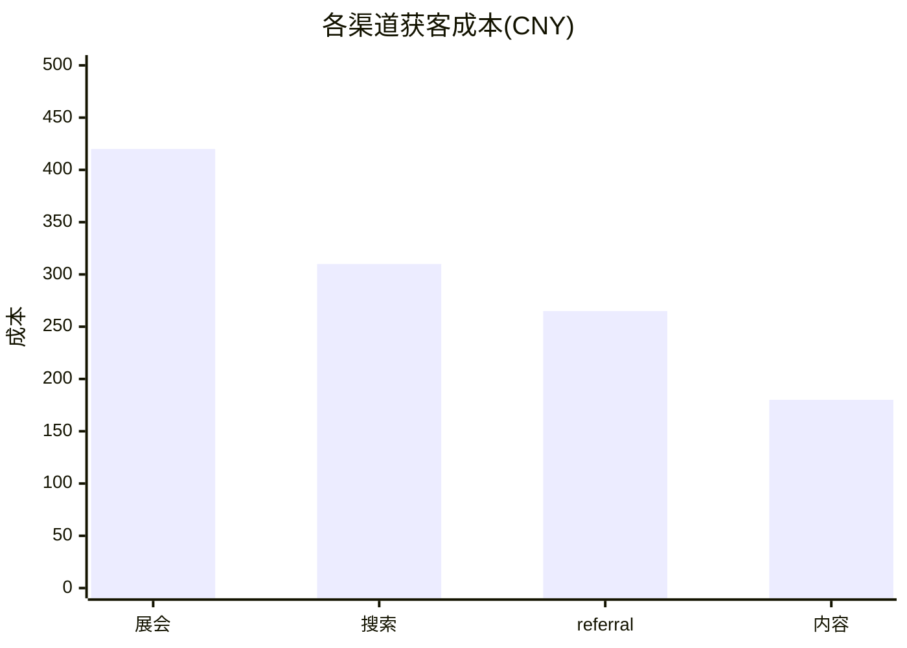

# 图表语法：柱状图（Bar）

**分类:** 11_图表语法

**定位:** 类别比较 — 离散类别的数值对比。柱状图是数据诚实度最高的图形之一(共零基线、长度可比)。

## 说明

**Mermaid 类型**:`xychart-beta`。文本描述即可渲染(mermaid 语法),是「可执行的图解」——与 07 信息图类型的「静态骨架」互补。

## 示例语法

> **示例数字仅为语法演示，必须替换为 approved 真实数据**（见 `00_索引/图表样式规范.md`）。

## 纪律

- **共零基线**;纵轴截断必须画断轴符号,否则柱长比较即撒谎。
- 类别按数值排序(时间类除外);直接标注数值优先于图例。
- 估算值柱体用纹理/虚线 +「~」前缀(置信度形状语法,见 `00_索引/图表样式规范.md`)。

> 图表的坐标轴/图例/配色处理沿用 `08_图片渲染` 与 `00_索引/图表样式规范.md`；颜色来自 deck colors 锚点，本文件只定结构与语法。
