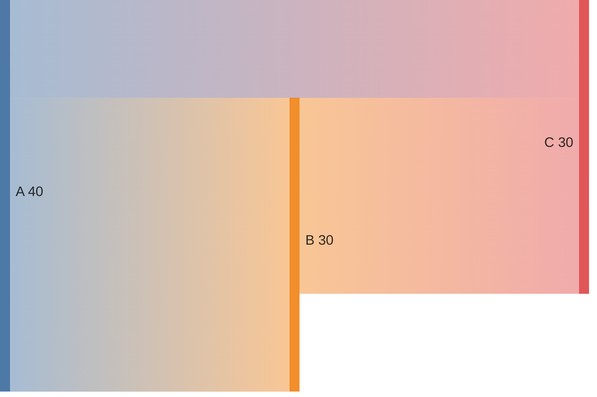

# 图表语法：桑基图（Sankey）

**分类:** 11_图表语法

**定位:** 流量/转化流向 — 流量/能量/转化流向,粗细表量。用于转化、能源、资金流。

## 说明

**Mermaid 类型**：`Sankey`。文本描述即可渲染（mermaid 语法），是「可执行的图解」——与 07 信息图类型的「静态骨架」互补。

## 示例语法

> **示例数字仅为语法演示，必须替换为 approved 真实数据**（见 `00_索引/图表样式规范.md`）。

> 图表的坐标轴/图例/配色处理沿用 `08_图片渲染` 与 `00_索引/图表样式规范.md`；颜色来自 deck colors 锚点，本文件只定结构与语法。