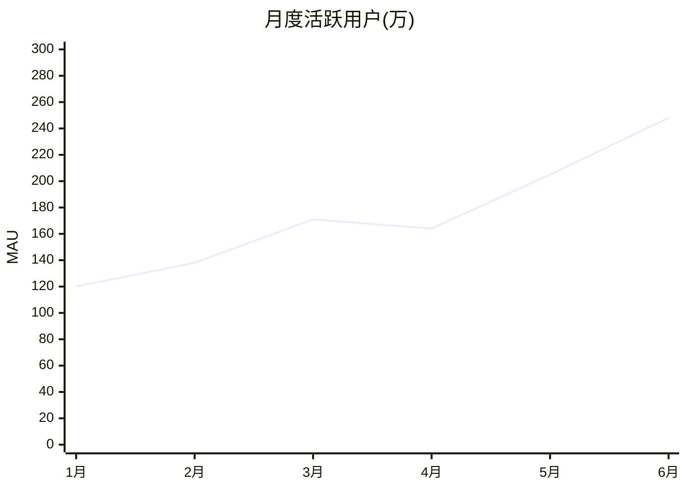

# 图表语法：折线图（Line）

**分类:** 11_图表语法

**定位:** 趋势演变 — 连续时间/序列上的变化趋势与拐点。折线表达「随时间的故事」。

## 说明

**Mermaid 类型**:`xychart-beta`。文本描述即可渲染(mermaid 语法),是「可执行的图解」——与 07 信息图类型的「静态骨架」互补。

## 示例语法

> **示例数字仅为语法演示，必须替换为 approved 真实数据**（见 `template-library/governance/authoring/index/图表样式规范.md`）。

## 纪律

- 横轴等距仅当采样等距;不等距时间必须按时间比例布点,否则趋势被扭曲。
- ≤3 个点不用折线(两点一线没有趋势),改用 KPI 卡或双数对比。
- 多线比较 ≤3 条;超过用分面(small multiples)。
- 估算区间/预测段用虚线并与实测段区分。

> 图表的坐标轴/图例/配色处理沿用 `rendering 轴` 与 `template-library/governance/authoring/index/图表样式规范.md`；颜色来自 deck colors 锚点，本文件只定结构与语法。
