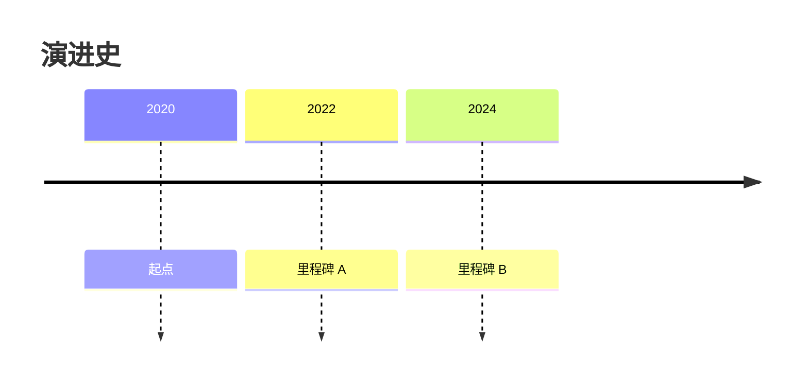

# 图表语法：时间线（Timeline）

**分类:** 11_图表语法

**定位:** 时间序列演进 — 按时间顺序的事件/时期。用于历史、演进、路线图。

## 说明

**Mermaid 类型**：`Timeline`。文本描述即可渲染（mermaid 语法），是「可执行的图解」——与 07 信息图类型的「静态骨架」互补。

## 示例语法

> **示例数字仅为语法演示，必须替换为 approved 真实数据**（见 `template-library/governance/authoring/index/图表样式规范.md`）。

> 图表的坐标轴/图例/配色处理沿用 `rendering 轴` 与 `template-library/governance/authoring/index/图表样式规范.md`；颜色来自 deck colors 锚点，本文件只定结构与语法。