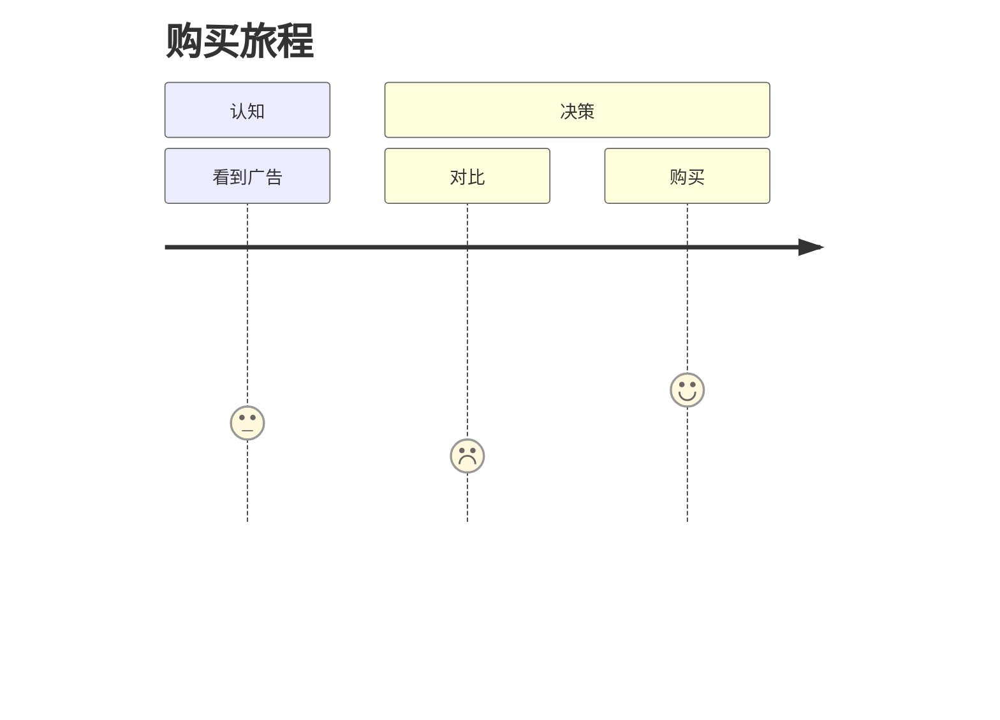

# 图表语法：用户旅程（UserJourney）

**分类:** 11_图表语法

**定位:** 体验阶段与情感 — 用户经历的阶段+接触点,情感曲线。用于体验/转化。

## 说明

**Mermaid 类型**：`UserJourney`。文本描述即可渲染（mermaid 语法），是「可执行的图解」——与 07 信息图类型的「静态骨架」互补。

## 示例语法

> **示例数字仅为语法演示，必须替换为 approved 真实数据**（见 `template-library/governance/authoring/index/图表样式规范.md`）。

> 图表的坐标轴/图例/配色处理沿用 `rendering 轴` 与 `template-library/governance/authoring/index/图表样式规范.md`；颜色来自 deck colors 锚点，本文件只定结构与语法。

## 构图变体：winding roadmap（S 曲线路径）

> 来源：JimLiu/baoyu-skills(MIT,快照 6b7a2e4 2026-07-03) · baoyu-infographic/references/layouts/winding-roadmap.md（思想级改写）。

Mermaid `UserJourney` 定阶段与情感分值；当页面需要更强的「旅程感」时，可用
S 曲线路径构图替代直线阶段条：里程碑为沿途旗标节点，障碍/助力者作侧元素，
终点为地标——适合项目路线图、学习路径、客户旅程的叙事版式。情感曲线数值
仍须 approved 真实数据；曲线只是呈现形态，不改变数据语义。